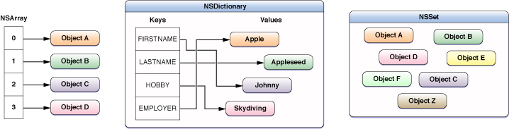

> 导航：[总目录](../../../README.md) · [referencelibrary](../../../_indexes/referencelibrary.md)

# Data Management Starting Point

> [!IMPORTANT]
> 

Data management involves the creation and handling of various types of data, including strings, text, binary data, dates, collections, property lists, and XML data. You also use data management APIs to store and access data in local databases, files, folders, and bundles.

#### Contents:

- [Get Up and Running](#apple-f4xwc4dqnrsv64tfmyxwi33df52wszbpkridimbqga3teojzfvbuqmjnirxw45cmnfxgwrlmmvwwk3tujfcf6mi)
- [Become Proficient](#apple-f4xwc4dqnrsv64tfmyxwi33df52wszbpkridimbqga3teojzfvbuqmjnirxw45cmnfxgwrlmmvwwk3tujfcf6mq)
- [Provide Application-Level Preferences](#apple-f4xwc4dqnrsv64tfmyxwi33df52wszbpkridimbqga3teojzfvbuqmjnknltq)
- [Access Contact Information](#apple-f4xwc4dqnrsv64tfmyxwi33df52wszbpkridimbqga3teojzfvbuqmjnknlto)

### Get Up and Running

Start by reading the programming guide that corresponds to the data type you want to use and refer to _[Foundation Framework Reference](https://developer.apple.com/documentation/foundation)_ for Objective-C class details and _[Core Foundation Framework Reference](https://developer.apple.com/documentation/corefoundation)_ for C-based API details. It’s your choice whether to use the Foundation framework Objective-C data management classes or the Core Foundation framework C opaque type equivalents.

- Read _[Number and Value Programming Topics](../../../documentation/Cocoa/Number%20and%20Value%20Programming%20Topics/Introduction%20to%20Numbers%20and%20Other%20Values.md#apple-f4xwc4dqnrsv64tfmyxwi33df52wszbpgeydambqgaztq2i)_ to learn about object wrappers for number and value data types.
- Read _[String Programming Guide](../../../documentation/Cocoa/String%20Programming%20Guide/Introduction%20to%20String%20Programming%20Guide.md#apple-f4xwc4dqnrsv64tfmyxwi33df52wszbpgeydambqgaztk2i)_ or _[String Programming Guide for Core Foundation](../../../documentation/Core%20Foundation/String%20Programming%20Guide%20for%20Core%20Foundation/Introduction%20to%20Strings%20Programming%20Guide%20for%20Core%20Foundation.md#apple-f4xwc4dqnrsv64tfmyxwi33df52wszbpgeydambqgeztc2i)_ for how to create, search, concatenate, and draw strings.
- Read _[Binary Data Programming Guide](../../../documentation/Cocoa/Binary%20Data%20Programming%20Guide/Introduction%20to%20Binary%20Data%20Programming%20Guide%20for%20Cocoa.md#apple-f4xwc4dqnrsv64tfmyxwi33df52wszbpgeydambqgazto2i)_ or _[Binary Data Programming Guide for Core Foundation](../../../documentation/Core%20Foundation/Binary%20Data%20Programming%20Guide%20for%20Core%20Foundation/Introduction%20to%20Binary%20Data%20Programming%20Guide%20for%20Core%20Foundation.md#apple-f4xwc4dqnrsv64tfmyxwi33df52wszbpgeydambqge2di2i)_, for how to manipulate binary data.
- Read _[Date and Time Programming Guide](../../../documentation/Cocoa/Date%20and%20Time%20Programming%20Guide/About%20Dates%20and%20Times.md#apple-f4xwc4dqnrsv64tfmyxwi33df52wszbpgeydambqgazts2i)_ or _[Date and Time Programming Guide for Core Foundation](../../../documentation/Core%20Foundation/Date%20and%20Time%20Programming%20Guide%20for%20Core%20Foundation/Introduction%20to%20Dates%20and%20Times%20Programming%20Guide%20for%20Core%20Foundation.md#apple-f4xwc4dqnrsv64tfmyxwi33df52wszbpgeydambqgezdk2i)_, if your application keeps track of dates and times. Read _[Timer Programming Topics](../../../documentation/Cocoa/Timer%20Programming%20Topics/Introduction%20to%20Timers.md#apple-f4xwc4dqnrsv64tfmyxwi33df52wszbpgeydambqga3dc2i)_ for how to perform delayed or periodic actions.
- Read _[Collections Programming Topics](../../../documentation/Cocoa/Collections%20Programming%20Topics/About%20Collections.md#apple-f4xwc4dqnrsv64tfmyxwi33df52wszbpgeydambqgazti2i)_ or _[Collections Programming Topics for Core Foundation](../../../documentation/Core%20Foundation/Collections%20Programming%20Topics%20for%20Core%20Foundation/Introduction.md#apple-f4xwc4dqnrsv64tfmyxwi33df52wszbpgeydambqgezdi2i)_ to learn how to manage groups of objects.

Explore _[Foundation Framework Reference](https://developer.apple.com/documentation/foundation)_ for classes that also interact with the file system. Also read _[Low-Level File Management Programming Topics](../../../documentation/Cocoa/Low-Level%20File%20Management%20Programming%20Topics/Introduction%20to%20Low-Level%20File%20Management%20Programming%20Topics.md#apple-f4xwc4dqnrsv64tfmyxwi33df52wszbpgeydambqga2tk2i)_ for methods and functions that manipulate files and folders.

### Become Proficient

Once you use basic data objects and types in your application, you might want to manipulate and store them.

To learn about data formatting, read _[Data Formatting Guide](../../../documentation/Cocoa/Data%20Formatting%20Guide/Introduction%20to%20Data%20Formatting%20Programming%20Guide%20For%20Cocoa.md#apple-f4xwc4dqnrsv64tfmyxwi33df52wszbpgeydambqgazds2i)_ or _[Data Formatting Guide for Core Foundation](../../../documentation/Core%20Foundation/Data%20Formatting%20Guide%20for%20Core%20Foundation/Introduction%20to%20Data%20Formatting%20Guide%20for%20Core%20Foundation.md#apple-f4xwc4dqnrsv64tfmyxwi33df52wszbpgeydambqge3tm2i)_.

You can also sort collections of objects described in _[Sort Descriptor Programming Topics](../../../documentation/Cocoa/Sort%20Descriptor%20Programming%20Topics/Introduction%20to%20Sort%20Descriptors.md#apple-f4xwc4dqnrsv64tfmyxwi33df52wszbpgeydambqge3ti2i)_.

Read _[Predicate Programming Guide](../../../documentation/Cocoa/Predicate%20Programming%20Guide/Introduction.md#apple-f4xwc4dqnrsv64tfmyxwi33df52wszbpkridimbqgaytoobz)_ to learn how to create queries in Cocoa. Predicates can be applied to collections and not just to Core Data or Spotlight.

There are different ways to store data objects and types as well. Read _[Archives and Serializations Programming Guide](../../../documentation/Cocoa/Archives%20and%20Serializations%20Programming%20Guide/Introduction.md#apple-f4xwc4dqnrsv64tfmyxwi33df52wszbpgeydambqga2do2i)_ for how to store a collection of interrelated objects and values.

Read _[Bundle Programming Guide](../../../documentation/Core%20Foundation/Bundle%20Programming%20Guide/Introduction.md#apple-f4xwc4dqnrsv64tfmyxwi33df52wszbpgeydambqgezdg2i)_ for how to access data stored in a file structure called a bundle.

Read _[Property List Programming Guide](../../../documentation/Cocoa/Property%20List%20Programming%20Guide/Introduction%20to%20Property%20Lists.md#apple-f4xwc4dqnrsv64tfmyxwi33df52wszbpgeydambqga2dq2i)_ or _[Property List Programming Topics for Core Foundation](../../../documentation/Core%20Foundation/Property%20List%20Programming%20Topics%20for%20Core%20Foundation/Introduction%20to%20Property%20List%20Programming%20Topics%20for%20Core%20Foundation.md#apple-f4xwc4dqnrsv64tfmyxwi33df52wszbpgeydambqgezta2i)_ for how to organize data into named values and lists of values. You can optionally save a property list as XML data. See the sample code project _[TheElements](../../../samplecode/TheElements/TheElements.md#apple-f4xwc4dqnrsv64tfmyxwi33df52wszbpirkfgnbqgaydonbrhe)_, a native iOS application that uses a property list to store chemical element data.

To learn how to use Core Data for general object graph management and persistency, follow the advice outlined in _Core Data Starting Point_.

### Provide Application-Level Preferences

Preferences are settings used to configure the behavior or appearance of an application.

Read [Implementing Application Preferences](https://developer.apple.com/library/archive/documentation/iPhone/Conceptual/iPhoneOSProgrammingGuide/Inter-AppCommunication/Inter-AppCommunication.html#//apple_ref/doc/uid/TP40007072-CH6) in _[App Programming Guide for iOS](https://developer.apple.com/library/archive/documentation/iPhone/Conceptual/iPhoneOSProgrammingGuide/Introduction/Introduction.html#//apple_ref/doc/uid/TP40007072)_ to learn how to display application-level preferences using the system-supplied Settings application.

If you need more flexibility than that offered by the Settings application, you can manage preferences within your application using the [NSUserDefaults](https://developer.apple.com/library/archive/documentation/LegacyTechnologies/WebObjects/WebObjects_3.5/Reference/Frameworks/ObjC/Foundation/Classes/NSUserDefaults/Description.html#//apple_ref/occ/cl/NSUserDefaults) class in the Foundation framework. For more information, see _[Preferences and Settings Programming Guide](../../../documentation/Cocoa/Preferences%20and%20Settings%20Programming%20Guide/About%20Preferences%20and%20Settings.md#apple-f4xwc4dqnrsv64tfmyxwi33df52wszbpgeydambqga2ts2i)_. If you prefer using Core Foundation, read _[Preferences Programming Topics for Core Foundation](../../../documentation/Core%20Foundation/Preferences%20Programming%20Topics%20for%20Core%20Foundation/Introduction%20to%20Preferences%20Programming%20Topics%20for%20Core%20Foundation.md#apple-f4xwc4dqnrsv64tfmyxwi33df52wszbpgeydambqgezds2i)_.

### Access Contact Information

Contacts is a centralized database for contact and other personal information for people. Contact information is important for software such as email and chat programs.

Read _[Address Book Programming Guide for iOS](../../../documentation/Address%20Book%20Programming%20Guide%20for%20iOS/Introduction.md#apple-f4xwc4dqnrsv64tfmyxwi33df52wszbpkridimbqga3tonbu)_ to learn how to leverage the contacts database in your application. You can not only access a user’s contact data but also design and implement your own properties and actions for the data. Refer to _Address Book Framework Reference_ for details.
