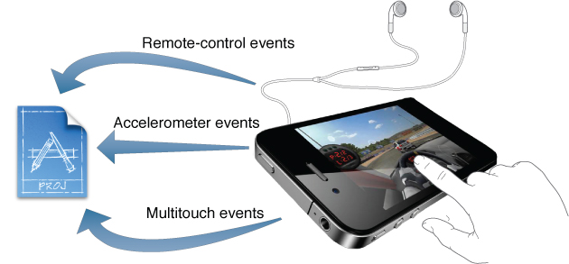

> 导航：[总目录](../../../README.md) · [referencelibrary](../../../_indexes/referencelibrary.md)

# Event Handling Starting Point

> [!IMPORTANT]
> 

Events are objects sent to an application to inform it of user actions. Events are generated whenever the user interacts with the user interface as well as when the user interacts with the accelerometer or uses a headset or other external accessory. There are also events generated when the location of the device changes.

#### Contents:

- [Get Up and Running](#apple-f4xwc4dqnrsv64tfmyxwi33df52wszbpkridimbqgeydonjvfvbuqmjnirxw45cmnfxgwrlmmvwwk3tujfcf6mi)
- [Become Proficient](#apple-f4xwc4dqnrsv64tfmyxwi33df52wszbpkridimbqgeydonjvfvbuqmjnirxw45cmnfxgwrlmmvwwk3tujfcf6mq)
- [Access Accelerometer Events](#apple-f4xwc4dqnrsv64tfmyxwi33df52wszbpkridimbqgeydonjvfvbuqmjnknlts)
- [Determine the Device Location](#apple-f4xwc4dqnrsv64tfmyxwi33df52wszbpkridimbqgeydonjvfvbuqmjnknltcma)

### Get Up and Running

Read The Event-Handling System in _[App Programming Guide for iOS](https://developer.apple.com/library/archive/documentation/iPhone/Conceptual/iPhoneOSProgrammingGuide/Introduction/Introduction.html#//apple_ref/doc/uid/TP40007072)_ for an overview of event handling and read _Event Handling Guide for iOS_ for specific tasks. _Event Handling Guide for iOS_ describes how to handle user events including multitouch events, motion events—from device accelerometers—and events for controlling multimedia. At a minimum, every application should respond to orientation changes.

### Become Proficient

Start with _[UIKit Framework Reference](https://developer.apple.com/documentation/uikit)_ to learn about the event handling classes in the UIKit framework. The framework includes classes for working with data, such as acceleration, device, screen, event, responder, and touch data.

### Access Accelerometer Events

An accelerometer measures changes in velocity along a given linear path. iOS devices contain three accelerometers, one along each of the primary axes of the device. Read Motion Events in _Event Handling Guide for iOS_ for an overview and refer to _[Core Motion Framework Reference](https://developer.apple.com/documentation/coremotion)_ for details on the accelerometer and gyroscope classes.

See the sample code project _BubbleLevel_, which uses accelerometer data to create a visual bubble level and inclinometer. This project provides an example of how to detect device orientation.

### Determine the Device Location

iOS devices contain hardware that can determine the device’s current location, triangulating a position fix from available signal information. To learn how to determine the current latitude and longitude of a device, start by reading _[Location and Maps Programming Guide](../../../documentation/User%20Experience/Location%20and%20Maps%20Programming%20Guide/About%20Location%20Services%20and%20Maps.md#apple-f4xwc4dqnrsv64tfmyxwi33df52wszbpkridimbqga4tiojx)_ and refer to _[Core Location Framework Reference](https://developer.apple.com/documentation/corelocation)_ for details on location classes.
