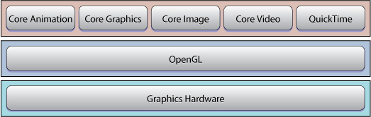

> 导航：[总目录](../../../README.md) · [referencelibrary](../../../_indexes/referencelibrary.md)

## Introduction

OS X has unsurpassed graphics and imaging technologies. The most challenging part of getting started is deciding which one to use first.

- Quartz 2D, part of the Core Graphics framework, is an advanced, 2D drawing engine that is resolution- and device-independent. Its powerful features include transparency layers, path-based drawing, offscreen rendering, and advanced color management, as well as PDF document creation, display, and parsing.
- Core Image lets you use built-in image-processing filters to process still and video images. You can also use it to write your own filters.
- Core Video provides a modern video pipeline. Among other things, it takes care of display synchronization issues for you and makes switching between uncompressed video frames and OpenGL or Core Image easy.
- Core Animation adds smooth motion and dynamic feedback to the user interface.
- OpenGL is a cross-platform, standards-based, 3D graphics library. OpenGL provides a broad set of rendering, texture mapping, special effects, and other powerful visualization functions. It underlies other OS X graphics technologies, which means that your application can benefit from OpenGL even if you are not explicitly using it.
- QuickTime—Apple’s cross-platform multimedia technology—lets you combine audio, video, still images, and text in a single application.

OS X graphics and imaging technologies leverage the power of the graphics hardware whenever possible. They hide the details of low-level graphics processing by providing easy-to-use application programming interfaces.

### Start Here

To write graphics code on OS X, you should:

- Decide whether you need to do 2D or 3D graphics.
- Determine whether your application needs to play back video or movie samples.

Choose next how you want to get started—by reading about the basics, getting your hands on some code, or diving into specific technologies.

__Want to get familiar with the fundamentals?__

- Read [Cocoa Drawing Guide](../../../documentation/Cocoa/Cocoa%20Drawing%20Guide/Introduction%20to%20Cocoa%20Drawing%20Guide.md#apple-f4xwc4dqnrsv64tfmyxwi33df52wszbpkridimbqgazteojq) to learn about the drawing classes, how to draw inside a Cocoa view, and how to instantiate and draw images defined in graphics files.
- Read [Overview of Quartz 2D](https://developer.apple.com/library/archive/documentation/GraphicsImaging/Conceptual/drawingwithquartz2d/dq_overview/dq_overview.html#//apple_ref/doc/uid/TP30001066-CH202) for an introduction to the Quartz 2D imaging model and drawing API.
- Read [Core Image Programming Guide](../../../documentation/Graphics%20Imaging/Core%20Image%20Programming%20Guide/About%20Core%20Image.md#apple-f4xwc4dqnrsv64tfmyxwi33df52wszbpkridgmbqgaytcobv) to get an understanding of the basic concepts and to learn how to use the Core Image API.
- Read [Core Video Programming Guide](../../../documentation/Graphics%20Imaging/Core%20Video%20Programming%20Guide/Introduction%20to%20Core%20Video%20Programming%20Guide.md#apple-f4xwc4dqnrsv64tfmyxwi33df52wszbpkridimbqgaytkmzw) to understand the OS X video model and to learn how to manipulate video frames using the Core Video API.
- Read Image [Image I/O Programming Guide](../../../documentation/Graphics%20Imaging/Image%20I-O%20Programming%20Guide/Introduction.md#apple-f4xwc4dqnrsv64tfmyxwi33df52wszbpkridimbqga2tinrs) for an introduction to the I/O programming interface.
- Read [Animation Overview](../../../documentation/Graphics%20Imaging/Animation%20Overview/Introduction%20to%20Animation%20Overview.md#apple-f4xwc4dqnrsv64tfmyxwi33df52wszbpkridimbqga2dsnjs) to get an introduction to the animation capabilities provided by OS X.
- If you’re completely new to OpenGL programming, you first need to understand the fundamental concepts and techniques covered in [OpenGL Programming Guide](http://www.opengl.org/documentation/red_book/), by Dave Shreiner and others (Addison-Wesley).

__Prefer to learn by example?__

- [Quartz2DBasics](../../../samplecode/Quartz2DBasics/Quartz2DBasics.md#apple-f4xwc4dqnrsv64tfmyxwi33df52wszbpirkfgmjqgaydgojxgu) demonstrates many common Quartz graphics calls.
- [Using OpenGL in Your Application](../../../documentation/Cocoa/Cocoa%20Drawing%20Guide/Incorporating%20Other%20Drawing%20Technologies.md#apple-f4xwc4dqnrsv64tfmyxwi33df52wszbpkridimbqgazteojqfvbuqmrrgewueqkbivbuurck) in the [Cocoa Drawing Guide](../../../documentation/Cocoa/Cocoa%20Drawing%20Guide/Introduction%20to%20Cocoa%20Drawing%20Guide.md#apple-f4xwc4dqnrsv64tfmyxwi33df52wszbpkridimbqgazteojq) shows how to access OpenGL from within a Cocoa application.
- [QTCoreVideo301](../../../samplecode/QTCoreVideo301/QTCoreVideo301.md#apple-f4xwc4dqnrsv64tfmyxwi33df52wszbpirkfgnbqgaydonzygu) is a good place for people interested in seeing how QuickTime, Core Video, and OpenGL work together.
- [CALayerEssentials](../../../samplecode/CALayerEssentials/CALayerEssentials.md#apple-f4xwc4dqnrsv64tfmyxwi33df52wszbpirkfgnbqgaydqmbshe) demonstrates how to set up Core Animation layers.
- [Converting an Image with Black Point Compensation](../../../samplecode/Converting%20an%20Image%20with%20Black%20Point%20Compensation/Converting%20an%20Image%20with%20Black%20Point%20Compensation.md#apple-f4xwc4dqnrsv64tfmyxwi33df52wszbpirkfgnbqgaytgnbzha) shows how to convert any image to sRGB using ImageIO.

__Are you familiar with OpenGL on another platform?__

- If you’ve used OpenGL on another platform, read [OpenGL Programming Guide for Mac](../../../documentation/Graphics%20Imaging/OpenGL%20Programming%20Guide%20for%20Mac/About%20OpenGL%20for%20OS%20X.md#apple-f4xwc4dqnrsv64tfmyxwi33df52wszbpkridimbqgaytsobx), which describes how to get started on OS Xusing the C programming language and also includes a tutorial on using OpenGL in Cocoa.

### Go In Depth

Sometimes you need to dig deeper into a graphics technology.

__Learning to Draw with Quartz 2D__

- Read [Quartz 2D Programming Guide](../../../documentation/Graphics%20Imaging/Quartz%202D%20Programming%20Guide/Introduction.md#apple-f4xwc4dqnrsv64tfmyxwi33df52wszbpkridgmbqgaytanrw) to learn how to use the Quartz 2D API to accomplish just about any drawing Quartz is capable of performing.
- Refer to Quartz 2D Reference Collection as necessary to learn more about Quartz opaque types and their associated functions and constants.
- Read [Core Animation Programming Guide](../../../documentation/Cocoa/Core%20Animation%20Programming%20Guide/About%20Core%20Animation.md#apple-f4xwc4dqnrsv64tfmyxwi33df52wszbpkridimbqga2dkmju) to learn how to use the Core Animation API.
- To learn how to display a single image in a frame, read [Viewing, Editing, and Saving Images in an Image View](https://developer.apple.com/library/archive/documentation/GraphicsImaging/Conceptual/ImageKitProgrammingGuide/ImageViews/ImageViews.html#//apple_ref/doc/uid/TP40004907-CH4) in [ImageKit Programming Guide](../../../documentation/Graphics%20Imaging/ImageKit%20Programming%20Guide/Introduction%20to%20Image%20Kit%20Programming%20Guide.md#apple-f4xwc4dqnrsv64tfmyxwi33df52wszbpkridimbqga2dsmbx).

__Core Animation__

- Refer to [Core Animation Reference Collection](https://developer.apple.com/documentation/quartzcore) as necessary to learn details of the Core Animation API.

### Ready for More?

The Graphics and Animation page in the Reference Library holds plenty more resources that make your job easier. To narrow the list of resources, you can set filters to focus on specific resource types (such as guides or sample code) or on specific topics (such as OpenGL or QuickTime).

