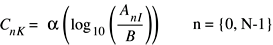

> 导航：[总目录](../../../README.md) · [referencelibrary](../../../_indexes/referencelibrary.md)

## Introduction

OS X provides the Accelerate framework to help significantly speed up your application's complex computations for mathematical calculation or digital signal and image processing.

The Accelerate framework includes two libraries, vImage and vecLib.

The vImage library contains high-level functions for image manipulation—convolutions, geometric transformations, histogram operations, morphological transformations, and alpha compositing—as well as utility functions for format conversions and other operations.

The vecLib library provides Apple’s accelerated versions of well-known libraries, including libm, BLAS, and LAPACK. It also supports vector mathematical functions, which run on vector processing hardware if available. This library abstracts the vector processing capability so that code written for it executes appropriate instructions for the processor available at runtime.

The vecLib library also contains the vDSP library, providing mathematical functions for applications such as speech, sound, audio, and video processing; diagnostic medical imaging; radar signal processing; seismic analysis; and scientific data processing. The vDSP functions operate on real and complex data types. The functions include data type conversions, fast Fourier transforms (FFTs), and vector-to-vector and vector-to-scalar operations.

The Accelerate framework takes advantage of any available vector processing units (such as the Intel x86 SSE extensions) to perform multiple calculations in parallel. By coding to the framework, you can reap the benefits of vector processors without the need to write vectorized code, and you can avoid creating separate code paths for each platform architecture. The Accelerate framework is highly tuned for all of the architectures that OS X supports.

### Start Here

To gain a succinct overview of the Accelerate framework’s features and capabilities, read the article Taking Advantage of the Accelerate Framework.

#### Want to get familiar with the fundamentals?

[vImage Programming Guide](https://developer.apple.com/library/archive/documentation/Performance/Conceptual/vImage/Introduction/Introduction.html#//apple_ref/doc/uid/TP30001001) discusses how vImage optimizes the processing of large images, offers general usage guidelines, and describes the workflow and operations for incorporating vImage into an application.

#### Prefer to learn by example?

[GLSL Showpiece Lite](../../../samplecode/GLSL%20Showpiece%20Lite/GLSL%20Showpiece%20Lite.md#apple-f4xwc4dqnrsv64tfmyxwi33df52wszbpirkfgmjqgaydimrzgu) demonstrates the algorithmic workflow invovled in using vImage and Image I/O to load and manipulate an image for use as an OpenGL texture.

[vDSP Examples](https://developer.apple.com/library/archive/samplecode/vDSPExamples/Introduction/Intro.html#//apple_ref/doc/uid/DTS10004300) demonstrate how to use vDSP to perform convolution and one- and two-dimensional fast Fourier transforms.

### Go In Depth

vImage Reference Collection describes in detail the programming interface for high-performance image processing.

vDSP Reference Collection details the programming interfaces for digital signal processing.

[vecLib Framework Reference](https://developer.apple.com/documentation/accelerate/veclib) describes in detail the vector mathematical functions in the Accelerate framework.

### Ready for More?

The Mac OS Reference Library contains additional resources to make your job easier. To narrow the list of resources available for the topic of mathematical computing, you can set filters to focus on specific resource types (such as guides or sample code).

