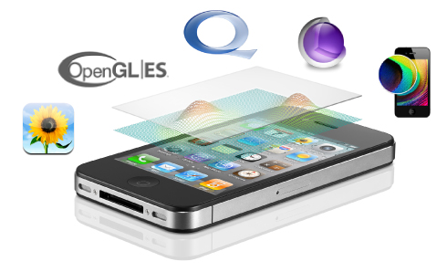

> 导航：[总目录](../../../README.md) · [referencelibrary](../../../_indexes/referencelibrary.md)

# Graphics & Animation Starting Point

> [!IMPORTANT]
> 

iOS provides several different frameworks for adding graphics and animations to your apps. UIKit is an Objective-C API that provides basic 2D drawing, image handling, and ways to animate user interface objects. Core Graphics is a C-based API that supports vector graphics, bitmap images, and PDF content. Core Animation is another Objective-C API that adds smooth motion and dynamic feedback to the user interface. OpenGL ES is the mobile version of OpenGL for high-performance 2D and 3D drawing. OpenGL ES includes EAGL, an Objective-C API that integrates OpenGL ES with Core Animation and UIKit.

#### Contents:

- [Get Up and Running](#apple-f4xwc4dqnrsv64tfmyxwi33df52wszbpkridimbqga3tgmbqfvbuqmjnirxw45cmnfxgwrlmmvwwk3tujfcf6mi)
- [Become Proficient](#apple-f4xwc4dqnrsv64tfmyxwi33df52wszbpkridimbqga3tgmbqfvbuqmjnirxw45cmnfxgwrlmmvwwk3tujfcf6mq)

### Get Up and Running

To use UIKit for basic graphics operations in your user interface:

- Read _[View Programming Guide for iOS](../../../documentation/Windows%20Views/View%20Programming%20Guide%20for%20iOS/About%20Windows%20and%20Views.md#apple-f4xwc4dqnrsv64tfmyxwi33df52wszbpkridimbqga4tkmbt)_ to get an understanding of such things as the view hierarchy, the native coordinate system for iOS, and the operations you can perform on views.
- Read _[Drawing and Printing Guide for iOS](../../../documentation/Drawing%20and%20Printing%20Guide%20for%20iOS/About%20Drawing%20and%20Printing%20in%20iOS.md#apple-f4xwc4dqnrsv64tfmyxwi33df52wszbpkridimbqgeydcnjw)_ to learn how to perform drawing tasks using UIKit. _[CGContext Reference](https://developer.apple.com/documentation/coregraphics/cgcontext)_ describes most of the functions you’ll use for drawing.
- Read _[UIImageView Class Reference](https://developer.apple.com/documentation/uikit/uiimageview)_ and _[UIImage Class Reference](https://developer.apple.com/documentation/uikit/uiimage)_ to use images in your application. To allow the user to zoom images, read _[UIScrollView Class Reference](https://developer.apple.com/documentation/uikit/uiscrollview)_, and _[UIScrollViewDelegate Protocol Reference](https://developer.apple.com/documentation/uikit/uiscrollviewdelegate)_.

When you need more powerful 2D drawing capabilities, use the Core Graphics framework. It’s the workhorse for drawing vector graphics, lines, shapes, patterns, gradients, images, and even PDF documents.

- Read [Overview of Quartz 2D](https://developer.apple.com/library/archive/documentation/GraphicsImaging/Conceptual/drawingwithquartz2d/dq_overview/dq_overview.html#//apple_ref/doc/uid/TP30001066-CH202) to learn how drawing works in Core Graphics. (Quartz 2D is the term used for the 2D drawing engine in Core Graphics.) To find out how to perform specific drawing tasks—for example, creating a pattern, path, or gradient—read the appropriate chapter in _[Quartz 2D Programming Guide](../../../documentation/Graphics%20Imaging/Quartz%202D%20Programming%20Guide/Introduction.md#apple-f4xwc4dqnrsv64tfmyxwi33df52wszbpkridgmbqgaytanrw)_.

Core Animation is the programming interface that the UIKit framework uses for layering and transitions in its classes. Use Core Animation if your application requires fine-grained control over animations.

- Read the [Animations](https://developer.apple.com/library/archive/documentation/WindowsViews/Conceptual/ViewPG_iPhoneOS/AnimatingViews/AnimatingViews.html#//apple_ref/doc/uid/TP40009503-CH6) chapter in _[View Programming Guide for iOS](../../../documentation/Windows%20Views/View%20Programming%20Guide%20for%20iOS/About%20Windows%20and%20Views.md#apple-f4xwc4dqnrsv64tfmyxwi33df52wszbpkridimbqga4tkmbt)_ to get you started animating views.
- The _[MoveMe](../../../samplecode/MoveMe/MoveMe.md#apple-f4xwc4dqnrsv64tfmyxwi33df52wszbpirkfgnbqgaydomzrgu)_ sample application contains examples of animating views and shows how to set up keyframe animations.

You use OpenGL ES to develop games and other applications that require the advanced graphics capabilities provided by the GPU.

- Read [OpenGL ES Overview](http://www.khronos.org/opengles/), provided by Khronos, the industry consortium that maintains the specifications for OpenGL ES.
- Next, examine the _[GLSprite](../../../samplecode/GLSprite/GLSprite.md#apple-f4xwc4dqnrsv64tfmyxwi33df52wszbpirkfgnbqgaydomzsgu)_ sample application in Xcode.

### Become Proficient

For details on UIKit classes, see _[UIKit Framework Reference](https://developer.apple.com/documentation/uikit)_.

For details on Core Graphics, see _Core Graphics Framework Reference_.

To get a more in-depth understanding of animation, read _[Core Animation Programming Guide](../../../documentation/Cocoa/Core%20Animation%20Programming%20Guide/About%20Core%20Animation.md#apple-f4xwc4dqnrsv64tfmyxwi33df52wszbpkridimbqga2dkmju)_ and refer to the _[MoveMe](../../../samplecode/MoveMe/MoveMe.md#apple-f4xwc4dqnrsv64tfmyxwi33df52wszbpirkfgnbqgaydomzrgu)_ sample application.

For how to best take advantage of OpenGL ES on iOS, read _[OpenGL ES Programming Guide](../../../documentation/3D%20Drawing/OpenGL%20ES%20Programming%20Guide/About%20OpenGL%20ES.md#apple-f4xwc4dqnrsv64tfmyxwi33df52wszbpkridimbqga4doojt)_. For details on OpenGL ES, see _[OpenGL ES Framework Reference](https://developer.apple.com/documentation/opengles)_.
