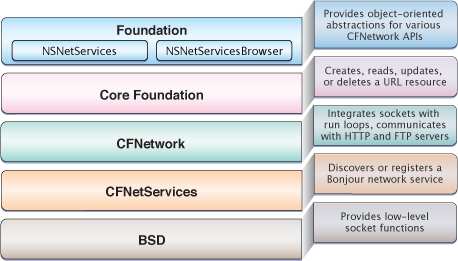

> 导航：[总目录](../../../README.md) · [referencelibrary](../../../_indexes/referencelibrary.md)

# Networking & Internet Starting Point

> [!IMPORTANT]
> 

iOS includes several frameworks and libraries to let developers add networking and Internet-based features to their applications. Developers gain access to major protocols and services through the Foundation and Core Foundation frameworks, as well as through CFNetwork and BSD Sockets. When you use these interfaces, you do not have to choose whether to use the Wi-Fi or cell-based radios yourself. The interfaces automatically access the underlying device hardware, choose the best transmission option, and seamlessly switch from one to the other as needed.

#### Contents:

- [Get Up and Running](#apple-f4xwc4dqnrsv64tfmyxwi33df52wszbpkridimbqga3tgmbrfvbuqmjnknlte)
- [Become Proficient](#apple-f4xwc4dqnrsv64tfmyxwi33df52wszbpkridimbqga3tgmbrfvbuqmjnknltg)
- [Download Resources Using URLs](#apple-f4xwc4dqnrsv64tfmyxwi33df52wszbpkridimbqga3tgmbrfvbuqmjnknlti)
- [Interact with Web and File Servers Using HTTP and FTP Streams](#apple-f4xwc4dqnrsv64tfmyxwi33df52wszbpkridimbqga3tgmbrfvbuqmjnknltk)
- [Communicate Using Sockets](#apple-f4xwc4dqnrsv64tfmyxwi33df52wszbpkridimbqga3tgmbrfvbuqmjnknltm)
- [Register and Discover Network Services](#apple-f4xwc4dqnrsv64tfmyxwi33df52wszbpkridimbqga3tgmbrfvbuqmjnknlto)

### Get Up and Running

Before you begin writing code, read _[Document Transfer Strategies](https://developer.apple.com/library/archive/technotes/tn2152/_index.html#//apple_ref/doc/uid/DTS40009179)_ for a survey of issues to consider when writing a networking application for iOS. Choose the language you want to use for writing your networking code. iOS supports networking code written in C and Objective-C. Your choice depends largely on which language you are most comfortable using and on whether you are porting existing networking code from another platform.

Decide whether you want to work with sockets directly or use an abstraction layer. iOS provides convenient abstractions for most socket interactions, making direct socket communication unnecessary. Determine whether you want to use Bonjour to discover existing network services or register new ones.

After you have taken these steps, you are better equipped to choose which networking API or APIs you want to use.

### Become Proficient

If you’re developing applications that communicate over a network, you want to be familiar with the APIs that iOS offers so that you can use them to access network protocols and services. If you’re developing applications that will interact with web servers, for example, you might choose Apple’s HTTP-based APIs in Core Foundation or Foundation. If you’re writing software that requires direct access to sockets, you need to understand the various socket APIs.

### Download Resources Using URLs

The Core Foundation URL Access Utilities (CFURL), and the NSURL API built on top of them, provide an easy way to download single files or other resources from web servers and FTP servers. The `CFURL` C-based APIs are part of the Core Foundation framework. You can learn more about them in _[CFURL Reference](https://developer.apple.com/documentation/corefoundation/cfurl-rd7)_. The `NSURL` Objective-C-based APIs are part of the Foundation framework. You can learn more about them in [NSURL Class Objective-C Reference](https://developer.apple.com/documentation/foundation/nsurl).

### Interact with Web and File Servers Using HTTP and FTP Streams

If your application needs to interact with a web server or an FTP server beyond the capabilities provided by the CFURL or NSURL APIs, you should consider using the CFHTTPStream and CFFTPStream APIs. These provide support for complex HTTP and FTP requests such as HTTP GET and POST requests, HTTP cookie and request header management, FTP directory reads, and FTP file uploading.

To learn about these APIs in general, read _[CFNetwork Programming Guide](../../../documentation/Networking/CFNetwork%20Programming%20Guide/Introduction%20to%20CFNetwork%20Programming%20Guide.md#apple-f4xwc4dqnrsv64tfmyxwi33df52wszbpkridgmbqgaytcmzs)_. For detailed API documentation, read _CFHTTPStream Reference_ and _CFFTPStream Reference_.

### Communicate Using Sockets

If your application uses sockets, iOS provides run-loop socket integration APIs in Core Foundation, as well as direct access to the BSD sockets on which these APIs are built. If you’ve designed a networking application for Mac OS X and want to write a networking application for iOS, you can use the same networking APIs. If you’ve decided to work with the CFNetwork APIs at a socket level, you should read _[CFNetwork Programming Guide](../../../documentation/Networking/CFNetwork%20Programming%20Guide/Introduction%20to%20CFNetwork%20Programming%20Guide.md#apple-f4xwc4dqnrsv64tfmyxwi33df52wszbpkridgmbqgaytcmzs)_ and _[CFNetwork Framework Reference](https://developer.apple.com/documentation/cfnetwork)_.

Although BSD (POSIX) networking APIs are available in iOS, you should avoid using them. If you communicate directly with sockets, certain networking capabilities of iOS, such as VPN On Demand, do not work. Use the APIs provided in _CFStream Socket Additions_ instead. To learn about BSD (POSIX) networking, read the [UNIX Socket FAQ](http://www.developerweb.net/forum/) website for code examples and general information. For API details, read `socket(2)` in the _[iOS Manual Pages](https://developer.apple.com/library/archive/documentation/System/Conceptual/ManPages_iPhoneOS/index.html#//apple_ref/doc/uid/TP40007259)_.

### Register and Discover Network Services

You can register a network service or discover a network service using Bonjour. To do this, use either the C-based CFNetServices or the Objective-C-based NSNetServices API. These APIs are described in _[NSNetServices and CFNetServices Programming Guide](../../../documentation/Networking/NSNetServices%20and%20CFNetServices%20Programming%20Guide/About%20NSNetServices%20and%20CFNetServices.md#apple-f4xwc4dqnrsv64tfmyxwi33df52wszbpkridimbqgazdomzw)_. For detailed API documentation, read _CFNetServices Reference_ and _[NSNetService Class Reference](https://developer.apple.com/documentation/foundation/nsnetservice)_ for the CFNetwork and Foundation forms of this API, respectively.
