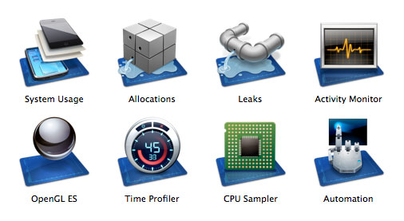

> 导航：[总目录](../../../README.md) · [referencelibrary](../../../_indexes/referencelibrary.md)

# Performance Starting Point for OS X

> [!IMPORTANT]
> 

When writing software for OS X, optimizing code to minimize use of the processors and memory is crucial to the performance of your application and therefore to a good user experience.

__Figure 1-1__Use the Instruments application to analyze and optimize your code

#### Contents:

- [Get Up and Running](#apple-f4xwc4dqnrsv64tfmyxwi33df52wszbpkridgmbqgaytaobsfvbuqmjnirxw45cmnfxgwrlmmvwwk3tujfcf6mi)
- [Become Proficient](#apple-f4xwc4dqnrsv64tfmyxwi33df52wszbpkridgmbqgaytaobsfvbuqmjnirxw45cmnfxgwrlmmvwwk3tujfcf6mq)
- [Good Document Transfer Strategies Can Speed Up Networking](#apple-f4xwc4dqnrsv64tfmyxwi33df52wszbpkridgmbqgaytaobsfvbuqmjnirxw45cmnfxgwrlmmvwwk3tujfcf6my)
- [Sample Code](#apple-f4xwc4dqnrsv64tfmyxwi33df52wszbpkridgmbqgaytaobsfvbuqmjnirxw45cmnfxgwrlmmvwwk3tujfcf6na)
- [Performance Tips](#apple-f4xwc4dqnrsv64tfmyxwi33df52wszbpkridgmbqgaytaobsfvbuqmjnirxw45cmnfxgwrlmmvwwk3tujfcf6ni)

### Get Up and Running

_[Performance Overview](../../../documentation/Performance/Performance%20Overview/Introduction.md#apple-f4xwc4dqnrsv64tfmyxwi33df52wszbpkridimbqgaytimjq)_ helps you get familiar with the fundamentals of performance analysis.

The main tool for analyzing your code’s use of the CPU, GPU, and memory is the Instruments application. Each of the tools in Instruments is documented in _[Instruments User Guide](https://developer.apple.com/library/archive/documentation/DeveloperTools/Conceptual/InstrumentsUserGuide/index.html#//apple_ref/doc/uid/TP40004652)_.

### Become Proficient

There are several aspects to performance, including memory use, speed, and drawing performance.

To learn how to reduce your application’s memory footprint, read _[Code Size Performance Guidelines](../../../documentation/Performance/Code%20Size%20Performance%20Guidelines/Introduction%20to%20Code%20Size%20Performance%20Guidelines.md#apple-f4xwc4dqnrsv64tfmyxwi33df52wszbpgeydambqge2ds2i)_.

To find and improve bottlenecks in your code that affect its speed, see _[Code Speed Performance Guidelines](../../../documentation/Performance/Code%20Speed%20Performance%20Guidelines/Introduction%20to%20Code%20Speed%20Performance%20Guidelines.md#apple-f4xwc4dqnrsv64tfmyxwi33df52wszbpgeydambqge2ta2i)_.

To make your drawing code more efficient, see _[Drawing Performance Guidelines](../../../documentation/Performance/Drawing%20Performance%20Guidelines/Introduction%20to%20Drawing%20Performance%20Guidelines.md#apple-f4xwc4dqnrsv64tfmyxwi33df52wszbpgeydambqge2tc2i)_.

For details on management of memory resources, see _[Memory Usage Performance Guidelines](../../../documentation/Performance/Memory%20Usage%20Performance%20Guidelines/Introduction.md#apple-f4xwc4dqnrsv64tfmyxwi33df52wszbpgeydambqge3da2i)_.

If you are writing a Cocoa application, read _[Cocoa Performance Guidelines](../../../documentation/Cocoa/Cocoa%20Performance%20Guidelines/Introduction%20to%20Cocoa%20Performance%20Guidelines.md#apple-f4xwc4dqnrsv64tfmyxwi33df52wszbpkridimbqgaytinby)_ for tips on how to use the Cocoa frameworks more efficiently.

To learn how to improve the efficiency of your algorithms so your application doesn’t slow down with large data sets, read _[Code Speed Performance Guidelines](../../../documentation/Performance/Code%20Speed%20Performance%20Guidelines/Introduction%20to%20Code%20Speed%20Performance%20Guidelines.md#apple-f4xwc4dqnrsv64tfmyxwi33df52wszbpgeydambqge2ta2i)_.

If your application performs complex math or image calculations, read _Taking Advantage of the Accelerate Framework_ to learn how to use the Accelerate framework to speed up operations using the available vector hardware.

### Good Document Transfer Strategies Can Speed Up Networking

To improve the performance of your networking code, read TN2152: _[Document Transfer Strategies](https://developer.apple.com/library/archive/technotes/tn2152/_index.html#//apple_ref/doc/uid/DTS40009179)_.

### Sample Code

The _[Worm](../../../samplecode/Worm/Worm.md#apple-f4xwc4dqnrsv64tfmyxwi33df52wszbpirkfgmjqgaydgnrvhe)_ sample project illustrates several optimizations for `NSView`.

The _[OpenCL Hello World Example](../../../samplecode/OpenCL%20Hello%20World%20Example/OpenCL%20Hello%20World%20Example.md#apple-f4xwc4dqnrsv64tfmyxwi33df52wszbpirkfgnbqgaydqmjyg4)_ shows how to use OpenCL to leverage the GPU for general computations.

### Performance Tips

Here are some tips to maximize performance:

- Avoid doing unnecessary work. Avoid computing anything until you are sure you actually need it.
- Avoid spinlocks, polling, and other CPU-hogging techniques.
- Use Core Animation and other GPU-intensive APIs sparingly. Use animation only if it provides a user benefit.
- Reduce your memory footprint by minimizing the amount of data you keep in memory at any given time.
- Consider memory-mapping large files instead of reading them into RAM. Doing so helps the system manage memory more efficiently.
- Release or free any allocated memory as soon as you are done using it.
- When practical, perform network requests in batches rather than one at a time.
