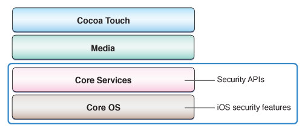

> 导航：[总目录](../../../README.md) · [referencelibrary](../../../_indexes/referencelibrary.md)

# Security Starting Point

> [!IMPORTANT]
> 

Application security is about protecting users’ information from being read, stolen, or destroyed by malicious people and processes. Security cannot be added to code as an afterthought; it must be built in. To keep your users’ information secure, your iOS application must be resistant to attack and you must keep your users’ data in a secure environment.

iOS security features are implemented at the Core OS level and its security APIs are at the Core Services level in the system architecture.

__Figure 1-1__Security APIs and system architecture

#### Contents:

- [Get Up and Running](#apple-f4xwc4dqnrsv64tfmyxwi33df52wszbpkridimbqga3tgmbsfvbuqmjnknlte)
- [Become Proficient](#apple-f4xwc4dqnrsv64tfmyxwi33df52wszbpkridimbqga3tgmbsfvbuqmjnknltg)
- [Download or Send Data Securely](#apple-f4xwc4dqnrsv64tfmyxwi33df52wszbpkridimbqga3tgmbsfvbuqmjnknlti)

### Get Up and Running

For sample code that shows how to use the keychain to store passwords and other secrets, and how to share keychain items between applications, see _[GenericKeychain](../../../samplecode/GenericKeychain/GenericKeychain.md#apple-f4xwc4dqnrsv64tfmyxwi33df52wszbpirkfgnbqgaydonzzg4)_.

For sample code that shows the use of the cryptographic functions found in the Security framework, see _[CryptoExercise](../../../samplecode/CryptoExercise/CryptoExercise.md#apple-f4xwc4dqnrsv64tfmyxwi33df52wszbpirkfgnbqgaydqmbrhe)_.

### Become Proficient

If you want to learn why and how to write secure code, read _[Secure Coding Guide](../../../documentation/Security/Secure%20Coding%20Guide/Introduction%20to%20Secure%20Coding%20Guide.md#apple-f4xwc4dqnrsv64tfmyxwi33df52wszbpkridimbqgazdimjv)_. That document explains the sources of security vulnerabilities in code and provides programming suggestions to help you write an application that will be resistant to attack. Then you can read _[Security Overview](../../../documentation/Security/Security%20Overview/About%20Software%20Security.md#apple-f4xwc4dqnrsv64tfmyxwi33df52wszbpkridgmbqgaydsnzw)_ to learn about all the security APIs and features available in iOS.

Following that, read _Keychain Services Programming Guide_ and _[Certificate, Key, and Trust Services Programming Guide](https://developer.apple.com/library/archive/documentation/Security/Conceptual/CertKeyTrustProgGuide/index.html#//apple_ref/doc/uid/TP40001358)_ to see more sample code and learn in more detail how to use the security APIs.

### Download or Send Data Securely

To learn how to download data from a secure URL using the HTTPS protocol, or to send data securely over a network using a Secure Sockets Layer (SSL) or Transport Layer Security (TLS) data stream, see _[CFNetwork Programming Guide](../../../documentation/Networking/CFNetwork%20Programming%20Guide/Introduction%20to%20CFNetwork%20Programming%20Guide.md#apple-f4xwc4dqnrsv64tfmyxwi33df52wszbpkridgmbqgaytcmzs)_.
