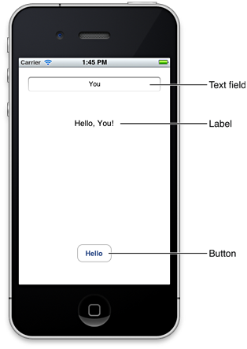

> 导航：[总目录](../../../README.md) · [referencelibrary](../../../_indexes/referencelibrary.md) · [Start Developing iOS Apps Today (Retired)](Document%20Revision%20History.md)

[Next](Getting%20Started.md)

[Back to Jump Right In](https://developer.apple.com/library/archive/referencelibrary/GettingStarted/RoadMapiOS-Legacy/chapters/JumpRightIn.html)
!
!
!

# Retired Document

__Important:__ This version of _Start Developing iOS Apps Today_ has been retired. The replacement version provides a new, more streamlined walkthrough of the basics. For information covering the same subject area as this page, please see ["Tutorial: Basics"](https://developer.apple.com/library/ios/referencelibrary/GettingStarted/RoadMapiOS/FirstTutorial.html#//apple_ref/doc/uid/TP40011343-CH3-SW1).

# About Creating Your First iOS App

_Your First iOS App_ introduces you to the Three Ts of iOS app development:

- __Tools__. How to use Xcode to create and manage a project.
- __Technologies__. How to create an app that responds to user input.
- __Techniques__. How to take advantage of some of the fundamental design patterns that underlie all iOS app development.

After you complete all the steps in this tutorial, you’ll have an app that looks something like this:

As you can see above, there are three main user interface elements in the app that you create:

- A text field (in which the user enters information)
- A label (in which the app displays information)
- A button (which causes the app to display information in the label)

When you run the finished app, you click inside the text field to reveal the system-provided keyboard. After you use the keyboard to type your name, you dismiss it (by clicking its Done key) and then you click the Hello button to see the string “Hello, _Your Name_!“ in the label between the text field and the button.

Later in _Start Developing iOS Apps Today_ you will work through another tutorial, _Internationalize Your App_, and in the process add a Chinese localization to the app you will create in this tutorial.

To benefit from this tutorial, it helps to have some familiarity with the basics of computer programming in general and with object-oriented programming and the Objective-C language in particular. If you haven’t used Objective-C before, don’t worry if the code in this tutorial is hard to understand. When you finish _Start Developing iOS Apps Today_, you’ll understand the code much better.

[Next](Getting%20Started.md)

---
