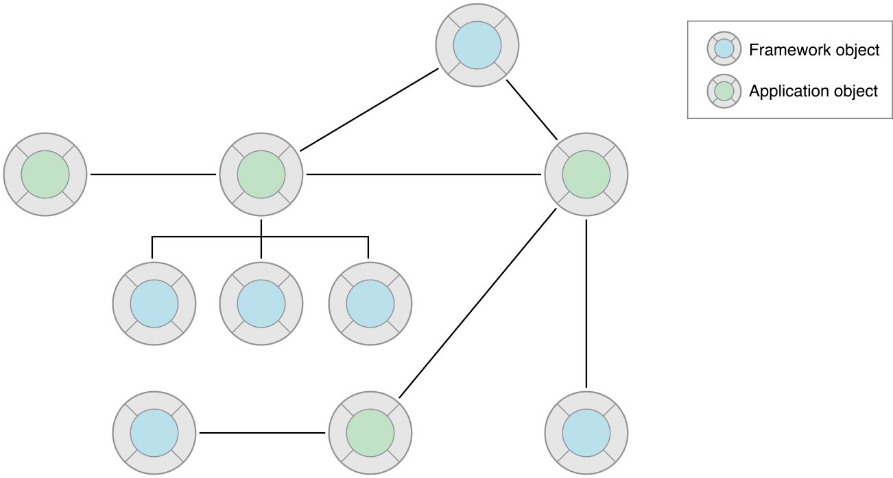
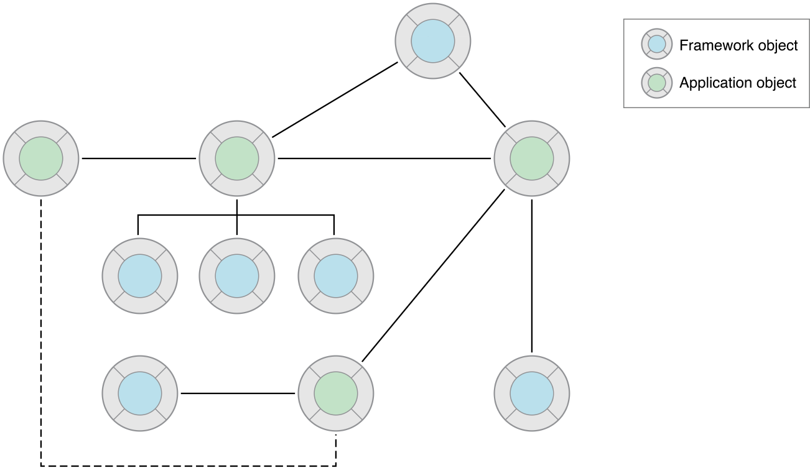
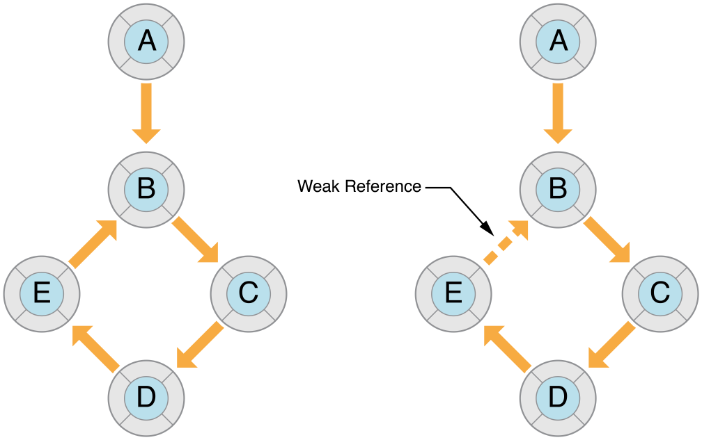
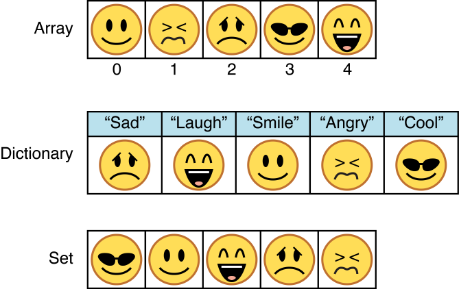

> 导航：[总目录](../../../README.md) · [referencelibrary](../../../_indexes/referencelibrary.md) · [Start Developing iOS Apps Today (Retired)](Document%20Revision%20History.md)


[Back to Basic Tasks](https://developer.apple.com/library/archive/referencelibrary/GettingStarted/RoadMapiOS-Legacy/chapters/BasicTasks.html)
!
!
!

# Retired Document

__Important:__ This version of _Start Developing iOS Apps Today_ has been retired. The replacement version provides a new, more streamlined walkthrough of the basics. For information covering the same subject area as this page, please see ["Working with Foundation"](https://developer.apple.com/library/ios/referencelibrary/GettingStarted/RoadMapiOS/FoundationClasses.html#//apple_ref/doc/uid/TP40011343-CH9-SW1).

# Acquire Foundational Programming Skills

The Foundation framework, as its name suggests, is the foundational toolkit for all programming for both iOS and OS X. You need to become familiar with this toolkit to be a successful developer for these platforms.

Foundation defines dozens of classes and protocols for a variety of purposes, but three categories of classes and protocols stand out as particularly fundamental:

- __The root class and related protocols.__ The root class, `NSObject`, along with a protocol of the same name, specifies the basic interface and behavior of all Objective-C objects. There are also protocols a class can adopt so that clients can copy instances of the class and encode their state.
- __Value classes.__ A value class generates an instance (called a _value object_) that is an object-oriented wrapper for a primitive data type such as a string, a number, a date, or binary data. Instances of the same value class with the same encapsulated value are considered equal.
- __Collection classes.__ An instance of a collection class (called a _collection_) manages a group of objects. What distinguishes a particular type of collection is how it lets you access the objects it contains. Often the items in a collection are value objects.

Collections and value objects are extremely important in Objective-C programming because you frequently find them as the parameters and return values of methods.

In a class hierarchy, a root class inherits from no other class and all other classes in the hierarchy ultimately inherit from it. `NSObject` is the root class of Objective-C class hierarchies. From `NSObject`, other classes inherit a basic interface to the Objective-C runtime system. And from `NSObject`, the instances of these classes derive their fundamental nature as Objective-C objects.

But by itself, an `NSObject` instance cannot do anything useful beyond being a simple object. To add any properties and logic specific to your program, you must create one or more classes inheriting from `NSObject` or from any other class that directly or indirectly inherits from `NSObject`.

`NSObject` adopts the `NSObject` protocol, which declares additional methods common to the interfaces of all objects. In addition, `NSObject.h` (the header file containing the class definition of `NSObject`) includes declarations of the `NSCopying`, `NSMutableCopying`, and `NSCoding` protocols. When a class adopts these protocols, it augments the basic object behaviors with object-copying and object-encoding capabilities. Model classes—those classes whose instances encapsulate application data and manage that data—frequently adopt the object-copying and object-encoding protocols.

The `NSObject` class and related protocols define methods for creating objects, for navigating the inheritance chain, for interrogating objects about their characteristics and capabilities, for comparing objects, and for copying and encoding objects. Much of the remainder of this article describes the basic requirements for most of these tasks.

At runtime, an app is a network of cooperating objects; these objects communicate with each other to get the work of the app done. Each object plays a role, has at least one responsibility, and is connected to at least one other object. (An object in isolation is of little value.) As illustrated in the figure below, the objects in a network include both framework objects and application objects. Application objects are instances of a custom subclass, usually of a framework superclass. An object network is commonly known as an _object graph_.



You establish these connections, or relationships, between objects through references. There are many language forms of references, among them instance variables, global variables, and even (within a limited scope) local variables. Relationships can be one-to-one or one-to-many and can express notions of ownership or parent-child correspondence. They are a means for one object to access, communicate with, or control other objects. A referenced object becomes a natural receiver of messages.

Messages between objects in an app are critical to the functional coherence of the app. Like a musician in an orchestra, each object in an app has a role, a limited set of behaviors it contributes to the app. An object might display an oval surface that responds to taps, or it might manage a collection of data-bearing objects, or it might coordinate the major events in the life of the app. But for its contributions to be realized, it must be able to communicate them to other objects. It must be able to send messages to other objects in the app or be able to receive messages from other objects.

With strongly coupled objects—objects connected through direct references—sending messages is an easy matter. But for objects that are loosely coupled—that is, objects far apart in the object graph—an app has to look for some other communication approach. The Cocoa Touch and Cocoa frameworks feature many mechanisms and techniques enabling communication between loosely coupled objects (as illustrated in the figure below). These mechanisms and techniques, all based on design patterns (which you will learn more about later), make it possible to efficiently construct robust and extensible apps.



You usually create an object by allocating it and then initializing it. Although these are two discrete steps, they are closely linked. Many classes also let you create an object by calling a class factory method.

To allocate an object, you send an `alloc` message to the object’s class and get back a “raw” (uninitialized) instance of the class. When you allocate an object, the Objective-C runtime allocates enough memory for the object from application virtual memory. In addition to allocating memory, the runtime does a few other things during allocation, such as setting all instance variables to zero.

Immediately after allocating the raw instance, you must initialize it. Initialization sets an object’s initial state—that is, its instance variables and properties—to reasonable values and then returns the object. The purpose of initialization is to return a usable object.

In the frameworks, you will find many methods called _initializers_ that initialize objects, but they all have similarities in their form. Initializers are instance methods that begin with `init` and return an object of type `id`. The root class, `NSObject`, declares the `init` method, which all other classes inherit. Other classes may declare their own initializers, each with its own keywords and parameter types. For example, the NSURL class declares the following initializer:

```objc
- (id)initFileURLWithPath:(NSString *)path isDirectory:(BOOL)isDir
```

When you allocate and initialize an object, you nest the allocation call inside the initialization call. Using the above initializer as an example:

```
NSURL *aURL = [[NSURL alloc] initFileURLWithPath:NSTemporaryDirectory() isDirectory:YES];
```

As a safe programming practice, you can test the returned object to verify that the object was created. If something happens during either stage that prevents the object’s creation, the initializer returns `nil`. Although Objective-C lets you send a message to `nil` without negative consequences (for example, without thrown exceptions), your code might not work as expected because no method is called. You should use the instance returned by the initializers instead of the one returned by the `alloc` method.

You can also create an object by calling a class factory method—a class method whose purpose is to allocate, initialize, and return an instance of itself. Class factory methods are conveniences because they permit you to create an object in one step rather than two. They are of the form:

- `+ (`_type_`)`_className_`...` (where _className_ excludes any prefix)

Some classes of an Objective-C framework define class factory methods that correspond to initializers of the class. For example, `NSString` declares the following two methods:

```objc
- (id)initWithFormat:(NSString *)format, ...;
+ (id)stringWithFormat:(NSString *)format, ...;
```

Here is an example of how you might use this class factory of `NSString`:

```
NSString *myString = [NSString stringWithFormat:@"Customer: %@", self.record.customerName];
```


The objects in an Objective-C program compose an object graph: a network of objects formed by each object’s relationships with—or references to—other objects. The references an object has are either one-to-one or (via collection objects) one-to-many. The object graph is important because it is a factor in the longevity of objects. The compiler examines the strength of references in an object graph and adds retain and release messages where appropriate.

You form references between objects through basic C and Objective-C constructs such as global variables, instance variables, and local variables. Each of these constructs carries with it an implied scope; for example, the scope of an object referenced by a local variable is the functional block in which it is declared. Just as important, references between objects are either strong or weak. A strong reference indicates ownership; the referring object owns the referenced object. A weak reference implies that the referring object does not own the referenced object. The lifetime of an object is determined by how many strong references there are to it. An object is not freed as long as there is a strong reference to it.

References in Objective-C are strong by default. Usually this is a good thing, enabling the compiler to manage the runtime life of objects so that objects are not freed while you’re using them. However, if you’re not careful, strong references between objects can form an unbroken chain of references, as illustrated on the left in the diagram below. With such an unbroken chain, it’s possible that the runtime will free none of the objects because there is a strong reference to each of them. Consequently, a strong reference cycle can cause your program to leak memory.



For the objects in the figure, if you break the reference between A and B, the subgraph consisting of B, C, D, and E lives on “forever” because these objects are bound together by a cycle of strong references. By introducing a weak reference from E to B, you break this strong reference cycle.

The fix for strong reference cycles is the judicious use of weak references. The runtime keeps track of both weak references and strong references to an object. After there are no strong references to an object, it frees that object and sets any weak references to the object to `nil`. For variables (global, instance, and local), use the `__weak` qualifier just before the variable name to mark the reference as weak. For properties, use the weak option. You should use weak references for the following kinds of references:

- Delegates

```objc
@property(weak) id delegate;
```

  You will learn about delegates and targets in the Design Patterns article “Streamline Your App with Design Patterns.”
- Outlets that are not references to top-level objects

```objc
@property(weak) IBOutlet NSString *theName;
```

  An outlet is a connection (or reference) between objects that is archived in a storyboard or nib file and restored when an app loads the storyboard or nib file. An outlet for a top-level object in a storyboard or nib file—typically a window, view, view controller, or other controller—should be `strong` (the default, so unmarked).
- Targets

```
(void)setTarget:(id __weak)target
```
- References to `self` in blocks

```
__block typeof(self) tmpSelf = self;
[self methodThatTakesABlock:^ {
    [tmpSelf doSomething];
}];
```

  A block forms a strong reference to variables it captures. If you use `self` within a block, the block forms a strong reference to `self`, so if `self` also has a strong reference to the block (which it typically does), a strong reference cycle results. To avoid the cycle, you need to create a `weak` (or `__block`) reference to `self` _outside the block_, as in the example above.

A mutable object is one whose state you can change after creating the object. You typically make changes through properties or accessor methods. An immutable object is one whose encapsulated state you cannot change after creating the object. The instances you’ll create of most classes of the Objective-C frameworks are mutable, yet a few are immutable. Immutable objects provide you with the following benefits:

- An immutable object won’t unexpectedly change in value while you’re using it.
- For many types of objects, application performance is improved if the object is immutable.

In Objective-C frameworks, the instances of immutable classes usually are ones that encapsulate collections of discrete or buffered values—for example, arrays and strings. These classes usually have mutable variants with “Mutable” in their names. For example, there is the `NSString` class (immutable) and the `NSMutableString` class. Note that some immutable objects that encapsulate discrete values, such as `NSNumber` or `NSDate`, do not have mutable class variants.

Use mutable objects instead of the immutable variant when you expect to change an object’s contents incrementally and frequently. If you receive an object from a framework that is typed as an immutable object, respect that return type; don’t attempt to change the object.

A value object is an object that encapsulates a primitive value (of a C data type) and provides services related to that value. Value objects represent scalar types in object form. The Foundation framework provides you with the following classes that generate value objects for strings, binary data, dates and times, numbers, and other values:

- `NSString` and `NSMutableString`
- `NSData` and `NSMutableData`
- `NSDate`
- `NSNumber`
- `NSValue`

Value objects are important in Objective-C programming. You frequently encounter these objects as the parameters and return values of methods and functions that your application calls. By passing value objects, different parts of a framework or even different frameworks can exchange data. Because value objects represent scalar values, you can use them in collections and wherever else objects are required. But beyond their commonness and consequent necessity, value objects have an advantage over the primitive types they encapsulate: They enable you to perform certain operations on the encapsulated value in a simple yet efficient manner. The `NSString` class, for example, has methods for searching for and replacing substrings, for writing strings to files or (preferably) URLs, and for constructing file-system paths.

Sometimes you’ll find it more efficient and straightforward to use primitive types—that is, values typed as `int` (integer), `float`, and so on. A primary example of such a situation is computing a value. Consequently, `NSNumber` and `NSValue` objects are less commonly used as parameters and return values in framework methods. However, many of the frameworks declare their own numeric data types and use these types for parameters and return values; examples are `NSInteger` and `CGFloat`. You should use these framework-defined types where appropriate because they help you to abstract your code away from the underlying platform.

The basic pattern for creating a value object is for your code or framework code to create it from data of the primitive type (and then perhaps pass it in a method parameter). In your code, you later access the encapsulated data from the object. The `NSNumber` class provides the clearest example of this approach:

```
int n = 5; // Value assigned to primitive type
NSNumber *numberObject = [NSNumber numberWithInt:n]; // Value object created from primitive type
int y = [numberObject intValue]; // Encapsulated value obtained from value object (y == n)
```

Most “value” classes declare both initializers and class factory methods for creating their instances. Some classes—`NSString` and `NSData`, in particular—also provide initializers and class factory methods for creating their instances from primitive data stored in local or remote files as well as from data in memory. These classes also provide complementary methods for writing strings and binary data to files or to URL-specified locations. The code in the following example calls the `initWithContentsOfURL:` method to create an `NSData` object from the contents of a file located by a URL object; after using the data, the code writes the data object back to the file system:

```
NSURL *theURL = // Code that creates a file URL from a string path...
NSData *theData = [[NSData alloc] initWithContentsOfURL:theURL];
// use theData...
[theData writeToURL:theURL atomically:YES];
```

In addition to creating value objects and letting you access their encapsulated values, most value classes provide methods for simple operations such as object comparison.

When you declare instances of the value classes as properties, you should use the `copy` option.

As a superset of C, Objective-C supports the same conventions for specifying strings as does C: Single characters are enclosed by single quotes and strings of characters are surrounded by double quotes. But Objective-C frameworks typically do not use C strings. Instead, they use `NSString` objects.

You created a formatted string when you created the `HelloWorld` app in _Your First iOS App_:

```
NSString *greeting = [[NSString alloc] initWithFormat:@"Hello, %@!", nameString];
```

The `NSString` class provides an object wrapper for strings, thereby offering such advantages as built-in memory management for storing arbitrary-length strings, support for different character encodings (particularly Unicode), and `printf`-style formatting utilities. Because you commonly use such strings, Objective-C provides a shorthand notation for creating `NSString` objects from constant values. To use this `NSString` literal, just precede a normal, double-quoted string with the at sign (`@`), as shown in the following examples:

```
// Create the string "My String" plus carriage return.
NSString *myString = @"My String\n";
// Create the formatted string "1 String".
NSString *anotherString = [NSString stringWithFormat:@"%d %@", 1, @"String"];
// Create an Objective-C string from a C string.
NSString *fromCString = [NSString stringWithCString:"A C string" encoding:NSASCIIStringEncoding];
```


Objective-C also offers a shorthand notation for creating `NSNumber` objects, removing the need to call initializers or class factory methods to create such objects. Simply precede the numeric value with the at sign (`@`) and optionally follow it with a value-type indicator. For example, to create `NSNumber` objects encapsulating an integer value and a double value, you could write the following:

```
NSNumber *myIntValue    = @32;
NSNumber *myDoubleValue = @3.22346432;
```

You can even use `NSNumber` literals to create encapsulated Boolean and character values.

```
NSNumber *myBoolValue = @YES;
NSNumber *myCharValue = @'V';
```

You can create `NSNumber` objects representing unsigned integers, long integers, long long integers, and float values by appending the letters “U”, “L”, “LL”, and “F”, respectively, to the notated value. For example, to create an `NSNumber` encapsulating a float value, you could write the following:

```
NSNumber *myFloatValue = @3.2F
```


An `NSDate` object is different from other kinds of value objects because of the distinctive nature of time as a primitive value. A date object encapsulates the interval, in seconds, from a reference date. That reference date is the first instant of January 1, 2001 GMT.

You can do little with an instance of `NSDate` just by itself. It does represent a moment in time, but that representation is without the context provided by a calendar, a time zone, and the temporal conventions of a locale. Fortunately, there are Foundation classes representing these conceptual entities:

- `NSCalendar` and `NSDateComponents`—You can associate the date with a calendar and then derive temporal units from the calendar for the date such as year, month, hour, and day of week. You can also perform calendrical calculations.
- `NSTimeZone`—When a date and time must reflect the time zone of an area, you can associate a time-zone object with a calendar.
- `NSLocale`—A locale object encapsulates cultural and linguistic conventions, including those related to time.

The following code snippet illustrates how you can use an `NSDate` object with these other objects to obtain the information you want (in this case, the current time printed as hours, minutes, and seconds).

```
NSDate *now = [NSDate date]; // 1
NSCalendar *calendar = [[NSCalendar alloc] initWithCalendarIdentifier:NSGregorianCalendar]; // 2
[calendar setTimeZone:[NSTimeZone systemTimeZone]]; // 3
NSDateComponents *dc = [calendar components:(NSHourCalendarUnit|NSMinuteCalendarUnit|
    NSSecondCalendarUnit) fromDate:now];  // 4
NSLog(@"The time is %d:%d:%d", [dc hour], [dc minute], [dc second]); // 5
```

This list explains each numbered line of code:

1. Creates a date object representing the current instant
2. Creates an object representing the Gregorian calendar
3. Sets the calendar object with an object representing the time zone specified in System Preferences.
4. Calls the `components:fromDate:` method on the calendar object, passing in the date object created in step 1. This call returns an object containing the hour, minute, and second components of the date object.
5. Logs the current hour, minute, and second to the console

Although this example logs the result, the preferred approach for displaying date information in an app’s user interface is to use date formatters (instances of the `NSDateFormatter` class). You should always use the appropriate class and method for calendrical calculations; don’t hard-code numerical values for units such as minutes, hours, and days.

A collection is an object that stores other objects in a certain way and allows clients to access those objects. You often pass collections as parameters of methods and functions, and you often obtain collections as return values of methods and functions. Collections frequently contain value objects, but they can contain any type of object. Most collections have strong references to the objects they contain.

The Foundation framework has several types of collections, but three of them are particularly important in Cocoa Touch and Cocoa programming: arrays, dictionaries, and sets. The classes for these collections come in immutable and mutable variants. Mutable collections permit you to add and remove objects, but immutable collections can contain only the objects they were created with. All collections allow you to enumerate their contents—in other words, to examine each of the contained objects in turn.

Different types of collections organize their contained objects in distinctive ways:

- `NSArray` and `NSMutableArray` — An array is an ordered collection of objects. You access an object by specifying its position (that is, its index) in the array. The first element in an array is at index 0 (zero).
- `NSDictionary` and `NSMutableDictionary` — A dictionary stores its entries as key-value pairs; the key is a unique identifier, usually a string, and the value is the object you want to store. You access this object by specifying the key.
- `NSSet` and `NSMutableSet` — A set stores an unordered collection of objects, with each object occurring only once. You generally access objects in the set by applying tests or filters to objects in the set.



Because of their storage, access, and performance characteristics, one type of collection can be better suited to a particular task than another one.

You can create arrays and dictionaries and access the values they contain either by calling methods of `NSArray` and `NSDictionary` or by using special Objective-C container literals and subscripting techniques. The following sections describe both approaches.

Arrays store objects in an ordered sequence. Thus, you use arrays when the order of objects in the collection is important. For example, many applications use arrays to give content to the rows of a table view or the items in a menu; the object at index 0 corresponds to the first row, the object at index 1 corresponds to the second row, and so on. Access times for objects in arrays are slower than they are for objects in a set.

The `NSArray` class gives you many initializers and class factory methods for creating and initializing arrays, but a few methods are particularly common and useful. You can create an array from a series of objects with the `arrayWithObjects:count:` and `arrayWithObjects:` methods (or with their corresponding initializers `initWithObjects:count:` and `initWithObjects:`). With the former method, the second parameter specifies the number of objects contained by the first parameter, a static C array; with the latter method, you terminate a comma-separated series of objects with `nil`.

```
// Compose a static array of string objects
NSString *objs[3] = {@"One", @"Two", @"Three"};
// Create an array object with the static array
NSArray *arrayOne = [NSArray arrayWithObjects:objs count:3];
// Create an array with a nil-terminated list of objects
NSArray *arrayTwo = [[NSArray alloc] initWithObjects:@"One", @"Two", @"Three", nil];
```

When creating mutable arrays, you can use the `arrayWithCapacity:` (or `initWithCapacity:`) method to create the array. The capacity parameter gives a hint to the class about the expected size of the array, thus making the array more efficient at runtime. The array can even exceed the specified capacity.

You can also create arrays using the container literal `@[` . . . `]`, where the items between the brackets are comma-separated objects. For example, to create an array containing a string, a number, and a date, you could write the following:

```
NSArray *myArray = @[ @"Hello World", @67, [NSDate date] ];
```


Generally, you call the `objectAtIndex:` method to access an object in an array by specifying its index position (zero-based) in the array:

```
NSString *theString = [arrayTwo objectAtIndex:1]; // returns second object in array
```

`NSArray` gives you other methods to access either the objects in an array or their indexes. For example, there is `lastObject`, `firstObjectCommonWithArray:`, and `indexOfObjectPassingTest:`.

Instead of using a method of `NSArray` to access an object in an array, you can use subscripting notation. For example, to access the second object in `myArray` (created above), you might write something like this:

```
id theObject = myArray[1];
```

Another common task with arrays is to do something with each of the objects in the array—this is a procedure known as _enumeration_. You often enumerate arrays to determine whether an object or objects match a certain value or condition and, if one does, complete an action with it. You can take one of three approaches for enumerating arrays: fast enumeration, enumeration with a block, or use of an `NSEnumerator` object. Fast enumeration, as its name implies, is typically faster than using other techniques to access the objects in an array. Fast enumeration is a language feature that requires a specific syntax:

`for (`_type variable_ `in` _array_`)``{` `/* inspect` _variable_`, do something with it */ }`

For example:

```
NSArray *myArray = // get array
for (NSString *cityName in myArray) {
    if ([cityName isEqualToString:@"Cupertino"]) {
        NSLog(@"We're near the mothership!");
        break;
    }
}
```

Several `NSArray` methods enumerate arrays with blocks, the simplest of them being `enumerateObjectsUsingBlock:`. The block has three parameters: the current object, its index, and a by-reference Boolean value, which if set to `YES` terminates the enumeration. The code in the block performs exactly the same work as the code between the braces in a fast-enumeration statement.

```
NSArray *myArray = // get array
[myArray enumerateObjectsUsingBlock:^(id obj, NSUInteger idx, BOOL *stop) {
    if ([obj isEqual:@"Cupertino"]) {
        NSLog(@"We're near the mothership!");
        *stop = YES;
    }
}];
```


`NSArray` has other methods that sort arrays, search arrays, and invoke a method on each object in an array.

You can add an object to a mutable array by calling the `addObject:` method; the object is placed at the end of the array. You can also use `insertObject:atIndex:` to put an object at a particular location in a mutable array. You can remove an object from a mutable array by calling the `removeObject:` method or the `removeObjectAtIndex:` method.

You can also use subscripting notation to insert an object at a specific location in a mutable array.

```
NSMutableArray *myMutableArray = [NSMutableArray arrayWithCapacity:1];
NSDate *today = [NSDate date];
myMutableArray[0] = today;
```


You use a dictionary to store objects as key-value pairs—that is, an identifier (a key) paired with an object (a value). Dictionaries are unordered collections because the key-value pairs can be in any order. Although a key can be virtually anything, it is typically a string that describes the value—for example, `NSFileModificationDate` or `UIApplicationStatusBarFrameUserInfoKey` (which are string constants). When there are public keys, dictionaries are a great way to pass information of any kind between objects.

Through its initializers and class factory methods, the `NSDictionary` class gives you many ways to create dictionaries, but two class methods are particularly common: `dictionaryWithObjects:forKeys:` and `dictionaryWithObjectsAndKeys:` (or their corresponding initializers). With the former method, you pass in an array of objects and an array of keys; the keys are positionally matched with their values. With the second method, you specify the first object value and then its key, the second object value and then its key, and so on; you signal the end of this series of objects with `nil`.

```
// First create an array of keys and a complementary array of values
NSArray *keyArray = [NSArray arrayWithObjects:@"IssueDate", @"IssueName", @"IssueIcon", nil];
NSArray *valueArray = [NSArray arrayWithObjects:[NSDate date], @"Numerology Today",
    self.currentIssueIcon, nil];
// Create a dictionary, passing in the key array and value array
NSDictionary *dictionaryOne = [NSDictionary dictionaryWithObjects:valueArray forKeys:keyArray];
// Create a dictionary by alternating value and key and terminating with nil
NSDictionary *dictionaryTwo = [[NSDictionary alloc] initWithObjectsAndKeys:[NSDate date],
    @"IssueDate", @"Numerology Today", @"IssueName", self.currentIssueIcon, @"IssueIcon", nil];
```

As with arrays, you can create an `NSDictionary` object by using the container literal `@{`_key_ `:` _value_`,` …} where “…” indicates any number of key-value pairs. For example, the following code creates an immutable dictionary object with three key-value pairs:

```
NSDictionary *myDictionary = @{
   @"name" : NSUserName(),
   @"date" : [NSDate date],
   @"processInfo" : [NSProcessInfo processInfo]
};
```


You access an object value in a dictionary by calling the `objectForKey:` method, specifying a key as a parameter.

```
NSDate *date = [dictionaryTwo objectForKey:@"IssueDate"];
```

You can also access an object in a dictionary using subscripting. The key appears between brackets right after the dictionary variable.

```
NSString *theName = myDictionary[@"name"];
```


You can insert and delete items in mutable dictionaries by calling the `setObject:forKey:` and `removeObjectForKey:` methods. The `setObject:forKey:` method replaces any existing value for the given key. These methods are fast.

You can also use subscripting to add a key-value pair to a mutable dictionary. The key is subscripted on the left side of the assignment, and the value is on the right side.

```
NSMutableDictionary *mutableDict = [[NSMutableDictionary alloc] init];
mutableDict[@"name"] = @"John Doe";
```


Sets are collection objects similar to arrays except that the items they contain are unordered instead of ordered. Rather than access objects in the set by index location or through a key, you access them randomly (using the `anyObject` method), by enumerating the collection, or by applying a filter or test to the set.

Although set objects are not as common in Objective-C programming as dictionaries and arrays, they are an important collection type in certain technologies. In Core Data (a data-management technology), when you declare a property for a to-many relationship, the property type should be `NSSet` or `NSOrderedSet`. Sets are also important in native touch-event handling in the UIKit framework, for example:

```objc
- (void)touchesEnded:(NSSet *)touches withEvent:(UIEvent *)event {
    UITouch *theTouch = [touches anyObject];
    // handle the touch...
}
```

Ordered sets are an exception to the basic definition of a set. In an ordered set, the order of the items in the set is important. Testing for membership in an ordered set is faster than it is in an array.

Introspection, a powerful and useful feature of Objective-C and the `NSObject` class, enables you to learn certain things about objects at runtime. You can thus avoid mistakes in your code such, as sending a message to an object that doesn’t recognize it or assuming that an object inherits from a given class when it doesn’t.

There are three important types of information that an object can divulge about itself at runtime:

- Whether it’s an instance of a particular class or subclass
- Whether it responds to a message
- Whether it conforms to a protocol

To discover whether an object is an instance of a class or its subclasses, call the `isKindOfClass:` method on the object. An app sometimes makes this check when it wants to discover the messages (implemented or inherited) that an app responds to.

```
static int sum = 0;
for (id item in myArray) {
    if ([item isKindOfClass:[NSNumber class]]) {
        int i = (int)[item intValue];
        sum += i;
    }
}
```

The `isKindOfClass:` method takes an object of type `Class` as a parameter; to get this object, you call the `class` method on the class symbol. Then evaluate the Boolean value returned by this method and proceed accordingly.

`NSObject` declares other methods for discovering information about object inheritance. The `isMemberOfClass:` method, for example, tells you whether an object is an instance of a specific class, whereas `isKindOfClass:` tells you whether the object is a member of that class or any of its descendent classes.

To discover whether an object responds to a message, call the `respondsToSelector:` method on the object. App code often verifies that an object responds to a message before it sends the message to the object.

```
if ([item respondsToSelector:@selector(setState:)]) {
    [item setState:[self.arcView.font isBold] ? NSOnState : NSOffState];
}
```

The `respondsToSelector:` method takes a selector as its parameter. A selector is an Objective-C data type for runtime identifiers of methods; you specify a selector using the `@selector` compiler directive. In your code, evaluate the Boolean value returned by this method and proceed accordingly.

For identifying the messages an object responds to, calling `respondsToSelector:` is generally more useful than evaluating class type. For example, a more recent version of a class might implement a method that isn’t found in a prior version.

To discover whether an object conforms to a protocol, call the `conformsToProtocol:` method on the object.

```objc
- (void) setDelegate:(id __weak) obj {
    NSParameterAssert([obj conformsToProtocol:
        @protocol(SubviewTableViewControllerDataSourceProtocol)]);
    delegate = obj;
}
```

The `conformsToProtocol:` method takes a runtime identifier of a protocol as a parameter; you specify this identifier using the `@protocol` compiler directive. Evaluate the Boolean value returned by this method and proceed accordingly. Note than an object can conform to a protocol without implementing its optional methods.

You can compare two objects by using the `isEqual:` method. The object receiving the message is compared to the passed-in object; if they’re the same, the method returns `YES`. For example:

```
BOOL objectsAreEqual = [obj1 isEqual:obj2];
if (objectsAreEqual) {
    // do something...
}
```

Note that object equality is different from object identity. For the latter, use the equality operator `==` to test whether two variables point to the same instance.

What is compared when you compare two objects of the same class? That depends on the class. The root class, `NSObject`, uses pointer equality as the basis of comparison. Subclasses at any level can override their superclass’s implementation to base the comparison on class-specific criteria, such as object state. For example, a hypothetical Person object might equal another Person object if the first-name, last-name, and birth-date attributes of both objects match.

The value and collection classes of the Foundation framework declare comparison methods of the form `isEqualTo`_Type_`:`, where _Type_ is the class type minus the NS prefix—for example, `isEqualToString:` and `isEqualToDictionary:`. The comparison methods assume that the passed-in object is of the given type and raise an exception if it is not.

You make a copy of an object by sending a `copy` message to it.

```
NSArray *myArray = [yourArray copy];
```

To be copied, the class of the receiving object must conform to the `NSCopying` protocol. If you want your objects to be copyable, you must adopt and implement the `copy` method of this protocol.

You sometimes copy an object obtained from elsewhere in a program when you want to ensure the object’s state does not change while you’re using it.

Copying behavior is specific to a class and depends upon the specific nature of the instance. Most classes implement deep copying, which makes a duplicate of all instance variables and properties; some classes (for example, the collection classes) implement shallow copying, which only duplicates the references to those instance variables and properties.

Classes that have mutable and immutable variants also declare a `mutableCopy` method to create a mutable copy of an object. For example, if you call `mutableCopy` on an `NSString` object, you get an instance of `NSMutableString`.

[Back to Basic Tasks](https://developer.apple.com/library/archive/referencelibrary/GettingStarted/RoadMapiOS-Legacy/chapters/BasicTasks.html)
!
!
!
