> 导航：[总目录](../../../README.md) · [referencelibrary](../../../_indexes/referencelibrary.md) · [Start Developing iOS Apps Today (Retired)](Document%20Revision%20History.md)


[Next](Implementing%20the%20View%20Controller.md)[Previous](Inspecting%20the%20View%20Controller%20and%20Its%20View.md)

# Retired Document

__Important:__ This version of _Start Developing iOS Apps Today_ has been retired. The replacement version provides a new, more streamlined walkthrough of the basics. For information covering the same subject area as this page, please see ["Tutorial: Basics"](https://developer.apple.com/library/ios/referencelibrary/GettingStarted/RoadMapiOS/FirstTutorial.html#//apple_ref/doc/uid/TP40011343-CH3-SW1).

# Configuring the View

Xcode provides a library of objects that you can add to a storyboard file. Some of these are user interface elements that belong in a view, such as buttons and text fields. Others are higher-level objects, such as view controllers and gesture recognizers.

The Hello World View Controller scene already contains a view. Now you need to add a button, a label, and a text field. Then, you make connections between these elements and the view controller class so that the elements provide the behavior you want.

You add user interface (UI) elements by dragging them from the object library to a view on the canvas. After the UI elements are in a view, you can move and resize them as appropriate.

To add the UI elements to the view and lay them out appropriately

1. If necessary, select `MainStoryboard.storyboard` in the project navigator to display the Hello World View Controller scene on the canvas.
2. If necessary, open the object library.

   The object library appears at the bottom of the utilities area. If you don’t see the object library, you can click its button, which is the third button from the left in the library selector bar:

   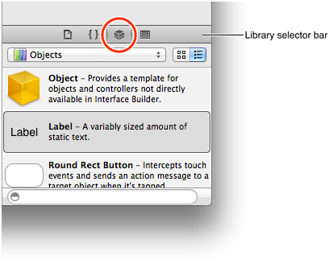
3. In the object library, choose Controls from the Objects pop-up menu.

   Xcode displays a list of controls below the pop-up menu. The list displays each control’s name and appearance, and a short description of its function.
4. One at a time, drag a text field, a rounded rectangle (Round Rect) button, and a label from the list, and drop each of them onto the view.

   
5. In the view, drag the text field so that it’s near the upper-left corner of the view.

   As you move the text field (or any UI element), dashed blue lines—called _alignment guides_—appear that help you align the item with the center and edges of the view. Stop dragging the text field when you can see the view’s left and upper alignment guides, as shown here:

   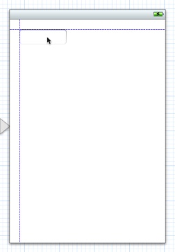
6. In the view, prepare to resize the text field.

   You resize a UI element by dragging its _resize handles_, which are small white squares that can appear on the element’s borders. In general, you reveal an element’s resize handles by selecting it on the canvas or in the outline view. In this case, the text field should already be selected because you just stopped dragging it. If your text field looks like the one below, you’re ready to resize it; if it doesn’t, select it on the canvas or in the outline view.

   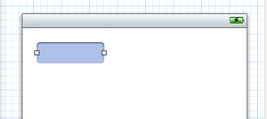
7. Drag the text field’s right resize handle until the view’s rightmost alignment guide appears.

   Stop resizing the text field when you see something like this:

   
8. With the text field still selected, open the Attributes inspector (if necessary).
9. In the Placeholder field near the top of the Text Field Attributes inspector, type the phrase `Your Name`.

   As its name suggests, the Placeholder field provides the light gray text that helps users understand the type of information they can enter in the text field. In the running app, the placeholder text disappears as soon as the user taps inside the text field.
10. Still in the Text Field Attributes inspector, click the middle Alignment button to center the text field’s text.

    After you enter the placeholder text and change the alignment setting, the Text Field Attributes inspector should look something like this:

    
11. In the view, drag the label so that it’s below the text field and its left side is aligned with the left side of the text field.
12. Drag the label’s right resize handle until the label is the same width as the text field.

    A label has more resize handles than a text field. This is because you can adjust both the height and the width of a label (you can adjust only the width of a text field). You don’t want to change the height of the label, so be sure to avoid dragging one of the resize handles in the label’s corners. Instead, drag the resize handle that’s in the middle of the label’s right side.

    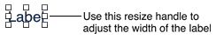
13. In the Label Attributes inspector, click the middle Alignment button (to center the text you’ll display in the label).
14. Drag the button so that it’s near the bottom of the view and centered horizontally.
15. On the canvas, double-click the button and enter the text `Hello`.

    When you double-click the button in the view (and before you enter the text), you should see something like this:

    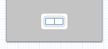

After you add the text field, label, and button UI elements and make the recommended layout changes, your project should look similar to this:


You probably noticed that when you added the text field, label, and button to the background view, Xcode inserted items in the outline view named __Constraints__. Cocoa Touch features an Auto Layout system that lets you define layout constraints for user-interface elements. Constraints represent relationships between user interface elements that affect how they alter their position and geometry when other views are resized or when there is an orientation change. You do not change the default constraints for the views you added to the user interface.

There are a few other changes you can make to the text field so that it behaves as users expect. First, because users will be entering their names, you can ensure that iOS suggests capitalization for each word they type. Second, you can make sure that the keyboard associated with the text field is configured for entering names (rather than numbers, for example) and that the keyboard displays a Done button.

This is the principle behind these changes: Because you know at design time what type of information a text field will contain, you can configure it so that its runtime appearance and behavior are well suited to the user’s task. You make all of these configuration changes in the Attributes inspector.

To configure the text field

1. In the view, select the text field.
2. In the Text Field Attributes inspector, make the following choices:

   - In the Capitalization pop-up menu, choose Words.
   - Ensure that the Keyboard pop-up menu is set to Default.
   - In the Return Key pop-up menu, choose Done.

   After you make these choices, the Text Field Attributes inspector should look like this:

   

Run your app in Simulator to make sure that the UI elements you added look the way you expect them to. If you click the Hello button, it should become highlighted, and if you click inside the text field, the keyboard should appear. At the moment, though, the button doesn’t do anything, the label remains empty, and there’s no way to dismiss the keyboard after it appears. To add this functionality, you need to make the appropriate connections between the UI elements and the view controller. These connections are described next.

When the user activates a UI element, the element can send an action message to an object that knows how to perform the corresponding action method (such as “add this contact to the user’s list of contacts”). This interaction is part of the _target-action_ mechanism, which is another Cocoa Touch design pattern.

In this tutorial, when the user taps the Hello button, you want it to send a “change the greeting” message (the _action_) to the view controller (the _target_). The view controller responds to this message by changing the string (that is, the model object) that it manages. Then, the view controller updates the text that’s displayed in the label to reflect the change in the model object’s value.

Using Xcode, you can add an action to a UI element and set up its corresponding action method by Control-dragging from the element on the canvas to the appropriate part of a source file (typically, a class extension in a view controller’s implementation file). The storyboard archives the connections that you create in this way. Later, when the app loads the storyboard, the connections are restored.

To add an action for the button

1. If necessary, select `MainStoryboard.storyboard` in the project navigator to display the scene on the canvas.
2. In the Xcode toolbar, click the Utilities button to hide the utilities area and click the Assistant Editor button to display the assistant editor pane.

   The Assistant Editor button is the middle Editor button and it looks like this: 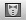.
3. Make sure that the Assistant displays the view controller’s implementation file (that is, `HelloWorldViewController.m`).

   If it shows `HelloWorldViewController.h` instead, select `HelloWorldViewController.m` in the project navigator.
4. On the canvas, Control-drag from the Hello button to the class extension in `HelloWorldViewController.m`.

   A class extension in an implementation file is a place for declaring properties and methods that are private to a class. (You will learn more about class extensions in _Write Objective-C Code_.) Outlets and actions should be private. The Xcode template for a view controller includes a class extension in the implementation file; in the HelloWorld project, the class extension looks like this:

```objc
@interface HellowWorldViewController()

@end
```

   To Control-drag, press and hold the Control key while you drag from the button to the implementation file in the assistant editor pane. As you Control-drag, you should see something like this:

   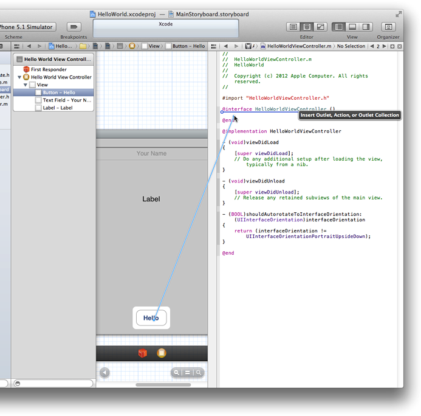

   When you release the Control-drag, Xcode displays a popover in which you can configure the action connection you just made:

   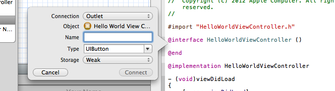
5. In the popover, configure the button’s action connection:

   - In the Connection pop-up menu, choose Action.
   - In the Name field, enter `changeGreeting:` (be sure to include the colon).

     In a later step, you’ll implement the `changeGreeting:` method so that it takes the text that the user enters into the text field and displays it in the label.
   - Make sure that the Type field contains `id`.

     The `id` data type can represent any Cocoa object. You want to use `id` here because it doesn’t matter what type of object sends the message.
   - Make sure that the Event pop-up menu contains Touch Up Inside.

     You specify the Touch Up Inside event because you want the message to be sent when the user lifts the finger inside the button.
   - Make sure that the Arguments pop-up menu contains Sender.

   After you configure the action connection, the popover should look like this:

   
6. In the popover, click Connect.

   Xcode adds a stub implementation of the new `changeGreeting:` method and indicates that the connection has been made by displaying a filled-in circle to the left of the method:

   

When you Control-dragged from the Hello button to the class extension in `HelloWorldViewController.m` file and configured the resulting action, you accomplished two things: You added, through Xcode, the appropriate code to the view controller class (in `HelloWorldViewController.m`), and you created a connection between the button and the view controller. Specifically, Xcode did the following things:

- To `HelloWorldViewController.m`, it added the following action method declaration to the class extension:

```objc
- (IBAction)changeGreeting:(id)sender;
```

  and added the following stub method to the implementation area:

```objc
- (IBAction)changeGreeting:(id)sender {
}
```
- It created a connection between the button and the view controller.

Next, you create connections between the view controller and the two remaining UI elements (that is, the label and the text field).

An _outlet_ describes a connection between two objects. When you want an object (such as the view controller) to communicate with an object that it contains (such as the text field), you designate the contained object as an outlet. When the app runs, the outlet you create in Xcode is restored, allowing the objects to communicate with each other at runtime.

In this tutorial, you want the view controller to get the user’s text from the text field and then display the text in the label. To ensure that the view controller can communicate with these objects, you create outlet connections between them.

The steps you take to add outlets for the text field and label are very similar to the steps you took when you added the button’s action. Before you start, make sure that the main storyboard file is still visible on the canvas and that `HelloWorldViewController.m` is still open in the assistant editor.

To add an outlet for the text field

1. Control-drag from the text field in the view to the class extension in the implementation file.

   As you Control-drag, you should see something like this:

   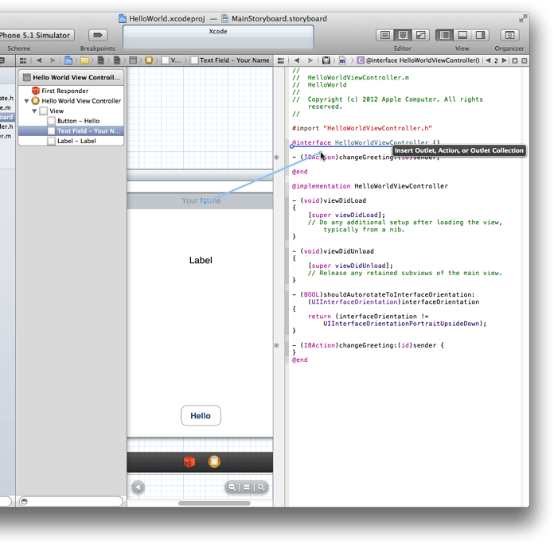

   It does not matter where you release the Control-drag as long as it’s inside the class extension. In this tutorial, the outlet declarations for the text field and the label are shown above the method declaration for the Hello button.
2. In the popover that appears when you release the Control-drag, configure the text field’s connection:

   - Make sure that the Connection pop-up menu contains Outlet.
   - In the Name field, type “textField”.

     You can call the outlet whatever you want, but your code is more understandable when an outlet name bears some relationship to the item it represents.
   - Make sure that the Type field contains “UITextField”.

     Setting the Type field to “UITextField” ensures that Xcode connects the outlet only to a text field.
   - Make sure that the Storage pop-up menu contains Weak, which is the default value.

     You will learn more about strong and weak storage later, in _Acquire Foundational Programming Skills_.

   After you make these settings, the popover should look like this:

   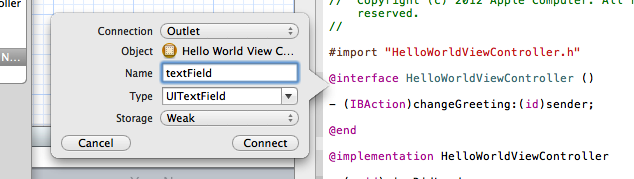
3. In the popover, click Connect.

You accomplished two things by adding an outlet for the text field. Through this procedure:

- Xcode added appropriate code to the implementation file (`HelloWorldViewController.m`) of the view controller class.

  Specifically, it added the following declaration to the class extension:

```objc
@property (weak, nonatomic) IBOutlet UITextField *textField;
```
- Xcode established a connection from the view controller to the text field.

  By establishing the connection between the view controller and the text field, the text that the user enters can be passed to the view controller. As Xcode did with the `changeGreeting:` method declaration, it indicates that the connection has been made by displaying a filled-in circle to the left of the text field declaration.

Now add an outlet for the label and configure the connection. Establishing a connection between the view controller and the label allows the view controller to update the label with a string that contains the user’s text. The steps you follow for this task are the same as the ones you followed to add the outlet for the text field, but with appropriate changes to the configuration. (Make sure that `HelloWorldViewController.m` is still visible in the assistant editor.)

To add an outlet for the label

1. Control-drag from the label in the view to the class extension in `HelloWorldViewController.m` in the assistant editor.
2. In the popover that appears when you release the Control-drag, configure the label’s connection:

   - Make sure that the Connection pop-up menu contains Outlet.
   - In the Name field, type “label”.
   - Make sure that the Type field contains “UILabel”.
   - Make sure that the Storage pop-up menu contains Weak.
3. In the popover, click Connect.

At this point in the tutorial, you’ve created a total of three connections to your view controller:

- An action connection for the button
- An outlet connection for the text field
- An outlet connection for the label

You can verify these connections in the Connections inspector.

To open the Connections inspector for the view controller

1. Click the Standard editor button to close the assistant editor and switch to the standard editor view.

   The Standard editor button is the leftmost Editor button and it looks like this: 
2. Click the Utilities view button to open the utilities area.
3. Select Hello World View Controller in the outline view.
4. Show the Connections inspector in the utilities area.

   The Connections inspector button is the rightmost button in the inspector selector bar, and it looks like this: 

In the Connections inspector, Xcode displays the connections for the selected object (in this case, the view controller). In your workspace window, you should see something like this:

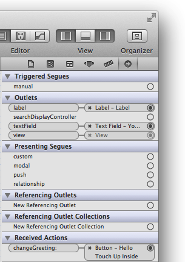

You’ll see a connection between the view controller and its view, in addition to the three connections you created. Xcode provides this default connection between the view controller and its view; you do not have to access it in any way.

You have one more connection to make in your app: You need to connect the text field to an object that you specify as its delegate. In this tutorial, you use the view controller for the text field’s delegate.

You need to specify a delegate object for the text field. This is because the text field sends a message to its delegate when the user taps the Done button in the keyboard (recall that a delegate is an object that acts on the behalf of another object). In a later step, you’ll use the method associated with this message to dismiss the keyboard.

Make sure that the storyboard file is open on the canvas. If it’s not, select `MainStoryboard.storyboard` in the project navigator.

To set the text field’s delegate

1. In the view, Control-drag from the text field to the yellow sphere in the scene dock (the yellow sphere represents the view controller object).

   When you release the Control-drag, you should see something like this:

   
2. Select `delegate` in the Outlets section of the translucent panel that appears.

The iOS operating system provides a host of features that help make apps accessible to all users, including those with visual, auditory, and physical disabilities. By making your app accessible, you open it up to millions of people who would otherwise not be able to use it.

A major accessibility feature is VoiceOver, Apple’s innovate screen-reading technology. With VoiceOver, users can navigate and control the parts of an app without having to see the screen. By touching a control or other object in the user interface, users can learn where they are, what they can do, and what will happen if they do something.

You can add several accessibility attributes to any view in your user interface. These attributes include the current value of the view (such as the text in a text field), its label, a hint, and a number of traits. For the HelloWorld app, you are going to add a hint to the text field.

To add an accessibility hint

1. Select the storyboard file (base internationalization) in the project navigator.
2. Select the text field.
3. In the Accessibility section of the Identity inspector, type “Type your name” in the Hint field.

   

Click Run to test your app.

You should find that the Hello button becomes highlighted when you click it. You should also find that if you click in the text field, the keyboard appears and you can enter text. However, there’s still no way to dismiss the keyboard. To do that, you have to implement the relevant delegate method. You’ll do that in the next chapter. For now, quit Simulator.

When you created the appropriate connections between the view controller on the canvas and the class extension in the implementation file (that is, `HelloWorldViewController.m`) in the assistant editor, you also updated the implementation file to support the outlets and the action.

You don’t have to use the Xcode feature that automatically adds code when you establish a connection by Control-dragging from the canvas to a source file. Instead, you can write the property and method declarations in the class extension or (for public properties and methods) the header file yourself, and then make the connections as you did with the text field’s delegate. Typically, though, you make fewer mistakes (and have less typing to do) when you let Xcode do as much of the work as it can.

[Next](Implementing%20the%20View%20Controller.md)[Previous](Inspecting%20the%20View%20Controller%20and%20Its%20View.md)

---
