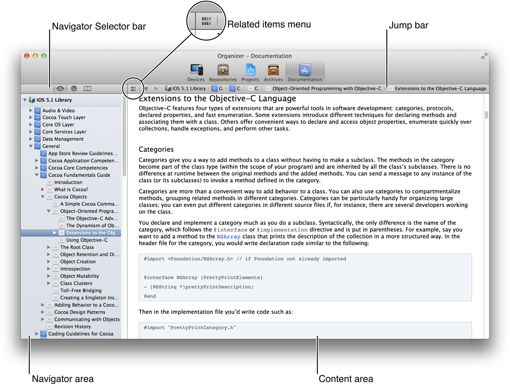
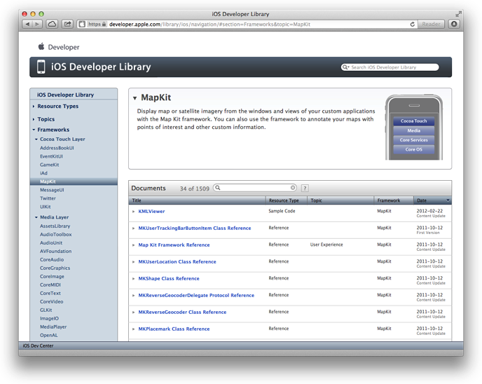
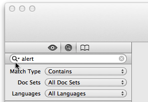
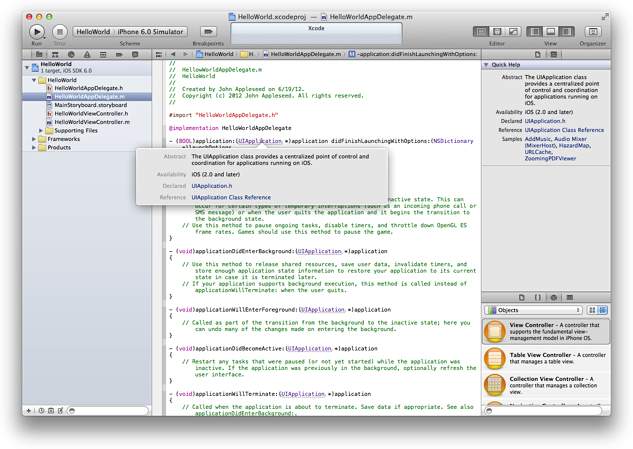
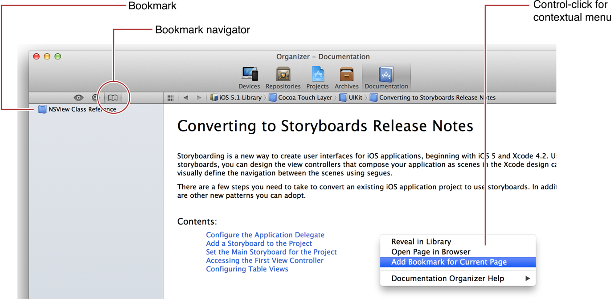
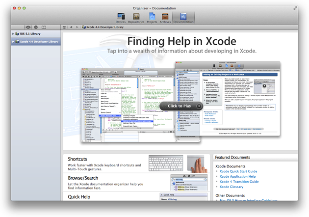

> 导航：[总目录](../../../README.md) · [referencelibrary](../../../_indexes/referencelibrary.md) · [Start Developing iOS Apps Today (Retired)](Document%20Revision%20History.md)

[Back to Finding Information](https://developer.apple.com/library/archive/referencelibrary/GettingStarted/RoadMapiOS-Legacy/chapters/FindingInformation.html)
!
!
!

# Retired Document

__Important:__ This version of _Start Developing iOS Apps Today_ has been retired. The replacement version provides a new, more streamlined walkthrough of the basics. For information covering the same subject area as this page, please see ["Finding Information"](https://developer.apple.com/library/ios/referencelibrary/GettingStarted/RoadMapiOS/FindingInformation.html#//apple_ref/doc/uid/TP40011343-CH13-SW1).

# Find Documentation Quickly

Apple provides documentation to help you successfully build and deploy your app, including sample code, FAQs, technical notes, videos, and conceptual and reference documentation. For the most current and accurate information, get the documentation resources you need directly from Apple. With Xcode, you already have access to these resources. If you prefer using a browser or viewing PDF on iPad, you can view the iOS Developer Library online. Either way, you need to become familiar with the variety of navigation and search techniques provided.

The Xcode Documentation organizer is a full-featured viewer that provides integrated searching and viewing of developer documentation. You use the Documentation organizer to specify which doc set you want to view.

A doc set is a collection of resources for key Apple technologies. Each set contains the same resources as the online iOS Developer Library. By default, Xcode automatically installs and updates doc sets as they become available. As an iOS developer, you’ll find that these two doc sets are installed automatically:

- iOS Developer Library, which contains documentation specific to writing iOS apps
- Xcode Developer Library, which contains documentation specific to using Xcode as your development environment

To view iOS documentation in Xcode

1. Choose Window > Organizer and click Documentation in the Organizer window.

   The Documentation organizer appears with the search navigator enabled.
2. Click the Browse button () in the navigator selector bar.

   The installed developer libraries appear in the document navigator.
3. Select iOS Library.

Click a navigator button to choose how you want to find documentation:

-    Browse the documentation hierarchy.
-     Search for specific terms.
-    Use bookmarks to return to documents you have viewed.

Selecting a document opens it in HTML format in the content area. If the document is available in PDF format, you can open the PDF version by choosing it in the related items menu.

The jump bar in the content area allows you to further explore the document and the library it’s in. After you are comfortable using the jump bar, you may want to increase the content display area by choosing Editor > Hide Navigator.

If you prefer, you can browse the developer library online. For example, you might want to read documentation on an iPad or on a computer without Xcode installed. Access the iOS Developer Library, by entering `http://developer.apple.com/library/iOS`, or log in to the iOS Dev Center and click the iOS Developer Library link.

You can also view documents in PDF on the website. If a document is available in PDF, a PDF button appears in the upper-right corner when the document is displayed. Click the button to display the PDF file in the browser, or Control-click it to download the file.

Both Xcode and the iOS Developer Library web interface give you several ways to navigate and find resources. You can view documents by resource type, topic, or framework. Resource types include guides describing concepts and tasks, reference documents containing API details, sample code ready for download, and video presentations by Apple engineers. There are also tutorials that provide step-by-step guides to some technologies. Navigate the Topics section to find resources by subject area, such as Audio & Video, Security, and User Experience. Use the Frameworks section to navigate to framework-specific documentation, such as for UIKit, Foundation, and Core Data.

Xcode and the online iOS Developer Library use the same user interface to filter documents. In Xcode, select the library in the left column to see the same landing page you see in the iOS Developer Library. Then, use the table of contents sidebar in the content area to browse the contents of the library.

When you select an item in the table of contents, the resource list is displayed in the content area on the right. Use the column headings to sort the resources by title, resource type, topic, framework (if applicable), or last modified date. In addition, there’s a search field in the documents bar that you can use to filter the list. For example, if you want to see all the reference documents for UIKit, select UIKit from the Frameworks category in the table of contents and then sort the list by resource type. All the reference documents appear first, followed by the sample code. If you know the name of a technology but are not sure where it is located, you can select the iOS Library heading in the table of contents to display all documents in the developer library and then enter a search string in the search field.

You can also easily view all the sample code available in a library. Click Sample Code (under Resource Types) in the table of contents, and then use the column headings and search field to sort and filter the list. Select the sample code you are interested in viewing. If you are viewing the sample in Xcode, you can view all the Xcode project files or click Open Project. If you are viewing the sample in the iOS Developer Library, you can click Download Sample Code.

Search developer documentation to locate information specific to your immediate needs.

Use the search field in the upper-right corner of the online iOS Developer Library to query the entire library. The search results are grouped by resource type. For example, if you enter `stringWith` in the search field, the results show _String Programming Guide_ as the most relevant guide and _String_ as a sample code project.

In Xcode, click the Search button () in the navigator selector bar to display the search navigator. Search results are displayed in the navigator area, organized by resource type (such as reference or guide) and in order of relevance.

Each document is identified by a document type icon. The icons include:

-   Topic category or conceptual document
-   API reference document
-   Sample code project
-   Document page or section
-   Help article

Results for API symbols in reference documents are further identified with a symbol type icon and are displayed with the search term highlighted.

Use the find options to restrict search results to resources that are most relevant to your needs. Click the magnifying glass icon and choose Show Find Options. Use the Match Type menu to specify that the search term must occur at least once within the resulting documents. Use the Doc Sets menu to choose any combination of doc sets to search. Use the Languages menu to restrict the results to documents for a specified set of the programming languages.

You can access reference documents directly from the source editor in Xcode. To open the source editor, select a source file in the navigation area. With a source file open, show the utilities area and click the Quick Help inspector button within it. Place the insertion point in an API symbol in the source editor, and view the documentation in the inspector.

The information displayed includes links to:

- Complete reference documentation for the symbol
- The header file where the symbol is declared
- Related programming guides
- Related sample code

You can also view concise reference information for an API symbol in a pop-up window by Option-clicking the symbol in the source code.

Add bookmarks in the Xcode Documentation organizer to return easily to a page, document, or category. You can bookmark any page or document.

Manage your bookmarks in the bookmark navigator. By default, bookmarks are listed in the order in which you add them. You can change the order of a bookmark by dragging it to a new position in the list. You can delete a bookmark by selecting it and pressing Delete. The name assigned to a bookmark is the title of the corresponding HTML page. (You cannot rename bookmarks.)

Apple also provides documentation about using Xcode. To browse the Xcode online help, choose Help > Xcode Help and the Documentation organizer opens to the “Finding Help in Xcode” start screen. Click Xcode Application Help for a list of help books organized by subject. Each help book consists of articles offering step-by-step descriptions for performing common operations in Xcode. Many of the articles in Xcode Help include a short video illustrating the described task. Click the video thumbnail to play the video.

Many Xcode Help articles are also available from shortcut menus throughout Xcode. Control-click in any of the main user interface areas in Xcode to see a list of help articles available for that area. If there are more articles than can be listed in the menu, choose Show All Help Topics to see all the related help articles.

There’s a custom interface for viewing documentation in Safari on iPad. To save screen space, you use the Library button instead of a table of contents to navigate by type, topic, or framework.

To view a PDF file on iPad, select the document you want to read, tap the table of contents control, and tap PDF.

If you don’t find what you need in Xcode or the iOS Developer Library, you can post a question to one of the Apple Developer forums. When you log in to the iOS Dev Center, the Apple Developer Forums link appears at the bottom of the page.

[Back to Finding Information](https://developer.apple.com/library/archive/referencelibrary/GettingStarted/RoadMapiOS-Legacy/chapters/FindingInformation.html)
!
!
!
