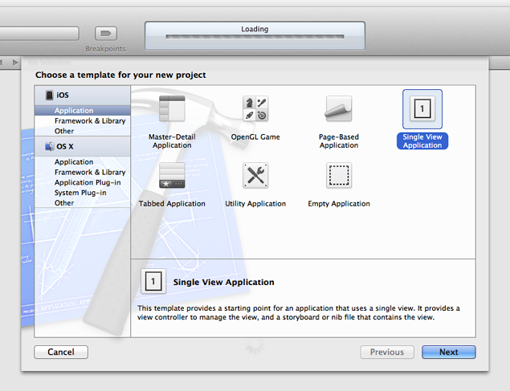
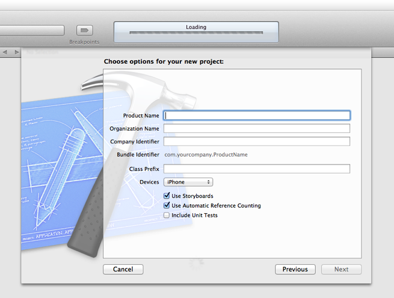
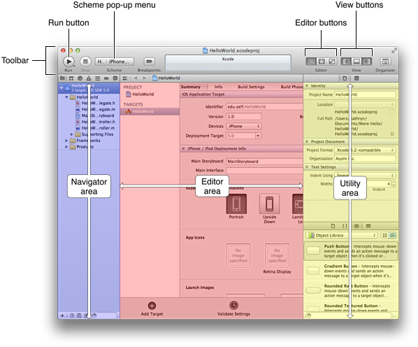
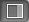
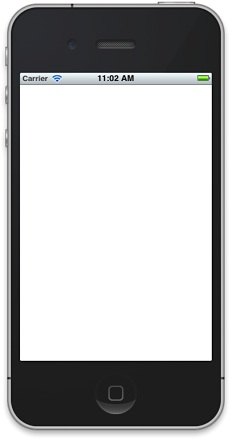
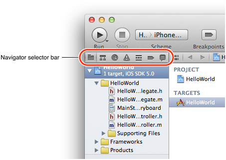
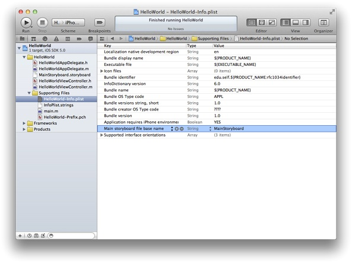
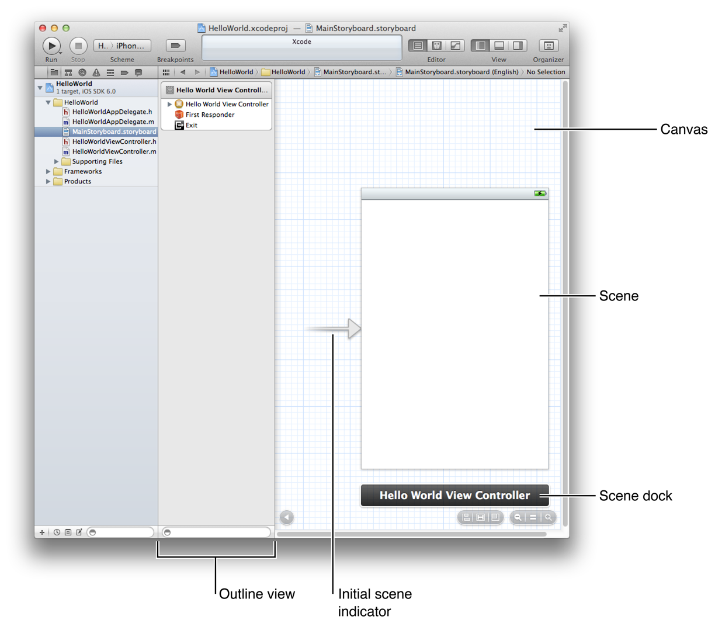

> 导航：[总目录](../../../README.md) · [referencelibrary](../../../_indexes/referencelibrary.md) · [Start Developing iOS Apps Today (Retired)](Document%20Revision%20History.md)


[Next](Inspecting%20the%20View%20Controller%20and%20Its%20View.md)[Previous](About%20Creating%20Your%20First%20iOS%20App.md)

# Retired Document

__Important:__ This version of _Start Developing iOS Apps Today_ has been retired. The replacement version provides a new, more streamlined walkthrough of the basics. For information covering the same subject area as this page, please see ["Tutorial: Basics"](https://developer.apple.com/library/ios/referencelibrary/GettingStarted/RoadMapiOS/FirstTutorial.html#//apple_ref/doc/uid/TP40011343-CH3-SW1).

# Getting Started

To create the iOS app in this tutorial, you need Xcode 4.3 or later. Xcode is Apple’s integrated development environment (or IDE) for both iOS and Mac OS X development. When you install Xcode on your Mac, you also get the iOS SDK, which includes the programming interfaces of the iOS platform.

To get started developing your app, you create a new Xcode project.

To create a new project

1. Open Xcode (by default it’s in `/Applications`).

   If you’ve never created or opened a project in Xcode before, you should see a Welcome to Xcode window similar to this:

   

   If you’ve created or opened a project in Xcode before, you might see a project window instead of the Welcome to Xcode window.
2. In the Welcome to Xcode window, click “Create a new Xcode project” (or choose File > New > New project).

   Xcode opens a new window and displays a dialog in which you can choose a template. Xcode includes several built-in app templates that you can use to develop common styles of iOS apps. For example, the Tabbed template creates an app that is similar to iTunes and the Master-Detail template creates an app that is similar to Mail.

   
3. In the iOS section at the left side of the dialog, select Application.
4. In the main area of the dialog, select Single View Application and then click Next.

   A new dialog appears that prompts you to name your app and choose additional options for your project.

   
5. Fill in the Product Name, Company Identifier, and Class Prefix fields.

   You can use the following values:

   - Product Name: `HelloWorld`
   - Company Identifier: Your company identifier, if you have one. If you don’t have a company identifier, you can use `edu.self`.
   - Class Prefix: `HelloWorld`
6. In the Device Family pop-up menu, make sure that iPhone is chosen.
7. Make sure that the Use Storyboard and Use Automatic Reference Counting options are selected and that the Include Unit Tests option is unselected.
8. Click Next.

   Another dialog appears that allows you to specify where to save your project.
9. Specify a location for your project (leave the Source Control option unselected) and then click Create.

   Xcode opens your new project in a window (called the _workspace window_), which should look similar to this:

   

Take a few moments to familiarize yourself with the workspace window that Xcode opens for you. You’ll use the buttons and areas identified in the window below throughout the rest of this tutorial.



If the utilities area in your workspace window is already open (as it is in the window shown above), you can close it for now because you won’t need it until later in the tutorial. The rightmost View button controls the utilities area. When the utilities area is visible, the button looks like this:



If necessary, click the rightmost View button to close the utilities area.

Even though you haven’t yet written any code, you can build your app and run it in the Simulator app that is included in Xcode. As its name implies, Simulator allows you to get an idea of how your app would look and behave if it were running on an iOS-based device.

To run your app in Simulator

1. Make sure that the Scheme pop-up menu in the Xcode toolbar has HelloWorld > iPhone 6.0 Simulator chosen.

   If the pop-up menu does not display that choice, open it and choose iPhone 6.0 Simulator from the menu.
2. Click the Run button in the Xcode toolbar (or choose Product > Run).

   Xcode updates you on the build process.

After Xcode finishes building your project, Simulator should start automatically. Because you specified an iPhone product (rather than an iPad product), Simulator displays a window that looks like an iPhone. On the simulated iPhone screen, Simulator opens your app, which should look like this:



Right now, your app is not very interesting: it simply displays a blank white screen. To understand where the white screen comes from, you need to learn about the objects in your code and how they work together to start the app. For now, quit Simulator (choose iOS Simulator > Quit iOS Simulator; make sure that you don’t quit Xcode).

Because you based your project on an Xcode template, much of the basic app environment is automatically set up when you run the app. For example, Xcode creates an application object which, among a few other things, establishes the run loop (a run loop registers input sources and enables the delivery of input events to your app). Most of this work is done by the `UIApplicationMain` function, which is supplied for you by the UIKit framework and is automatically called in your project’s `main.m` source file.

To look at the main.m source file

1. Make sure the project navigator is open in the navigator area.

   The project navigator displays all the files in your project. If the project navigator is not open, click the leftmost button in the navigator selector bar:

   
2. Open the Supporting Files folder in the project navigator by clicking the disclosure triangle next to it.
3. Select `main.m`.

   Xcode opens the source file in the main editor area of the window, which should look similar to this:

   

The `main` function in `main.m` calls the `UIApplicationMain` function within an autorelease pool:

```
@autoreleasepool {
   return UIApplicationMain(argc, argv, nil, NSStringFromClass([HelloWorldAppDelegate class]));
}
```

The `@autoreleasepool` statement supports the Automatic Reference Counting (ARC) system. ARC provides automatic object-lifetime management for your app, ensuring that objects remain in existence for as long as they're needed and no longer.

The call to `UIApplicationMain` creates an instance of the `UIApplication` class and an instance of the app delegate (in this tutorial, the app delegate is `HelloWorldAppDelegate`, which is provided for you by the Single View template). The main job of the __app delegate__ is to provide the window into which your app’s content is drawn. The app delegate can also perform some app configuration tasks before the app is displayed. (__Delegation__ is a design pattern in which one object acts on behalf of, or in coordination with, another object.)

In an iOS app, a __window__ object provides a container for the app’s visible content, helps deliver events to app objects, and helps the app respond to changes in the device’s orientation. The window itself is invisible.

The call to `UIApplicationMain` also scans the app’s `Info.plist` file. The `Info.plist` file is an information property list—that is, a structured list of key-value pairs that contains information about the app such as its name and icon.

To look at the property list file

- In the Supporting Files folder in the project navigator, select `HelloWorld-Info.plist`.

  Xcode opens the `Info.plist` file in the editor area of the window, which should look similar to this:

  

  In this tutorial, you won’t need to look at any other files in the Supporting Files folder, so you can minimize distractions by closing the folder in the project navigator. Again click the disclosure triangle next to the folder icon to close the Supporting Files folder.

Because you chose to use a storyboard in this project, the `Info.plist` file also contains the name of the storyboard file that the application object should load. A __storyboard__ contains an archive of the objects, transitions, and connections that define an app’s user interface.

In the HelloWorld app, the storyboard file is named `MainStoryboard.storyboard` (note that the `Info.plist` file shows only the first part of this name). When the app starts, `MainStoryboard.storyboard` is loaded and the initial view controller is instantiated from it. A __view controller__ is an object that manages an area of content; the __initial view controller__ is simply the first view controller that gets loaded when an app starts.

The HelloWorld app contains only one view controller (specifically, `HelloWorldViewController`). Right now, `HelloWorldViewController` manages an area of content that is provided by a single view. A __view__ is an object that draws content in a rectangular area of the screen and handles events caused by the user’s touches. A view can also contain other views, which are called __subviews__. When you add a subview to a view, the containing view is called the __parent view__ and its subview is called a __child view__. The parent view, its child views (and their child views, if any) form a __view hierarchy__. A view controller manages a single view hierarchy.

In a later step, you’ll create a view hierarchy by adding three subviews to the view that’s managed by `HelloWorldViewController`; these three subviews represent the text field, the label, and the button.

You can see visual representations of the view controller and its view in the storyboard.

To look at the storyboard

- Select `MainStoryboard.storyboard` in the project navigator.

  Xcode opens the storyboard in the editor area. (The area behind the storyboard objects—that is, the area that looks like graph paper—is called the __canvas__.)

When you open the default storyboard, your workspace window should look similar to this:



A storyboard contains scenes and segues. A __scene__ represents a view controller, and a __segue__ represents a transition between two scenes.

Because the Single View template provides one view controller, the storyboard in your app contains one scene and no segues. The arrow that points to the left side of the scene on the canvas is the __initial scene indicator__, which identifies the scene that should be loaded first when the app starts (typically, the initial scene is the same as the initial view controller).

The scene that you see on the canvas is named Hello World View Controller because it is managed by the `HelloWorldViewController` object. The Hello World View Controller scene consists of a few items that are displayed in the Xcode __outline view__ (which is the pane that appears between the canvas and the project navigator). Right now, the view controller consists of the following items:

- A first responder placeholder object (represented by an orange cube).

  The __first responder__ is a dynamic placeholder that represents the object that should be the first to receive various events while the app is running. These events include editing-focus events (such as tapping a text field to bring up the keyboard), motion events (such as shaking the device), and action messages (such as the message a button sends when the user taps it), among others. You won’t be doing anything with the first responder in this tutorial.
- A placeholder object named __Exit__ for unwinding seques.

  By default, when a user dismisses a child scene, the view controller for that scene _unwinds_ (or returns) to the parent scene—that is the scene that originally transitioned to the child scene. However, the Exit object enables a view controller to unwind to an arbitrary scene.
- The `HelloWorldViewController` object (represented by a pale rectangle inside a yellow sphere).

  When a storyboard loads a scene, it creates an instance of the view controller class that manages the scene.
- A view, which is listed below the view controller (to reveal this view in the outline view, you might have to open the disclosure triangle next to Hello World View Controller).

  The white background of this view is what you saw when you ran the app in Simulator.

The area below the scene on the canvas is called the __scene dock__. Right now, the scene dock displays the view controller’s name (that is, Hello World View Controller). At other times, the scene dock can contain the icons that represent the first responder, the Exit placeholder object, and the view controller object.

In this chapter you used Xcode to create a new project based on the Single View template and you built and ran the default app that the template defines. Then you looked at some of the basic pieces of the project, such as the `main.m` source file, the `Info.plist` file, and the storyboard file, and learned how an app starts up. You also learned how the Model-View-Controller design pattern defines roles for the objects in your app.

In the next chapter, you’ll learn more about the view controller and its view.

[Next](Inspecting%20the%20View%20Controller%20and%20Its%20View.md)[Previous](About%20Creating%20Your%20First%20iOS%20App.md)

---
