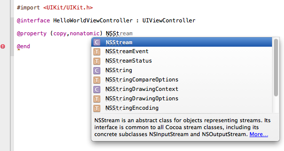

> 导航：[总目录](../../../README.md) · [referencelibrary](../../../_indexes/referencelibrary.md) · [Start Developing iOS Apps Today (Retired)](Document%20Revision%20History.md)


[Next](Troubleshooting%20and%20Reviewing%20the%20Code.md)[Previous](Configuring%20the%20View.md)

# Retired Document

__Important:__ This version of _Start Developing iOS Apps Today_ has been retired. The replacement version provides a new, more streamlined walkthrough of the basics. For information covering the same subject area as this page, please see ["Tutorial: Basics"](https://developer.apple.com/library/ios/referencelibrary/GettingStarted/RoadMapiOS/FirstTutorial.html#//apple_ref/doc/uid/TP40011343-CH3-SW1).

# Implementing the View Controller

There are several parts to implementing the view controller: You need to add a property for the user’s name, implement the `changeGreeting:` method, and ensure that the keyboard is dismissed when the user taps Done.

You need to add a property declaration for the string that holds the user’s name, so that your code always has a reference to it. Because this property should be public—that is, visible to clients and subclasses—you add this declaration to the view controller’s header file, `HelloWorldViewController.h`. Public properties indicate how you intend objects of your class to be used.

A _property declaration_ is a directive that tells the compiler how to generate the accessor methods for a variable, such as the variable used to hold the user’s name. (You’ll learn about accessor methods after you add the property declaration.)

At this point in the tutorial, you don’t need to make any further changes to the storyboard file. To give yourself more room in which to add the code described in the following steps, hide the utilities area by clicking the Utilities View button again (or by choosing View > Utilities > Hide Utilities).

To add a property declaration for the user’s name

1. In the project navigator, select `HelloWorldViewController.h`.
2. Before the `@end` statement, write an `@property` statement for the string.

   The property declaration should look like this:

```objc
@property (copy, nonatomic) NSString *userName;
```

   You can copy and paste the code above or you can type it into the editor pane. If you decide to type the code, notice that Xcode suggests completions to what you’re typing. For example, as you begin to type `@prop...` Xcode guesses that you want to enter `@property`, so it displays this symbol in an inline suggestion panel that looks similar to this:

   

   If the suggestion is appropriate (as it is in the example shown above), press Return to accept it.

   As you continue to type, Xcode might offer a list of suggestions from which you can choose. For example, Xcode might display the following list of completions as you type `NSStr...`:

   

   When Xcode displays a completion list, press Return to accept the highlighted suggestion. If the highlighted suggestion isn’t correct (as is the case in the list shown above), use the arrow keys to select the appropriate item in the list.

The compiler automatically synthesizes accessor methods for any property you declare. An _accessor method_ is a method that gets or sets the value of an object’s property (sometimes, accessor methods are also called “getters” and “setters”). For example, the compiler generates declarations of the following getter and setter for the `userName` property you just declared, along with their implementations:

- `- (NSString *)userName;`
- `- (void)setUserName:(NSString *)newUserName;`

The compiler also automatically declares private instance variables to back each declared property. For example, it declares an instance variable named `_userName` that backs the `userName` property.

In the previous chapter, “Configuring the View,” you configured the Hello button so that when the user taps it, it sends a `changeGreeting:` message to the view controller. In response, you want the view controller to display in the label the text that the user entered in the text field. Specifically, the `changeGreeting:` method should:

- Retrieve the string from the text field and set the view controller’s `userName` property to this string.
- Create a new string that is based on the `userName` property and display it in the label.

To implement the changeGreeting: method

1. If necessary, select `HelloWorldViewController.m` in the project navigator.

   You might have to scroll to the end of the file to see the `changeGreeting:` stub implementation that Xcode added for you.
2. Complete the stub implementation of the `changeGreeting:` method by adding the following code:

```objc
- (IBAction)changeGreeting:(id)sender {

    self.userName = self.textField.text;

    NSString *nameString = self.userName;
    if ([nameString length] == 0) {
        nameString = @"World";
    }
    NSString *greeting = [[NSString alloc] initWithFormat:@"Hello, %@!", nameString];
    self.label.text = greeting;
}
```

There are several interesting things to note in the `changeGreeting:` method:

- `self.userName = self.textField.text;` retrieves the text from the text field and sets the view controller’s `userName` property to the result.

  In this tutorial, you don’t actually use the string that holds the user’s name anywhere else, but it’s important to remember its role: It’s the very simple model object that the view controller is managing. In general, the controller should maintain information about app data in its own model objects—app data shouldn’t be stored in user interface elements such as the text field of the HelloWorld app.
- `NSString *nameString = self.userName;` creates a new variable (of type `NSString`) and sets it to the view controller’s `userName` property.
- `@"World"` is a string constant represented by an instance of `NSString`. If the user runs your app but does not enter any text (that is, `[nameString length] == 0`), `nameString` will contain the string “World”.
- The `initWithFormat:` method is supplied for you by the Foundation framework. It creates a new string that follows the format specified by the format string you supply (much like the `printf` function of the ANSI C library).

  In the format string, `%@` acts as a placeholder for a string object. All other characters within the double quotation marks of this format string will be displayed onscreen exactly as they appear.

If you build and run the app, you should find that when you click the button, the label shows “Hello, World!” If you select the text field and start typing on the keyboard, though, you should find that you still have no way to dismiss the keyboard when you’re finished entering text.

In an iOS app, the keyboard is shown automatically when an element that allows text entry becomes the first responder; it is dismissed automatically when the element loses first responder status. (Recall that the first responder is the object that first receives notice of various events, such as tapping a text field to bring up the keyboard.) Although there’s no way to directly send a message to the keyboard from your app, you can make it appear or disappear as a side effect of toggling the first responder status of a text-entry UI element.

The `UITextFieldDelegate` protocol is defined by the UIKit framework, and it includes the `textFieldShouldReturn:` method that the text field calls when the user taps the Return button (regardless of the actual title of this button). Because you set the view controller as the text field’s delegate (in [“To set the text field’s delegate”](Configuring%20the%20View.md#apple-f4xwc4dqnrsv64tfmyxwi33df52wszbpkridimbqgeytgnbtfvkfanbqgaytemzsgmwugsbxfvjvomjs)), you can implement this method to force the text field to lose first responder status by sending it the `resignFirstResponder` message—which has the side effect of dismissing the keyboard.

To configure HelloWorldViewController as the text field’s delegate

1. If necessary, select `HelloWorldViewController.m` in the project navigator.
2. Implement the `textFieldShouldReturn:` method in the `HelloWorldViewController.m` file.

   The method should tell the text field to resign first responder status. The implementation should look something like this:

```objc
- (BOOL)textFieldShouldReturn:(UITextField *)theTextField {
    if (theTextField == self.textField) {
        [theTextField resignFirstResponder];
    }
    return YES;
}
```

   In this app, it’s not really necessary to test the `theTextField == self.textField` expression because there’s only one text field. This is a good pattern to use, though, because there may be occasions when your object is the delegate of more than one object of the same type and you might need to differentiate between them.
3. Select `HelloWorldViewController.h` in the project navigator.
4. To the end of the `@interface` line, add `<UITextFieldDelegate>`.

   Your interface declaration should look like this:

```objc
@interface HelloWorldViewController : UIViewController <UITextFieldDelegate>
...
```

   This declaration specifies that your `HelloWorldViewController` class adopts the `UITextFieldDelegate` protocol.

Build and run the app. This time, everything should behave as you expect. In Simulator, click Done to dismiss the keyboard after you have entered your name, and then click the Hello button to display “Hello, _Your Name_!” in the label.

If the app doesn’t behave as you expect, you need to troubleshoot. For some areas to investigate, see “Troubleshooting and Reviewing Code”.

Now that you’ve finished the implementation of the view controller, you’ve completed your first iOS app. Congratulations!

Return to _Start Developing iOS Apps Today_ to continue learning about iOS app development. If you had trouble getting your app to work correctly, try the problem-solving approaches described in the next chapter before returning to _Start Developing iOS Apps Today_.

[Next](Troubleshooting%20and%20Reviewing%20the%20Code.md)[Previous](Configuring%20the%20View.md)

---
