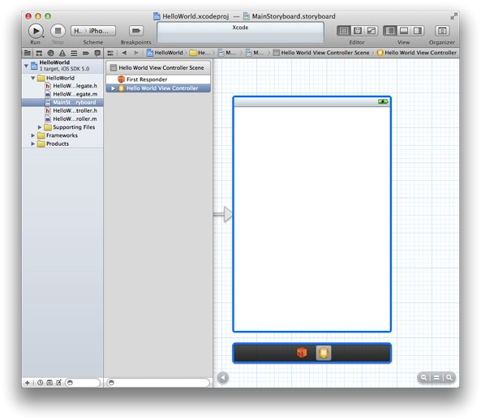
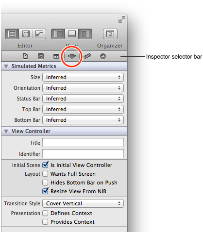
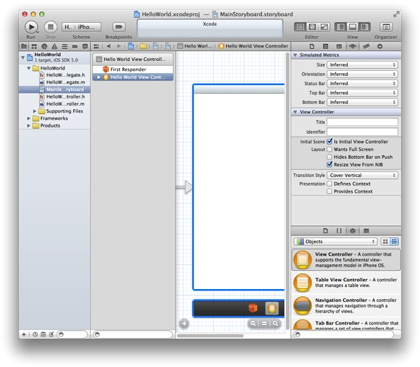
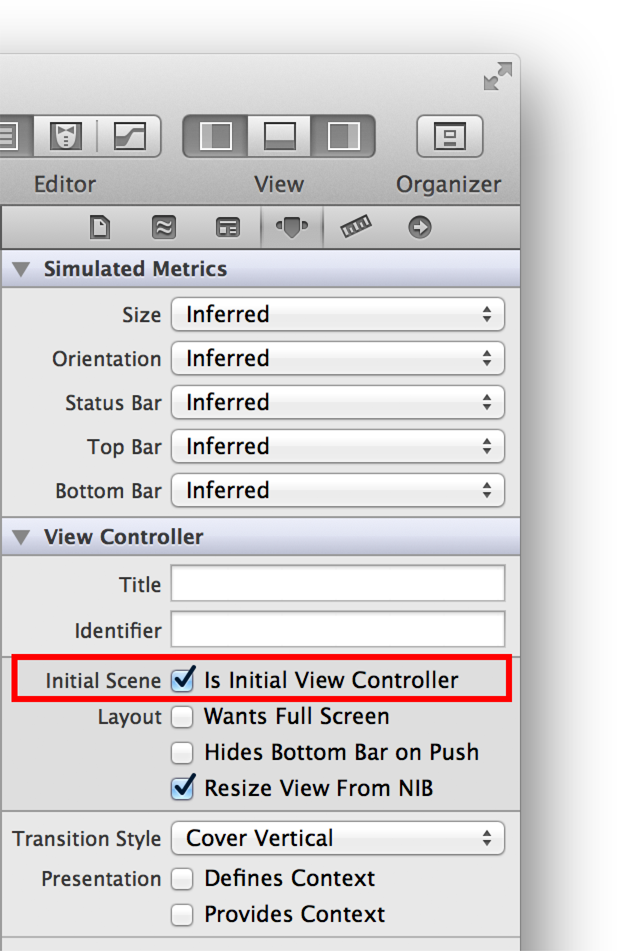
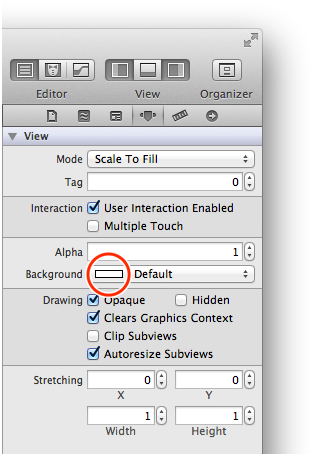
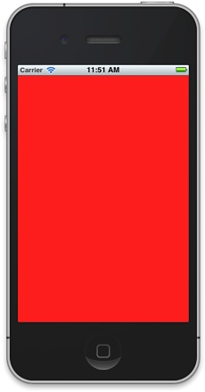

> 导航：[总目录](../../../README.md) · [referencelibrary](../../../_indexes/referencelibrary.md) · [Start Developing iOS Apps Today (Retired)](Document%20Revision%20History.md)

[Next](Configuring%20the%20View.md)[Previous](Getting%20Started.md)

# Retired Document

__Important:__ This version of _Start Developing iOS Apps Today_ has been retired. The replacement version provides a new, more streamlined walkthrough of the basics. For information covering the same subject area as this page, please see ["Tutorial: Basics"](https://developer.apple.com/library/ios/referencelibrary/GettingStarted/RoadMapiOS/FirstTutorial.html#//apple_ref/doc/uid/TP40011343-CH3-SW1).

# Inspecting the View Controller and Its View

As you learned earlier, a view controller is responsible for managing one scene, which represents one area of content. The content that you see in this area is defined in the view controller’s view. In this chapter, you take a closer look at the scene managed by `HelloWorldViewController` and learn how to adjust the background color of its view.

When an app starts up, the main storyboard file is loaded and the initial view controller is instantiated. The initial view controller manages the first scene that users see when they open the app. Because the Single View template provides only one view controller, it’s automatically set to be the initial view controller. You can verify the status of the view controller, and find out other things about it, by using the Xcode inspector.

To open the inspector

1. If necessary, click `MainStoryboard.storyboard` in the project navigator to display the scene on the canvas.
2. In the outline view, select Hello World View Controller (it’s listed below First Responder).

   Your workspace window should look something like this:

   

   Notice that the scene and the scene dock are both outlined in blue, and the view controller object is selected in the scene dock.
3. Click the rightmost View button in the toolbar to display the utilities area at the right side of the window (or choose View > Utilities > Show Utilities).
4. Click the Attributes inspector button in the utilities area to open the Attributes inspector.

   The Attributes inspector button is the fourth button from the left in the inspector selector bar at the top of the utilities area:

   

   With the Attributes inspector open, your workspace window should look something like this (you might have to resize the window to see everything):

   

   In the View Controller section of the Attributes inspector, you can see that the Initial Scene option is selected:

   

   Note that if you deselect this option, the initial scene indicator disappears from the canvas. For this tutorial, make sure the Initial Scene option remains selected.

Earlier in the tutorial, you learned that a view provides the white background that you saw when you ran the app in Simulator. To make sure that your app is working correctly, you can set the background color of the view to something other than white and verify that the new color is displayed by again running the app in Simulator.

Before you change the background of the view, make sure that the storyboard is still open on the canvas. (If necessary, click `MainStoryboard.storyboard` in the project navigator to open the storyboard on the canvas.)

To set the background color of the view controller’s view

1. In the outline view, click the disclosure triangle next to Hello World View Controller (if it’s not already open) and select View.

   Xcode highlights the view area on the canvas.
2. Click the Attributes button in the inspector selector bar at the top of the utilities area to open the Attributes inspector, if it’s not already open.
3. In the Attributes inspector, click the white rectangle in the Background pop-up menu to open the Colors window.

   The rectangle displays the current color of the item’s background. The Background pop-up menu looks like this:

   
4. In the Colors window, select a color other than white.

   Your workspace window (and the Colors window) should look something like this:

   

   Note that because Xcode highlights the view when you select it, the color on the canvas might look different from the color in the Colors window.
5. Close the Colors window.

Click the Run button (or choose Product > Run) to test your app in Simulator. Make sure the Scheme pop-up menu in the Xcode toolbar still displays HelloWorld > iPhone 5.0 Simulator. You should see something like this:

Before you continue with the tutorial, restore the view’s background color to white.

To restore the view’s background color

1. In the Attributes inspector, open the Background pop-up menu by clicking the arrows.

   Note that the rectangle in the Background pop-up menu has changed to display the color you chose in the Colors window. If you click the colored rectangle (instead of the arrows), the Colors window reopens. Because you want to reuse the view’s original background color, it’s easier to choose it from the Background menu than it is to find it in the Colors window.
2. In the Background pop-up menu, choose the white square listed in the Recently Used Colors section of the menu.
3. Click the Run button to compile and run your app (and to save your changes).

After you’ve verified that your app again displays a white background, quit Simulator.

When you run your app, Xcode might open the Debug area at the bottom of the workspace window. You won’t use this pane in this tutorial, so you can close it to make more room in your window.

To close the Debug area

- Click the Debug View button in the toolbar.

  The Debug View button is the middle View button and it looks like this: .

In this chapter, you inspected the scene and changed (and restored) the background color of the view.

In the next chapter, you add to the view the text field, label, and button that allow users to interact with your app.

[Next](Configuring%20the%20View.md)[Previous](Getting%20Started.md)

---
