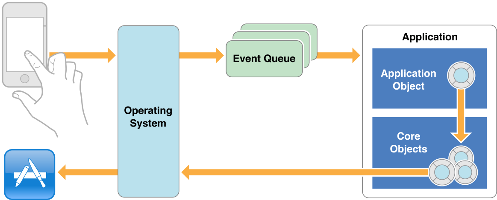
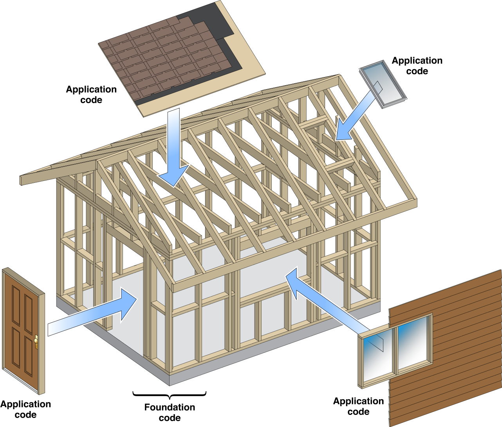
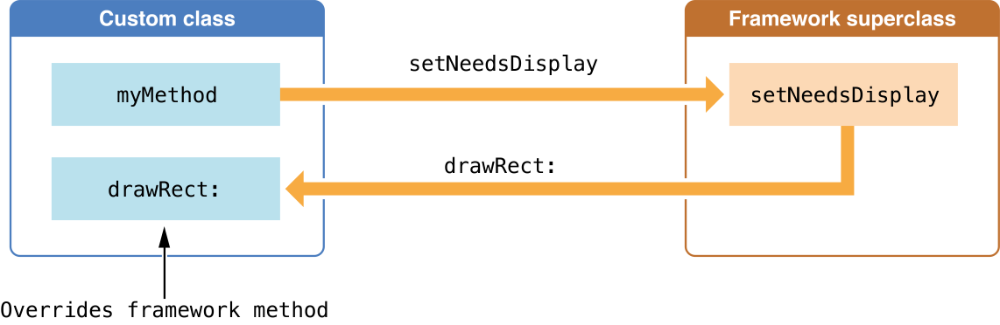
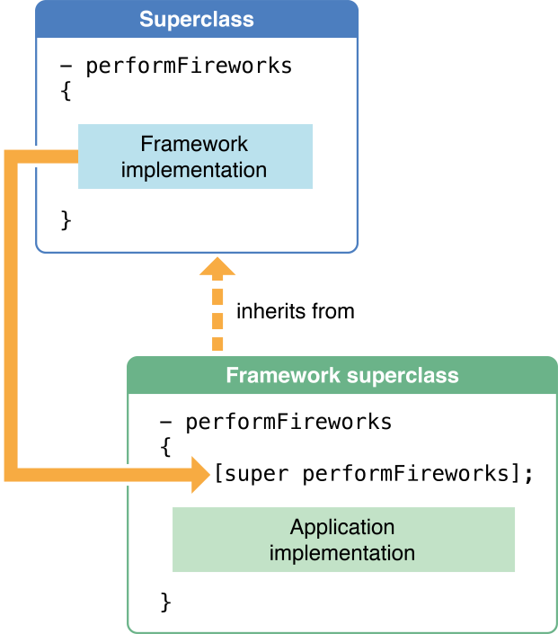

> 导航：[总目录](../../../README.md) · [referencelibrary](../../../_indexes/referencelibrary.md) · [Start Developing iOS Apps Today (Retired)](Document%20Revision%20History.md)

[Back to Frameworks](https://developer.apple.com/library/archive/referencelibrary/GettingStarted/RoadMapiOS-Legacy/chapters/Frameworks.html)
!
!
!

# Retired Document

__Important:__ This version of _Start Developing for iOS Today_ has been retired. The replacement version provides a new, more streamlined walkthrough of the basics. For information covering the same subject area as this page, please see _[Programming With Objective-C](https://developer.apple.com/library/ios/documentation/Cocoa/Conceptual/ProgrammingWithObjectiveC/Introduction/Introduction.html#//apple_ref/doc/uid/TP40011210)_.

# Integrate Your Code with the Frameworks

When you develop an app for iOS or OS X, you won’t be on your own. You’ll be drawing on the work done by Apple and others, on the classes they’ve developed and collected in Objective-C frameworks. A framework is a class library that can be shared by multiple processes at runtime; it includes the resources that support software development with that library. The Cocoa and Cocoa Touch frameworks give you a set of interdependent classes that work together to structure a part—often a substantial part—of your app.

With a library of C functions, you can more or less pick and choose which functions to use and when to call them, depending on the program you’re trying to write. A framework, on the other hand, imposes a design on your program, or at least on a certain problem space your program is trying to address. When using an object-oriented framework, you can call methods of the framework’s classes to do much of the work of the program, just as in a procedural program. But you’ll also need to customize the generic framework behavior and adapt it to your needs by implementing methods that the framework will invoke at the appropriate time. These methods are hooks that introduce your code into the structure imposed by the framework, augmenting it with the behavior that characterizes your program.

The following sections explore this relationship between framework code and application code.

You can gain some insight into the relationship between your code and framework code by considering what takes place when an application launches. Basically, the app sets up a core group of objects and turns control over to those objects. More and more objects will be created as the program runs, but at the outset all that’s required is enough structure—that is, enough of the core object network—to handle the initial tasks. There are two primary tasks:

- Draw the app’s initial user interface.
- Handle the events received when the user interacts with that user interface.

After the initial user interface is on the screen, the app is driven by external events, the most important of which are those originated by users (for example, by tapping a button). The operating system reports such events, along with information about them, to the app. The app, consisting of both your code and that of the frameworks, handles the events and updates the user interface accordingly.

An app gets an event and responds to it—often by drawing a part of the user interface—then waits for the next event. It keeps getting events, one after another, as long as the user or some other source (such as a timer) initiates them. From the time an app is launched to the time it terminates, almost everything it does is driven by user actions in the form of events.

The mechanism for getting and responding to events is the _main event loop_. In the group of core objects of an app, one object, the global app object, is responsible for managing the main event loop; it gets an event, dispatches the event to the object or objects that can best handle it, and then gets the next event. This figure illustrates the main event loop for Cocoa Touch apps in iOS.

The Cocoa and Cocoa Touch frameworks are more than a grab bag of individual classes that offer their services. These object-oriented frameworks are collections of classes that structure a problem space and present an integrated solution to it. Instead of providing discrete services that you can use as needed (as with function libraries), a framework maps out and implements an entire application structure that your own code must adapt to. Because this application structure is generic, you can specialize it to meet the requirements of your particular app. Rather than design an app that you plug library functions into, you plug the code for your app code into the design provided by the framework.

To use a framework, you must accept the application structure it defines and then employ and customize as many of its classes as necessary to mold your particular app to that structure. The classes of a framework are mutually dependent and come as a group, not individually. At first glance, the need to adapt your code to a framework’s structure for apps might seem restrictive. But the reality is quite the opposite. A framework offers you many ways in which you can alter and extend its generic behavior. It simply requires you to accept that all apps behave in the same fundamental ways because they are all based on the same structure. In a broad metaphorical sense, an Objective-C framework is like the framework of a house, and your app code is like the doors, windows, siding, and other elements that make the house unique.

From the perspective of using a framework and integrating your code with it, there are two general kinds of classes.

- __Off the shelf.__ Some classes define off-the-shelf objects—that is, objects that are ready to be used. You simply create instances of the class and use the instances as needed.
- __Generic.__ With generic framework classes, you can—and _must_ in some circumstances—create subclasses of them and override the implementations of certain methods. By subclassing them, you introduce your code into the application structure. The framework invokes the methods of your subclass at the appropriate moments.

Subclassing a generic framework class is a major technique for integrating your program-specific code into the structure provided by the frameworks. But it is not the only technique, and in many cases it is not the preferred technique. As you’ll learn in a later article, the Cocoa Touch and Cocoa frameworks also include architectures and mechanisms, all based on design patterns, that enable greater cooperation and coordination between both framework objects and your custom objects.

When you make a subclass, you have two basic decisions to make: what class to inherit from (the superclass) and which methods of that class to override. The following sections explore the context for making these decisions.

A framework such as UIKit defines a structure that, because it is generic, many types of apps can share. Because the structure is generic, it is not surprising that a few framework classes are abstract or intentionally incomplete. Such a class often implements a fair amount of common code, but leaves significant portions of the work either undone or completed in a safe default fashion.

A major way to add application-specific behavior to a framework is to create a custom subclass of one of these framework classes. The subclass fills in these gaps in its superclass, supplying the pieces the framework class is missing. An instance of your custom subclass takes its place in the network of objects the framework defines and inherits from the framework the ability to work with other objects. For an app to do anything useful, it must create at least one subclass and possibly many of them.

The following discussion explores some of the decisions and strategies that go into subclassing and describes some of the general requirements. It does not cover in detail _how_ to make a subclass. “Defining a Class” in _The Objective-C Programming Language_ describes that technique.

Subclassing is a process of reusing an existing class and specializing it for your needs. Sometimes all a subclass needs to do is override a single inherited method and have the method do something slightly different from the original behavior. Other subclasses might add one or two attributes to their superclass (as instance variables) and then define the methods that access and operate on these attributes, integrating them into the superclass behavior.

Subclassing starts with identifying the framework class to subclass from. Here are a few considerations to guide you:

- __Know the framework.__  You should become familiar with the purpose and capabilities of each class in the framework. To begin, read the introduction to a framework in the developer library and scan the list of the framework’s classes. Maybe there is a class that already does what you want to do. And if you find a class that does _almost_ what you want to do, you’re in luck. That class is a promising superclass for your custom class.

  For example, when you worked through _Your First iOS App_, you encountered `UIViewController` and other classes of the UIKit framework. To find out more about these classes, you could do the following:

  1. In Xcode, choose Window > Organizer.
  2. Click the Documentation button in the toolbar.
  3. Click the Browse at the top of the navigation area to begin browsing your installed developer libraries.
  4. Click the most recent iOS library (you might have to log into Apple Developer first).

     The iOS Developer Library opens in the content area.
  5. In the Documents filter field above the list of documents in the documentation area, type “UIKit Framework Reference”.

     The filtered list now shows only the name of the entered document.
  6. Click the document name to open a page that lists all the classes and protocols of UIKit.

  Read the introduction and click a listed class or protocol to learn more about it.
- __Be very clear about what your app is supposed to do__. This advice applies to the app as a whole and to specific parts of the app. Some framework architectures impose their own subclassing requirements. For example, if your app is document-based, you must subclass an abstract document class.
- __Define the role played by an instance of your subclass.__ In app development for iOS or OS X, the Model-View-Control design pattern is used to assign roles to objects. View objects appear on the user interface; model objects hold application data (and implement the algorithms that act on that data); controller objects mediate between view and model objects. Knowing what role an object plays can narrow the decision for which superclass to use. For example, if you want to do custom drawing in an iOS app, you might have to subclass `UIView`, the base view class in the UIKit framework.

Despite its importance in programming for iOS and OS X, subclassing is sometimes not the best way to solve a problem. If you just want to add a few convenience methods to a class, you might create a category instead of a subclass. Or, to inject application-specific behavior, you could employ one of the many other resources of the frameworks based on design patterns—for example, delegation. (These patterns are described in the Design Patterns article “Streamline Your App with Design Patterns.”) And bear in mind that some framework classes are not meant to be subclassed. The reference documentation tells you whether a framework class is meant to be subclassed.

It’s possible to create a subclass that doesn’t reimplement any superclass methods; for example, the subclass might add additional state and define new methods that access that state and call methods of the superclass. However, for some subclasses the primary task is implementing a specific set of methods declared by a superclass (or in a protocol adopted by a superclass). Reimplementing an inherited method is known as _overriding_ that method.

Most methods defined in a framework class are fully implemented; they exist so that you can invoke them to obtain the services the class provides. You rarely need to override such methods and shouldn’t attempt to. Other framework methods can be overridden, but there’s seldom a reason to do so.

Some framework methods, however, are intended to be overridden; they exist to let you add program-specific behavior to the framework. Often the method, as implemented by the framework, does little or nothing that’s of value to your app. To give content to these kinds of methods, an app must implement its own version. The framework calls these methods at appropriate junctures in an app’s runtime life.

The framework methods you override in a subclass won’t generally be methods that you’ll invoke yourself, at least not directly. You simply reimplement the method and leave the rest up to the framework. In fact, the more likely you are to write an application-specific version of a method, the less likely you are to invoke it in your own code. In a general sense, a framework class declares public methods so that you, the developer, can do one of two things with them:

- Invoke them to use the services the class provides.
- Override them to introduce your own code into the program model defined by the framework.

Sometimes a method falls into both these categories; it renders a valuable service upon invocation, and it can be strategically overridden. But in most cases, if a method is one that you can invoke, it’s fully defined by the framework and doesn’t need to be redefined in your code. If the method is one that you need to reimplement in a subclass, the framework has a particular job for it to do and so will invoke the method itself at the appropriate times. This figure illustrates the two general types of framework methods.

In this figure, a hypothetical method of your custom class (`myMethod`) _calls_ the `setNeedsDisplay:` method, which is implemented by a framework. The framework does some work to set up the environment for drawing and then calls the framework-declared method `drawRect:`, which is _overridden_ by the custom class to do the actual drawing.

Overriding a method does not have to be a formidable task. You can often make significant change in superclass behavior by a careful reimplementation of the method that entails no more than one or two lines of code.

When you override a framework method, you have to decide whether to replace the behavior of the inherited method or extend or supplement that behavior. If you want to replace the existing behavior, simply provide your own implementation of the method; if you want to extend that behavior, call the superclass implementation _and_ provide your own code.

You call the superclass implementation by sending the same message that invoked the method to `super`. By sending the message to `super`, you “plug in” the superclass’s code for that method into your reimplementation at the point of invocation. For example, let’s say that a hypothetical `Celebrate` class defines a method named `performFireworks`. After the framework draws and animates fireworks in a view, you want to display a banner in the view. The following figure illustrates how calling `super` works in this case:

Thus, the decision to call `super` is based on how you intend to reimplement a method:

- If you intend to _supplement_ the behavior of the superclass implementation, call `super`.
- If you intend to _replace_ the behavior of the superclass implementation, don’t call `super`.

If you supplement superclass behavior, another important consideration is when to invoke the superclass implementation of a method. You might want the superclass code to do its thing before your code is executed, or vice versa.

[Back to Frameworks](https://developer.apple.com/library/archive/referencelibrary/GettingStarted/RoadMapiOS-Legacy/chapters/Frameworks.html)
!
!
!
