> 导航：[总目录](../../../README.md) · [referencelibrary](../../../_indexes/referencelibrary.md) · [Start Developing iOS Apps Today (Retired)](Document%20Revision%20History.md)


[Back to App Design](https://developer.apple.com/library/archive/referencelibrary/GettingStarted/RoadMapiOS-Legacy/chapters/ApplicationDesign.html)
!
!
!

# Retired Document

__Important:__ This version of _Start Developing iOS Apps Today_ has been retired. The replacement version provides a new, more streamlined walkthrough of the basics. For information covering the same subject area as this page, please see _[Internationalization Programming Topics](https://developer.apple.com/library/ios/documentation/MacOSX/Conceptual/BPInternational/BPInternational.html#//apple_ref/doc/uid/10000171i)_.

# Internationalize Your App

Many popular apps in the App Store are available in more than one language. Although their popularity might result from many factors, their availability in multiple localizations is certainly one of them. For the more people there are who can understand and use your app, the more potential buyers your app has.

To make your app available in multiple languages, you must internationalize it and then localize it. Internationalization is the technique for organizing localized resources so that an app can select the user-preferred set of resources at runtime. Localization is the translation of text displayed or pronounced by an app (for example, by VoiceOver). It can also include the addition of images and other resources that are specific to a locale. (Localization can also refer to a set of resources localized to a particular language and locale—for example, the Simplified Chinese localization.)

To learn about all facets of internationalization, see _Internationalization Programming Topics_.

In this tutorial you are going to internationalize the HelloWorld app so that it supports two localizations: English and Simplified Chinese. You then will localize the following text:

- The text in the storyboards for both languages
- The string that the app constructs and displays when users click the Hello button
- The name of the app as displayed to users

In this tutorial, you will also modify the user interface and configure the layout constraints for internationalization.

This tutorial does not demonstrate how to add a localized resource such as an image file or a sound file to your project. To learn how to do this, read the appropriate sections in _Internationalization Programming Topics_.

When you select Simplified Chinese as the preferred language and then launch the internationalized HelloWorld, the app will look like this:

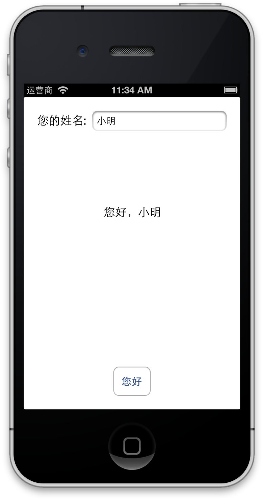

Base internationalization, a feature introduced in Xcode 4.5, relieves localizers (that is, translators) of the need to modify storyboards and nib files for each language an app supports. Instead, an app has just one set of storyboards or nib files that is localized to the default language; these storyboards and nibs are called the _base internationalization_. When you add a localization to an app, Xcode generates a strings file for all the text that each storyboard or nib file displays or includes as an accessibility label or hint. Xcode gives the file the name of the storyboard and the extension `strings`. So if you have a storyboard named `MyStoryboard.storyboard`, the generated strings file is named `MyStoryboard.strings`.

As you’ll see, strings files associate text in an app (the value) with another string (the key). A localizer uses the key to help him or her identify the text in the user interface and then translates that text. When you construct an app’s user interface in the base internationalization, you must use the Auto Layout feature to ensure that objects displaying translated strings appropriately adapt their position and size relative to adjacent views when those views change.

To use base internationalization

1. In Xcode, select the HelloWorld project and display the Info pane.

   
2. Select the Use Base Internationalization option under the Localizations table.

   Xcode displays a sheet asking you to select the storyboard to use for the base internationalization.

   
3. Make sure that `MainStoryboard.storyboard` is selected and that the reference language is English. Click the Finish button.
4. Select `MainStoryboard.storyboard (Base)` in the project navigator.
5. If “Label” appears in the label object, double-click it to select the text and then press Delete.

   This final step is necessary because “Label” should not be visible to users and thus there is no need to translate it.

When you created HelloWorld, Xcode automatically added a folder to your Xcode project for resources localized to English. Later, when you requested a base internationalization, it added another folder to your project. If you look at your project files in the Finder, you’ll see one folder named `Base.lproj` and another one (for the English localization) named `en.lproj`. In the first folder is the storyboard file; in the second folder is an `InfoPlist.strings` file. (You’ll learn more about `InfoPlist.strings` files in [“Localize the Name of the App.”](#apple-f4xwc4dqnrsv64tfmyxwi33df52wszbpkridimbqgezdiobqfvbuqmrnknltcny)) English is the default language for your project. If you want additional localizations, you must add them in Xcode.

To add a localization to a project

1. Select the Info pane of the project settings.

   
2. Click the plus button (+) in the Localization table and choose Simplified Chinese from the pop-up menu. Simplified Chinese is identified by the language ID `zh-Hans`.

   
3. In the sheet that asks you to choose files and reference languages, make sure that all settings and selections are as depicted below. Then click the Finish button.

   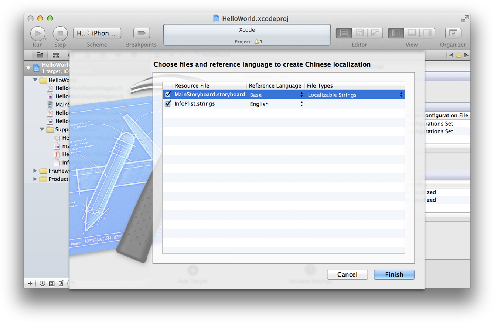

After you complete this task, Xcode updates the project navigator to show the new localization. Click the disclosure triangle next to `MainStoryboard.storyboard` to reveal the base (English) and Simplified Chinese localizations of those files.

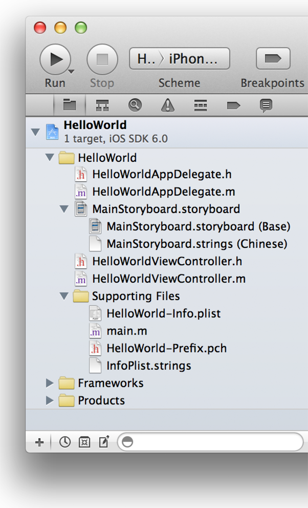

You probably noticed that there are two kinds of strings files in the project navigator. When you add a localization, Xcode creates both of them. The first kind is the strings file derived from the base internationalization (`MainStoryboard.strings`). It contains one or more key-value pairs that Xcode automatically generates from the text it finds in the storyboard file. The second kind of strings file is `InfoPlist.strings`, which you use for localizing application properties that are visible to users (such as the app’s name). It begins without content. You’ll learn more about both types of strings files in the sections that follow.

If you are going to type Chinese characters for the Simplified Chinese localization, you need a suitable input source to enter those characters. You request this input source in the System Preferences of OS X.

To select the input source suitable for Simplified Chinese

1. Launch the System Preferences app and select Language & Text.

   To launch System Preferences, choose System Preferences from the Apple menu. (This is not an Xcode function.)
2. Choose the Input Sources view.
3. Select Chinese - Simplified in the list of input sources.

   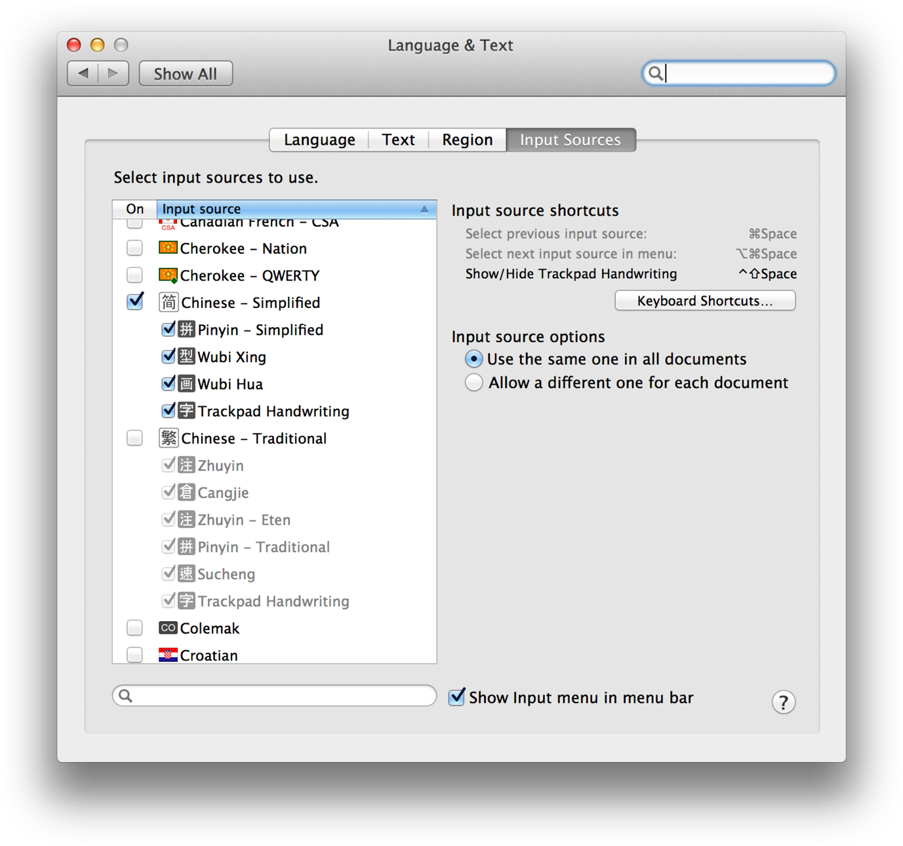
4. Make sure the “Show Input menu in menu bar” option is selected.

You can now choose a Simplified Chinese input source in the menu bar to make it the active input source.

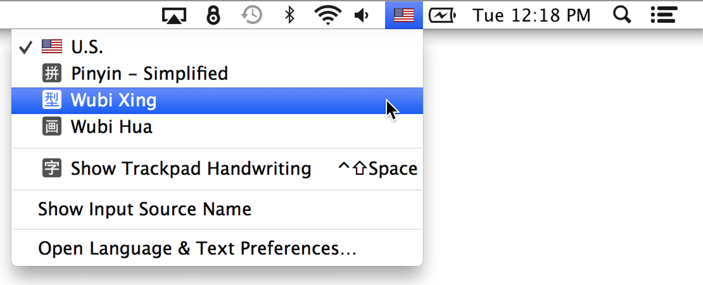

A _strings file_ contains textual items localized to a specific language and matched to arbitrary strings used as keys. The file has an extension of `strings`. When an app runs on a device, it finds strings in the strings files that are in the user’s preferred language and displays them. (Of course, the app must support a localization for that language.) In iOS, internationalization uses three different types of strings files:

- Strings files that Xcode automatically generates from base-internationalization storyboards or nib files
- Strings files for localizing user-visible properties in the app’s information property list, such as the display name of an app
- Strings files for strings created and displayed by the app’s code

The following sections describe how to configure each of these types of strings files when internationalizing your app.

Entries in all strings files have the following basic format:

```
/* Comment to localizers */
"Key" = "Value";
```

The comment is intended to assist localizers by clarifying the context of the localized string. Following the comment (which is on its own line) is a key, an equals sign, a value, and a terminating semicolon. The value is always a quoted string. The key is usually a quoted string but can also be a symbol declared as a global string.

For each localization added to an app project, Xcode generates a strings file from the base-internationalization storyboard, names it _StoryboardName_`.strings`, and writes it to a folder in the project for that localization (such as `zh-Hans.lproj)`.

To examine the strings file for Simplified Chinese

1. In the project navigator, disclose the items under `MainStoryboard.storyboard` by clicking the disclosure triangle.
2. Select the item named `MainStoryboard.strings (Chinese)`.

   The content of the strings file appears in the project editor.

For the HelloWorld app, Xcode generated the following strings file from the base internationalization:

```
/* Class = "IBUITextField"; accessibilityHint = "Type your name"; ObjectID = "PzI-FE-QQF"; */ "PzI-FE-QQF.accessibilityHint" = "Type your name";  /* Class = "IBUITextField"; placeholder = "Your Name"; ObjectID = "PzI-FE-QQF"; */ "PzI-FE-QQF.placeholder" = "Your Name";  /* Class = "IBUIButton"; normalTitle = "Hello"; ObjectID = "fYK-eX-amY"; */ "fYK-eX-amY.normalTitle" = "Hello";
```

For each string in the storyboard, Xcode concatenates a key from an identifier of the text-displaying object, a period (`.`), and the property to which the string is assigned. The value (the string after the equals sign) is the visible or audible string in the base internationalization storyboard. Localizers translate these strings. (The comment for each entry repeats this information but adds the class of the object as known by Xcode.) If the user’s preferred language is different from that of the base internationalization, an app at runtime dynamically replaces each string in the base-internationalization storyboard with the matching string in the _StoryboardName_`.strings` file of the current localization. Figure 1-1 illustrates this process.

__Figure 1-1__  Localizing strings from the base internationalization

!
To localize the strings to Simplified Chinese

1. Choose a Simplified Chinese input source from the menu bar.

   You may use a Chinese keyboard if one is available. You can use another keyboard instead (for example, U.S. English), but for this you should know the key mappings.

   You may skip this step if you are copying Chinese characters from the example below and pasting them into your strings file (or if you are localizing text to a different language).
2. Select the `MainStoryboard.strings (Chinese)` file in the project navigator to display it in the project editor.
3. Translate each value string (that is, the string to the right of the equals sign) to Simplified Chinese.

   If you are copying and pasting Chinese, the characters to copy are provided below.
4. Save the file (File > Save).

The HelloWorld user interface is very simple, with only one storyboard, one scene, and three strings. Apps with more complicated user interfaces can have many views with text and thus many strings to localize. Xcode helps you to identify text-displaying views by using the object ID embedded in the key. Select the view in the storyboard (for example, the Hello button) and then open the Identity inspector. Look in the Document section of this inspector for the object ID and match it with an object ID in the strings file.

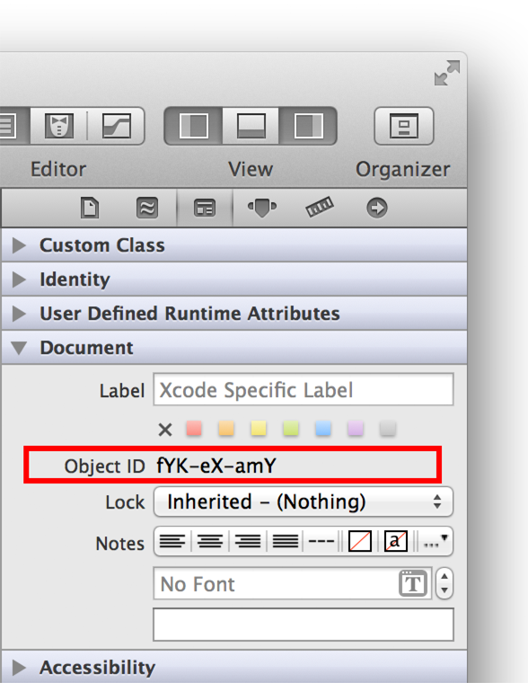

The contents of the `MainStoryboard.strings` file for the Chinese localization should now look like this:

```
/* Class = "IBUITextField"; accessibilityHint = "Type your name"; ObjectID = "PzI-FE-QQF"; */ "PzI-FE-QQF.accessibilityHint" = "键入您的姓名";  /* Class = "IBUITextField"; placeholder = "Your Name"; ObjectID = "PzI-FE-QQF"; */ "PzI-FE-QQF.placeholder" = "您的姓名";  /* Class = "IBUIButton"; normalTitle = "Hello"; ObjectID = "fYK-eX-amY"; */ "fYK-eX-amY.normalTitle" = "您好";
```


When you add a localization to an app project, Xcode by default creates a file named `InfoPlist.strings` and writes it in the localization folder in the file system (for example, `zh-Hans.lproj`). This file, which at first has no content, should contain key-value pairs for localizing strings in the information property list that are visible to users; for the HelloWorld app, this property list is in the `HelloWorld-Info.plist` file.

The most important user-visible property is the display name of the app, which you will now localize. The keys in `InfoPlist.strings` files are framework-declared symbols that you can find in the information property list.

To localize the app name

1. Select the HelloWorld target and choose the Info view.
2. Control-click anywhere in the table of properties and choose Show Raw Keys/Values from the contextual menu.

   
3. Locate the property `CFBundleDisplayName` (which is the Core Foundation symbol for representing an app’s display name).
4. Select the `InfoPlist.strings` file in the project navigator to display the file in the editor.

   This file is for the Simplified Chinese localization. You can verify the localization of a selected file in the Localization section of the Identity inspector.

   
5. Type the the following lines in the `InfoPlist.strings` file and choose Save from the File menu to save the file.

```
/* The name of the app displayed on the device*/
CFBundleDisplayName = "您好，世界";
```

   You do not have to put quotes around the key in this case.

The `InfoPlist.strings` file for the native English localization does not need to be edited because user-visible properties in the information property list are already in English.

The code of an app often creates and displays strings of text at runtime. The HelloWorld project has an example of such programmatically generated text in the `changeGreeting:` method.

```objc
- (IBAction)changeGreeting:(id)sender {
    self.userName = self.textField.text;

    NSString *nameString = self.userName;
    if ([nameString length] == 0) {
        nameString = @"World";
    }
    NSString *greeting = [[NSString alloc] initWithFormat:@"Hello, %@", nameString]; // programmatically created
    self.label.text = greeting;
}
```

The method gets the name to be displayed from the text field and then concatenates the string “Hello, ” and the name using the `initWithFormat:` method of the `NSString` class. To display this text, it sets the `text` property of the label to the constructed string. The internationalization problem here is that the word “Hello” must be translated into each localization the app supports. For localizing code-generated strings, the internationalization facilities of iOS provide strings files and the `NSLocalizedString` macro. The following sections describe how to use this file and macro.

The conventional name for a strings file containing localized strings for programmatically displayed text is `Localizable.strings`. You will create two of these files, one for English and one for Simplified Chinese, and then add the appropriate key-value pairs to them.

To add a Localizable.strings file for each localization

1. In the Xcode project navigator, select the Supporting Files folder.
2. Chose File > New > File.
3. In the iOS Resources category, select the Strings File template and click the Next button.

   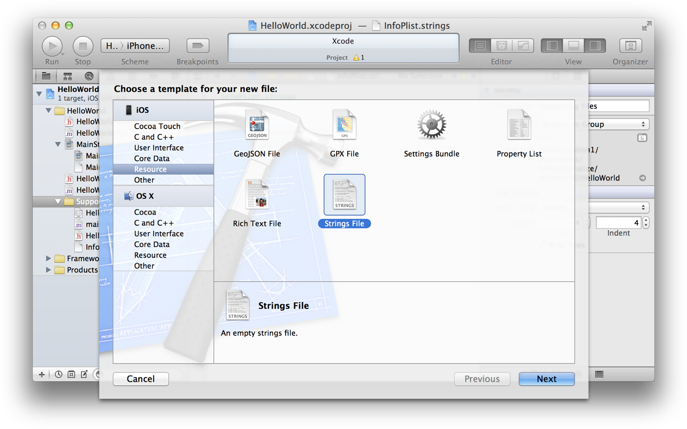
4. In the Save As field, rename the file `Localizable.strings` and click the Create button.

   Leave the default settings—for example, the selected target—unchanged.
5. Select `Localizable.strings` in the project navigator and click the “Make localized” button in the Identity inspector.

   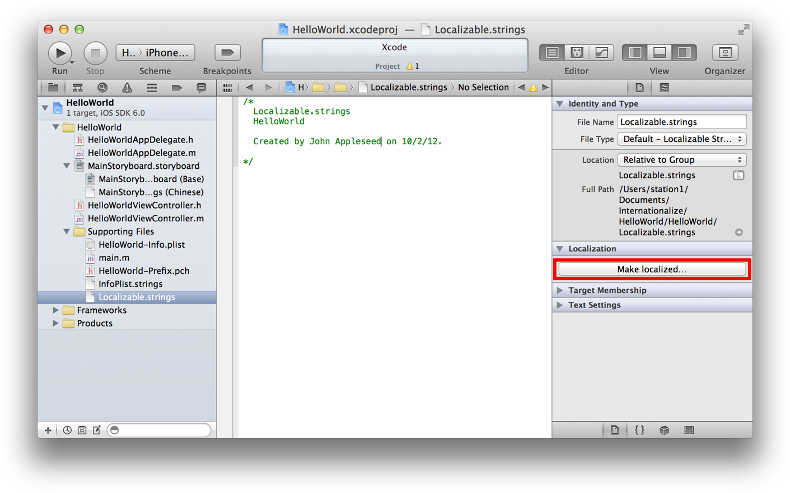
6. In the confirmation dialog that appears, make sure that English is selected in the pull-down menu and then click the Localize button.

   

   After this step the “Make localized” button is replaced by a table listing the current localizations.
7. Select the Chinese checkbox to add a `Localizable.strings` file to the Simplified Chinese localization.

Now that you have a `Localizable.strings` file for both localizations, it’s time to add key-value pairs to them.

To localize the “Hello” string

1. Select `Localizable.strings (English)` in the project navigator.
2. Type the following text in the editor:

```
/* The string displayed */
"HELLO" = "Hello, %@";
```

   To help identify the left string (“HELLO”) as a key, it is in uppercase.
3. Select `Localizable.strings (Chinese)` in the project navigator.
4. Type the following text in the editor:

```
/* The string displayed */
"HELLO" = "您好，%@";
```


The `NSLocalizedString` macro fetches a localized string from the `Localizable.strings` file for the current localization. In the HelloWorld app, you want this macro to replace the text `@"Hello, %@"`.

To request a localized string in your code

1. In the project navigator, select `HelloWorldViewController.m`.
2. Modify the following statement in the `changeGreeting:` method:

```
NSString *greeting = [[NSString alloc] initWithFormat:@"Hello %@", nameString];
```

   so that it looks like this:

```
NSString *greeting = [[NSString alloc] initWithFormat:NSLocalizedString(@"HELLO", @"The string displayed"), nameString];
```

The first parameter of the macro takes a key in the strings file, and the second parameter takes a comment to localizers. The macro returns the value for the key in the localization that corresponds to the user’s preferred language. You may wonder why this example includes the comment to localizers as a parameter of this macro; after all, you wrote a comment in the `Localizable.strings` files for both English and Chinese.

Large application projects often use a command-line program named `genstrings` to generate a strings file (by default, named `Localizable.strings`) from information the program finds in your code. The utility looks for each call to the `NSLocalizedString` macro, extracts the key (which is also the initial value) and the comment, and writes these items to the strings file. You can then add the strings file to each localization of your project and translate the values.

Congratulations. You have finished internationalizing and localizing your app to Simplified Chinese. Now it’s time to test the app to see if it displays strings in Simplified Chinese when that is the user’s preferred language.

To test your app in Simplified Chinese

1. Run iOS Simulator, launch the Settings app, and choose Simplified Chinese as the preferred language.

   If the iOS Simulator is running HelloWorld or any other app, click the Home button.

   In the Settings app, choose General > International > Language. Then click the row in the table as depicted in the example. Click the Done button.

   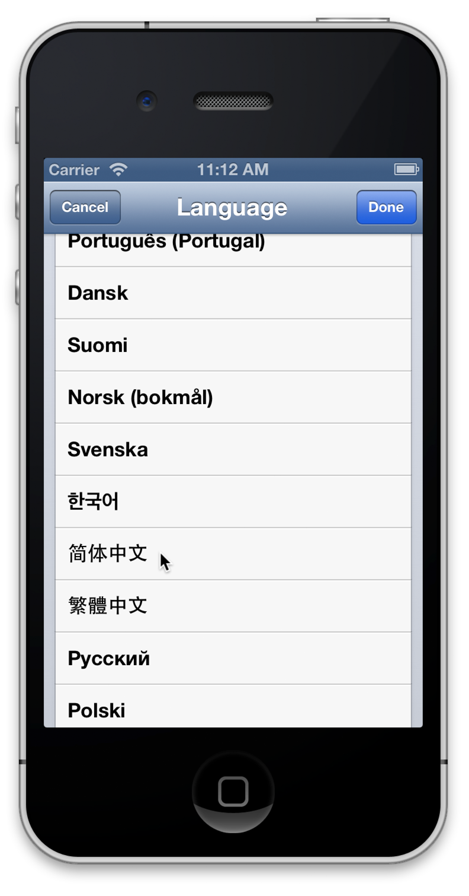
2. In Xcode, make sure “iPhone _version number_ Simulator” is the active scheme and click the Run button.

   Xcode runs HelloWorld in iOS Simulator. It should look like this:

   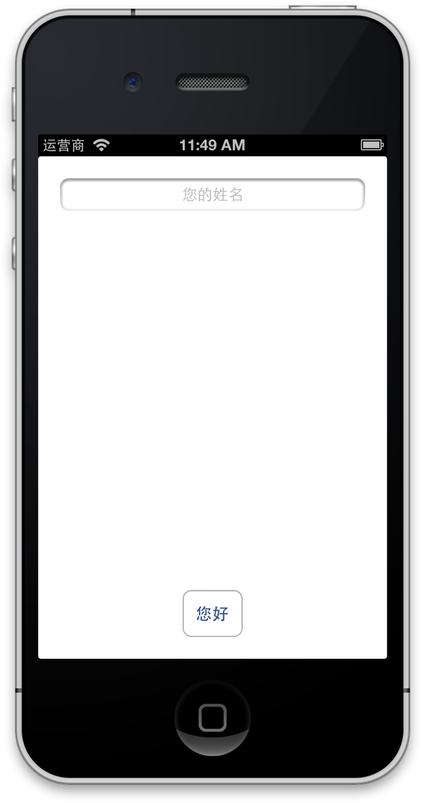
3. From the menu bar, choose Simplified Chinese as the input source, enter some Chinese characters in the text field, and then click the button.

   The app should display “您好, _characters typed_”. If you find any strings that are not translated to the current language, be sure to translate them in their strings file.
4. From the Hardware menu, choose Rotate Left or Rotate Right to simulate an orientation change and see what happens.
5. Quit the app by clicking the Home button and find the app in the simulated iPhone.

   

   Notice that the name of the app is localized to Simplified Chinese.

Of course, most commercial apps display more text than HelloWorld does; they might also include localized images and other resources. And these apps might have several localizations. For each localization, you should run the app and go to each screen or dialog that displays text and see if there are any unlocalized strings or resources.

If your app is configured for VoiceOver, also check that the app is properly localized for accessibility. You may use the Accessibility Inspector built into iOS Simulator for this purpose. For more information on the Accessibility Inspector, see _Accessibility Programming Guide for iOS_.

When you tested the HelloWorld app in the Simplified Chinese localization, you simulated orientation changes. The app displayed text in a way that would be appropriate for any localization. Because the placeholder text in the text field and the programmatically displayed text in the label are centered in their objects (which occupy the width of the screen), they can be of any reasonable length, regardless of orientation. And the button resizes itself to fit any localized string.

Of course, few apps have a user interface as simple as that of HelloWorld, where objects are centered on the screen and are next to no other objects. A common design for text in user interfaces is a label followed by a text field. When localizers translate the label text in the _StoryboardName_`.strings` file for a given language, the label should resize itself to fit the new text. And the width of the text field should then change to accommodate the new label size, as shown in Figure 1-2.

__Figure 1-2__  Auto Layout in a common localization pattern

!

In the rest of this tutorial, you will learn a little about the Auto Layout system of iOS and how you can use the Auto Layout facilities of Xcode to specify layout rules that contribute to the internationalization of an app. You will then modify the user interface to have the label-text field design and configure it to have the behavior shown in Figure 1-2.

To learn more about Auto Layout, see _Cocoa Auto Layout Guide_.

The Auto Layout system of iOS allows you to define rules for the layout of your app’s views so that when one view changes its size or position, neighboring views adjust their sizes and positions appropriately. Auto Layout is a key feature for responding to device orientation changes. It is also a key feature for internationalizing your app, especially when using a base internationalization.

With Auto Layout you use _layout constraints_ to describe how you want your app to lay out its user interface. When you configured the HelloWorld user interface in _Your First iOS App_, you accepted the automatic constraints implemented by the Auto Layout system in accordance with the Aqua guidelines—for example, using the recommended interobject spacing and having the leading or trailing edges of objects pinned to their superviews. Thin blue layout lines around views in the storyboard scene indicate automatic constraints. You’re going to examine these constraints now.

To examine the layout constraints

1. Select the `MainStoryboard.storyboard` (base internationalization) in the project navigator.
2. In the outline view for the Hello World view controller, click the triangle next to each Constraints item to disclose its contents.

   The outline view should look like this:

   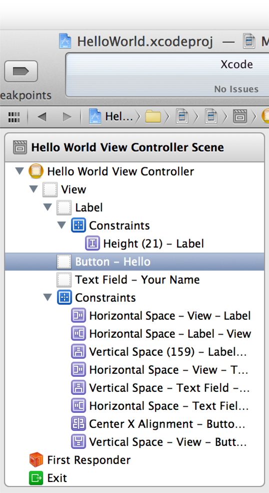
3. Select a constraint (for example, Horizontal Space - Label - View) and then open the Attributes inspector.

   The Attributes inspector displays the following information about the constraint:

   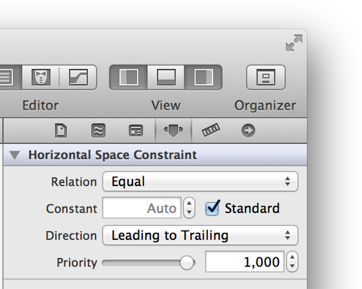

   The values in the inspector are in reference to the label’s superview. When Standard is checked, it means that the constraint is automatic—in other words, the Auto Layout system is laying out objects according to the Aqua guidelines.

   Xcode also lets you view all constraints associated with a particular view as described in the following step.
4. Select the text field and choose the Size inspector.

   In addition to showing constraints, the Size inspector shows Content Hugging and Content Compression Resistance priority values for a view.

   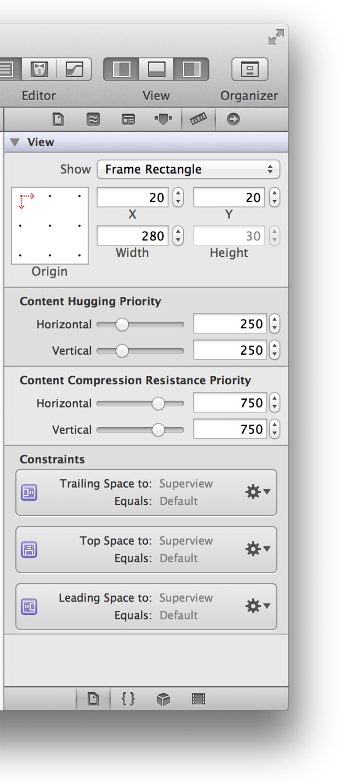

You can override the settings of an automatic constraint, thereby creating a user constraint, but there is no need to do that. As noted earlier, the simple user interface of HelloWorld is suitable for localization. The text field (with its placeholder text) and label extend across the screen, allowing strings of virtually any length. And the Hello button will resize itself to each localized title and remain centered in its superview.

You will now modify the user interface of HelloWorld to have a label–text field pair, a more common user interface design in apps.

To change the user interface and layout constraints of the HelloWorld app

1. Select the text field and in the Attributes inspector delete `Your Name` from the Placeholder field.
2. Resize the width of the text field so that it occupies the right half of its superview.
3. Open the Object library in the Utility area and drag a label object onto the storyboard scene.

   
4. Select the label and click the Align Right button in the Attributes inspector.

   
5. Select the text field and click the Align Left button.
6. Double-click the default text of the label (`Label`) to select it, then replace it with `Your Name:`.
7. Position and resize the label and the text field so that the label fits its text and the automatic constraints (the thin blue lines) are in effect.

   With both objects selected, the user interface should now look like this:

   
8. Select the new label object and, in the Size inspector, set the horizontal content hugging priority to 1000.

   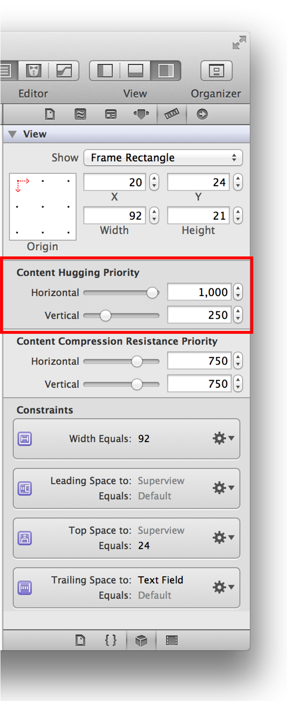

   The content hugging priority tells the Auto Layout system how much a view should adjust its size to its content relative to other views; in the case of the label, the value of 1000 means essentially that the label should always resize itself to contain its string. Because the content hugging priority of the text field remains at the default value of 250, it is the object that changes its width when the width of the label changes.

The label–text field pair is now internationalized. If you type `A Very Long Name` as the label text and press Return, you will see the text field shorten its width to accommodate the new label value. You can also run the app in its English localization and then run it in its Simplified Chinese localization and observe the change in behavior.

In the Auto Layout exercise you just completed, you added a new text-displaying object to the user interface of HelloWorld: the “Your Name:” label. Consequently, the Chinese `MainStoryboard.strings` file is now out of sync with the base internationalization (`MainStoryboard.storyboard`). You use the command-line utility `ibtool` to generate a new strings file from the base internationalization and then add the new strings file entry to your existing `MainStoryboard.strings` file.

To merge the new user-interface object with the existing Chinese MainStoryboard.strings file

1. Launch the Terminal app.

   This app is located in `/Applications/Utilities`.
2. In the Terminal shell, connect to the `Base.lproj` directory in your project folder.

   For example:

```
cd /Users/UserName/Projects/HelloWorld/HelloWorld/Base.lproj
```
3. Enter the following command after the prompt:

```
ibtool MainStoryboard.storyboard --generate-strings-file NewStuff.strings
```

   You can give the output file—`NewStuff.strings` in the example—any name you choose.
4. Open the generated output file in Xcode and copy the new string-file entry—that is, the comment and key-value pair for the “Your Name:” label—to the Chinese `MainStoryboard.strings` file.
5. Translate the new string value.

[Back to App Design](https://developer.apple.com/library/archive/referencelibrary/GettingStarted/RoadMapiOS-Legacy/chapters/ApplicationDesign.html)
!
!
!
