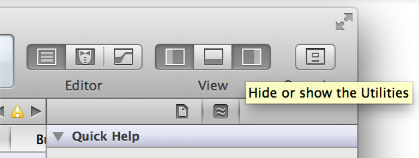
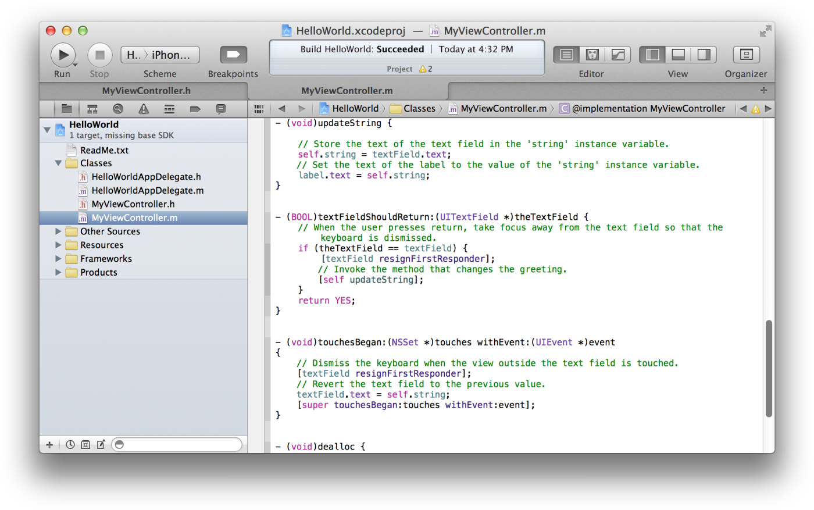
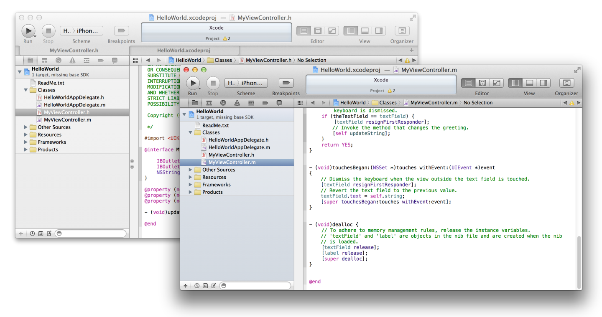
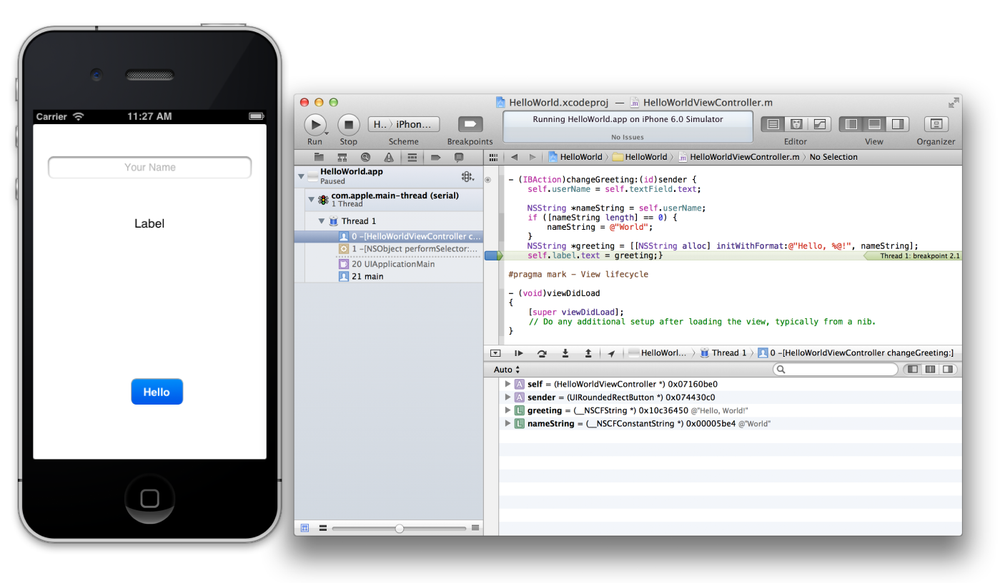
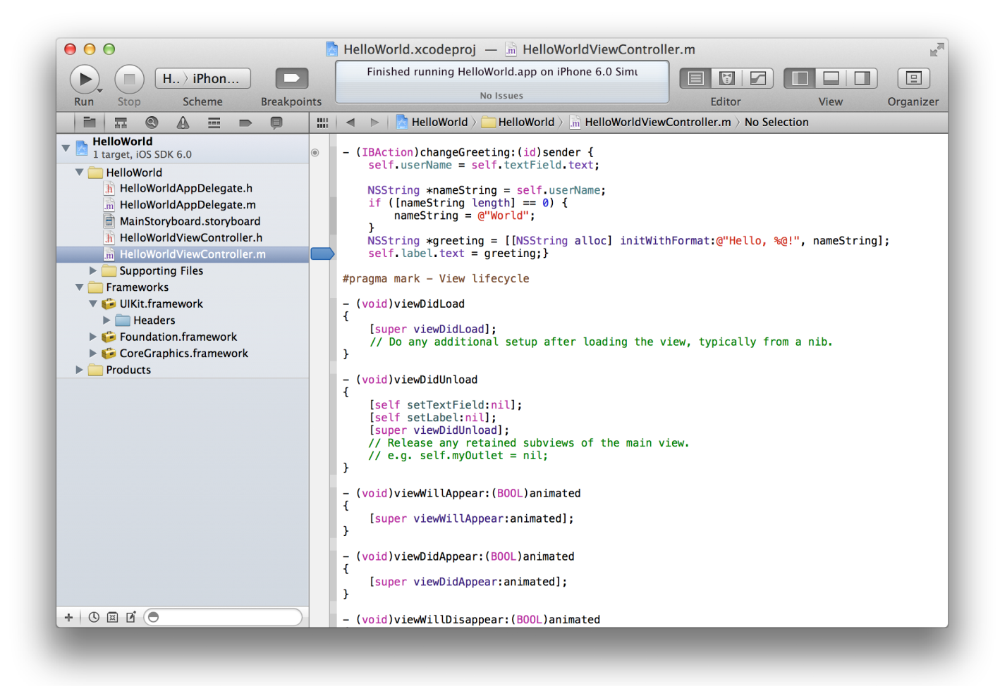
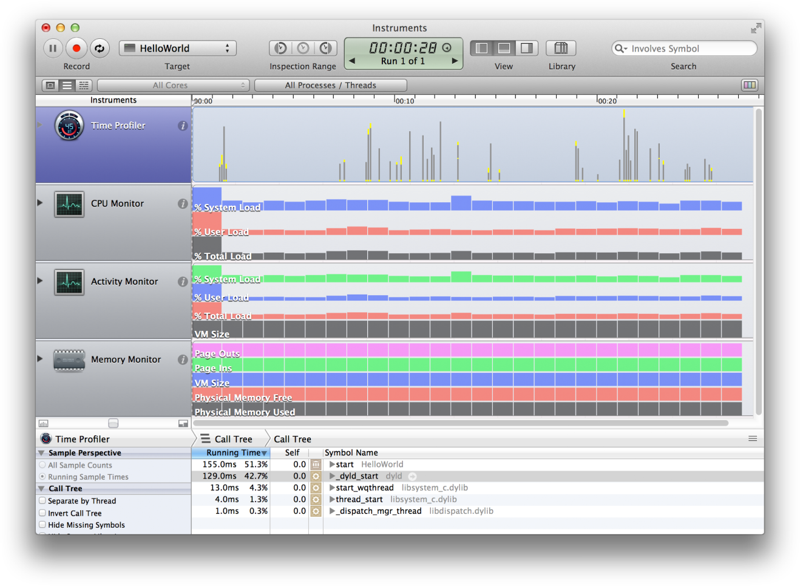
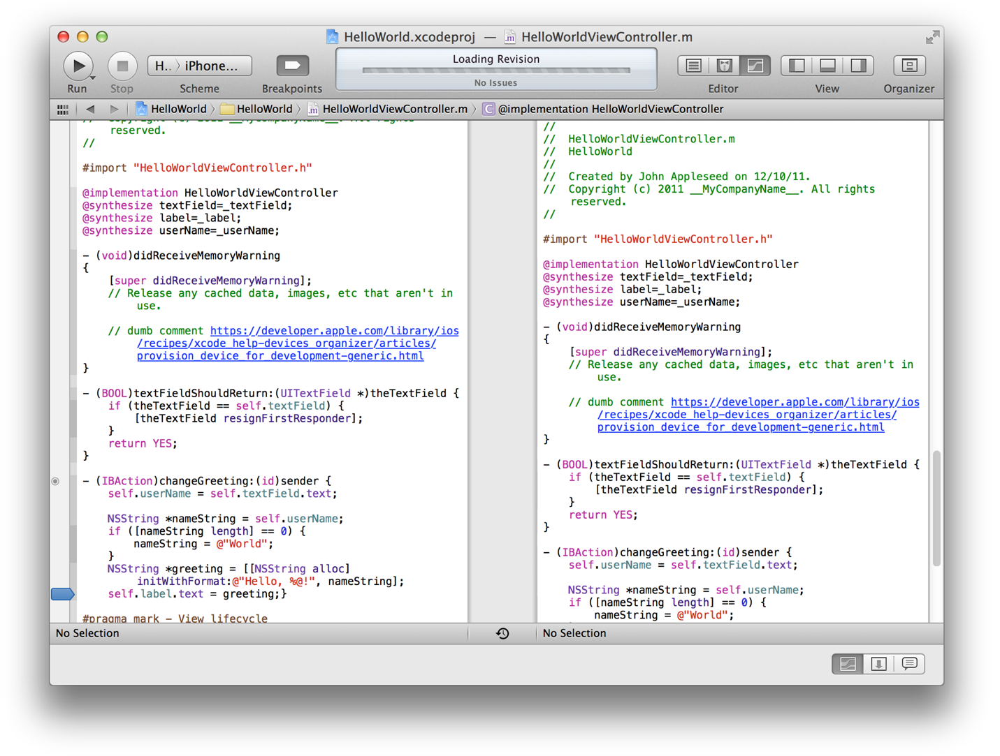
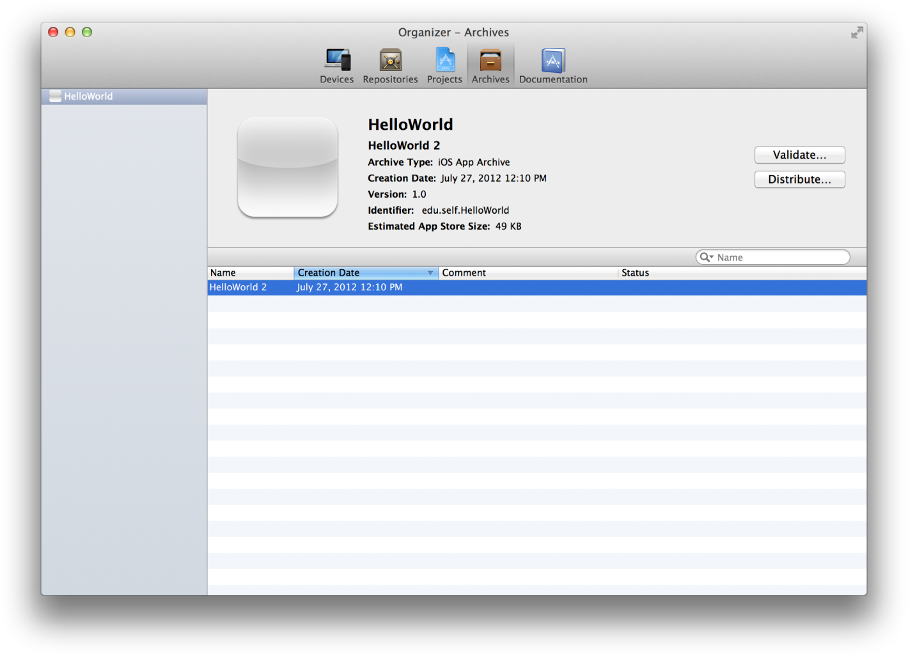

> 导航：[总目录](../../../README.md) · [referencelibrary](../../../_indexes/referencelibrary.md) · [Start Developing iOS Apps Today (Retired)](Document%20Revision%20History.md)

[Back to Tools](https://developer.apple.com/library/archive/referencelibrary/GettingStarted/RoadMapiOS-Legacy/chapters/Tools.html)
!
!
!

# Retired Document

__Important:__ This version of _Start Developing iOS Apps Today_ has been retired. The replacement version provides a new, more streamlined walkthrough of the basics. For information covering the same subject area as this page, please see _[Xcode Overview](https://developer.apple.com/library/ios/documentation/ToolsLanguages/Conceptual/Xcode_Overview/About_Xcode/about.html#//apple_ref/doc/uid/TP40010215)_.

# Manage Your Workflow in Xcode

As you saw in the tutorial _Your First iOS App_, you perform your major workflow tasks in the Xcode workspace window. A separate Organizer window allows you to perform ancillary tasks, such as reading documentation, enabling devices for testing, and preparing your app for submission to the App Store.

The workspace window features a navigator area, an editor area, and a utility area. In Your First iOS App, you used the navigator area to select files to edit. You used the editor area to edit source files and to design user interface components. In the utility area, you set label text and a button title.

You can hide the navigator, editor, and utility areas in various combinations. In Your First iOS App, you used the View selector in the toolbar to hide and disclose the utility area. Hiding the utility area allowed you to view a larger editor area, whereas disclosing the utility area allowed you to inspect and select various object attributes.

You can customize the workspace in other ways, such as by using Safari-style tabs to implement multiple, workflow-specific layouts of the workspace window. For example, you can use one tab to view a header file and another to view an implementation file.

To view source code files in tabs

1. Select HelloWorldViewController.h in the project navigator to display the header file in the source editor.
2. Choose View > Show Tab Bar.
3. Choose File > New > Tab.
4. Select HelloWorldViewController.m in the project editor to display the implementation file in the tabbed source editor window.
5. Click the tabs to move between source files.
6. To remove a tab, move the pointer to the tab and click its close box.
7. You can hide the tab bar by choosing View > Hide Tab Bar.

You can also create multiple workspace windows. Each tab or workspace window can be customized independently of the others.

To view source code files in multiple windows

1. Select HelloWorldViewController.h in the project navigator to display the header file in the source editor.
2. Choose File > New > Window to open a new workspace window.
3. Select HelloWorldViewController.m in the project editor to display the implementation file in the new window.
4. Customize either window, such as by showing and hiding the utilities area with the View selector.

When you run your app to test or debug it, you can run it in iOS Simulator on your Mac. Using iOS Simulator, you can make sure your app behaves the way you want.

The debugging environment is built into Xcode. When your app is running, the debug navigator shows a stack trace that you can expand or compress to show or hide stack frames as you debug. As you step through, you can lock onto a single thread and follow that specific thread of execution.

To run your app in the Xcode debugger

1. In your HelloWorld project, select HelloWorldViewController.m in the project navigator to display the file in the source editor.
2. Locate the statement `self.label.text = greeting;}`.
3. Click the gutter to the left of this statement to insert a breakpoint.

   A blue breakpoint indicator appears.

   
4. Click the Run button in the toolbar to build and run HelloWorld in iOS Simulator.
5. Type `World` into the text field, and click the Done button to close the keyboard.
6. Click the Hello button.

   The breakpoint causes the execution of HelloWorld to stop. The workspace window moves to the foreground with the debug area open at the bottom of the editor area. The debug area displays the local variables and their current values. To remove the breakpoint, click and drag it away from the gutter.

Although you can test your app’s basic behavior in iOS Simulator, you should also run it on devices connected to your Mac. Devices provide the ultimate testing environments, in which you can observe your app as it will behave on your customers’ devices. Such testing is necessary because iOS Simulator doesn’t run all threads that run on devices. Ideally, you should test the app on all of the devices and iOS versions that you intend to support.

If you joined the iOS Developer Program, you can use Xcode right now to start running, testing, and debugging your app on a device. (_Set Up_ earlier in this road map contained information about enrolling as an iOS Developer.)

To run your app on a device, you must obtain an development certificate from Apple. Your app must be cryptographically signed before it can run on a device, and this certificate is used to sign your app. You obtain this certificate through the Xcode Organizer window.

To obtain your development certificate in Xcode

1. Choose Window > Organizer.
2. Click Devices.
3. Select Provisioning Profiles under Library.
4. Click the Refresh button at the bottom of the window.
5. Enter your Apple Developer user name and password, and click Log in.

   After you log in to your account, a prompt appears asking whether Xcode should request your development certificate.
6. Click the Submit Request button.

   The development certificate is added to your keychain and later added to the iOS Team Provisioning Profile. Another prompt may appear asking whether Xcode should request your distribution certificate, which is needed later for submitting your app to the App Store. If appropriate, click the Submit Request button again.

   
7. At the end of the refresh process, a dialog asks if you want to export your developer profile. Click Export.

   Export your developer profile and other certificates immediately after you create them. Should you later want to continue developing your app on a different Mac, you will need to import these certificates to the new computer.

To run an app on a device, you must also install an associated provisioning profile on the device. This provisioning profile enables your app to run by identifying you (through your development certificate) and your device (by listing its unique device identifier).

To provision your device in Xcode

1. Connect your device to your Mac.
2. Open the Devices Organizer.
3. Select your device under Devices.
4. Click the "Use for Development" button.

   

   The first time you add a device ID to your account, Xcode creates the iOS Team Provisioning Profile using the Xcode wildcard app ID, your development certificate, and the device ID. The iOS Team Provisioning Profile is also installed on your device.

With a development certificate and a provisioning profile in place, you can run your app on an installed device. You can also use the Xcode debugging and performance profiling facilities while your app runs on the device.

To launch your app on a connected device

1. In the Xcode workspace window for your project, choose Product > Edit Scheme to open the scheme editor.
2. Select your device from the Destination pop-up menu.

   When you plug a device with a valid provisioning profile into your Mac, its name and the iOS release it’s running appear as an item in the Destination pop-up menu.

   
3. Click OK to close the scheme editor.
4. Click the Run button.

   If a prompt appears asking whether the codesign tool can sign the app using a key in your keychain, click Allow or Always Allow.

During the course of app development, you perform a lot of operations in Xcode. If you need assistance with a task, Xcode provides workflow-sensitive help, which you can access directly from the Xcode user interface. This assistance includes easy-to-follow steps, videos or screenshots, and concise descriptions that help you get back to work quickly.

To view Xcode help

1. In your HelloWorld project, select HelloWorldViewController.h in the project navigator to display the header file in the source editor.
2. If you are reading this document in the Xcode document organizer, locate its Go Back button. You will need to click it to return this document after performing the remaining steps.

   
3. Control-click anywhere in the source editor.

   A contextual menu opens in which Source Editor Help is the final item.
4. Choose Source Editor Help to display a list of common source editor tasks.

   
5. Choose Source Editor Help > “Catching Mistakes with Fix-it” to see a help article in the Documentation organizer.
6. Click the thumbnail image to play an instructional video.

To ensure that you deliver the best user experience for your software, launch Instruments from Xcode to analyze the performance of your app as it runs in iOS Simulator or on a device. Instruments gathers data from your running app and presents it in a graphical timeline.

You can gather data about your app’s memory usage, disk activity, network activity, and graphics performance, among other measurements. By viewing the data together, you can analyze different aspects of your app’s performance to identify potential areas of improvement. You can automate the testing of your app’s user interface elements. You can also compare your app’s behavior at different times to determine whether your changes improve the performance of your app.

To begin analyzing the performance of your app

1. From your HelloWorld project in Xcode, choose Product > Perform Action > Profile Without Building.
2. Under iOS Simulator in the left column, click All to see the available trace templates.
3. Select the Leaks template and click Profile.

   The Instruments app launches along with the iOS Simulator running HelloWorld.
4. Type your name into the HelloWorld text field, click the Done button to close the keyboard, and click Hello.
5. Choose iOS Simulator > Quit iOS Simulator to stop recording performance data.
6. Click Allocations in the Instruments pane to examine the HelloWorld project's memory allocations.

   For example, the track pane graphs where the memory allocations occurred, allowing you to see how frequently memory allocations occurred throughout the program. (Large spikes in the track pane can indicate potential bottlenecks that you might want to mitigate either by preallocating some blocks or by being more lazy about other blocks.)

If something goes wrong because of a code change you make, an Xcode snapshot makes it easy to restore your project, even a deleted project, to a previous state. A snapshot saves the current state of your project onto disk for possible restoration later. The Projects organizer in Xcode lists your snapshots.

You can create a snapshot manually whenever you like, and you can set Xcode to automatically create snapshots in other circumstances, such as before every build or before executing every Find and Replace operation.

To create and restore a snapshot of your project

1. With the HelloWorld project open, choose File > Create Snapshot.
2. Type a name and description in the provided fields.
3. Click Create Snapshot.
4. To view the snapshot, Choose Window > Organizer to display the Organizer window.
5. Click the Projects button.

   You should see a list of all snapshots.

Source control management (SCM) allows you to keep track of changes at a more fine-grained level than snapshots allow. (Source control management also helps you coordinate efforts if you work with a team of programmers.) An SCM system saves multiple versions of each file onto disk, storing metadata about each version of each file in an SCM repository.

Xcode supports two popular SCM systems: Git and Subversion. Xcode includes a version editor that makes it easy to compare versions of files saved in repositories from either system. If you find you’ve introduced bugs in your code, you can compare changes between the latest version of a file and an earlier version that worked correctly, helping you to zero in on the source of the trouble.

Xcode makes it easy to share your app with testers before release and to publish your app on the App Store. You start the distribution process by using the scheme editor to create an archive of your app in Xcode. You can then use the Archives organizer in Xcode to share your app with others for testing.

When you’re ready to publish your app, use the Archives organizer to perform essential validation tests required for App Store publication. Passing these tests ensures that your app’s approval process is as fast as possible. You'll then be ready to submit your app directly to the App Store from Xcode.

You’ll learn more about distributing and publishing your app in the article _Prepare for App Store Submission_ later in this road map.

[Back to Tools](https://developer.apple.com/library/archive/referencelibrary/GettingStarted/RoadMapiOS-Legacy/chapters/Tools.html)
!
!
!
