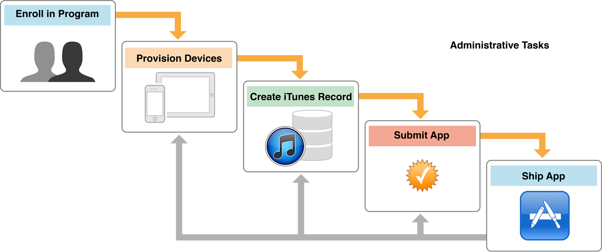
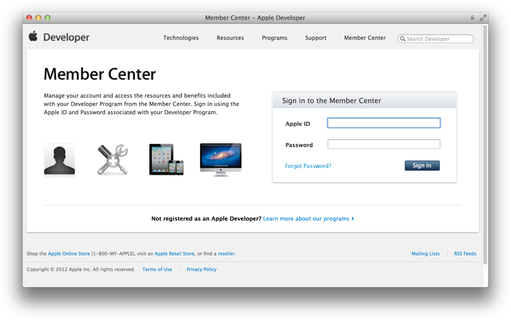
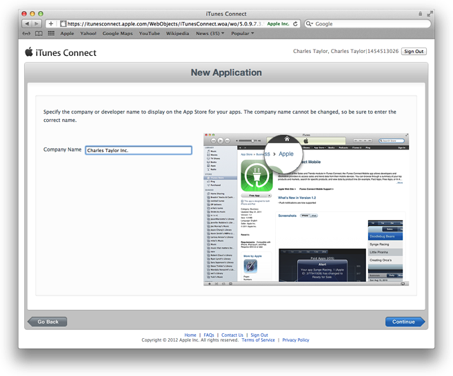
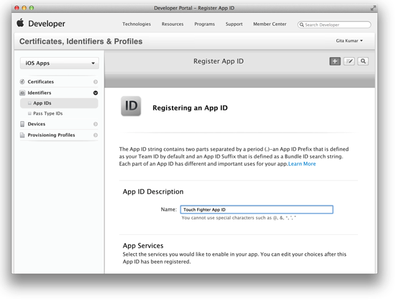

> 导航：[总目录](../../../README.md) · [referencelibrary](../../../_indexes/referencelibrary.md) · [Start Developing iOS Apps Today (Retired)](Document%20Revision%20History.md)

[Back to App Store](https://developer.apple.com/library/archive/referencelibrary/GettingStarted/RoadMapiOS-Legacy/chapters/ApplicationDevelopment.html)
!
!
!

# Retired Document

__Important:__ This version of _Start Developing iOS Apps Today_ has been retired. The replacement version provides a new, more streamlined walkthrough of the basics. For information covering the same subject area as this page, please see _[App Distribution Guide](https://developer.apple.com/library/ios/documentation/IDEs/Conceptual/AppDistributionGuide/Introduction/Introduction.html#//apple_ref/doc/uid/TP40012582)_.

# Prepare for App Store Submission

Most of your time is spent on coding tasks, but to develop for the App Store, you need to perform a number of administrative tasks, using Xcode and other tools, throughout the lifetime of your app. The App Store is a curated store and restricts which apps may be sold. Apple does this to provide the best experience possible for users. For example, apps that are sold on the App Store must not crash or exhibit other major bugs.

Apple provides tools you need to develop, test, and submit your app to the App Store. To run an app on a device, the device needs to be provisioned for development and later provisioned for testing. You also need to provide information about your app that the App Store displays to customers, and you need to upload screenshots. Then submit your app to Apple for approval. After the app is approved, set the date the app should appear for sale in the App Store. Finally, use Apple’s tools to monitor the sales of the app, customer reviews, and crash reports. Then repeat the entire process again to submit updates to your app.

If you use certain technologies—such as iCloud storage or In-App Purchase—there are additional configuration and administrative tasks to perform. There are tasks you perform to manage a team of developers as well.

To develop for the App Store, you first need to join the iOS Developer Program. After enrolling in the program, you have access to all the resources and tools that you need to manage your account and begin testing your app on a device.

You become the primary contact for Apple, sign legal agreements, create your assets, and market your app. You’ll be asked whether you are an individual developer or a company. If you are a company, you may add other people to your team and grant some of them privileges to manage your account as well. Anyone who needs to run the app on a device during development must be added to your team to do so.

You administer your account with these iOS Developer Program web tools:

- __Member Center.__ The tool to manage developer program accounts, register App IDs and devices, create signing certificates, and create provisioning profiles. Member Center is also a gateway to other resources and tools, including iTunes Connect.
- __iTunes Connect.__ The marketing and business tool used to check the status of your contracts, set up tax and banking information, obtain sales and finance reports, and manage metadata about the app.

You perform some Member Center administrative tasks using Xcode and return as needed to Member Center at `http://developer.apple.com/membercenter`. These administrative tasks are necessary for security and to ensure that your app is not distributed prematurely.

Some of the App Store configuration is completed for you when you create an Xcode project from a template. Xcode prompts you to enter the product name and company identifier. The bundle ID is derived from these two properties. For example, in the HelloWorld project, the product name is HelloWorld and company identifier is `edu.self`. Therefore, the default bundle ID is `edu.self.HelloWorld`. Xcode uses reasonable defaults for other values as well. Carefully consider which template you use to create an app and the settings used to configure the project; starting with the right template helps speed the development process.

If you want to change these settings later, or use iCloud storage, you’ll find most of these settings—including enabling entitlements—on the target’s Summary pane in Xcode. For example, to pass the validation tests, you need to set the app icons and launch images that appear under iPhone/iPod Deployment Info on the Summary pane. These images represent your app in the App Store.

To run your app on a device during development, it must be connected to your Mac, enabled for development, and recognized by Apple. You do this by providing some information about the app, yourself, and the device. You create a type of signing certificate called a development certificate to identify yourself. All of this information is incorporated into a development provisioning profile that is eventually installed on the device and allows the app to launch.

You can use the Devices organizer in Xcode to provision your devices for development using the default App ID and iOS Team Provisioning Profile that Xcode creates for you. (However, if you use iCloud storage, push notifications, In-App Purchase, or Game Center, you need to create a specialized provisioning profile.)

The first time you refresh the provisioning profiles in the Devices organizer, Xcode creates both development and distribution signing certificates on your behalf. (A distribution certificate is needed later for testing and submitting your app to the App Store.)

The iOS Team Provisioning Profile allows you to run the app on a device immediately. The first time you add a device to your account, Xcode creates the iOS Team Provisioning Profile using the default App ID, your device ID, and your development certificate. You simply connect your device to your Mac and click the "Use for Development" button to add the device to the iOS Team Provisioning Profile. Then Xcode automatically installs this profile on the device connected to your Mac. Xcode also updates this provisioning profile when new devices are provisioned for development.

When you build the app, you code sign it with the signing certificate contained in the provisioning profile you want to use. In the Xcode project editor, use the Code Signing Identity build setting pop-up menu to set the Code Signing Identity to the developer certificate contained in your iOS Team Provisioning Profile.

After you provision your device for development, you can tell Xcode to launch the app on the device. You do this by changing the run destination setting in the Scheme pop-up menu before you build the app. When you plug a device with a valid provisioning profile into your Mac, its name and the iOS release it’s running appear as an option in the destination Scheme pop-up menu. Choose Product > Edit Scheme to open the scheme editor.

You should have a plan for rigorously testing the app on a variety of devices and iOS versions. It’s not sufficient to test the app using a simulator and on a device provisioned for development. A simulator doesn’t run all threads that run on devices, and launching apps on devices using Xcode disables some of the watchdog timers. At a minimum, test the app on all the devices you have available. Ideally, test the app on all the devices and iOS versions you intend to support.

You do this by creating a special distribution provisioning profile, called an ad hoc provisioning profile, and send it, along with the app, to testers. With this type of profile, tests don't need to be added to your team, create signing certificates, or use Xcode to run your app. App testers simply install the app and the ad hoc provisioning profile on their device to launch the app. You can then collect and analyze crash reports or logs from these testers to resolve problems.

First, collect all the device IDs from the testers and add them to Member Center. Testers can get their device ID using iTunes. Using Member Center, create an ad hoc provisioning profile containing your App ID and these device IDs.

When the app is ready to be tested, use Xcode to create an archive and generate an iOS App Store Package (a file with a `.ipa` filename extension). In the Archives organizer, select the archive, click the Distribute button, and select the "Save for Enterprise or Ad-Hoc Deployment" option to create the package. When you create the package, you sign the archive with the distribution certificate in the ad hoc provisioning profile. Then distribute the package to testers.

Testers use iTunes to install the provisioning profile and app on their devices. When the app crashes on a device, iOS creates a record of that event. The next time the tester connects the device to iTunes, iTunes downloads those records (known as _crash logs_) to the tester’s Mac. Testers should send these crash logs to you.

When an app is sold in the App Store, the store displays a lot of information about the app, including its name, a description, an icon, screenshots, and contact information for your company. To provide that information, you log in to iTunes Connect, create a record for the app, and fill in some forms. The record in iTunes Connect includes a field for a bundle ID. Make sure that the bundle ID you enter exactly matches the bundle ID for the app, and that the app name and version match the Xcode project configuration information. The artwork that the App Store needs to present your app to customers needs to be uploaded to pass validation tests. The app record status needs to be at least "Waiting for Upload" to submit your app to the App Store.

Normally, you create your iTunes Connect app record late in the development process because there’s a time limit from when you create the record to when you submit your app. However, some Apple technologies, including Game Center and In-App Purchase, require an iTunes Connect record to be created earlier. For example, with In-App Purchase, you need to create the app record so that you can add the details of the items you want to sell. You need to create this content before the development process is complete so that you can use it to test the code you added to implement In-App Purchase.

Submitting your app to the App Store is a multistep process involving several tools. First log in to iTunes Connect and change the state of your app record to "Waiting for Upload" or later. Then create a distribution certificate and distribution provisioning profile using Member Center. Using Xcode, create an archive, validate it, and submit it to the App Store. When your app is approved, use iTunes Connect to set the date the app will be available to customers.

When the app is ready for publication, create a distribution provisioning profile by selecting App Store as the method of distribution. You only select an App ID when creating this type of provisioning profile, not any signing certificates or device IDs.

Use the Archives organizer in Xcode to validate and submit your app. Create an archive and sign it with the distribution certificate. Then validate the archive; this validation. performs an automated check against the app in the archive as well as the information you provided in your iTunes Connect record. If problems are found during validation, fix them before continuing.

Before you submit the app, read the [App Store Review Guidelines](https://developer.apple.com/appstore/guidelines.html) to avoid problems. When you click the Distribute button and check the Submit to the iOS App Store option, Xcode transmits the archive to Apple, where it is examined to determine whether it conforms to the app guidelines. If the app is rejected, correct the problems and resubmit it.

Use iTunes Connect to set a date when the app is to be released to the App Store. For example, you can choose a date that immediately releases the app to the App Store after it is approved, or you can set a future date. Using a later release date allows you to arrange other marketing activities around the launch of the app.

After you submit the app to the App Store, you need to manage the app records and maintain the app throughout its lifetime. When it’s available on the App Store, you need to monitor your app, respond to user issues, and submit updates as needed.

Pay attention to how users perceive the app. Customer ratings and reviews on the App Store can have a big effect on the success of the app; if users run into problems, work quickly to determine the bug and submit a new version of the app through the approval process.

iTunes Connect provides data to help you determine how successful the app is, including sales and financial reports, customer reviews, and crash logs submitted to Apple by users. Crash logs are particularly important, because they represent significant problems users are seeing in the app. Make investigating these reports a high priority.

Except for low-memory crash logs, all crash logs contain stack traces for each thread at the time of termination. To view a crash log, open it from the Xcode Organizer window. As long as your Mac has the archive corresponding to the version of the app that generated the crash log, Xcode automatically resolves any addresses in the crash log with the actual classes and functions in the app.

If you use certain technologies, you need to create specialized provisioning profiles that use an explicit App ID and configure your app accordingly. Apple uses this App ID to uniquely identify the apps that use these technologies throughout iOS, the App Store, and Apple’s servers. The technologies that require these provisioning profiles are:

- iCloud storage, which allows you to share the user’s data among multiple instances of your app running on different iOS and Mac OS X devices
- Push notifications, which allow an app that is not running in the foreground to notify the user that it has information for the user
- In-App Purchase, which embeds a store directly into your app by allowing you to connect to the App Store and securely process payments from the user
- Game Center, which is a social gaming service that allows players to share information about the games they are playing and to join other players in multiplayer matches

A development provisioning profile contains a list of signing certificates, an App ID, and a list of device IDs. If you previously used the iOS Team Provisioning Profile to provision a device for development, your signing certificate and device IDs are already in your account. The App ID provided by Xcode is a wildcard ID that matches all your bundle IDs. You need to create an App ID that exactly matches your app’s bundle ID and use it instead of the wildcard App ID in the new development provisioning profile. If you use iCloud storage or push notifications, the App ID needs to be enabled to use these technologies.

You use Member Center to register the App ID with Apple and create a development provisioning profile. An explicit App ID exactly matches your bundle ID.

When you create an explicit App ID, In-App Purchase and Game Center are enabled by default. If you want to enable push notifications or iCloud storage, click Settings next to the App ID on the App IDs page and select the appropriate options. You need to enable these technologies before you use the App ID in a specialized provisioning profile.

When you create a development provisioning profile, select the explicit App ID, your signing certificate, and the device IDs you want to use. When the status of the provisioning profile changes from Pending to Active, refresh the provisioning profiles in Xcode and use the new profile to sign your app. Similarly, create an ad hoc provisioning profile for testing and a distribution provisioning profile for submitting using your explicit App ID.

If you want to use iCloud storage, enable entitlements and configure iCloud under Entitlements on the target’s Summary pane in Xcode.

[Back to App Store](https://developer.apple.com/library/archive/referencelibrary/GettingStarted/RoadMapiOS-Legacy/chapters/ApplicationDevelopment.html)
!
!
!
