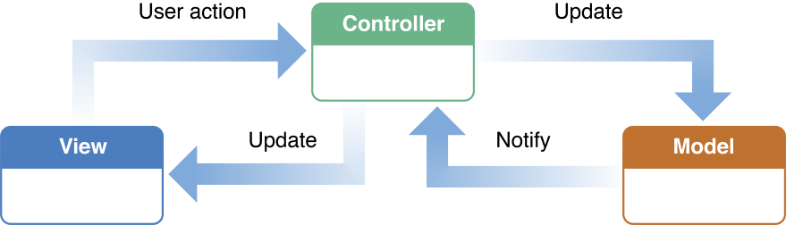
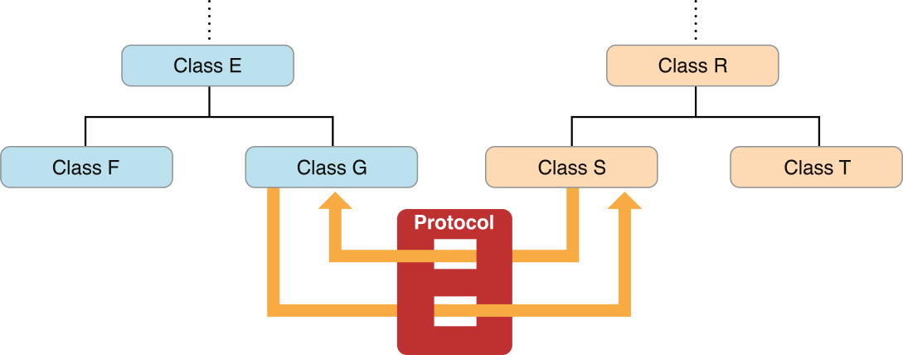
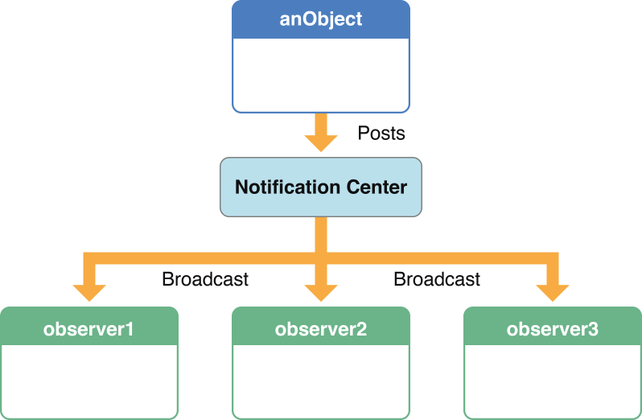
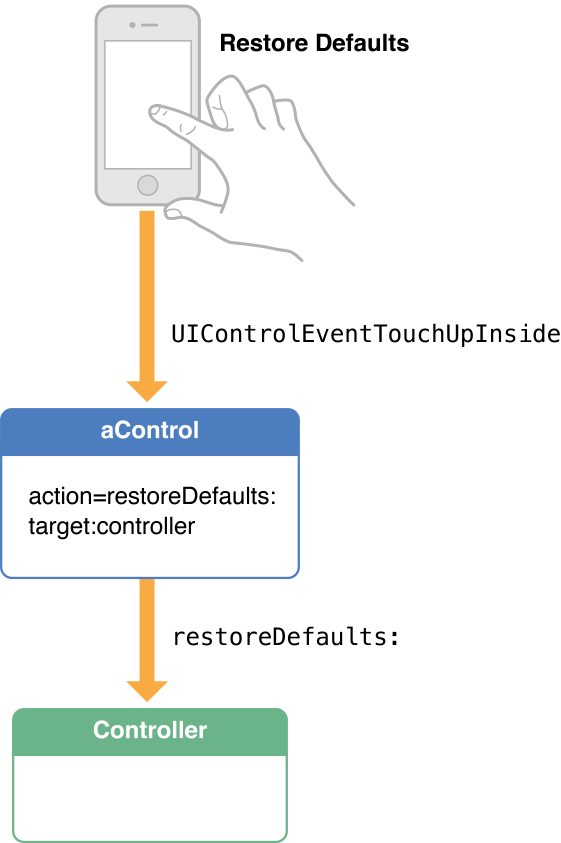
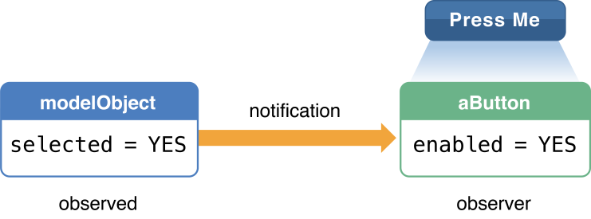

> 导航：[总目录](../../../README.md) · [referencelibrary](../../../_indexes/referencelibrary.md) · [Start Developing iOS Apps Today (Retired)](Document%20Revision%20History.md)

[Back to Design Patterns](https://developer.apple.com/library/archive/referencelibrary/GettingStarted/RoadMapiOS-Legacy/chapters/DesignPatterns.html)
!
!
!

# Retired Document

__Important:__ This version of _Start Developing for iOS Today_ has been retired. The replacement version provides a new, more streamlined walkthrough of the basics. For information covering the same subject area as this page, please see ["Using Design Patterns"](https://developer.apple.com/library/ios/referencelibrary/GettingStarted/RoadMapiOS/DesignPatterns.html#//apple_ref/doc/uid/TP40011343-CH5-SW1).

# Streamline Your App with Design Patterns

In Objective-C programming, one way to add behavior specific to your app is through inheritance. You create a subclass of an existing class that either augments the attributes and behavior of the superclass or modifies them in some way. But there are other, more dynamic ways of adding app-specific behavior that do not involve subclassing. These dynamic techniques and approaches are based on design patterns. As this articles explains, adopting design patterns in your code contributes to the reusability and extensibility of both your classes and the framework classes.

A design pattern is a tool of abstraction used in object-oriented software development as well as other fields. It is a template for a design that solves a general, recurring problem in a particular context. A design pattern is thus a kind of guide for a particular, concrete design: an “instantiation” of a pattern, in a sense. There is some flexibility in how you can apply a design pattern, and often things such as the programming language and existing architectures can determine how the pattern is applied.

Several themes or principles of design influence design patterns. These design principles are rules of thumb for constructing object-oriented systems, such as “encapsulate the aspects of system structure that vary” and “program to an interface, not an implementation.” They express important insights. For example, the principle of encapsulation says that if you isolate the parts of a system that vary, and encapsulate them, they can vary independently of other parts of the system, especially if you define interfaces for them that are not tied to implementation specifics. You can later alter or extend those variable parts without affecting the other parts of the system. You thus eliminate dependencies and reduce couplings between parts, and consequently the system becomes more flexible and easier to change.

Benefits such as these make design patterns an important consideration when you’re writing software. If you find, adapt, and use patterns in your app’s design, that program—and the objects and classes that it comprises—will be more reusable, more extensible, and easier to change when future requirements demand it. Moreover, apps that are based on design patterns are generally more elegant and efficient than apps that aren’t, because they require fewer lines of code to accomplish the same goal.

You can find adaptations of design patterns throughout the Cocoa Touch and Cocoa frameworks and in the Objective-C runtime and language. Some of these pattern-based mechanisms you get almost “for free,” but others require some work on your part. And you can apply design patterns to your own app’s code when the situation warrants it. If you use the same patterns that the Cocoa Touch and Cocoa frameworks use, your code tends to fit in better with the frameworks’ code and work more elegantly.

The Model-View-Controller design pattern (commonly known as MVC) assigns objects in an app one of three roles: model, view, or controller. The pattern defines not only the roles objects play in the app, it defines the way objects communicate with each other. Each of the three types of objects is separated from the others by abstract boundaries and communicates with objects of the other types across those boundaries. The collection of objects of a certain MVC type in an app is sometimes referred to as a layer—for example, a model layer.

MVC is central to a good design for any iOS app or Mac app. The benefits of adopting this pattern are numerous. Many objects in these apps tend to be more reusable, and their interfaces tend to be better defined. Apps having an MVC design are also more easily extensible than other apps. Moreover, many technologies and architectures that your app can use are based on MVC and require that your custom objects play one of the MVC roles.

You might not be aware of it, but you have already created an app that is based on MVC: HelloWorld in _Your First iOS App_. The model object is the `userName` property (an `NSString` object) declared and managed by the `HelloWorldViewController` class. Instances of the `HelloWorldViewController` and `HelloWorldAppDelegate` classes are the app’s controller objects, and the view objects of the app are the text field, label, button, and the background view.

Complete information about Model-View-Controller is in “Model-View-Controller” in _Concepts in Objective-C Programming_.

A model object encapsulates the data of an app and defines the logic and computation that manipulate and process that data. For example, a model object might represent a character in a game or a contact in an address book. Sometimes the model layer of an app is effectively one or more graphs of related objects. Much of the data that is part of the persistent state of the app (whether that persistent state is stored in files or databases) should reside in the model objects after the data is loaded into the app. Because model objects represent knowledge and expertise related to a specific problem domain, they can be reused in similar problem domains. A “pure” model object should have no explicit connection to the view objects that present its data and allow users to edit that data—it should not be concerned with user-interface and presentation issues.

User actions in the view layer that create or modify data are communicated through a controller object and result in the creation or updating of a model object. When a model object changes (for example, new data is received over a network connection), it notifies a controller object, which updates the appropriate view objects.

A view object is an object in an app that users can see. A view object knows how to draw itself and might respond to user actions. A major purpose of view objects is to display data from the app’s model objects and to enable the editing of that data. Despite this, in an MVC app view objects are typically decoupled from model objects.

Because you typically reuse view objects and reconfigure them, view objects provide consistency between apps. For iOS, the UIKit framework provides collections of view classes; for OS X, the AppKit framework provides a similar collection. In UIKit a view object ultimately inherits from the `UIView` class; in AppKit, it ultimately inherits from the `NSView` class.

View objects learn about changes in model data through the app’s controller objects and communicate user-initiated changes—for example, text entered in a text field—through controller objects to an app’s model objects.

A controller object acts as an intermediary between one or more of an app’s view objects and one or more of its model objects. Controller objects are thus a conduit through which view objects learn about changes in model objects and vice versa. Controller objects can also perform setup and coordinating tasks for an app and manage the life cycles of other objects.

A controller object interprets user actions made in view objects and communicates new or changed data to the model layer. When model objects change, a controller object communicates that new model data to the view objects so that they can display it.

An object-oriented system such as an app is dynamic. What an object can do at runtime is not limited to behavior set at the time of compilation. An object can send messages to other objects, and the target of the same message can vary by runtime circumstance. An object can also cooperate with a variable group of other objects at runtime, using a variety of techniques, to efficiently accomplish the work of the app. For an object, or a network of objects, to do this, it must take advantage of the many techniques and framework architectures that are adaptations of design patterns.

The following sections describe many of these techniques and architectures. Consider them part of your Objective-C programming toolkit.

In delegation, an object called the _delegate_ acts on behalf of, and at the request of, another object. That other, delegating, object is typically a framework object. At some point in execution, it sends a message to its delegate; the message tells the delegate that some event is about to happen and asks for some response. The delegate (usually an instance of a custom class) implements the method invoked by the message and returns an appropriate value. Often that value is a Boolean value that tells the delegating object whether to proceed with an action.

Delegation is thus a means for injecting application-specific behavior into the workings of a framework class—without having to subclass that class. It is a common and powerful design for extending and influencing the behavior of the frameworks.

Recall the `HelloWorldAppDelegate` object in the HelloWorld app you created when working through _Your First iOS App_. Xcode automatically assigns it to be the delegate of the app object, which is a framework object. The app delegate can handle the `application:didFinishLaunchingWithOptions:` and other delegation messages sent to it by the app object.

There are two programmatic components to delegation. The delegating class must define a property (by convention named `delegate`) to hold a reference to the delegate. It must also declare a protocol that the class of the delegate must adopt (see the following section for more on protocols). Many classes of the Cocoa Touch and Cocoa frameworks offer delegation as an approach that apps can take to augment framework behavior with something that is specific to the app.

Delegation, however, is not limited to framework classes. You can implement delegation between two custom objects in an app. A common design in Cocoa Touch apps uses delegation as a means for allowing a child view controller to communicate some value (typically a user-entered value) to its parent view controller.

A protocol is a declaration of a programmatic interface whose methods any class can implement. An instance of a class associated with the protocol calls the methods of the protocol and obtains values returned by the class formally _adopting_ and implementing the protocol. This communication between the objects furthers a specific goal, such as parsing XML code or copying an object. The objects on either side of the protocol interface can be distantly related to each other by inheritance. A protocol is thus, as is delegation, an alternative to subclassing and is often part of a framework’s implementation of delegation.

The frameworks that Apple provides declare dozens of protocols. In addition, your app can declare custom protocols that your classes can adopt. Protocols are part of your programming toolkit. _Programming with Objective-C_ gives a comprehensive description of protocols.

A notification center is a subsystem of the Foundation framework that broadcasts a message—a notification—to all objects in an app that are registered observers of an event. (Programmatically, it’s an instance of the `NSNotificationCenter` class.) The event can be anything that happens in an app—the app entering the background state, for instance, or the user starting to type in a text field. A notification informs the observer that the event has happened or is about to happen, thus giving the observer an opportunity to respond in an appropriate manner. Notifications broadcast by the notification center are a way to increase cooperation and cohesion among the objects of an app.

For example, a view controller in an iOS app can observe the notification `UIKeyboardWillShowNotification` to adjust its view’s geometry to accommodate the virtual keyboard. As this example indicates, a notification is an object that has a name indicating a specific event and whether that event has occurred or is about to occur. It also carries a reference to the object that posts (or sends) the notification to the notification center, and it can contain a dictionary of supplementary information.

Any object can observe a notification, but to do so it must register to receive it. In registering, it must specify a selector identifying the method to be invoked by the delivery of the notification; the method signature must have a single parameter: the notification object. When registering, the observer can also specify the posting object.

Notification-center notifications are similar to delegation messages; both are sent to arbitrary objects when certain events occur. However, methods that handle notifications, unlike delegation methods, cannot return a value. Notification via the notification center is synchronous, just as with delegation.

A custom object in your app can define and post its own notifications, and other custom objects in your app can observe the notification.

The target-action design is conceptually simple. An object stores the elements that make up a message expression and, when a certain event occurs, puts these elements together and sends a message. The elements are a selector identifying the message (the action) and the object to receive the message (the target). The target’s class implements the method corresponding to the action and the target, and when it receives the message at runtime, it responds to the event by executing the method.

Target-action is primarily a feature of controls in both the Cocoa Touch and Cocoa frameworks. A control is a user-interface object such as a button, slider, or switch that users manipulate (by tapping, dragging, and so on) to signal their intention to an app. A Cocoa Touch control stores both action and target; most Cocoa controls are paired with one or more cell objects that store target and action.

Some frameworks use target-action in objects other than controls. For example, the UIKit framework uses target-action in its design for gesture recognizers. When a gesture-recognizer object recognizes its gesture, it sends the action message to the target object.

Key-value observing (or KVO) allows an object to observe a property of another object. The observing object is notified when that property’s value changes. It learns about the new value as well as the old one; if the observed property is a to-many relationship (for example, an array), it also learns which of the contained objects are involved in the change. KVO helps apps to become more cohesive by keeping objects in the model, controller, and view layers synchronized to changes.

Similar to `NSNotificationCenter` notifications, multiple KVO observers can observe a single property. Moreover, KVO is more dynamic because it allows objects to observe arbitrary properties without requiring any new API, such as a notification name. KVO is a lightweight point-to-point communication mechanism that doesn’t allow observing a specific property of all instances.

The Cocoa Touch and Cocoa frameworks also include other designs based on design patterns, including the following:

- __View hierarchy.__ The views an app presents are arranged in a hierarchical organization based visually on containment. This pattern allows apps to treat individual views and compositions of views uniformly. At the root of the hierarchy is a window object; each view under that root has one parent view and zero or more child views. Parent views enclose child views. The view hierarchy is a structural component of both drawing and event handling.
- __Responder chain.__ The responder chain is a series of objects—mostly views, but also windows, view controllers, and the application object itself—along which an event or action message can be passed until one object in the chain handles the event. It thus is a mechanism for cooperative event handling. The responder chain is closely related to the view hierarchy.
- __View controller.__ Although both the UIKit and AppKit frameworks have view controller classes, they are particularly important in iOS. A view controller is a special kind of controller object for presenting and managing a set of views. View controller objects provide the infrastructure for managing content-related views and for coordinating the showing and hiding of them. A view controller manages a subhierarchy of application views.
- __Receptionist.__ In the Receptionist pattern, work that an app is performing is redirected—or “bounced”—from one execution context to another. (An execution context is a dispatch queue or operation queue associated with the main thread or a secondary thread.) You apply the Receptionist pattern primarily in situations where work performed in a secondary queue results in a task that must must be performed on the main queue, such as operations updating the user interface.
- __Category.__ A category offers you a way to extend a class by adding methods to it. As with delegation, it enables you to customize behavior without subclassing. Categories are a feature of Objective-C described in _Write Objective-C Code_.

[Back to Design Patterns](https://developer.apple.com/library/archive/referencelibrary/GettingStarted/RoadMapiOS-Legacy/chapters/DesignPatterns.html)
!
!
!
