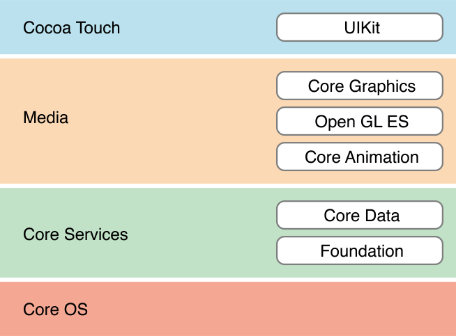
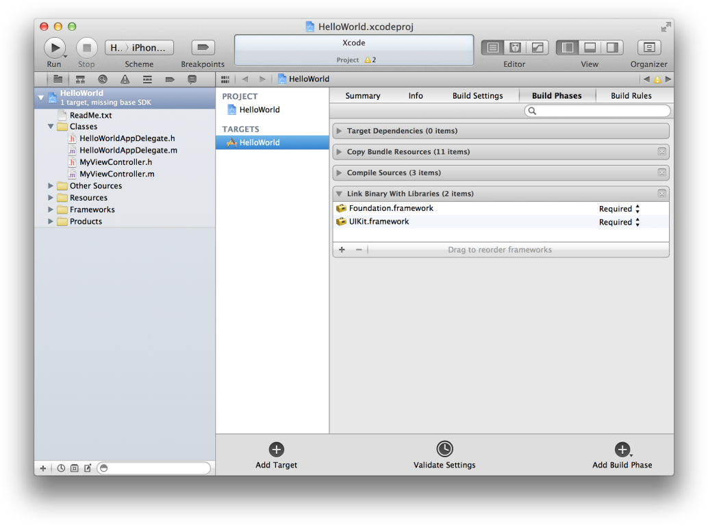

> 导航：[总目录](../../../README.md) · [referencelibrary](../../../_indexes/referencelibrary.md) · [Start Developing iOS Apps Today (Retired)](Document%20Revision%20History.md)

[Back to Frameworks](https://developer.apple.com/library/archive/referencelibrary/GettingStarted/RoadMapiOS-Legacy/chapters/Frameworks.html)
!
!
!

# Retired Document

__Important:__ This version of _Start Developing iOS Apps Today_ has been retired. The replacement version provides a new, more streamlined walkthrough of the basics. For information covering the same subject area as this page, please see ["iOS Technologies"](https://developer.apple.com/library/ios/referencelibrary/GettingStarted/RoadMapiOS/iOSTechnologies.html#//apple_ref/doc/uid/TP40011343-CH11-SW1).

# Survey the Major Frameworks

A framework is a directory that includes a shared library, header files to access the code stored in that library, and other resources such as image and sound files. A shared library defines functions and methods that apps can call.

iOS provides many frameworks that you can use in app development. To use a framework, add it to your project so that your app can link to it. Most apps link to the Foundation, UIKit, and Core Graphics frameworks. Depending on which template you choose for your app, other frameworks might also be included. You can always add additional frameworks to your project if the core set of frameworks does not meet your app’s requirements.

To look at the frameworks included in HelloWorld.xcodeproj

1. Open the `HelloWorld.xcodeproj` project in Xcode (if it’s not already open). You created this project earlier in the tutorial _Your First iOS App_.
2. Open the Frameworks folder in the project navigator by clicking the disclosure triangle next to it.

   You should see `UIKit.framework`, `Foundation.framework`, and `CoreGraphics.framework`.
3. You can view the header files in a framework by clicking the disclosure triangle next to the framework and then clicking the disclosure triangle next to the Headers folder.

Each framework belongs to a layer of the iOS system. Each layer builds on the ones below it. Use higher-level frameworks instead of lower-level frameworks whenever possible. Higher-level frameworks provide object-oriented abstractions for lower-level constructs.

When you begin programming, you mainly use the Foundation and UIKit frameworks because they cover most of your app development needs.

Your apps, as well as UIKit and other frameworks, are built on the Foundation framework infrastructure. The Foundation framework provides many primitive object classes and data types, making it fundamental to app development. It also establishes conventions (for tasks such as deallocation) that make your code more consistent and reusable.

Use Foundation to:

- Create and manage collections, such as arrays and dictionaries
- Access images and other resources stored in your app
- Create and manage strings
- Post and observe notifications
- Create date and time objects
- Automatically discover devices on IP networks
- Manipulate URL streams
- Execute code asynchronously

You already used the Foundation framework in _Your First iOS App_. For example, you used an instance of the `NSString` class to store the user’s input in `userName`. You also used the Foundation instance method `initWithFormat:` to create the greeting string.

All iOS apps are based on UIKit. You can’t ship an app without this framework. UIKit provides the infrastructure for drawing to the screen, handling events, and creating common user interface elements. UIKit also organizes a complex app by managing the content that is displayed onscreen.

Use UIKit to:

- Construct and manage your user interface
- Handle touch- and motion-based events
- Present text and web content
- Optimize your app for multitasking
- Create custom user interface elements

In _Your First iOS App_, you used UIKit. When you examined how an app starts up, you saw that the `UIApplicationMain` function creates an instance of the `UIApplication` class, which handles incoming user events. You implemented the `UITextFieldDelegate` protocol in order to dismiss the keyboard when the user taps the Done key. In fact, you used UIKit to create your entire interface with the `UITextField`, `UILabel`, and `UIButton` classes.

The Core Data, Core Graphics, Core Animation, and OpenGL ES frameworks are advanced technologies that are important for app development and require time to learn and master.

Core Data manages object-graphs. With Core Data, you create model objects, known as managed objects. You manage relationships between those objects and make changes to the data through the framework. Core Data takes advantage of the built-in SQLite technology to store and manage data efficiently.

Use Core Data to:

- Save and retrieve objects from storage
- Support basic undo/redo
- Validate property values automatically
- Filter, group, and organize data in memory
- Manage results in a table view with `NSFetchedResultsController`
- Support document-based applications

High-quality graphics are an important part of all iOS apps. The simplest and most efficient way to create graphics in iOS is to use prerendered images with the standard views and controls of the UIKit framework and to let iOS do the drawing. UIKit also provides classes for custom drawing—including paths, colors, patterns, gradients, images, text, and transformations. Use UIKit, a higher-level framework, instead of Core Graphics, a lower-level framework, whenever possible.

Use Core Graphics when you want to write drawing code that you share directly between iOS and OS X. The Core Graphics framework, also known as _Quartz_, is nearly identical on both platforms.

Use Core Graphics to:

- Make path-based drawings
- Use antialiased rendering
- Add gradients, images, and colors
- Use coordinate-space transformations
- Create, display, and parse PDF documents

UIKit provides animations that are built on top of the Core Animation technology. If you need advanced animations beyond the capabilities of UIKit, you can use Core Animation directly. The Core Animation interfaces are contained in the Quartz Core framework. With Core Animation, you create a hierarchy of layer objects that you manipulate, rotate, scale, transform, and so forth. By using Core Animation’s familiar viewlike abstraction, you can create dynamic user interfaces without having to use low-level graphics APIs such as OpenGL ES.

Use Core Animation to:

- Create custom animations
- Add timing functions to graphics
- Support key frame animation
- Specify graphical layout constraints
- Group multiple-layer changes into an atomic update

OpenGL ES supports basic 2D and 3D drawing. Apple’s implementation of the OpenGL ES standard works closely with the device hardware to provide high frame rates for full-screen game-style applications.

Use OpenGL ES to:

- Create 2D and 3D graphics
- Make more complex graphics, such as data visualization, flight simulation, or video games
- Access underlying graphics hardware

If you’re a Mac developer, you’ll find that Cocoa and Cocoa Touch apps are based on similar technologies. Their shared APIs make it easier to migrate from Cocoa. In fact, some frameworks are identical (or nearly identical), like Foundation and Core Data. However, other frameworks are distinct from their OS X counterparts. This is especially true of AppKit and UIKit. Therefore, when migrating a Mac app to iOS, you must replace a significant number of interface-related classes and code related to those classes.

For more information on differences and similarities between platforms, see “Migrating from Cocoa” in _iOS Technology Overview_.

There are many more frameworks you can use in your app. When you decide you need to use a framework that is not already included, add the framework to your project so that your app can link to it.

To link the HelloWorld.xcodeproj to another framework

1. Open the `HelloWorld.xcodeproj` project in Xcode (if it’s not already open).
2. Click the HelloWorld project in the project navigator to show the project editor.
3. Specify HelloWorld as the target to which you want to add a framework by clicking HelloWorld in the Targets list.
4. Click Build Phases at the top of the project editor.
5. Open the Link Binary With Libraries section by clicking the disclosure triangle.
6. Click the Add (+) button to add a framework.
7. Select a framework from the list and click Add.

For a complete list of the frameworks, or to learn more about them, see the _iOS Technology Overview_.

[On to Integrate Your Code with the Frameworks](Integrate%20Your%20Code%20with%20the%20Frameworks.md)
!
!
!
[Back to Frameworks](https://developer.apple.com/library/archive/referencelibrary/GettingStarted/RoadMapiOS-Legacy/chapters/Frameworks.html)
!
!
!
