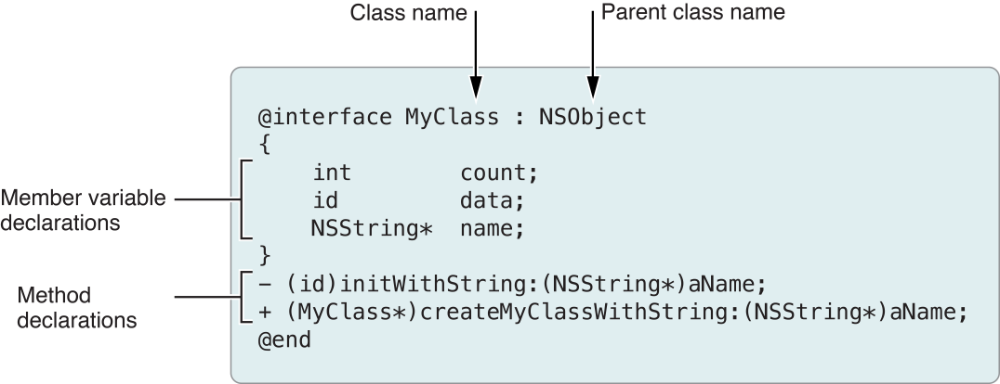
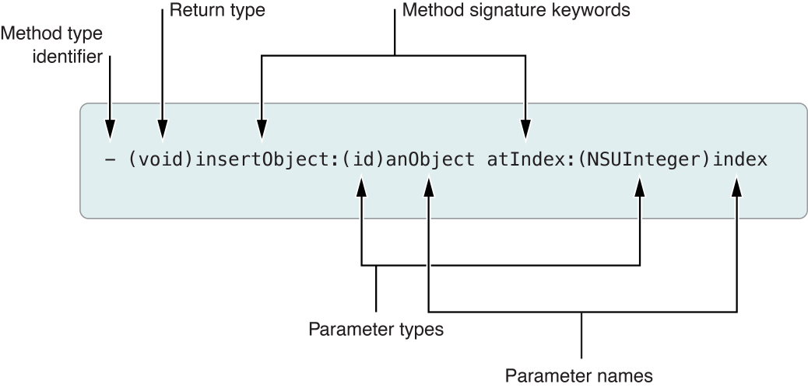
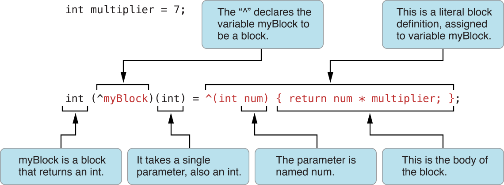

> 导航：[总目录](../../../README.md) · [referencelibrary](../../../_indexes/referencelibrary.md) · [Start Developing iOS Apps Today (Retired)](Document%20Revision%20History.md)


[Back to Language](https://developer.apple.com/library/archive/referencelibrary/GettingStarted/RoadMapiOS-Legacy/chapters/Languages.html)
!
!
!

# Retired Document

__Important:__ This version of _Start Developing iOS Apps Today_ has been retired. The replacement version provides a new, more streamlined walkthrough of the basics. For information covering the same subject area as this page, please see _[Programming with Objective-C](https://developer.apple.com/library/ios/documentation/Cocoa/Conceptual/ProgrammingWithObjectiveC/Introduction/Introduction.html#//apple_ref/doc/uid/TP40011210)_.

# Write Objective-C Code

If you haven’t programmed for either iOS or Mac OS X, you need to become acquainted with the primary programming language, Objective-C. Objective-C is a not a difficult language, and once you spend some time with it, you’ll appreciate its elegance. The Objective-C language enables sophisticated object-oriented programming. It extends the standard ANSI C programming language by providing a syntax for defining classes and methods. It also promotes dynamic extension of classes and interfaces that any class can adopt.

If you are familiar with ANSI C, the following information should help you learn the basic syntax of Objective-C. And if you have programmed with other object-oriented languages, you’ll find that many of the traditional object-oriented concepts, such as encapsulation, inheritance, and polymorphism, are all present in Objective-C. If you are not familiar with ANSI C, it’s a good idea to at least read an overview of the C language before you attempt to read this article.

The Objective-C language is fully explained in _The Objective-C Programming Language_.

The Objective-C language specifies a syntax for defining classes and methods, for calling methods of objects, and for dynamically extending classes and creating programming interfaces adapted to address specific problems. As a superset of the C programming language, Objective-C supports the same basic syntax as C. You get all of the familiar elements, such as primitive types (`int`, `float`, and so on), structures, functions, pointers, and control-flow constructs such as `if...else` and `for` statements. You also have access to the standard C library routines, such as those declared in `stdlib.h` and `stdio.h`.

Objective-C adds the following syntax and features to ANSI C:

- Definition of new classes
- Class and instance methods
- Method invocation (called _messaging_)
- Declaration of properties (and automatic synthesizing of accessor methods from them)
- Static and dynamic typing
- Blocks—encapsulated segments of code that can be executed at any time
- Extensions to the base language such as protocols and categories

Don’t worry if these aspects of Objective-C are unfamiliar to you now. As you progress through the remainder of this article, you will learn about them. If you’re a procedural programmer new to object-oriented concepts, it might help at first to think of an object as essentially a structure with functions associated with it. This notion is not too far off the reality, particularly in terms of runtime implementation.

In addition to providing most of the abstractions and mechanisms found in other object-oriented languages, Objective-C is a very dynamic language, and that dynamism is its greatest advantage. It is dynamic in that it permits an app’s behavior to be determined when it is running (that is, at runtime) rather than being fixed when the app is built. Thus the dynamism of Objective-C frees a program from constraints imposed when it’s compiled and linked; instead it shifts much of the responsibility for symbol resolution to runtime, when the user is in control.

As in most other object-oriented languages, classes in Objective-C support the encapsulation of data and define the actions that operate on that data. An object is a runtime instance of a class. It contains its own in-memory copy of the instance variables declared by its class and pointers to the methods of the class. You create an object in a two-step procedure called _allocation and initialization_.

The specification of a class in Objective-C requires two distinct pieces: the interface and the implementation. The interface portion contains the class declaration and defines the public interface of the class. As with C code, you define header files and source files to separate public declarations from the implementation details of your code. (You can put other declarations in your implementation file if they are part of the programmatic interfaces but are meant to be private.) These files have the filename extensions listed in the following table.

| Extension | Source type |
| --- | --- |
| `.h` | Header files. Header files contain class, type, function, and constant declarations. |
| `.m` | Implementation files. A file with this extension can contain both Objective-C and C code. It is sometimes called a _source file._ |
| `.mm` | Implementation files. An implementation file with this extension can contain C++ code in addition to Objective-C and C code. Use this extension only if you actually refer to C++ classes or features from your Objective-C code. |

When you want to include header files in your source code, specify a pound import (`#import`) directive as one of the first lines in a header or source file; a `#import` directive is like C’s `#include` directive, except that it makes sure that the same file is never included more than once. If you want to import most or all of the header files of a framework, import the framework’s umbrella header file, which has the same name as the framework. The syntax for importing the header files of the (hypothetical) Gizmo framework is:

```objc
#import <Gizmo/Gizmo.h>
```

The diagram below shows the syntax for declaring a class called `MyClass`, which inherits from the base (or _root_) class, `NSObject`. (A root class is one that all other classes directly or indirectly inherit from.) The class declaration begins with the `@interface` compiler directive and ends with the `@end` directive. Following the class name (and separated from it by a colon) is the name of the parent class. In Objective-C, a class can have only one parent.



You write declarations of properties and methods between the `@interface` and `@end` directives. These declarations form the public interface of the class. (Declared properties are described in [“Declared Properties and Accessor Methods.”](#apple-f4xwc4dqnrsv64tfmyxwi33df52wszbpkridimbqgeytgnbtfvkfanbqgaytcmztgmwugsbsfvjvona)) A semicolon marks the end of each property and method declaration. If the class has custom functions, constants, or data types associated with its public interface, put their declarations outside the `@interface` . . . `@end` block.

The syntax for a class implementation is similar. It begins with an `@implementation` compiler directive (followed by the name of the class) and ends with an `@end` directive. Method implementations go in between. (Function implementations should go outside the `@implementation` . . . `@end` block.) An implementation should always import its interface file as one of the first lines of code.


```objc
#import "MyClass.h"

@implementation MyClass
- (id)initWithString:(NSString *)aName
{
    // code goes here
}

+ (MyClass *)myClassWithString:(NSString *)aName
{
    // code goes here
}
@end
```

Objective-C supports dynamic typing for variables containing objects, but it also supports static typing. Statically typed variables include the class name in the variable type declaration. Dynamically typed variables use the type `id` for the object instead. You find dynamically typed variables used in certain situations. For example, a collection object such as an array (where the exact types of the contained objects may be unknown) might use dynamically typed variables. Such variables provide tremendous flexibility and allow for greater dynamism in Objective-C programs.

This example shows statically and dynamically typed variable declarations:

```
MyClass *myObject1;  // Static typing
id       myObject2;  // Dynamic typing
NSString *userName;  // From Your First iOS App (static typing)
```

Notice the asterisk (`*`) in the first declaration. In Objective-C, object references must always be pointers. If this requirement doesn’t make complete sense to you, don’t worry. You don’t have to be an expert with pointers to be able to start programming with Objective-C. You just have to remember to put an asterisk in front of the variable names for statically typed object declarations. The `id` type implies a pointer.

If you’re new to object-oriented programming, it might help to think of a method as a function that is scoped to a specific object. By sending a message to—or _messaging_—an object, you call a method of that object. There are two kinds of methods in Objective-C: instance methods and class methods.

- An _instance method_ is a method whose execution is scoped to a particular instance of the class. In other words, before you call an instance method, you must first create an instance of the class. Instance methods are the most common type of method.
- A _class method_ is a method whose execution is scoped to the method’s class. It does not require an instance of an object to be the receiver of a message.

The declaration of a method consists of the method type identifier, a return type, one or more signature keywords, and the parameter type and name information. Here’s the declaration of the `insertObject:atIndex:` instance method.



For instance methods, the declaration is preceded by a minus sign (`-`); for class methods, the corresponding indicator is a plus sign (`+`). “Class Methods,” below, describes class methods in greater detail.

A method’s actual name (`insertObject:atIndex:`) is a concatenation of all of the signature keywords, including colon characters. The colon characters declare the presence of a parameter. In the above example, the method takes two parameters. If a method has no parameters, you omit the colon after the first (and only) signature keyword.

When you want to call a method, you do so by sending a message to the object that implements the method. (Although the phrase "sending a message” is commonly used as a synonym for “calling a method,” the Objective-C runtime does the actual sending.) A message is the method name along with the parameter information the method needs (properly conforming to type). All messages you send to an object are dispatched dynamically, thus facilitating the polymorphic behavior of Objective-C classes. (_Polymorphism_ refers to the ability of different types of objects to respond to the same message.) Sometimes the method invoked is implemented by a superclass of the class of the object receiving the message.

To dispatch a message, the runtime requires a message expression. A _message expression_ encloses with brackets (`[` and `]`) the message itself (along with any required parameters) and, just inside the leftmost bracket, the object receiving the message. For example, to send the `insertObject:atIndex:` message to an object held by the `myArray` variable, you would use the following syntax:

```
[myArray insertObject:anObject atIndex:0];
```

To avoid declaring numerous local variables to store temporary results, Objective-C lets you nest message expressions. The return value from each nested expression is used as a parameter, or as the receiving object, of another message. For example, you could replace any of the variables used in the previous example with messages to retrieve the values. Thus, if you had another object called `myAppObject` that had methods for accessing the array object and the object to insert into the array, you could write the preceding example to look something like the following:

```
[[myAppObject theArray] insertObject:[myAppObject objectToInsert] atIndex:0];
```

Objective-C also provides a dot-notation syntax for invoking accessor methods. _Accessor methods_ get and set the state of an object, and thus are key to encapsulation, which is an important feature of all objects. Objects hide, or _encapsulate_, their state and present an interface common to all instances for accessing that state. Using dot-notation syntax, you could rewrite the previous example like this:

```
[myAppObject.theArray insertObject:myAppObject.objectToInsert atIndex:0];
```

You can also use dot-notation syntax for assignment:

```
myAppObject.theArray = aNewArray;
```

This syntax is simply a different way to write `[myAppObject setTheArray:aNewArray];`. You cannot use a reference to a dynamically typed object (object of type `id`) in a dot-notation expression.

You have used dot syntax already for assigning to a variable in _Your First iOS App_:

```
self.userName = self.textField.text;
```


Although the preceding examples sent messages to an instance of a class, you can also send messages to the class itself. (A class is an object of type `Class` created by the runtime.) When messaging a class, the method you specify must be defined as a class method instead of an instance method. Class methods are a feature similar to static class methods in C++.

You often use class methods either as factory methods to create new instances of the class or to access some piece of shared information associated with the class. The syntax for a class method declaration is identical to that of an instance method except that you use a plus (`+`) sign instead of a minus sign for the method type identifier.

The following example illustrates how you use a class method as a factory method for a class. In this case, the `array` method is a class method on the `NSArray` class—and inherited by `NSMutableArray`—that allocates and initializes a new instance of the class and returns it to your code.

```
NSMutableArray *myArray = nil;  // nil is essentially the same as NULL

// Create a new array and assign it to the myArray variable.
myArray = [NSMutableArray array];
```


A property in the general sense is some data encapsulated or stored by an object. It is either an attribute—such as a name or a color—or a relationship to one or more other objects. The class of an object defines an interface that enables users of its objects to get and set the values of encapsulated properties. The methods that perform these actions are called _accessor methods_.

There are two types of accessor methods, and each method must conform to a naming convention. A “getter” accessor method, which returns the value of a property, has the same name as the property. A "setter” accessor method, which sets a new value for a property, has the form `set`_PropertyName_`:`, where the first letter of the property name is capitalized. Properly named accessor methods are a critical element of several technologies of the Cocoa and Cocoa Touch frameworks, including key-value coding (KVC), which is a mechanism for accessing an object’s properties indirectly through their names.

Objective-C offers _declared properties_ as a notational convenience for the declaration and implementation of accessor methods. In _Your First iOS App_ you declared the `userName` property:

```objc
@property (nonatomic, copy) NSString *userName;
```

Declared properties eliminate the need to implement a getter and setter method for each property exposed in the class. Instead, you specify the behavior you want using the property declaration. The compiler can then create—or _synthesize_—actual getter and setter methods based on that declaration. Declared properties reduce the amount of boilerplate code you have to write and, as a result, make your code much cleaner and less error prone. Use declared properties or accessor methods to get and set items of an object’s state.

You include property declarations with the method declarations in your class interface. You declare public properties in the class header files; you declare private properties in a class extension in the source file. (See “Protocols and Categories” for a short description of class extensions along with an example.) Properties of controller objects such as delegates and view controllers should typically be private.

The basic declaration for a property uses the `@property` compiler directive, followed by the type information and name of the property. You can also configure the property with custom options, which define how the accessor methods behave, whether the property is a weak reference, and whether it is read-only. The options are in parentheses following the `@property` directive.

The following lines of code illustrate a few more property declarations:

```objc
@property (copy) MyModelObject *theObject;  // Copy the object during assignment.
@property (readonly) NSView *rootView;      // Declare only a getter method.
@property (weak) id delegate;               // Declare delegate as a weak reference
```

The compiler automatically synthesizes declared properties. In synthesizing a property, it creates accessor methods for it as well as a private instance variable that “backs” the property. The instance variable has the same name as the property but with an underscore prefix (`_`). Your app should directly access an instance variable (instead of its property) only in methods for object initialization and deallocation.

If you want a different name for an instance variable, you can bypass autosynthesis and explicitly synthesize a property. Use the `@synthesize` compiler directive in the class implementation to ask the compiler to generate the accessor methods along with the specially named instance variable. For example:

```objc
@synthesize enabled = _isEnabled;
```

Incidentally, when you declare a property you can specify custom names for the accessor methods, typically to make the getter methods of Boolean properties follow a conventional form, as shown here:

```objc
@property (assign, getter=isEnabled) BOOL enabled; // Assign new value, change name of getter method
```


_Blocks_ are objects that encapsulate a unit of work—that is, a segment of code—that can be executed at any time. They are essentially portable and anonymous functions that one can pass in as parameters of methods and functions or that can be returned from methods and functions. Blocks themselves have a typed parameter list and may have an inferred or a declared return type. You can also assign a block to a variable and then call it just as you would a function.

A caret (^) is used as a syntactic marker for blocks. There are other, familiar syntactic conventions for parameters, return values, and body of the block (that is, the executed code). The following figure explains the syntax, specifically when assigning a block to a variable.



You can then call the block variable as if it were a function:

```
int result = myBlock(4); // result is 28
```

A block shares data in the local lexical scope. This characteristic of blocks is useful because if you implement a method and that method defines a block, the block has access to the local variables and parameters of the method (including stack variables) as well as to functions and global variables, including instance variables. This access is read-only, but if a variable is declared with the `__block` modifier, its value can be changed within the block. Even after the method or function enclosing a block has returned and its local scope has been destroyed, the local variables persist as part of the block object as long as there is a reference to the block.

As method or function parameters, blocks can serve as a callback. When invoked, the method or function performs some work and, at the appropriate moments, calls back to the invoking code—via the block—to request additional information or to obtain program-specific behavior from it. Blocks enable the caller to provide the callback code at the point of invocation. Instead of packaging the required data in a “context” structure, blocks capture data from the same lexical scope as does the host method or function. Because the block code does not have to be implemented in a separate method or function, your implementation code can be simpler and easier to understand.

Objective-C frameworks have many methods with block parameters. For example, the `NSNotificationCenter` class of the Foundation framework declares the following method, which has a block parameter:

```objc
- (id)addObserverForName:(NSString *)name object:(id)obj queue:(NSOperationQueue *)queue usingBlock:(void (^)(NSNotification *note))block
```

This method adds an observer to the notification center (notifications are discussed in _Streamline Your App with Design Patterns_). When a notification of the specified name is posted, the block is invoked to handle the notification.

```
    opQ = [[NSOperationQueue alloc] init];
    [[NSNotificationCenter defaultCenter] addObserverForName:@"CustomOperationCompleted"
             object:nil queue:opQ
        usingBlock:^(NSNotification *notif) {
        // handle the notification
    }];
```


A _protocol_ declares methods that can be implemented by any class, even if those classes implementing the protocol don’t have a common superclass. Protocol methods define behavior that is independent of any particular class. Protocols simply define an interface that other classes are responsible for implementing. When your class implements the methods of a protocol, your class is said to _conform_ to that protocol.

From a practical perspective, a protocol defines a list of methods that establishes a contract between objects without requiring them to be instances of any specific class. This contract enables communication between those objects. One object wants to tell another object about the events it’s encountering, or perhaps it wants to ask for advice about those events.

The `UIApplication` class implements the required behavior of an application. Instead of forcing you to subclass `UIApplication` to receive simple notifications about the current state of the application, the `UIApplication` class delivers those notifications by calling specific methods of its assigned delegate object. An object that implements the methods of the `UIApplicationDelegate` protocol can receive those notifications and provide an appropriate response.

You specify in the interface block that your class conforms to, or _adopts_, a protocol by putting the name of the protocol in angle brackets (`<...>`) after the name of the class from which it inherits. You indicated adoption of the `UITextFieldDelegate` protocol in _Your First iOS App_ in the following line of code:

```objc
@interface HelloWorldViewController : UIViewController <UITextFieldDelegate> {
```

You do not have to declare the protocol methods you implement.

The declaration of a protocol looks similar to that of a class interface, with the exceptions that protocols do not have a parent class and they do not define instance variables (although they can declare properties). The following example shows a simple protocol declaration with one method:

```objc
@protocol MyProtocol
- (void)myProtocolMethod;
@end
```

For many delegate protocols, adopting a protocol is simply a matter of implementing the methods defined by that protocol. There are some protocols that require you to state explicitly that you support the protocol, and protocols can specify both required and optional methods.

When you begin exploring the header files of the Objective-C frameworks, you’ll soon encounter a line similar to this one:

```objc
@interface NSDate (NSDateCreation)
```

This line declares a category through the syntactical convention of enclosing the name of the category in parentheses. A _category_ is a feature of the Objective-C language that enables you to extend the interface of a class without having to subclass it. The methods in the category become part of the class type (within the scope of your program) and are inherited by all the class’s subclasses. You can send a message to any instance of the class (or its subclasses) to invoke a method defined in the category.

You can use categories as a means for grouping related method declarations within a header file. You can even put different category declarations in different header files. The frameworks use these techniques throughout their header files for clarity.

You can also use an anonymous category known as a _class extension_ to declare private properties and private methods in the implementation (`.m`) file. A class extension looks like a category except there is no text between the parentheses. For example, here is a typical class extension:

```objc
@interface MyAppDelegate ()
@property (strong) MyDataObject *data;
@end
```


Objective-C has several terms that you should not use as the names of variables because they are reserved for special purposes. Some of these terms are compiler directives that are prefixed with at-signs (`@`), for example, `@interface` and `@end`. Other reserved terms are defined types and the literals that go with those types. Objective-C uses a number of defined types and literals that you won’t find in ANSI C. In some cases, these types and literals replace their ANSI C counterparts. The following table describes a few of the important ones, including the allowable literals for each type.

| Type | Description and literal |
| --- | --- |
| `id` | The dynamic object type. The negative literal for both dynamically and statically typed objects is `nil`. |
| `Class` | The dynamic class type. Its negative literal is `Nil`. |
| `SEL` | The data type (`typedef`) of a selector; this data type represents a method signature at runtime. Its negative literal is `NULL`. |
| `BOOL` | A Boolean type. The literal values are `YES` and `NO`. |

You often use these defined types and literals in error-checking and control-flow code. In your program’s control-flow statements, you can test the appropriate literal to determine how to proceed. For example:

```
NSDate *dateOfHire = [employee dateOfHire];
if (dateOfHire != nil) {
    // handle this case
}
```

To paraphrase this code, if the object representing the date of hire is not `nil`—in other words, if it is a valid object—then the logic proceeds in a certain direction. Here’s a shorthand way of doing the same branching:

```
NSDate *dateOfHire = [employee dateOfHire];
if (dateOfHire) {
    // handle this case
}
```

You can even reduce these lines of code further (assuming you don’t need a reference to the `dateOfHire` object):

```
if ([employee dateOfHire]) {
    // handle this case
}
```

You handle Boolean values in much the same way. In this example, the `isEqual:` method returns a Boolean value.

```
BOOL equal = [objectA isEqual:objectB];
if (equal == YES) {
    // handle this case
}
```

You can shorten this code in the same way you can for the code that tests for the absence or presence of `nil`.

In Objective-C, you can send a message to `nil` with no ill effects. Indeed there is no effect at all, except that the runtime returns `nil` if the method is supposed to return an object. Return values from messages sent to `nil` are guaranteed to work as long as what is returned is typed as an object.

Two other important reserved terms in Objective-C are `self` and `super`. The first term, `self`, is a local variable that you can use within a message implementation to refer to the current object; it is equivalent to `this` in C++. You can substitute the reserved word `super` for `self`, but only as the receiver in a message expression. If you send a message to `self`, the runtime first looks for the method implementation in the current object’s class; if it can’t find the method there, it looks for it in its superclass (and so on). If you send a message to `super`, the runtime first looks for the method implementation in the superclass.

The primary uses of both `self` and `super` have to do with sending messages. You send a message to `self` when the method to invoke is implemented by the class of `self`. For example:

```
[self doSomeWork];
```

`self` is also used in dot notation to invoke the accessor method synthesized by a declared property. For example:

```
NSString *theName = self.name;
```

You often send messages to `super` in overrides (that is, reimplementations) of methods inherited from a superclass. In this case, the method invoked has the same signature as the method overridden.

[Back to Language](https://developer.apple.com/library/archive/referencelibrary/GettingStarted/RoadMapiOS-Legacy/chapters/Languages.html)
!
!
!
