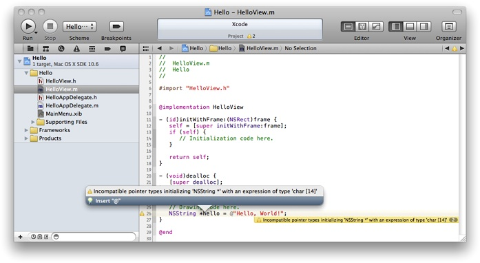
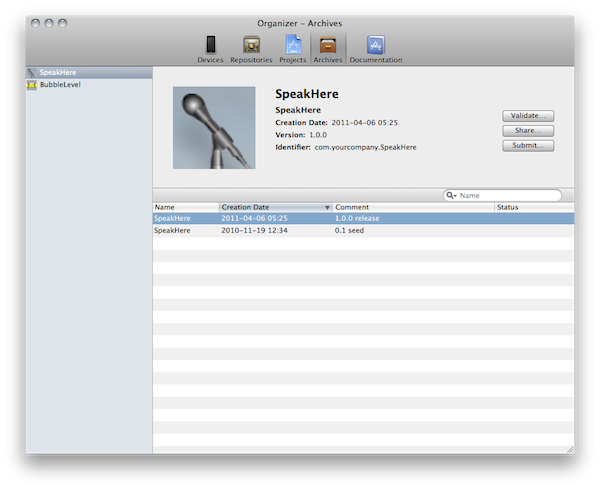

> 导航：[总目录](../../../README.md) · [referencelibrary](../../../_indexes/referencelibrary.md)

## Tools for iOS Development

Xcode is the toolset you use to manage product development, edit and debug source code, design user interface components, analyze and improve application performance, perform source control operations with the Git and Subversion source control systems, submit your application to the App Store, and much more. At the center of this toolset is the _Xcode application_, which provides an integrated development environment that actively assists you in your development tasks.

### Manage Your Work

To develop an iOS application, you start by creating an Xcode project. A [project](https://developer.apple.com/library/archive/featuredarticles/XcodeConcepts/Concept-Projects.html#//apple_ref/doc/uid/TP40009328-CH5) manages all the information associated with your application, including the source files, user interface designs, and build settings needed to build your application. You work on your project through the _workspace window_, which provides quick access to all the elements that make up your application.

__Figure 1__  The workspace window

!

The workspace window is divided into four major areas: the navigator area, the editor area, the debug area, and the utility area.

- The _navigator area_ is where you manage the files in your project, and other information, such as symbols, breakpoints, threads and stacks, warnings and errors, and logs about the activities you perform.
- The _editor area_ is where you edit source files, design user interface components, configure project settings, and view other project information.
- The _debug area_ contains panes you use to view variables in the current program execution scope, the threads and corresponding stacks of the running application, and its console output. You can also enter commands to the debugger.
- The _utility area_ contains inspectors you use to configure the properties of a file or an object, and libraries you use to add preconfigured source files or user interface elements, among other types of resources, to your project.

You can hide any of these areas—except the editor area—to focus on the task at hand. You can also use Safari-style tabs to implement multiple workflow-specific layouts of the workspace window. For example, you can configure a tab for debugging, in which only the editor and debug areas are open, to concentrate your attention on the code being executed. In another tab you can have the navigator area open to perform project management tasks. If you prefer not to use tabs, you can use multiple workspace windows.

If you need help performing a task, Xcode provides contextual help, which you can access directly from the user interface element about which you need help. This assistance includes easy-to-follow steps, videos or screenshots, and concise descriptions that help you get back to work quickly.

To learn more about the major Xcode features that help you get your work done, see [Orientation to Xcode](https://developer.apple.com/library/archive/documentation/ToolsLanguages/Conceptual/Xcode_Overview/UsingInterfaceBuilder.html#//apple_ref/doc/uid/TP40010215-CH5).

### Edit Your Source Code Files

To help you work efficiently, the _source code editor_ supports features such as code completion, syntax-aware indentation, and code folding (to hide code blocks temporarily). And if you need information about a particular symbol, you can get a summary of a symbol’s documentation directly in the editor.

Xcode also helps you write better code by identifying common mistakes as you work and offering to fix those mistakes for you.

To learn more about the Xcode source editing facilities, see [Writing and Editing Source Code](https://developer.apple.com/library/archive/documentation/ToolsLanguages/Conceptual/Xcode_Overview/UsingtheDebugger.html#//apple_ref/doc/uid/TP40010215-CH8).

### Design Your User Interface Components

_Interface Builder_ is the editor you use to assemble your application’s user interface using preconfigured objects. The objects include windows, controls (such as switches, text fields, and buttons), and views you use to represent your application’s data in specialized ways. With this editor, you position objects, configure their properties, and establish relationships (or connections) between those objects and your code.

__Figure 2__  Designing a user interface component

!

Interface Builder saves your designs in documents called [nib files](https://developer.apple.com/library/archive/documentation/General/Conceptual/DevPedia-CocoaCore/NibFile.html#//apple_ref/doc/uid/TP40008195-CH34), which contain all the information iOS needs to reconstitute the same objects in your application at runtime.

Overall, using Interface Builder saves you a tremendous amount of time when it comes to creating your application’s user interface. Using this editor eliminates the custom code needed to create, configure, and position the objects that make up your user interface. Because it is a visual editor, you get to see exactly what your application’s user interface will look like at runtime.

To learn more about the Xcode user interface design facilities, see Designing User Interfaces in Xcode.

### Run Your Application

When you run your application to debug or test it, you can run it in _iOS Simulator_ on your Mac and then on an iOS-based device. Using the simulator you can make sure your application behaves the way you want. After you are satisfied with your application’s basic behavior, you can run it on a device connected to your Mac. A device provides the ultimate testing environment, in which you can observe your application as it will behave on your customers’ devices.

__Figure 3__  Running an application in iOS Simulator

!

For details on how to run your application in the simulator or on a device, see iOS Development Guide.

### Improve the Performance of Your Application

To ensure that you deliver the best user experience for your software, use the _Instruments application_ to analyze the performance of your application as it runs in the simulator or on a device. Instruments gathers data from your running application and presents it in a graphical timeline.

__Figure 4__  Gathering information about a running application

!

You can gather data about your application’s memory usage, disk activity, network activity, and graphics performance, among other measurements. By viewing the data together, you can analyze different aspects of your application’s performance to identify potential areas of improvement. You can also compare your application’s behavior at different times to determine whether your changes actually improve the performance of your application.

For details on how to use Instruments with iOS applications, see iOS Development Guide. For general information on how to use Instruments, see [Instruments User Guide](https://developer.apple.com/library/archive/documentation/DeveloperTools/Conceptual/InstrumentsUserGuide/index.html#//apple_ref/doc/uid/TP40004652).

### Distribute Your Application

Xcode makes it easy to share your application with testers before release, and to publish it on the App Store. In this process, you create an archive of your application. This archive contains debugging information that you may need to investigate bugs reported by users of your application.

Xcode also performs essential validation tests required for App Store publication. Passing these tests ensures that your application’s approval process is a fast as possible.

For details about sharing and publishing applications, see Distributing Applications.

