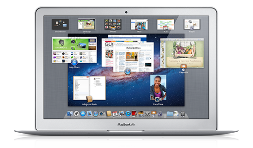

> 导航：[总目录](../../../README.md) · [referencelibrary](../../../_indexes/referencelibrary.md)

# User Experience Starting Point

User experience encompasses the visual appearance, interactive behavior, and assistive capabilities of software. The look and feel of your application is often as important as its feature set.

For example, an application with a great user experience should:

- Embody user-friendly design principles
- Have a professional, consistent look, with quality icons and graphics
- Support alternative input devices for users with disabilities

#### Contents:

- [Get Up and Running](#apple-f4xwc4dqnrsv64tfmyxwi33df52wszbpkridgmbqgaytcmbtfvbuqmrqgewvgvzs)
- [Become Proficient](#apple-f4xwc4dqnrsv64tfmyxwi33df52wszbpkridgmbqgaytcmbtfvbuqmrqgewvgvzt)
- [Sample Code](#apple-f4xwc4dqnrsv64tfmyxwi33df52wszbpkridgmbqgaytcmbtfvbuqmrqgewvgvzu)

### Get Up and Running

Before you design a user interface or write any code, it’s a good idea to become familiar with the range of OS X technologies that influence the user experience. Many of these technologies are described in _[Mac Technology Overview](../../../documentation/Mac%20OSX/Mac%20Technology%20Overview/About%20Developing%20for%20Mac.md#apple-f4xwc4dqnrsv64tfmyxwi33df52wszbpkridimbqgaytanrx)_.

Interface Builder is Apple’s graphical UI editor. To learn to use Interface Builder to edit the UI of an app, read Designing User Interfaces in Xcode in _[Xcode Overview](https://developer.apple.com/library/archive/documentation/ToolsLanguages/Conceptual/Xcode_Overview/index.html#//apple_ref/doc/uid/TP40010215)_.

All OS X developers should be familiar with Apple’s human interface guidelines for OS X. Read _Apple Human Interface Guidelines_ to learn about the design principles that underlie all user-friendly software and the OS X user interface features that your application can take advantage of.

### Become Proficient

To become proficient, you need to know how to implement the most important UI elements, such as windows, menus, and controls. _[Window Programming Guide](../../../documentation/Cocoa/Window%20Programming%20Guide/Introduction.md#apple-f4xwc4dqnrsv64tfmyxwi33df52wszbpgeydambqgaztc2i)_ explains how to implement windows, dialogs, and panels; _[Application Menu and Pop-up List Programming Topics](../../../documentation/Cocoa/Application%20Menu%20and%20Pop-up%20List%20Programming%20Topics/Introduction%20to%20Application%20Menus%20and%20Pop-up%20Lists.md#apple-f4xwc4dqnrsv64tfmyxwi33df52wszbpgeydambqgazte2i)_ explains how to implement menus. For information about sheets, read _[Sheet Programming Topics](../../../documentation/Cocoa/Sheet%20Programming%20Topics/Introduction%20to%20Sheets.md#apple-f4xwc4dqnrsv64tfmyxwi33df52wszbpgeydambqgayde2i)_. [Control-specific programming topics](https://developer.apple.com/library/archive/navigation/redirect.html#//apple_ref/doc/uid/TP30000440-TP30000437-TP30000495) (such as _[Button Programming Topics](../../../documentation/Cocoa/Button%20Programming%20Topics/Introduction%20to%20Buttons.md#apple-f4xwc4dqnrsv64tfmyxwi33df52wszbpgeydambqgayts2i)_) describe how to implement specific controls.

You may also want to became proficient in Apple style and usage and to familiarize yourself with accessibility topics. _[Apple Style Guide](https://help.apple.com/asg/mac/2013/)_ lists style and usage of Apple terms, including user interface terms that should be used in applications.

_[Accessibility Programming Guide for OS X](https://developer.apple.com/library/archive/documentation/Accessibility/Conceptual/AccessibilityMacOSX/index.html#//apple_ref/doc/uid/TP40001078)_ walks you through several accessibility topics. Most commercial applications must have user interfaces that support alternative input devices, such as screen readers, Braille keyboards, and so on, for users with disabilities. Making your user interface accessible also allows you to use the accessibility API to run automated UI tests.

### Sample Code

_[ButtonMadness: Creating and Customizing AppKit Controls](../../../samplecode/ButtonMadness-%20Creating%20and%20Customizing%20AppKit%20Controls/ButtonMadness-%20Creating%20and%20Customizing%20AppKit%20Controls.md#apple-f4xwc4dqnrsv64tfmyxwi33df52wszbpirkfgmjqgaydinbtga)_ demonstrates how to use the various types of buttons both using a nib file and programatically.

_[SpeedometerView](../../../samplecode/SpeedometerView/SpeedometerView.md#apple-f4xwc4dqnrsv64tfmyxwi33df52wszbpirkfgmjqgaydimzugu)_ shows how to make a custom view that can respond to mouse clicks.
