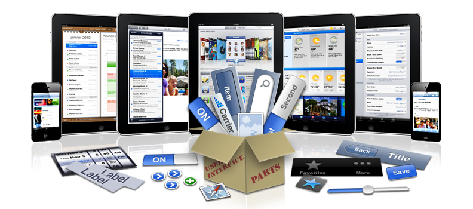

> 导航：[总目录](../../../README.md) · [referencelibrary](../../../_indexes/referencelibrary.md)

# User Experience Starting Point

> [!IMPORTANT]
> 

User experience encompasses the appearance, behavior, and accessibility of applications. Because your users are accustomed to the beauty, power, and simplicity of iOS-based devices, your goal is to design a user experience that reflects these qualities and helps your app feel at home on the device. For the best results, stay focused on the user experience at every stage in your development process.

#### Contents:

- [Get Up and Running](#apple-f4xwc4dqnrsv64tfmyxwi33df52wszbpkridimbqga3teojwfvbuqmjnirxw45cmnfxgwrlmmvwwk3tujfcf6mi)
- [Become Proficient](#apple-f4xwc4dqnrsv64tfmyxwi33df52wszbpkridimbqga3teojwfvbuqmjnirxw45cmnfxgwrlmmvwwk3tujfcf6mq)
- [Enhance Your Game with In-Game Voice and Game Center Services](#apple-f4xwc4dqnrsv64tfmyxwi33df52wszbpkridimbqga3teojwfvbuqmjnirxw45cmnfxgwrlmmvwwk3tujfcf6my)
- [Publish Ads to Boost Revenue](#apple-f4xwc4dqnrsv64tfmyxwi33df52wszbpkridimbqga3teojwfvbuqmjnirxw45cmnfxgwrlmmvwwk3tujfcf6na)

### Get Up and Running

For an overview of the fundamental device and application paradigms that influence the user experience of your app, read Platform Characteristics.

Interface Builder is Apple’s graphical UI editor. To get a glimpse of how to use Interface Builder to edit the UI of an app, read Configuring the View.

To see some sample code that shows different ways to use tables to display large amounts of information, see the _[UITableView Fundamentals for iOS](../../../samplecode/UITableView%20Fundamentals%20for%20iOS/UITableView%20Fundamentals%20for%20iOS.md#apple-f4xwc4dqnrsv64tfmyxwi33df52wszbpirkfgnbqgaydomzrha)_ sample code project.

To learn how to make your web content look great on iOS-based devices, see ["Creating Compatible Web Content"](https://developer.apple.com/library/safari/#documentation/AppleApplications/Reference/SafariWebContent/CreatingContentforSafarioniPhone/CreatingContentforSafarioniPhone.html#//apple_ref/doc/uid/TP40006482-SW1) in _Safari Web Content Guide_ and Technical Note TN2262 _[Preparing Your Web Content for iPad](https://developer.apple.com/library/archive/technotes/tn2010/tn2262/_index.html#//apple_ref/doc/uid/DTS40009577)_ (for iPad devices in particular).

### Become Proficient

All iOS app developers should be familiar with Apple’s human interface guidelines for iOS-based devices. Read _iOS Human Interface Guidelines_ to learn how your app should look and behave, and how to use the UI elements that UIKit provides.

To learn how to programmatically create and customize specific UI elements, see the _[UIKit Catalog (iOS): Creating and Customizing UIKit Controls](https://developer.apple.com/library/archive/samplecode/UICatalog/Introduction/Intro.html#//apple_ref/doc/uid/DTS40007710)_ sample code project and the class-specific documents in _[UIKit Framework Reference](https://developer.apple.com/documentation/uikit)_.

To find out how to make your app accessible to all users, read _[Accessibility Programming Guide for iOS](../../../documentation/User%20Experience/Accessibility%20Programming%20Guide%20for%20iOS/Introduction.md#apple-f4xwc4dqnrsv64tfmyxwi33df52wszbpkridimbqga4doobv)_.

### Enhance Your Game with In-Game Voice and Game Center Services

To learn how to give your users access to in-game voice, multiplayer sessions, leaderboards, and achievement tracking, read _[Game Center Programming Guide](../../../documentation/Networking%20Internet/Game%20Center%20Programming%20Guide/About%20Game%20Center.md#apple-f4xwc4dqnrsv64tfmyxwi33df52wszbpkridimbqga4dgmbu)_.

### Publish Ads to Boost Revenue

To learn how you can receive additional revenue when users tap ads you host within your app, read _iAd Programming Guide_.
