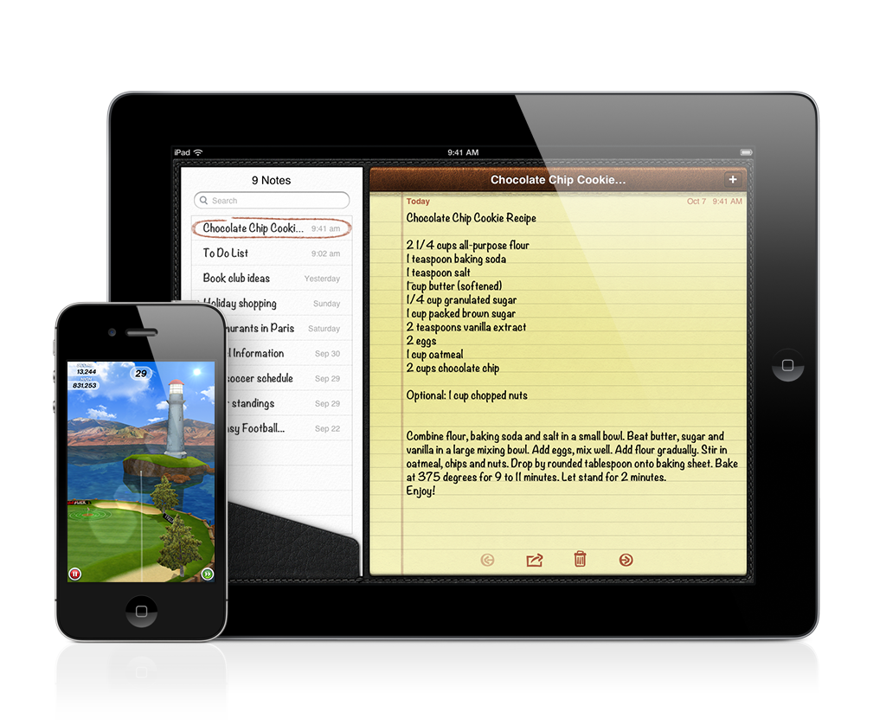

> 导航：[总目录](../../../README.md) · [referencelibrary](../../../_indexes/referencelibrary.md) · [马上着手开发 iOS 应用程序 (Start Developing iOS Apps Today) (弃用的文稿)](%E6%96%87%E7%A8%BF%E4%BF%AE%E8%AE%A2%E5%8E%86%E5%8F%B2%E8%AE%B0%E5%BD%95.md)

 [返回“用户界面设计”](https://developer.apple.com/library/archive/referencelibrary/GettingStarted/RoadMapiOSCh-Legacy/chapters/HumanInterfaceDesign.html) ! ! !

# 从用户角度进行设计

iOS 应用程序的成功，很大程度上取决于其用户界面的质量。如果用户发现应用程序不具有吸引力，又不容易使用，那么即使它是最快、最强大、功能最完整的应用程序，也会在 App Store 中沉没。

有许多方法可将一时的灵感转化为流行的应用程序，但没有必胜的独门偏方。不过，所有成功的应用程序开发，都遵循同一个指导原则：从用户角度进行设计。以下总结的策略和最佳实践，全都基于此指导原则，它们指出了在设计应用程序时，您需要遵循的一些原则和指南。当您准备好着手开发时，请务必阅读《_iOS Human Interface Guidelines_》（iOS 用户界面指南）以获得完整的信息。

如果是刚接触 iOS，您需要做的第一步，就是自己成为 iOS 用户。然后，以用户身份（而不是开发者身份）尽可能探索 iOS 平台的特征。无论一开始您就用过基于 iOS 的设备，还是从未接触过，请在使用设备时，花时间弄清楚您的期望并分析您的操作。

例如，考虑以下的设备和软件功能，如何影响用户的体验：

- iPhone、iPad 和 iPod touch 为手持设备，能够促使用户随时随地使用。用户期望应用程序能够迅速启动，并且在各种环境下都容易使用。
- 在所有基于 iOS 的设备上，不管设备尺寸大小，显示屏都最为重要。当用户专注于使用应用程序时，相对较小的显示屏不会构成障碍。
- 多触摸界面让用户无需借助别的设备（例如鼠标），就可操控内容。用户通常会有更能主导应用程序的体验，因为他们能够以触控来操控屏幕上的元素。
- 一次只有一个应用程序在最前面。用户可以使用多任务栏在应用程序之间迅速而轻松地切换，但是这种体验和在电脑显示器上看到多个应用程序同时打开是不同的。
- 一般情况下，应用程序不会同时打开几个单独窗口。相反，用户在屏幕内容之间转换，每个屏幕内容可以包含多个视图。
- 内建的“设置”应用程序包含用户偏好设置，用来设置设备以及在设备上运行的一些应用程序。要打开“设置”，用户必须从当前使用的应用程序切换出去，因此，这些偏好设置应该是那些“设好就不常改”的类型。大多数应用程序可以避免把偏好设置添加到“设置”中，反而在应用程序的主用户界面，给用户进行选择。

请记住，完美的应用程序需发挥其运行平台的优点，其使用体验亦要完全融合设备和平台的特性。

作为一名用户，当应用程序令您不清楚它是否接收到您的输入，或者弹出式窗口不明所以地在屏幕上到处冒出，您都会特别在意。在这些情况下，您在意的其实就是应用程序没有遵循用户界面的基本设计原则。

言下之意，用户界面指的是用户和设备（包括在设备上运行的软件）之间的互动。当应用程序（或设备）的用户界面按照用户实际思考和操作的方式构建时，用起来就会令人觉得很容易、很顺心。

Apple 的用户界面设计原则，归纳了人机互动的几个高层次范畴，对用户体验有着深刻影响。设计应用程序时，请记住以下用户界面设计的原则：

- __美学集成度__。美学集成度 (aesthetic integrity) 不是衡量应用程序有多好看；而是看应用程序的外观和它的功能融合得有多紧密。
- __一致性__。界面的一致性让用户把对一个应用程序的知识和技巧，应用到另一个应用程序。理想情况下，应用程序应与 iOS 标准、其本身及较早版本相一致。
- __直接操控__。当用户直接操控屏幕上的对象（而不是透过别的控制），他们会更加专注于任务，并且更容易理解操作的结果。
- __反馈__。通过反馈来确认用户的操作，并让他们确信处理正在进行。例如，当用户操作控制时，他们期望得到即时的反馈；进行长时间的操作时，则希望看到状态的更新。
- __隐喻__。如果应用程序中的虚拟对象和操作，隐喻着现实世界中的对象和操作，用户会迅速理解如何使用应用程序。最适当的隐喻，会启发一种用法和体验，而不是把所基于的现实世界对象或行动的限制强加实施。
- __用户控制__。虽然应用程序可以建议一系列操作，或者对危险的后果提出警告，但是如果不给用户做决定，则通常是错误的。最好的应用程序，会在给予用户所需的功能和帮助他们避免危险的结果之间，找到正确的平衡。

《_iOS Human Interface Guidelines_》（iOS 用户界面指南）给出了大量指导准则，范围从用户体验的建议，到使用 iOS 技术与屏幕元素的具体规则。这一部分并不是《_iOS Human Interface Guidelines_》（iOS 用户界面指南）的摘要；而是让你接触一些指南，有助于您设计一个成功的应用程序。

好的 iOS 应用程序，会让用户流畅地访问他们所关心的内容。为了达到这样的目的，这些应用程序整合了这些用户体验指南：

- 聚焦于主要任务。
- 让用法简单和明确。
- 使用以用户为中心的术语。
- 制作指尖大小的目标。
- 不强调设置。
- 一致地使用用户界面 (UI) 元素。
- 使用令人会意的动画来沟通。
- 仅在必要时要求用户进行存储。

用户期望应用程序整合平台的功能，例如多任务、iCloud、VoiceOver 和打印。用户可能认为这些功能是自然而然就该有的，应用程序开发者则清楚他们必须花工夫来整合这些功能。要确保应用程序为这些功能提供预期的用户体验，开发者须遵循这些 iOS 技术指南：

- 简单清晰地支持 iCloud 储存。
- 做好与多任务相关的中断和恢复准备。
- 处理本地通知和推送通知时，遵循用户的“通知中心”设置。
- 提供叙述信息，以便 VoiceOver 用户操作应用程序。
- 依赖系统提供的打印 UI，为用户带来满意的打印体验。
- 确保声音在各种情形下，都满足用户的期望。

当应用程序正确地使用 UI 元素（例如按钮和标签栏）时，用户就会专注于应用程序是否按他们所预期的方式运行。但是，当应用程序错误地使用 UI 元素时，用户很快就会表现不满。好的 iOS 应用程序，会小心遵循 UI 元素使用指南。例如：

- 确保导航栏中的返回按钮，显示上一个屏幕的标题。
- 当标签功能不可用时，不要将标签从标签栏移除。
- 避免提供“隐藏弹出式窗口”按钮。
- 当用户选择表格视图所列出的项目时，要提供反馈。
- 在 iPad 上，仅在弹出式窗口内显示挑选器。
- 使用系统提供的按钮和图标时，遵从它们定义好的含义。
- 设计自定图标和图像时，使用所有用户都理解的通用图像，避免复制 Apple 的 UI 元素或产品。

再次说明，本节中列出的指南，只是《_iOS Human Interface Guidelines_》（iOS 用户界面指南）中的一部分。在应用程序开发过程中，完整阅读该文稿是非常重要的一步。

最成功的 iOS 应用程序，通常是深思熟虑、反复设计的结果。当开发者聚焦于主要任务，使功能更加精炼，是可以创建优秀的用户体验。本节总结的策略，可以帮助改进您的想法、审视设计选项，并专注于用户会欣赏的应用程序上。

__提炼功能列表__。在设计过程中，尽早确定应用程序的功能和目标用户。使用此定义（称为应用程序定义语句）过滤掉不必要的功能，并指导应用程序的风格。虽然，功能越多应用程序就越好的想法很诱人，很多时候，却是反面教材。最好的应用程序，通常聚焦于一个主要任务，只提供用户完成该任务所需的那些功能。

__为设备而设计__。除了整合 iOS 用户界面和用户体验的模式之外，请确定您的应用程序在设备上运行自如。如果计划开发一个通用应用程序（即同时运行在 iPhone 和 iPad 上的应用程序），这就意味着必须为每个设备设计不同的 UI，即使大多数底层代码可以是相同的。同样，如果计划采用基于网上的内容，有必要重新设计这些内容，使其看起来和感觉起来像是原生的应用程序。

__适当地定制__。每个应用程序都包括一些自定 UI（即使只在其 App Store 图标中）。iOS SDK 可以让您自定 UI 的各个方面，至于多少自定才合适就完全由您决定。最好的应用程序，会以目的明确和易用作为自定的考量。理想情况下，您想要用户觉得您的应用程序与众不同，又同时欣赏到其直观和易用，与其他应用程序保持一致。

__原型和迭代__。在决定好包括哪些功能后，您就可以开始创建可测试的原型。早期的原型不需要显示真实的 UI 或美工图样，也不需要处理真实的内容。但是，它们需要给测试员准确的概念，知道应用程序是如何使用的。在测试过程中，要特别注意测试员尝试过但失败的地方，因为这些尝试，可以暴露出应用程序本该有却未实现的行为。继续测试直到您感到满意，认为用户可轻松理解应用程序是如何使用的，并能操作全部功能。

[返回“用户界面设计”](https://developer.apple.com/library/archive/referencelibrary/GettingStarted/RoadMapiOSCh-Legacy/chapters/HumanInterfaceDesign.html) ! ! !
