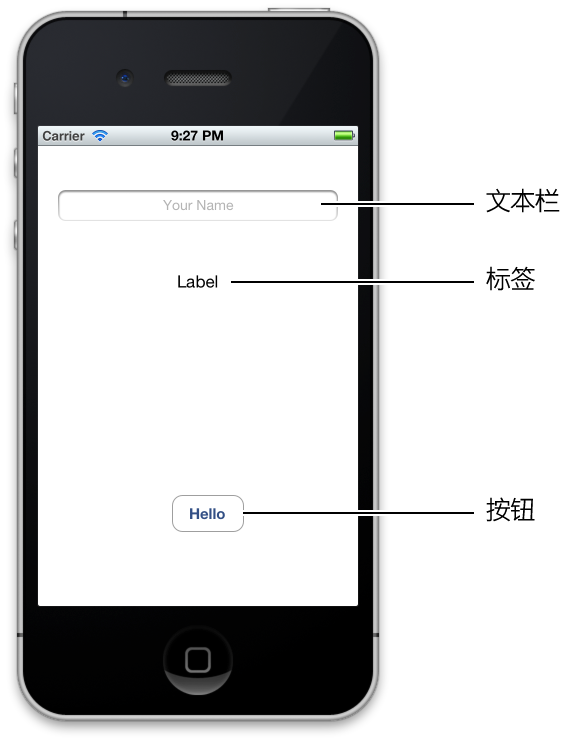

> 导航：[总目录](../../../README.md) · [referencelibrary](../../../_indexes/referencelibrary.md) · [马上着手开发 iOS 应用程序 (Start Developing iOS Apps Today) (弃用的文稿)](%E6%96%87%E7%A8%BF%E4%BF%AE%E8%AE%A2%E5%8E%86%E5%8F%B2%E8%AE%B0%E5%BD%95.md)

[下一页](%E7%AB%8B%E5%8D%B3%E5%BC%80%E5%A7%8B.md) 

[返回“马上开始”](https://developer.apple.com/library/archive/referencelibrary/GettingStarted/RoadMapiOSCh-Legacy/chapters/JumpRightIn.html) ! ! !

# 关于创建您的首个 iOS 应用程序

“__您的首个 iOS 应用程序__”介绍 iOS 应用程序开发的“三Ｔ”：

- __工具 (Tools)__。如何使用 Xcode 创建和管理项目。
- __技术 (Technologies)__。如何创建一个响应用户输入的应用程序。
- __技巧 (Techniques)__。如何利用一些基础设计模式－－所有 iOS 应用程序开发的基础。

完成本教程中的所有步骤后，您的应用程序外观大致是这样的：

如上图所示，您的应用程序有三个主要的用户界面元素：

- 文本栏（用于用户输入信息）
- 标签（用于显示信息）
- 按钮（让应用程序在标签中显示信息）

运行编写完成的应用程序时，点按文本栏会调出系统提供的键盘。使用键盘键入您的姓名后，点按“Done”键将键盘隐藏，然后点按“Hello”按钮，即可在文本栏和按钮之间的标签中看到字符串“Hello，__您的姓名__!”。

稍后在《__马上着手开发 iOS 应用程序__》中，您将会学习另一个教程“__将您的应用程序国际化__”，为您在此教程中创建的应用程序添加中文本地化。

如果您有计算机编程的基础知识，特别是面向对象编程和 Objective-C 程序设计语言的知识，您将能更好地理解本教程。如果您以前从未使用过 Objective-C，也不必担心本教程中的代码难以理解。您学完《__马上着手开发 iOS 应用程序__》之后，就能更好地理解这些代码了。

[下一页](%E7%AB%8B%E5%8D%B3%E5%BC%80%E5%A7%8B.md)
