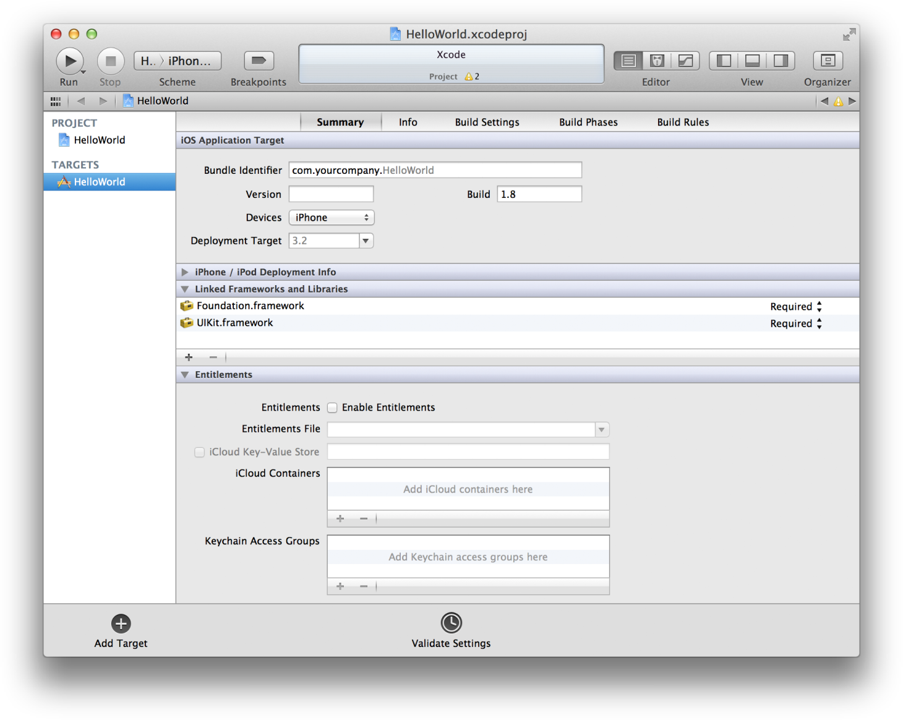
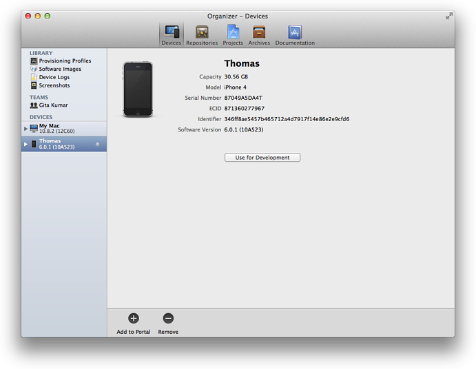
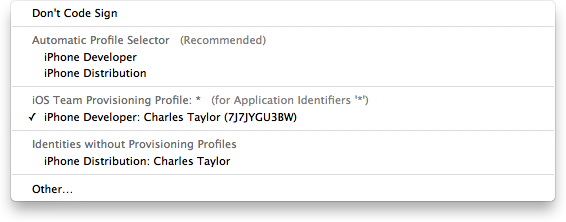
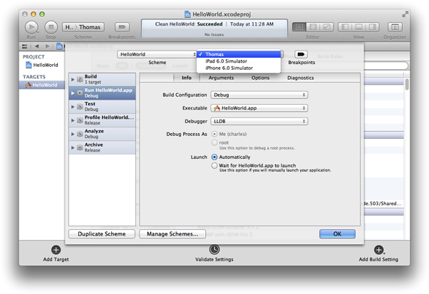
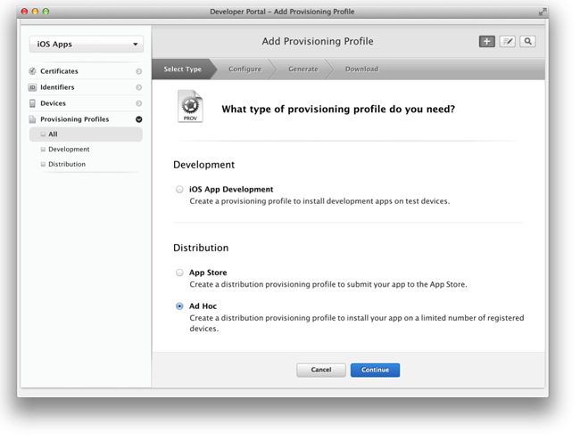
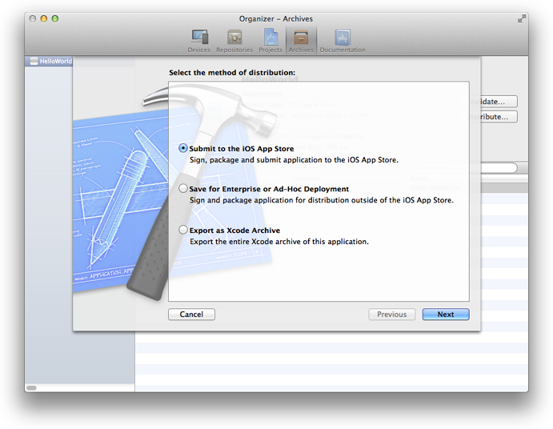
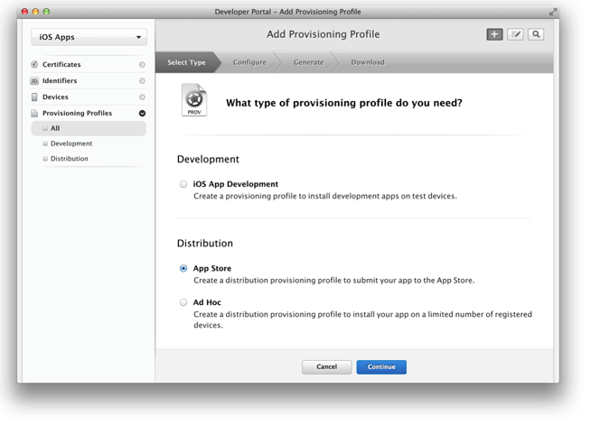
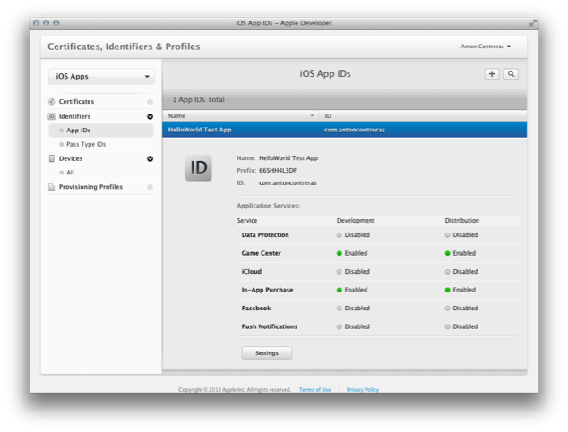

> 导航：[总目录](../../../README.md) · [referencelibrary](../../../_indexes/referencelibrary.md) · [马上着手开发 iOS 应用程序 (Start Developing iOS Apps Today) (弃用的文稿)](%E6%96%87%E7%A8%BF%E4%BF%AE%E8%AE%A2%E5%8E%86%E5%8F%B2%E8%AE%B0%E5%BD%95.md)

 [返回“App Store”](https://developer.apple.com/library/archive/referencelibrary/GettingStarted/RoadMapiOSCh-Legacy/chapters/ApplicationDevelopment.html) ! ! !

# 准备提交到 App Store

您的大部分时间都花在了编程任务上，但是要为 App Store 开发应用程序，您还需要在应用程序的整个生命周期中，使用 Xcode 和其他工具来执行一些管理任务。App Store 是一个受监管的商店，限制哪些应用程序可以销售。Apple 这么做是为了尽可能地为用户提供最佳体验。例如，在 App Store 上出售的应用程序不得崩溃或出现其他主要错误。

Apple 为您提供了所需的工具，来进行开发和测试，以及将应用程序提交到 App Store。要在设备上运行应用程序，设备需要为开发和稍后的测试做好预备工作。还需要提供应用程序的相关信息，以供 App Store 显示给客户，并且还需要上传屏幕快照。然后将应用程序提交给 Apple 审批。应用程序审批通过后，您设定应用程序在 App Store 上架销售的日期。最后，使用 Apple 的工具来监测应用程序的销售、客户评论和崩溃报告。然后再次重复整个流程，来提交应用程序的更新。

如果使用某些技术（例如 iCloud 储存或应用程序内购买），则需要执行额外的配置和管理任务。您还要执行管理开发者团队的任务。

要为 App Store 开发应用程序，首先需要加入 iOS Developer Program。加入该计划之后，您可以访问所需的资源和工具，来管理您的帐户，以及在设备上测试应用程序。

您将成为与 Apple 联络的主要人员，负责签订法律条款、创造资产并推广您的应用程序。您将要回答是个人开发者，还是公司开发者。如果是公司开发者，您可以将其他人添加到您的团队，并授予权限给他们中的某些人来管理帐户。在开发期间，需要在设备上运行应用程序的个别人士，要先加入您的团队。

您将使用以下 iOS Developer Program 网上工具来管理您的帐户：

- Member Center 是管理 Developer Program 帐户、注册 App ID 和设备、制作签名证书以及创建预置描述文件的工具。Member Center 还是通向其他资源和工具（包括 iTunes Connect）的大门。
- iTunes Connect 是营销和商务工具，用来检查合同状态、设置税务及银行信息、获取销售及财务报告，以及管理应用程序元数据。

您可以使用 Xcode 执行某些 Member Center 的管理任务，再根据需要返回到 Member Center，网址为 `http://developer.apple.com/membercenter`。这些管理任务对安全来说是非常必要的，并确保您的应用程序不会被过早发布。

从模板创建 Xcode 项目时，某些 App Store 配置已经完成。Xcode 会提示您输入产品名称和公司标识符。捆绑包 ID 就来自这两项属性。例如，在 HelloWorld 项目中，产品名称是 HelloWorld，公司标识符是 `edu.self`。因此，默认的捆绑包 ID 为 `edu.self.HelloWorld`。Xcode 也为其他值使用合理的默认值。您应该认真考虑，使用哪个模板来创建应用程序，使用什么设置来配置项目；从正确的模版开始，有助于加速开发过程。

如果想要稍后更改这些设置，或使用 iCloud 储存，您可在 Xcode 的目标“Summary”面板中找到大部分设置，包括启用权利。例如要通过验证测试，您需要设定应用程序图标和启动画面，它们出现在“Summary”面板上的“iPhone/iPod Deployment Info”下面。这些图像用来在 App Store 中代表您的应用程序。

开发期间，要在设备上运行应用程序，该设备必须连接到 Mac、已启动开发功能，并经过 Apple 识别。只需提供应用程序、您本人和设备的一些相关信息，就可以完成以上准备工作。您创建一种名为 development certificate 的签名证书来标识您自己。所有这些信息都会纳入开发预置描述文件，该文件最终要安装到设备上并允许应用程序开启。

通过使用 Xcode 为您创建的默认 App ID 和 iOS 团队预置描述文件 (iOS Team Provisioning Profile)，您可以使用 Xcode 中的“Devices”管理器来预备设备，以进行开发。（但是，如果使用 iCloud 储存、推送通知、应用程序内购买或 Game Center，则需要创建一个专用预置描述文件。）

第一次在“Devices”管理器中刷新预置描述文件时，Xcode 会创建您的签名证书。Xcode 代表您创建开发和分发证书 (development and distribution certificates)。（分发证书在稍后测试和提交应用程序到 App Store 时需要。）

iOS 团队预置描述文件可让您立即开始在设备上运行应用程序。首次将设备添加到您的帐户时，Xcode 会使用默认 App ID、设备 ID 和您的开发证书来创建 iOS 团队预置描述文件。只需要将设备与 Mac 连接，然后点按“Use for Development”按钮，将设备添加到 iOS 团队预置描述文件。然后，Xcode 自动将此描述文件安装在您的 Mac 连接着的设备上。预备新设备以用于开发时，Xcode 也更新此预置描述文件。

生成应用程序时，您要进行代码签署，采用的签名证书就包含在要使用的预置描述文件中。在 Xcode 项目编辑器中，使用“Code Signing Identity”生成设置弹出式菜单，将“Code Signing Identity”设定为 iOS 团队预置描述文件中包含的开发者证书。

将设备预备好用于开发后，可以告诉 Xcode 在设备上启动应用程序。方法是在生成应用程序前，在“Scheme”弹出式菜单中，更改运行目的位置的设置。将附带有效预置描述文件的设备连接到 Mac 时，设备名称和其运行的 iOS 版本，会作为选项出现在目的“Scheme”弹出式菜单中。选取“Product”>“Edit Scheme”以打开方案编辑器。

您应该制定计划，在各种设备和 iOS 版本上严格测试应用程序。仅使用模拟器并仅在预备用于开发的设备上测试应用程序，是不够的。模拟器不能运行在设备上运行的所有线程，使用 Xcode 在设备上开启应用程序，会停用某些监察定时器 (watchdog timer)。至少，您应该在所有能找到的设备上测试应用程序。最理想的做法是，在打算支持的所有设备和 iOS 版本上测试应用程序。

做法是创建一个名为 adhoc provisioning profile（临时预置描述文件）的特殊分发预置描述文件，并将其和应用程序一起发送给测试员。临时预置描述文件不需要将测试员添加到您的团队，不需要创建签名证书或使用 Xcode 运行应用程序。应用程序测试员仅需在他们的设备上安装该应用程序和临时预置描述文件，就可启动应用程序。然后，可以从这些测试员收集和分析崩溃报告或日志，从而解决问题。

首先，从测试员那里收集所有的设备 ID，并将它们添加到 Member Center。测试员可使用 iTunes 来获得他们设备的 ID。通过使用 Member Center，您可以创建包含您的 App ID 和这些设备 ID 的临时预置描述文件。

应用程序可用于测试时，使用 Xcode 来创建归档和生成 iOS App Store 软件包（文件扩展名为 `.ipa` 的文件）。在“Archives”管理器中，选择归档，点按“Distribute”按钮，然后点按“Save for Enterprise or Ad-Hoc Deployment”选项来创建软件包。创建软件包时，您先使用临时预置描述文件中的分发证书给归档签名，然后将软件包分发给测试员。

测试员使用 iTunes 在他们的设备上安装预置描述文件和应用程序。应用程序在设备上崩溃时，iOS 会创建该事件的记录。下次测试员将设备连接到 iTunes 时，iTunes 会将这些记录（称为“__崩溃日志__”）下载到测试员的 Mac 上。测试员应该将这些崩溃日志发送给您。

应用程序在 App Store 销售时，该商店会显示应用程序的很多信息，包括名称、描述、图标、屏幕快照和您公司的联系信息。要提供这些信息，请登录到 iTunes Connect，为应用程序创建记录并填写一些表单。iTunes Connect 中的记录包括捆绑包 ID 栏；在此栏中输入的值必须完全匹配应用程序的捆绑包 ID。应用程序名称和版本也需要与 Xcode 项目配置相符。插图需要上传到 App Store 以通过验证测试，App Store 要用它们将应用程序展示给客户。应用程序记录状态至少应该是“Waiting for Upload”，才可将应用程序提交到 App Store。

通常在开发过程的较后阶段，才创建 iTunes Connect 应用程序记录，因为从创建记录到提交应用程序之间有时间限制。但是，一些 Apple 技术（包括 Game Center 和应用程序内购买）要求早一点创建 iTunes Connect 记录。例如，对应用程序内购买而言，需要创建应用程序记录以便添加您想要出售项目的详细信息。此内容需要在开发过程完成之前创建，以便使用它来测试实现应用程序内购买所添加的代码。

将应用程序提交到 App Store 需要很多步骤，还会用到几个工具。首先登录到 iTunes Connect，将应用程序记录的状态更改为“Waiting for Upload”或靠后的状态。然后使用 Member Center 创建分发证书和分发预置描述文件。使用 Xcode 创建归档、验证归档，并将其提交到 App Store。应用程序通过审批后，使用 iTunes Connect 设定让客户购买该应用程序的日期。

当应用程序准备发布时，您需要创建分发预置描述文件 (distribution provisioning profile)，选择 App Store 作为分发方法。创建这种类型的预置描述文件时，只需选择一个 App ID，而不选择任何签名证书或设备 ID。

使用 Xcode 中的“Archives”管理器来验证和提交应用程序。首先创建归档，然后使用分发证书为其签名。然后验证归档，完成对归档中的应用程序以及您在 iTunes Connect 记录中提供的信息的自动化检查。如果在验证过程中发现问题，您需要修正这些问题才能继续。

在提交应用程序前，您应该阅读《[App Store Review Guidelines](https://developer.apple.com/appstore/guidelines.html)》(App Store 审核指南）以避免出现问题。点按“Distribute”按钮并选中“Submit to the iOS App Store”选项时，Xcode 将归档传输到 Apple——Apple 检查归档以测定它是否符合应用程序指南。如果应用程序遭拒，请修正应用程序审批过程中提出的问题，然后重新提交应用程序。

使用 iTunes Connect 设定应用程序即将发布到 App Store 的日期。例如，您可以选取在应用程序通过审批后，立即将应用程序发布到 App Store，也可以设定审批日期之后的某一天。使用晚一些的发布日期，可让您在应用程序首发日前后安排其他营销活动。

不能将应用程序提交到 App Store 后就置之不理。您应该在应用程序的整个生命周期中管理应用程序记录，并维护应用程序。应用程序一旦发布到 App Store，您就需要监控其状态，回应用户的问题，并提交所需的更新。

您要关注用户对您的应用程序有什么样的感受。App Store 中的客户评级和评论，极大地影响着应用程序的成功。如果用户遇到问题，您需要迅速确定错误，然后通过审批流程提交应用程序的新版本。

iTunes Connect 提供的数据能帮助您判断应用程序有多成功，这些数据包括销售和财务报告、客户评论，以及用户提交给 Apple 的崩溃日志。崩溃日志至关重要，因为它们表示用户在应用程序中遇到的重大问题。您应该优先研究这些报告。

除了低内存崩溃日志外，所有崩溃日志都包含应用程序终止时每个线程的堆栈跟踪。要查看崩溃日志，您需要在 Xcode 管理器窗口中打开它。只要您的 Mac 上的归档与产生崩溃日志的应用程序版本相一致，Xcode 就自动将崩溃日志中的所有地址解析为应用程序中的实际类和函数。

如果使用某些技术，您需要创建专用预置描述文件（该文件使用明确的 App ID），并相应配置应用程序。在整个 iOS、App Store 和 Apple 的服务器中，Apple 运用此 App ID 对使用了这些技术的应用程序进行唯一识别。需要这些预置描述文件的技术有：

- iCloud 储存，允许您与不同 iOS 和 Mac OS X 设备上运行的应用程序的多个实例共享用户数据。
- 推送通知，允许不在前台运行的应用程序，在有信息时通知用户。
- 应用程序内购买，允许您连接至 App Store 并安全地处理用户的付款，即直接将商店嵌入应用程序内。
- Game Center，它是一项社交游戏服务，允许玩家分享他们正在玩的游戏的信息，并参与多人游戏比赛。

开发预置描述文件 (development provisioning profile) 包含一个签名证书列表、一个 App ID 和一个设备 ID 列表。如果以前已经使用 iOS 团队预置描述文件来预置设备以用于开发，则签名证书和设备 ID 已经存在于您的帐户中。Xcode 提供的 App ID 为匹配所有捆绑包 ID 的通配符 ID。您需要创建一个完全匹配应用程序捆绑包 ID 的 App ID，并在新建的开发预置描述文件中，使用该 App ID，而非通配符 App ID。如果使用 iCloud 储存或推送通知，需要启用 App ID 以使用这些技术。

使用 Member Center 向 Apple 注册 App ID，并创建开发预置描述文件。一个明确的 App ID，与您的捆绑包 ID 完全相符。

创建明确的 App ID 时，应用程序内购买和 Game Center 在默认情况下是启用的。如果想要启用推送通知或 iCloud 储存，请在“App IDs”页面上点按 App ID 旁的“Settings”，然后选择合适的选项。需要先启用这些技术，才能在专用预置描述文件中使用该 App ID。

创建开发预置描述文件时，请选择明确的 App ID、您的签名证书和想要使用的设备 ID。预置描述文件的状态从“Pending”更改为“Active”时，请在 Xcode 中刷新预置描述文件，然后使用新的描述文件给应用程序签名。同样，使用明确的 App ID 来创建用于测试的临时预置描述文件，以及用于提交的分发预置描述文件。

如果想要使用 iCloud 储存，请在 Xcode 中启用权利，并在目标“Summary”面板中的“Entitlements”下方配置 iCloud。

[返回“App Store”](https://developer.apple.com/library/archive/referencelibrary/GettingStarted/RoadMapiOSCh-Legacy/chapters/ApplicationDevelopment.html) ! ! !
