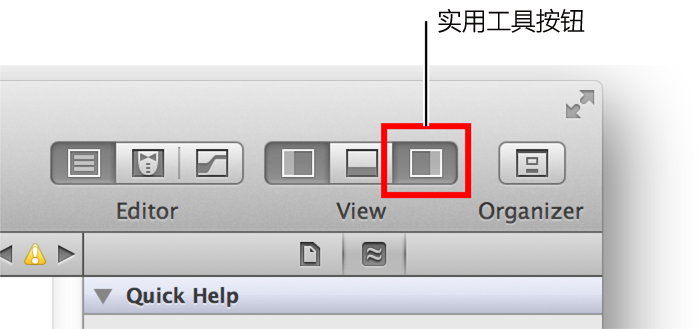
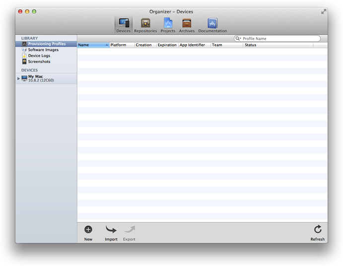
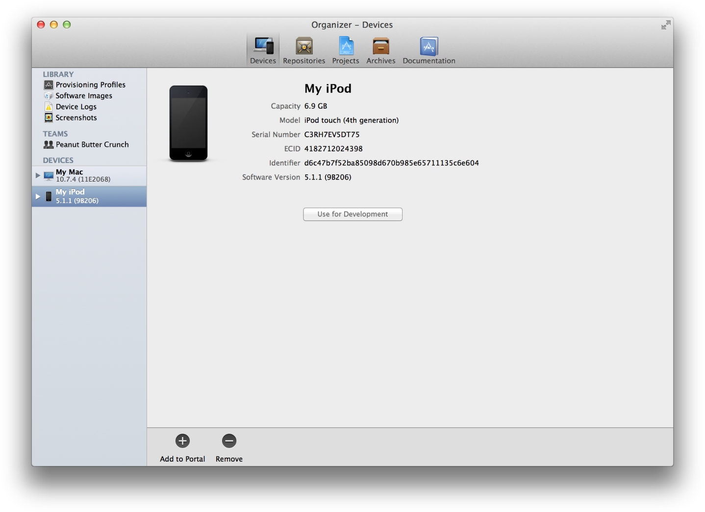
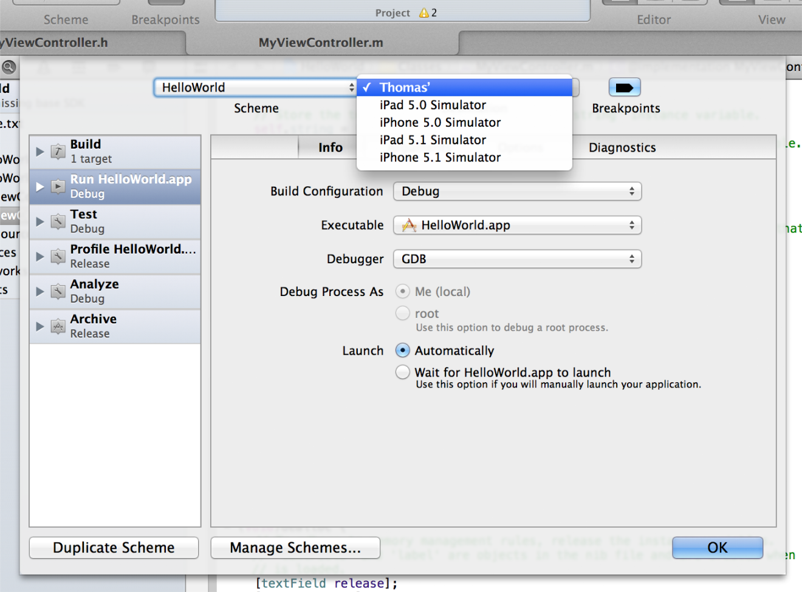
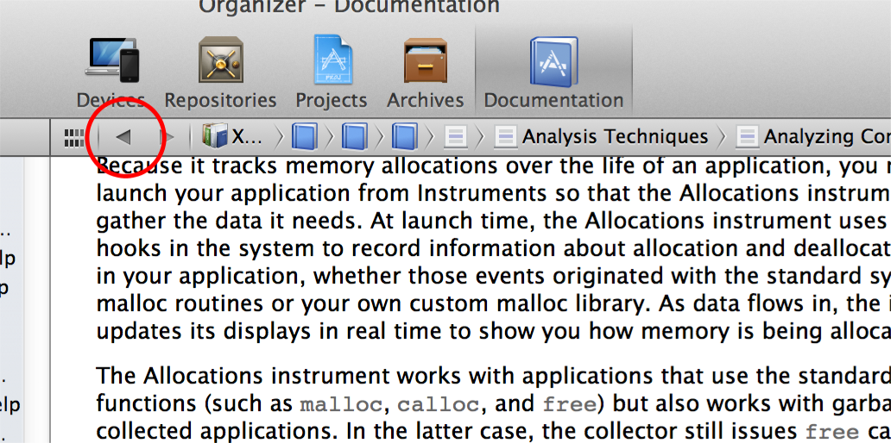
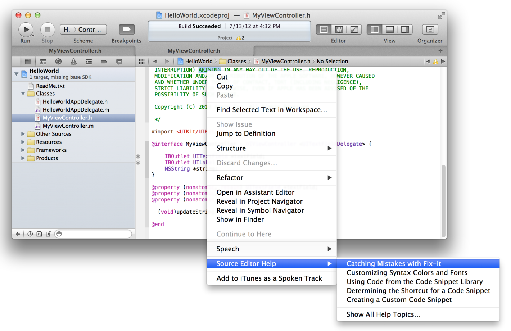
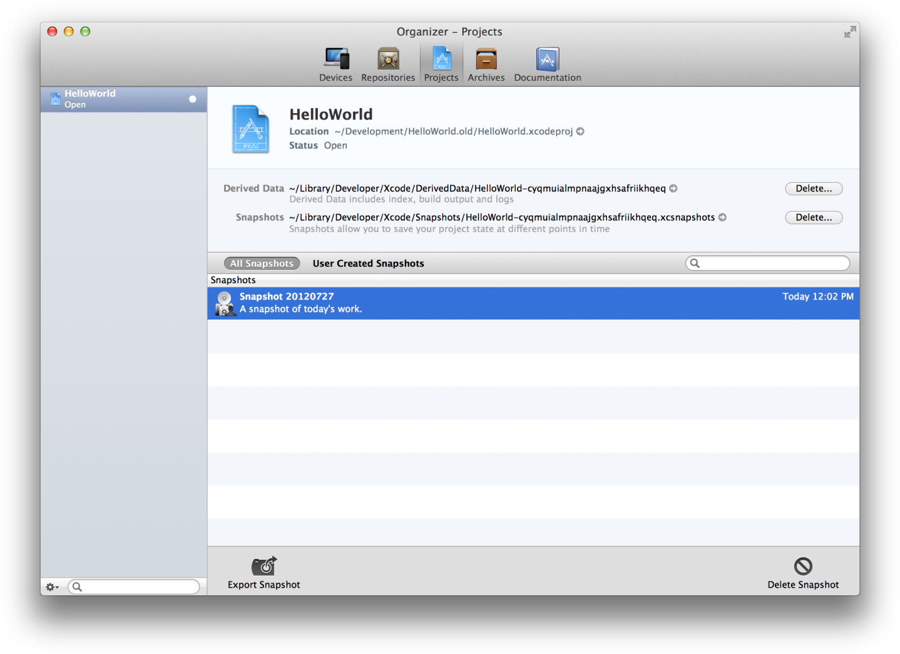

> 导航：[总目录](../../../README.md) · [referencelibrary](../../../_indexes/referencelibrary.md) · [马上着手开发 iOS 应用程序 (Start Developing iOS Apps Today) (弃用的文稿)](%E6%96%87%E7%A8%BF%E4%BF%AE%E8%AE%A2%E5%8E%86%E5%8F%B2%E8%AE%B0%E5%BD%95.md)

 [返回“工具”](https://developer.apple.com/library/archive/referencelibrary/GettingStarted/RoadMapiOSCh-Legacy/chapters/Tools.html) ! ! !

# 在 Xcode 中管理工作流程

正如在“__您的首个 iOS 应用程序__”教程中看到的，主要的工作流程任务都在 Xcode 工作区窗口中执行。而辅助任务会在单独的管理器窗口中执行，如阅读文稿、启用设备进行测试，以及准备应用程序用于提交到 App Store。

工作区窗口具有导航器区域、编辑器区域和实用工具区域。在“您的首个 iOS 应用程序”中，使用了导航器区域来选择要编辑的文件，使用编辑器区域来编辑源文件并设计用户界面组件，同时还在实用工具区域中，设定了标签文本和按钮标题。

您可以通过隐藏导航器、编辑器和实用工具区域中的一个或多个来自定工作区。在“您的首个 iOS 应用程序”中，您使用了工具栏中的“View”选择器，来隐藏和显示实用工具区域。隐藏实用工具区域，可让您查看较大的编辑器区域，而显示实用工具区域，可让您检查和选择各种对象属性。

您还可以采用其他方式自定工作区，例如用类似 Safari 的标签，在工作区窗口使用多个，而又有特定工作流程的布局。例如，您可以使用一个标签查看头文件，另一个标签查看实现文件。

在标签中查看源代码文件

1. 在项目导航器中，选择 HelloWorldViewController.h，以在源代码编辑器中，显示头文件。
2. 选取“View”>“Show Tab Bar”。
3. 选取“File”>“New”>“Tab”。
4. 在项目编辑器中，选择 HelloWorldViewController.m，以在标签式源代码编辑器窗口中，显示实现文件。
5. 点按这些标签，在源文件之间切换。
6. 要移走标签，请将指针移到标签，并点按其关闭框。
7. 通过选取“View”>“Hide Tab Bar”，您可以隐藏标签栏。

您还可以创建多个工作区窗口。每个标签或工作区窗口，都可以相互独立自定。

在多个窗口中查看源代码文件

1. 在项目导航器中，选择 HelloWorldViewController.h，以在源代码编辑器中，显示头文件。
2. 选取“File”>“New”>“Window”打开一个新工作区窗口。
3. 在项目编辑器中，选择 HelloWorldViewController.m，以在新窗口中，显示实现文件。
4. 例如，通过“View”选择器显示和隐藏实用工具区域，自定任一窗口。

测试或调试应用程序，可在 Mac 上的 iOS Simulator 中进行。使用 iOS Simulator，您可以确保应用程序按预期方式运行。

Xcode 内建调试环境。在应用程序运行时，调试导航器会显示堆栈踪迹。调试时，您可以将其展开或收缩来显示或隐藏堆栈结构。随着逐步运行，您可以锁定单个线程，并跟踪该特定线程的执行。

在 Xcode 调试器中运行应用程序

1. 在 HelloWorld 项目的项目导航器中，选择 HelloWorldViewController.m，以在源代码编辑器中显示文件。
2. 找到语句 `self.label.text = greeting;}`。
3. 点按此语句左边的边槽，插入断点。

   出现一个蓝色的断点指示器。

   
4. 点按工具栏中的“Run”按钮，生成 HelloWorld，并在 iOS Simulator 中运行它。
5. 将 `World` 键入文本栏，然后点按“Done”按钮来关闭键盘。
6. 点按“Hello”按钮。

   断点导致 HelloWorld 停止执行。工作区窗口移到前台，其中调试区域在编辑器区域底部打开。调试区域显示局部变量及其当前值。要去掉该断点，请点按它，并将它拖出边槽。

尽管您可以在 iOS Simulator 中测试应用程序的基本行为，但还应该在连接到 Mac 的设备上运行它。这些设备提供终极测试环境，您可以在此环境中，观察应用程序的表现，就像它将在客户的设备上表现的那样。进行此类测试是必要的，因为 iOS Simulator 没有运行在设备上运行的所有线程。理想情况下，您应该在所有您想要支持的设备和 iOS 版本上，进行应用程序的测试。

如果您加入了 iOS Developer Program，您可以立即使用 Xcode 在设备上开始运行、测试和调试应用程序。（本路线图前面的__设置__部分，包含了有关加入此计划成为 iOS 开发者的信息。）

您必须从 Apple 获得开发证书，方可在设备上运行您的应用程序。证书作为签名之用，而应用程序必须经过加密签名，才能在设备上运行。您可通过 Xcode 管理器窗口获得此证书。

在 Xcode 中获取开发证书

1. 选取“Window”>“Organizer”。
2. 点按“Devices”。
3. 选择“Library”下方的“Provisioning Profiles”。
4. 点按窗口底部的“Refresh”按钮。
5. 输入您的 Apple 开发者用户名称和密码，然后点按“Log in”。

   登录帐户后，会出现一则提示，询问 Xcode 是否应该请求开发证书。
6. 点按“Submit Request”按钮。

   开发证书会添加到钥匙串中，稍后还会添加到 iOS 团队预置描述文件中。可能还会出现另一则提示，询问 Xcode 是否应该请求分发证书，以后将应用程序提交到 App Store 时，需要此证书。如果适用，再次点按“Submit Request”按钮。

   
7. 刷新过程结束时，会出现一个对话框，询问您是否想导出开发者描述文件。点按“Export”。

   立即导出所创建的开发者描述文件和其他证书。如果稍后您想要继续在其他 Mac 上开发应用程序，就需要将这些证书导入到新的电脑上。

要在一个设备上运行应用程序，您还必须在该设备上安装相关的预置描述文件。此预置描述文件可识别您（通过您的开发证书）和设备（通过列出其唯一设备标识符），让该设备能够运行您的应用程序。

在 Xcode 中预备设备

1. 将设备连接到 Mac。
2. 打开“Devices”管理器。
3. 在“Devices”下方选择该设备。
4. 点按“Use for Development”按钮。

   

   首次将一个设备 ID 添加到您的帐户时，Xcode 会创建 iOS 团队预置描述文件（使用 Xcode 通配符 App ID、开发证书和设备 ID）。iOS 团队预置描述文件也要安装在您的设备上。

开发证书和预置描述文件就位后，设备就可运行您的应用程序了。程序运行过程中，您还可以使用 Xcode 的工具进行调试和性能分析。

在连接的设备上开启应用程序

1. 在项目的 Xcode 工作区窗口中，选取“Product”>“Edit Scheme”，打开方案编辑器。
2. 从“Destination”弹出式菜单中选择设备。

   将带有有效预置描述文件的设备连接到 Mac 时，设备名称和其运行的 iOS 版本，会整体作为一个选项出现在“Destination”弹出式菜单中。

   
3. 点按“OK”关闭方案编辑器。
4. 点按“Run”按钮。

   如果出现一则提示，询问代码签名工具是否可以使用钥匙串中的密钥，对应用程序进行签名，请点按“Allow”或“Always Allow”。

在应用程序开发过程中，您会在 Xcode 中执行众多操作。Xcode 提供工作流程关联型的帮助，如果需要与任务有关的帮助，您可以从 Xcode 用户界面直接访问。此类帮助包含易于遵循的步骤、视频或屏幕快照以及简明描述，有助您快速投入工作。

查看 Xcode 帮助

1. 在 HelloWorld 项目中，从项目导航器选择 HelloWorldViewController.h，以在源代码编辑器中显示头文件。
2. 如果您正在 Xcode 的“Documentation”管理器中阅读本文稿，请找到其“Go Back”按钮。在执行其余步骤后，您需要点按它返回本文稿。

   
3. 按住 Control 键，点按源代码编辑器中的任意位置。

   一个关联菜单会打开，其中“Source Editor Help”是最后一项。
4. 选取“Source Editor Help”，显示常见源代码编辑器任务列表。

   
5. 选取“Source Editor Help”>“Catching Mistakes with Fix-it”，可在“Documentation”管理器中查看帮助文章。
6. 点按缩略图图像可播放教学视频。

要确保软件提供最佳用户体验，请从 Xcode 启动 Instruments 来分析应用程序在 iOS Simulator 或设备上运行时的性能。Instruments 会从运行的应用程序收集数据，并将此类数据呈现在图形时间线中。

您可以收集有关应用程序的内存使用、磁盘活动、网络活动和图形性能的数据，以及其他测量数据。通过统一查看数据，您可以分析应用程序性能的不同方面，以找出可以改进的地方。您可以使应用程序用户界面元素的测试自动化。您还可以对应用程序在不同时间的行为进行比较，以确定您的修改是否提高了应用程序的性能。

开始分析应用程序的性能

1. 从 Xcode 中的 HelloWorld 项目，选取“Product”>“Perform Action”>“Profile Without Building”。
2. 在左栏的 iOS Simulator 下方，点按“All”，查看可用的跟踪模板。
3. 选择“Leaks”模板，并点按“Profile”。

   Instruments 应用程序会随运行 HelloWorld 的 iOS Simulator 一起启动。
4. 在 HelloWorld 文本栏中键入您的姓名，点按“Done”按钮关闭键盘，然后点按“Hello”。
5. 选取“iOS Simulator”>“Quit iOS Simulator”，停止记录性能数据。
6. 在 Instruments 面板中，点按“Allocations”来检查 HelloWorld 项目的内存分配。

   例如，跟踪面板将内存分配发生点绘制成图形，让您查看整个程序的内存分配状况。（跟踪面板中的尖峰点，标示出潜在的瓶颈；您可以通过预先分出某些内存块，或者降低其他内存块的响应速度，来进行改善。）

Xcode 快照能够轻易地恢复项目（甚至已删除的项目），可轻松解决因代码更改而出错的问题。快照将项目的当前状态存储在磁盘上，用于以后可能的恢复。Xcode 中的“Projects”管理器会列出快照。

您可以随时根据需要手动创建快照，并且可以将 Xcode 设定为在某些情况下自动创建快照，如在每次生成或每次执行“查找和替换”操作之前。

创建和恢复项目的快照

1. 在 HelloWorld 项目打开时，选取“File”>“Create Snapshot”。
2. 在提供的栏中，键入名称和描述。
3. 点按“Create Snapshot”。
4. 要查看快照，请选取“Window”>“Organizer”来显示管理器窗口。
5. 点按“Projects”按钮。

   您应该会看到所有快照的一个列表。

源代码控制管理 (SCM) 可让您跟踪修改，精细程度比快照所允许的更细。（对于团队合作开发，源代码控制管理还可帮助协调工作。）SCM 系统将每个文件的多个版本存储在磁盘上，并且将文件的各个版本的相关元数据储存在 SCM 存储库中。

Xcode 支持两种流行的 SCM 系统：Git 和 Subversion。Xcode 包含版本编辑器，可以轻松地比较任一系统库存的各个文件版本。如果您发现在代码中引入了错误，可以比较文件的最新版本和较早版本（正常运行）之间的更改，有助您追查出错源头。

利用 Xcode，您可在发布前轻松地跟测试员共享应用程序，也使 App Store 的发布工作变得容易。您可使用方案编辑器在 Xcode 创建应用程序的归档，从而开始分发过程。接着可以使用 Xcode 中的“Archives”管理器，与他人共享应用程序，以进行测试。

准备好发布应用程序时，您可使用“Archives”管理器，执行 App Store 发布所需的基本验证测试（这些测试获得通过，可加快应用程序的审批）。接着即可将应用程序直接从 Xcode 发布到 App Store。

您将在本路线图后面的“__准备提交到 App Store__”文章中，学习更多有关分发和发布应用程序的知识。

[返回“工具”](https://developer.apple.com/library/archive/referencelibrary/GettingStarted/RoadMapiOSCh-Legacy/chapters/Tools.html) ! ! !
