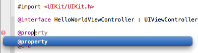

> 导航：[总目录](../../../README.md) · [referencelibrary](../../../_indexes/referencelibrary.md) · [马上着手开发 iOS 应用程序 (Start Developing iOS Apps Today) (弃用的文稿)](%E6%96%87%E7%A8%BF%E4%BF%AE%E8%AE%A2%E5%8E%86%E5%8F%B2%E8%AE%B0%E5%BD%95.md)


[下一页](%E6%8E%92%E9%99%A4%E6%95%85%E9%9A%9C%E5%92%8C%E6%A3%80%E6%9F%A5%E4%BB%A3%E7%A0%81.md)[上一页](%E9%85%8D%E7%BD%AE%E8%A7%86%E5%9B%BE.md) 

# 实施视图控制器

实施视图控制器包括这几部分：为用户姓名添加属性，实施 `changeGreeting:` 方法，确保用户轻按“Done”时键盘消失。

您需要为保存用户姓名的字符串添加属性声明，这样您的代码就总能引用该字符串。因为此属性必须是公共的，即对客户端和子类为可见，所以须将此声明添加到视图控制器的头文件，即 `HelloWorldViewController.h`。公共属性表示您打算如何使用这一类的对象。

__属性声明__是一个指令，它告诉编译器如何为变量（例如用来保存用户姓名的变量）生成存取方法。（添加属性声明后，您将了解到有关存取方法的信息。）

到此为止，不需要对串联图文件做出任何进一步的修改。要腾出更多空间以按照以下步骤来添加代码，请再次点按“Utilities View”按钮来隐藏实用工具区域（或者选取“View”>“Utilities”>“Hide Utilities”）。

为用户姓名添加属性声明

1. 在项目导航器中，选择 `HelloWorldViewController.h`。
2. 在 `@end` 语句前，为字符串编写一个 `@property` 语句。

   属性声明应该是这样的：

```objc
@property (copy, nonatomic) NSString *userName;
```

   可以拷贝和粘贴以上代码，也可以在编辑器面板中键入以上代码。如果您决定键入代码，请注意 Xcode 会根据键入内容提供自动补齐的建议。例如，开始键入 `@prop...`Xcode 猜测您想要键入 `@property`，因此会在内联建议面板中显示这样一个符号（如下图所示）：

   

   如果建议合适（如上述示例所示），则按下 Return 键接受建议。

   随着您继续键入，Xcode 可能提供一个建议列表供您选取。例如随着您键入 `NSStr...`，Xcode 可能显示如下补齐列表：

   

   Xcode 显示补齐列表时，按下 Return 键以接受高亮显示的建议。如果高亮显示的建议不正确（如上图所示列表），可使用箭头键从列表中选择合适的项目。

编译器自动为您声明的任何属性合成存取方法。__存取方法__是一种获取或设定一个对象的属性的值的方法（因此，存取方法有时也称为“getter”和“setter”）。例如，编译器为刚刚声明的 `userName` 属性生成以下的 getter 和 setter 声明及其实现：

- `- (NSString *)userName;`
- `- (void)setUserName:(NSString *)newUserName;`

编译器也自动声明专有实例变量以支持每一个经声明的属性。例如，编译器声明名为 `_userName` 的实例变量以支持 `userName` 属性。

在上一章“配置视图”中，您已配置了“Hello”按钮，因此在用户轻按该按钮时，它发送 `changeGreeting:` 消息给视图控制器。作为响应，您想要视图控制器将用户在文本栏中输入的文本显示在标签中。具体来说，`changeGreeting:` 方法应该：

- 从文本栏取回字符串，并将视图控制器的 `userName` 属性设定为此字符串。
- 基于 `userName` 属性，创建新的字符串，并将其显示在标签中。

实施 changeGreeting: 方法

1. 如有需要，在项目导航器中选择 `HelloWorldViewController.m`。

   您可能需要滚动到文件的末尾才能看到 `changeGreeting:` 存根实现，它是 Xcode 为您添加的。
2. 添加以下代码来完成 `changeGreeting:` 方法的存根实现：

```objc
- (IBAction)changeGreeting:(id)sender {

    self.userName = self.textField.text;

    NSString *nameString = self.userName;
    if ([nameString length] == 0) {
        nameString = @"World";
    }
    NSString *greeting = [[NSString alloc] initWithFormat:@"Hello, %@!", nameString];
    self.label.text = greeting;
}
```

`changeGreeting:` 方法中有几项有趣的事值得注意：

- `self.userName = self.textField.text;` 从文本栏取回文本，并将视图控制器的 `userName` 属性设定为该结果。

  在本教程中，您不会在其他任何地方用得上那个保存着用户姓名的字符串，但重要的是您要记住它的角色：这正是视图控制器所管理的非常简单的模型对象。一般情况下，控制器应在它自己的模型对象中维护应用程序数据的相关信息。换句话说，应用程序数据不应储存在用户界面元素（例如 HelloWorld 应用程序的文本栏）中。
- `NSString *nameString = self.userName;` 创建一个新的变量（为 `NSString` 类型）并将其设为视图控制器的 `userName` 属性。
- `@"World"` 是一个字符串常量，用 `NSString` 的实例表示。如果用户运行应用程序但不输入任何文本（即 `[nameString length] == 0`），`nameString` 将包含字符串“World”。
- `initWithFormat:` 方法是由 Foundation 框架提供给您的。它创建一个新的字符串，按您提供的格式字符串所规定的格式（很像 ANSI C 库中的 `printf` 函数）。

  在格式字符串中，`%@` 充当字符串对象的占位符。此格式字符串的双引号中的所有其他字符都将如实显示在屏幕上。

如果生成并运行应用程序，在点按按钮时应该会看到标签显示“Hello, World!”。如果您选择文本栏并开始在键盘上键入，您会发现完成文本输入后，仍然无法让键盘消失。

在 iOS 应用程序中，允许文本输入的元素成为第一响应器时，键盘会自动出现；元素失去第一响应器状态时，键盘会自动消失。（前面提到过第一响应器是第一个接收各种事件通知的对象，例如轻按文本栏来调出键盘。）虽然无法从应用程序直接将消息发送给键盘，但是可以通过切换文本输入 UI 元素的第一响应器状态这种间接方式，使键盘出现或消失。

`UITextFieldDelegate` 协议是由 UIKit 框架定义的，它包括 `textFieldShouldReturn:` 方法，当用户轻按“Return”按钮（不管该按钮的实际名称是什么）时，文本栏调用该方法。因为您已经将视图控制器设定为文本栏的委托（在[“设定文本栏的委托”](%E9%85%8D%E7%BD%AE%E8%A7%86%E5%9B%BE.md#apple-f4xwc4dqnrsv64tfmyxwi33df52wszbpkridimbqgezdmnryfvkfanbqgaytemzsgmwugsbxfvjvomjs)中），可以实施该方法，通过发送 `resignFirstResponder` 消息强制文本栏失去第一响应器状态，以该方法的副作用使键盘消失。

将 HelloWorldViewController 配置为文本栏的委托

1. 如有需要，在项目导航器中选择 `HelloWorldViewController.m`。
2. 在 `HelloWorldViewController.m` 文件中实施 `textFieldShouldReturn:` 方法。

   此方法应该指示文本栏放弃第一响应器的状态。实现结果应该是这样的：

```objc
- (BOOL)textFieldShouldReturn:(UITextField *)theTextField {
    if (theTextField == self.textField) {
        [theTextField resignFirstResponder];
    }
    return YES;
}
```

   在本应用程序中，没有必要真正测试 `theTextField == self.textField` 表达式，因为只有一个文本栏。但这是一个很好的模式，因为有些场合您的对象可能是不只一个同类对象的委托，所以可能有需要对它们加以区分。
3. 在项目导航器中选择 `HelloWorldViewController.h`。
4. 在 `@interface` 行的末尾，添加 `<UITextFieldDelegate>`。

   您的接口声明应如下图所示：

```objc
@interface HelloWorldViewController :UIViewController <UITextFieldDelegate>
…
```

   此声明指定 `HelloWorldViewController` 类采用 `UITextFieldDelegate` 协议。

生成并运行应用程序。这一次，一切的表现都应该如您所期望的那样。在 Simulator 中，输入您的姓名后，点按“Done”按钮使键盘消失，然后点按“Hello”按钮将“Hello, __您的姓名__!”显示在标签中。

如果应用程序的表现不是您所期望的，则需要进行故障排除。对于某些要检查的区域，请参阅“排除故障和检查代码”。

既然您已完成了视图控制器的实施，您的首个 iOS 应用程序也就圆满完成了。恭喜您！

返回《__马上着手开发 iOS 应用程序__》以继续学习有关 iOS 应用程序开发的内容。如果应用程序未能正确工作，请尝试下一章中描述的解决问题的方法，然后再返回《__马上着手开发 iOS 应用程序__》。

[下一页](%E6%8E%92%E9%99%A4%E6%95%85%E9%9A%9C%E5%92%8C%E6%A3%80%E6%9F%A5%E4%BB%A3%E7%A0%81.md)[上一页](%E9%85%8D%E7%BD%AE%E8%A7%86%E5%9B%BE.md)
