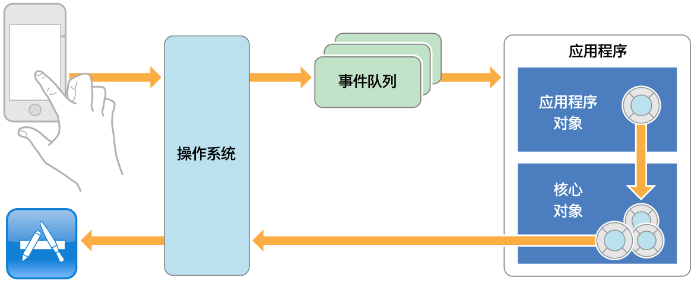
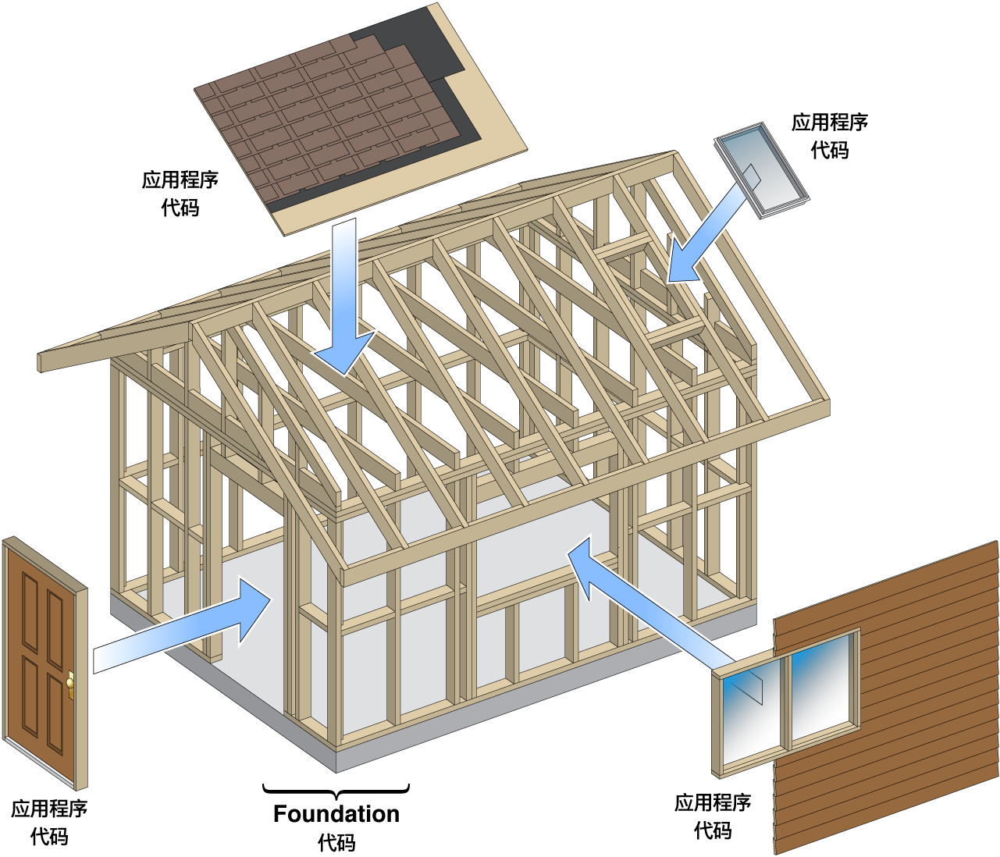
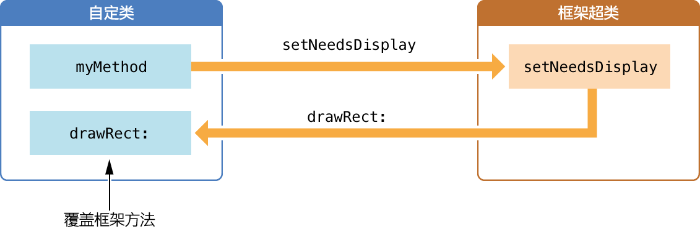
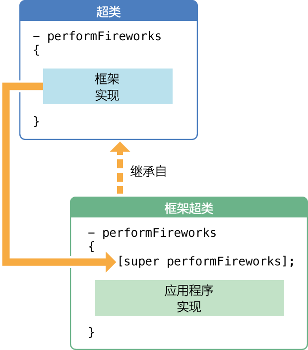

> 导航：[总目录](../../../README.md) · [referencelibrary](../../../_indexes/referencelibrary.md) · [马上着手开发 iOS 应用程序 (Start Developing iOS Apps Today) (弃用的文稿)](%E6%96%87%E7%A8%BF%E4%BF%AE%E8%AE%A2%E5%8E%86%E5%8F%B2%E8%AE%B0%E5%BD%95.md)

 [返回“框架”](https://developer.apple.com/library/archive/referencelibrary/GettingStarted/RoadMapiOSCh-Legacy/chapters/Frameworks.html) ! ! !

# 将代码与框架整合

您为 iOS 或 OS X 开发应用程序时，不会是完全孤立的。您将沿用 Apple 和其他人的劳动成果，沿用他们在 Objective-C 框架中开发和收集的类。框架是运行时可供多个进程共享的类资源库；它包含支持采用该资源库进行软件开发的资源。Cocoa 和 Cocoa Touch 框架，为您提供了一组相互依赖的类，它们共同工作，以构成应用程序的一部分（通常是相当重要的一部分）。

针对您要编写的程序，您可以按需从一个 C 函数库中选用函数，并确定何时调用它们。另一方面，框架会将某种设计强加于您的程序，或至少强加于您的程序要尝试解决的某个问题空间。使用面向对象的框架时，可以调用框架中的类的方法，来执行程序的大部分工作，就和过程化程序中一样。但是，您也还需要定制泛型框架行为，并通过实施一些方法，让框架在适当时候调用这些方法，对框架行为进行调整，以满足您的需要。这些方法作为钩子 (hook)，将您的代码引入到框架所施加的结构中，增加了能使您的应用程序特征化的行为。

以下部分探索框架代码和应用程序代码之间的关系。

通过考虑应用程序启动时会发生什么，可以一窥您编写的代码和框架代码之间的关系。基本上，应用程序建立一组核心对象，然后将控制权移交给这些对象。随着程序的运行，越来越多的对象会被创建，但是程序最初所需的，却只是足以处理初始任务的结构（即足够的核心对象网络）。有两个主要任务：

- 绘制应用程序的初始用户界面。
- 处理用户与该用户界面互动时收到的事件。

初始用户界面显示在屏幕上之后，应用程序由外部事件驱动。最重要的外部事件源自用户（例如轻触按钮）。操作系统将这些事件及其相关信息一起报告给应用程序。该应用程序（由您的代码和框架代码组成）处理事件，并相应地更新用户界面。

应用程序获取事件，并作出响应（通常是通过绘制部分用户界面），然后等待下一个事件。应用程序不断获取事件，一个接一个，只要用户或其他源（例如计时器）发起事件。从应用程序启动到终止，它所做的几乎所有事情，都是由用户的操作，以事件的形式来驱动。

获取事件和对事件做出响应的机制，就是__主要事件循环__。在应用程序的一组核心对象中，有一个对象（即全局应用程序对象）负责管理主要事件循环。它获取事件，将事件分派给该对象或能最好地处理事件的对象，然后获取下一个事件。下图说明了 iOS 中 Cocoa Touch 应用的主要事件循环。

Cocoa 和 Cocoa Touch 框架不光是将提供各自服务的各个类混杂在一起的杂物袋。这些面向对象的框架是类的集合，每个类构建一个问题空间，并提供完整的解决方案。框架提供的不是根据需要可以使用的离散服务（如函数库），而是制订并实现整个应用程序的结构，您编写的代码则必须适应该结构。因为此应用程序结构是通用的，您可以使其特殊化，以满足特定应用的要求。与其说是设计一个程序，并插入资源库函数，不如说是将应用程序代码，插入到框架提供的设计中。

要使用框架，您必须接受它定义的应用程序结构，然后根据需要，尽可能多的使用和定制它的类，将特定的应用进行改造，以适合该结构。框架中的类相互依赖构成一个整体，并不是单个的。乍一看，在应用程序中要求您的代码适应框架的结构，似乎有限制性。事实刚好相反。框架为您提供了很多方式，来修改和扩展其通用行为。它只要求您接受这样的观点，所有应用都以同样的基本方式来运行，因为这些应用全部基于同样的结构。从广义的隐喻层面而言，Objective-C 框架就像房屋的框架，而应用程序代码就好比大门、窗户、壁板和其他元素，是这些东西让房子与众不同。

从使用框架和将代码与框架整合的观点看，有两种总的类：

- __现成的。__一些类定义了现成对象，也就是可以随时使用的对象。您只需要创建类的实例，然后根据需要使用这些实例。
- __通用的（或泛型）。__对于泛型框架类，您可以（在有些情况下__必须__）创建它们的子类，并覆盖某些方法的实现。通过对它们进行子类化，将代码引入到应用程序结构中。框架会在适当的时刻，调用子类的方法。

将泛型框架类子类化，是将程序特定的代码，整合到框架所提供的结构中的主要技巧。但这并不是唯一技巧，而且在很多情况下，也不是首选的技巧。在后面的文章中，您将会学习到 Cocoa Touch 和 Cocoa 框架，也包括架构和机制，二者都基于设计模式，可以实现框架对象和自定对象间的更大合作与协调。

创建子类时，需要做出两个基本决定：决定从哪个类（超类）继承和要覆盖该类的哪个方法。下面的部分探索做出这些决定的来龙去脉。

框架（如 UIKit）定义的结构，因为是泛型结构，可供很多类型的应用程序共享。因为结构是泛型的，所以有一些框架类是抽象的或有意不完整的，这也不足为奇。这样的类通常实现大量的常见代码，但却让工作的重要部分，要么未完成，要么以安全的默认方式完成。

将特定于应用的行为，添加到框架的主要方式，就是创建其中一个框架类的自定子类。子类填补了其超类中的这些空隙，提供了框架类所缺少的部分。自定子类的实例，占据其在框架所定义的对象网络中的位置，也继承框架与其他对象合作的能力。要让应用程序做任何有用的事情，它必须创建至少一个子类，大多数情况下需要创建很多子类。

下面的讨论探索有关子类化的一些决定和策略，并说明一些总的要求。该讨论并没有详细介绍__如何__创建子类。《_The Objective-C Programming Language_》（Objective-C 程序设计语言）中的“Defining a Class”（定义类）描述了该技巧。

子类化是这样一个过程：重新使用现有的类并将其特殊化，以满足您的需要。有时候一个子类所需要做的，仅是覆盖单个继承的方法，并让该方法做一些与原来的行为稍微不同的事情。其他子类可能添加一个或两个属性到其超类中（作为实例变量），然后定义方法来访问并操作这些属性，将它们整合到超类行为。

子类化从确定子类来自哪个框架类开始。以下是供您参考的一些考虑因素：

- __了解框架。__您应该熟悉框架中的每个类的目的和功能。首先，阅读开发者资源库中框架的介绍，然后扫描框架的类的列表。可能存在着某个类，已经完成了您想要执行的操作。如果找到了一个类，可以完成__几乎__所有您想要执行的操作，您算走运了。该类很大可能会是您的自定类的超类。

  例如，创建“__您的首个 iOS 应用程序__”时，遇到了 `UIViewController` 和 UIKit 框架的其他类。要找出关于这些类的更多信息，可以执行以下操作：

  1. 在 Xcode 中，选取“Window”>“Organizer”。
  2. 点按工具栏中的“Documentation”按钮。
  3. 点按导航区域顶部的“Browse”，以浏览已经安装的开发者资源库。
  4. 点按最近浏览的 iOS 资源库（可能必须先登录 Apple Developer）。

     iOS Developer Library 打开在内容区域。
  5. 在文稿区域的文稿列表上的“Documents”过滤栏中，键入“UIKit Framework Reference”。

     现在，过滤后的列表只显示输入的文稿名称。
  6. 点按文稿名称，打开列出所有 UIKit 类和协议的页面。

  阅读介绍并点按列出的类或协议，以了解关于它的更多信息。
- __应该十分明确您要应用程序做什么__。这个忠告适用于应用程序整体，也适用于应用程序的特定部分。一些框架架构会施加它们自己的子类化要求。例如，如果应用程序是基于文稿的，则必须创建一个抽象的文稿类子类。
- __定义子类实例扮演的角色。__在开发 iOS 或 OS X 应用程序时，“模型－视图－控制器”设计模式用于为对象分配角色。视图对象出现在用户界面上；模型对象保存应用程序数据（并实施作用于该数据的算法）；控制器对象充当视图和模型对象之间的媒介。了解对象所扮演的角色，可以缩窄使用哪个超类的决定。例如，如果想要在 iOS 应用程序中自定绘制，可能必须创建 `UIView`（为 UIKit 框架中的基础视图类）的子类。

尽管子类化在为 iOS 和 OS X 应用程序编程中具有重要作用，但有时候不是解决问题的最佳方式。如果只想要为一个类添加一些便捷方法，您可能要创建类别，而不是子类。或者，要加入应用程序特定的行为，可以基于设计模式，使用框架中众多其他资源中的一种，例如委托。（“设计模式”文章的“采用设计模式使您的应用程序合理化”中描述了这些模式。）请记住，一些框架类不可以创建子类。参考文稿告诉您某一个框架类是否该用于创建子类。

您可以创建不重新实施任何超类方法的子类，例如该子类可能添加额外状态，并定义新的方法来访问状态及调用该超类的方法。但是，对于一些子类而言，主要任务便是实施一组特定的、由超类（或超类所采用的协议中）所声明的方法。重新实施继承的方法，称为__覆盖__该方法。

在框架类中定义的大多数方法，都属于完整实施；它们的存在是让您可以调用它们，以获取该类所提供的服务。您很少需要覆盖这些方法，也不应尝试这么做。您可以覆盖其他框架方法，但是很少有必要这么做。

然而，一些框架方法是用于被覆盖的；它们的存在是让您将程序特定的行为添加到框架。一般来说，由这些框架实施的方法，所做的工作对您的应用程序来说没有多大价值，甚至没有价值。要将内容赋予这些方法，应用程序必须根据自身要求实施这类方法。应用程序运行期间，框架在适当的时候调用这些方法。

在子类中覆盖的框架方法，一般不是要亲自调用的方法，至少不是直接的调用。只需要重新实施该方法，剩下的事情就交给框架处理。事实上，您越是编写应用程序特定版本的方法，在自己的代码中调用它的可能性就越小。一般来说，框架类会声明公共方法，以便作为开发者的您可以使用它们来执行以下两项操作中的一项：

- 调用它们，以使用该类提供的服务。
- 覆盖它们，以便将您的代码引入到框架定义的程序模型中。

有时候，一个方法同时归入这两个类别；在调用时提供有价值的服务，也可以加以策略性的覆盖。但是，在大多数情况下，如果方法可供调用，则它已经由框架完全定义，您就不需要再在代码中重新定义它。如果是需要在子类中重新实施的方法，框架会用它来执行特定的任务，因此，它会在适当的时候，自行调用该方法。下图描述两大类型的框架方法。

上图中，自定类 (`myMethod`) 的假设方法__调用__由框架实施的 `setNeedsDisplay:` 方法。框架做一些工作为绘制建立环境，然后调用框架声明的方法 `drawRect:`，该方法则由自定类__覆盖__，以执行实际的绘制。

覆盖一个方法不必是一项艰巨的任务。通过编写一两行代码，小心地重新实施一个方法，常常就可以对超类行为做出重大改变。

覆盖框架方法时，必须决定是否要替换继承的方法的行为，或者扩展或补充该行为。如果想要替换现有的行为，提供自己的方法实现即可；如果想要扩展该行为，调用超类实现__并__提供自己的代码即可。

通过发送消息（与调用方法的消息相同）到 `super` 来调用超类实现。通过将消息发送给 `super`，您就将该方法的超类代码插入到重新实现的调用点。举个例子，比如一个假设的 `Celebrate` 类，定义了一个称为 `performFireworks` 的方法。在框架于视图中绘画并播放烟火动画后，您想在视图显示一个横幅。下图说明在这种情况下调用 `super` 的方式：

因此，决定是否调用 `super`，基于您打算如何重新实施方法：

- 如果打算__补充__超类实现的行为，请调用 `super`。
- 如果打算__替换__超类实现的行为，就不要调用 `super`。

如果您要补充超类行为，另一个需要重点考虑的，是何时调用一个方法的超类实现。您可能想超类代码在执行您的代码前，就做好它的工作，反之亦然。

[返回“框架”](https://developer.apple.com/library/archive/referencelibrary/GettingStarted/RoadMapiOSCh-Legacy/chapters/Frameworks.html) ! ! !
