> 导航：[总目录](../../../README.md) · [referencelibrary](../../../_indexes/referencelibrary.md) · [马上着手开发 iOS 应用程序 (Start Developing iOS Apps Today) (弃用的文稿)](%E6%96%87%E7%A8%BF%E4%BF%AE%E8%AE%A2%E5%8E%86%E5%8F%B2%E8%AE%B0%E5%BD%95.md)


 
[返回“应用程序设计”](https://developer.apple.com/library/archive/referencelibrary/GettingStarted/RoadMapiOSCh-Legacy/chapters/ApplicationDesign.html) ! ! !

# 将您的应用程序国际化

App Store 中很多流行的应用程序有多种语言版本。虽然这些应用程序可能因为很多因素而变得流行，但是具有多种本地化版本，肯定是其中一个因素。越多的人可以理解并使用您的应用程序，潜在的买家也就越多。

若要让您的应用程序拥有多个语言版本，必须先将它国际化，然后将它本地化。国际化是整理本地化资源的一种技巧，以便应用程序在运行时，可以选择用户首选的资源集。本地化就是翻译应用程序所显示或读出（例如 VoiceOver）的文本。它还可以包括某个区域专用的额外图像和其他资源。（本地化也可以指将一组资源本地化为某个特定语言和区域设置——例如简体中文本地化。）

若要了解国际化的所有方面，请参阅“__国际化编程主题__”。

在本教程中，您将会使 HelloWorld 应用程序国际化，以便其支持两种本地化语言：英文和简体中文。接下来您会将以下文本本地化：

- 串联图中两种语言的文本
- 用户点按“Hello”按钮后，应用程序所构建和显示的字符串
- 显示给用户的应用程序名称

在本教程中，您还将修改用户界面并配置国际化的布局约束。

本教程不会教您如何将本地化资源（例如图像文件或声音文件）添加到项目。若要了解如何将本地化资源添加到项目，请阅读“__国际化编程主题__”中的相应章节。

当您选择简体中文作为首选语言，然后启动国际化的 HelloWorld 后，该应用程序外观应该是这样的：


“Base Internationalization”是 Xcode 4.5 推出的一项功能，使用该功能，本地化工程师（即翻译人员）不再需要为应用程序支持的每种语言修改串联图和 nib 文件。相反，一个应用程序只有一组串联图或 nib 文件会本地化为默认语言，这些串联图和 nib 文件称为 _Base Internationalization_。当您将本地化语言添加到某个应用程序时，Xcode 会生成一个包含所有文本的字符串文件，这些文本包含每个串联图或 nib 文件显示的文本，或者作为辅助功能标签或提示的文本。Xcode 会以串联图的名称命名该文件，文件的扩展名为 `strings`。因此，如果串联图的名称为 `MyStoryboard.storyboard`，所生成的字符串文件的名称就是 `MyStoryboard.strings`。

正如您将看到的，字符串文件将应用程序中的文本（值）与其他字符串（键）相关联。本地化工程师使用该键以帮助识别用户界面中的文本，然后翻译该文本。在“Base Internationalization”中构建应用程序的用户界面时，必须使用“Auto Layout”功能，以确保显示翻译字符串的对象，在其相邻视图更改时，适当地调整其相对位置和大小。

使用 Base Internationalization

1. 在 Xcode 中，选择 HelloWorld 项目，并显示“Info”面板。

   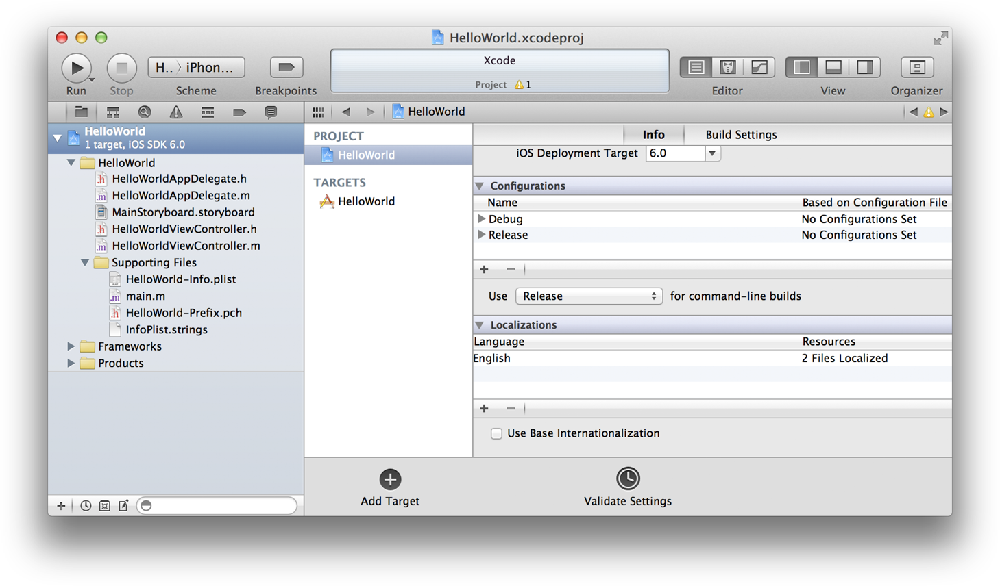
2. 选择“Localizations”表格下方的“Use Base Internationalization”选项。

   Xcode 显示一张表单，要求您选择要用于“Base Internationalization”的串联图。

   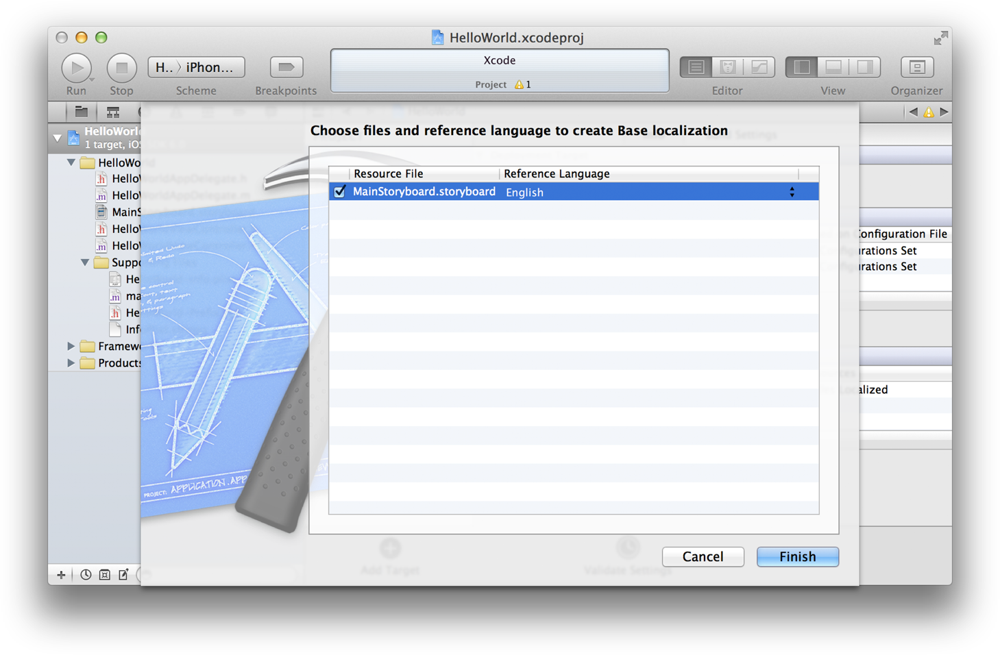
3. 请确定已选中 `MainStoryboard.storyboard`，并且参考语言为“English”。点按“Finish”按钮。
4. 在项目导航器中选择 `MainStoryboard.storyboard (Base)`。
5. 如果“Label”显示在标签对象中，请连按它以选择该文本，然后按下“Delete”。

   这最后一步是必须的，因为用户应该是看不到“标签”的，因此不需要翻译它。

创建 HelloWorld 时，Xcode 已自动将一个文件夹添加到了 Xcode 项目。此文件夹用于存放英文本地化的资源。稍后，当您请求某个“Base Internationalization”时，Xcode 会将另一个文件夹添加到项目。如果在 Finder 中查看项目文件，您将看到一个名为 `Base.lproj` 的文件夹和另一个名为 `en.lproj` 的文件夹（用于英文本地化）。第一个文件夹中的是串联图文件；第二个文件夹中的是 `InfoPlist.strings` 文件。（您将在[“将应用程序名称本地化”](#apple-f4xwc4dqnrsv64tfmyxwi33df52wszbpkridimbqgezdiobqfvbuqmrnknltcny)中了解有关 `InfoPlist.strings` 文件的更多信息。）英语是项目的默认语言。如果想要添加其他的本地化语言，您必须在 Xcode 中添加它们。

将某种本地化语言添加到项目

1. 选择项目设置的“Info”面板。

   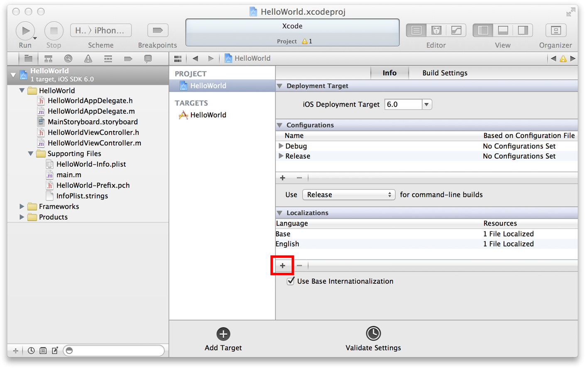
2. 点按“Localization”表格中的加号按钮 (+)，然后从弹出式菜单中选取简体中文。简体中文的语言 ID 标识为 `zh-Hans`。

   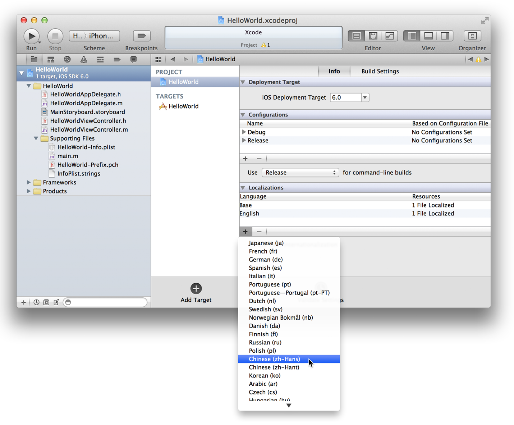
3. 在要求您选取文件和参考语言的表单中，请确定所有设置和选择都如下所描述。然后点按“Finish”按钮。

   

在完成此项任务后，Xcode 会更新该项目导航器，以显示新的本地化语言。点按 `MainStoryboard.storyboard` 旁边的展示三角形，以显示这些文件的基本（英文）和简体中文本地化。


在项目导航器中，您可能注意到有两种类型的字符串文件。当您添加一种本地化语言时，Xcode 生成两种字符串文件。第一种是来自“Base Internationalization”的字符串文件 (`MainStoryboard.strings`)。该字符串文件包含一个或多个键－值对，它们由 Xcode 从串联图文件找到的文本自动生成。第二种字符串文件，是 `InfoPlist.strings`，您使用该文件将用户可见的应用程序属性（例如其名称）本地化。该文件开始内容为空。您将在接下来的部分了解有关这两种字符串文件的更多信息。

如果要为简体中文本地化键入中文字，您需要一个合适的输入源，来输入这些字符。您在 OS X 的“系统偏好设置”中请求此输入源。

选择适合简体中文的输入源

1. 启动“系统偏好设置”应用程序，然后选择“语言与文本”。

   若要启动“系统偏好设置”，请从苹果菜单中选取“系统偏好设置”。（这不是 Xcode 的一项功能。）
2. 选取“输入源”视图。
3. 在输入源列表中，选择“中文 - 简体”。

   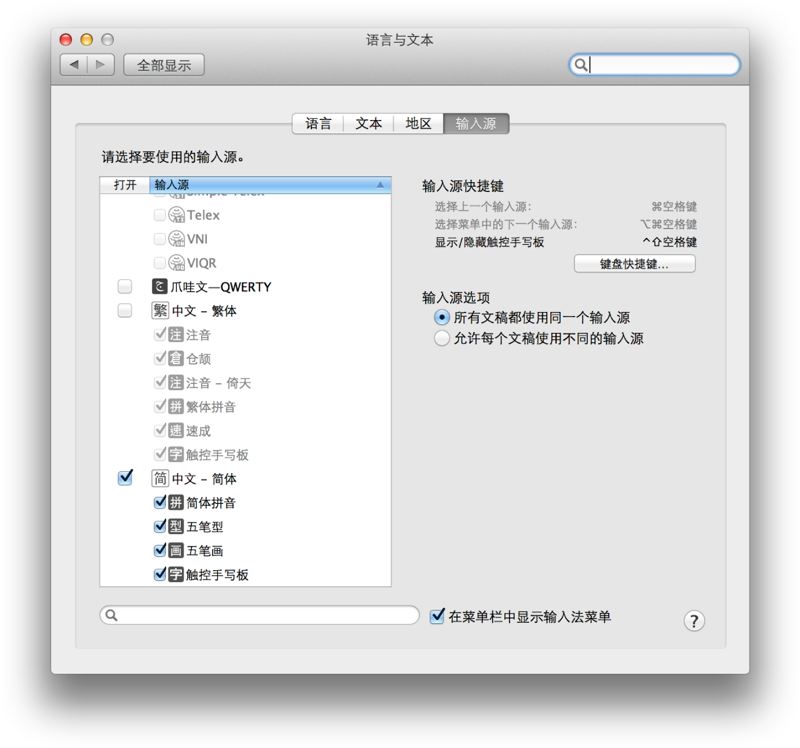
4. 请确定已选定“在菜单栏中显示输入法菜单”。

现在，您可以在菜单栏中选取一种简体中文输入源，以将其设为活跃的输入源。

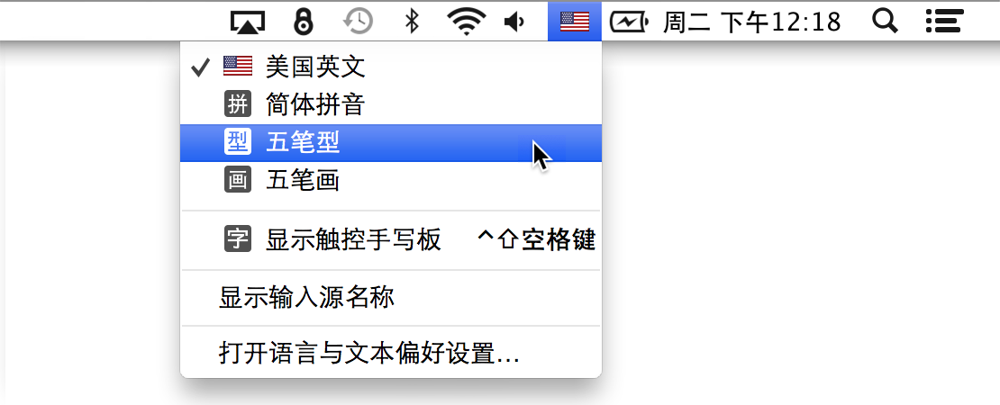

__字符串文件__包含文本项，这些文本项已本地化为特定语言，并与用作键的任何字符串相匹配。该文件的扩展名为 `strings`。当应用程序在设备上运行时，它会从用户首选语言所属的字符串文件中，找出并显示这些字符串。（当然，该应用程序必须支持该语言的本地化。）在 iOS 中，国际化使用三种不同类型的字符串文件：

- Xcode 从“Base-internationalization”串联图或 nib 文件自动生成的字符串文件
- 用于本地化用户可见属性的字符串文件，这些属性存在于应用程序的信息属性列表，如应用程序的显示名称
- 由应用程序代码所创建和显示的字符串的文件

以下部分描述了，将应用程序国际化时如何配置各种类型的字符串文件。

所有字符串文件中的条目，具有以下基本格式：

```
/* Comment to localizers */
"Key" = "Value";
```

该注释旨在通过澄清已本地化字符串的上下文，来帮助本地化工程师。注释（位于单独一行）之后是一个键、一个等号、一个值和一个表示终止的分号。值是一个总被引号括起来的字符串。键是通常被引号括起来的字符串，但也可以是声明为全局字符串的符号。

对于每种添加到应用程序项目的本地化语言，Xcode 从“Base-internationalization”串联图生成名为 _StoryboardName_`.strings` 的字符串文件，并将该文件写入该项目本地化语言（例如 `zh-Hans.lproj）`的文件夹。

检查简体中文的字符串文件

1. 在项目导航器中，点按展示三角形，以显示 `MainStoryboard.storyboard` 下方的项目。
2. 选择名称为 `MainStoryboard.strings (Chinese)` 的项目。

   该字符串文件的内容，会显示在项目编辑器中。

就 HelloWorld 应用程序而言，Xcode 从“Base Internationalization”生成以下字符串文件：

```
/* Class = "IBUITextField"; accessibilityHint = "Type your name"; ObjectID = "PzI-FE-QQF"; */ "PzI-FE-QQF.accessibilityHint" = "Type your name";  /* Class = "IBUITextField"; placeholder = "Your Name"; ObjectID = "PzI-FE-QQF"; */ "PzI-FE-QQF.placeholder" = "Your Name";  /* Class = "IBUIButton"; normalTitle = "Hello"; ObjectID = "fYK-eX-amY"; */ "fYK-eX-amY.normalTitle" = "Hello";
```

对于串联图中的每个字符串，Xcode 将文本显示对象标识符的键、句点 (`.`) 和指定给该字符串的属性连接起来。值（等号后面的字符串）是“Base Internationalization”串联图中的可见或可听字符串。本地化工程师会翻译这些字符串。（每个条目的注释，会重复此信息，但会添加 Xcode 已知的对象类。）如果用户的首选语言与“Base Internationalization”的语言不同，应用程序在运行时会将“Base-internationalization”串联图中的每个字符串，动态替换为当前本地化语言的 _StoryboardName_`.strings` 文件中相匹配的字符串。图 1-1 说明了此流程。

__图 1-1__  将“Base Internationalization”中的字符串本地化

 !将字符串本地化为简体中文

1. 从菜单栏中选取一种简体中文输入源。

   您可以使用中文键盘（如果有）。您也可以使用其他键盘（例如，“美国英文”键盘），但应该知道它的按键映射。

   如果拷贝下面示例中的中文字，并将它们粘贴到字符串文件中（或者如果将文本本地化为其他语言），您可以跳过此步骤。
2. 选择项目导航器中的 `MainStoryboard.strings (Chinese)` 文件，以在项目编辑器中显示该文件。
3. 将每个值字符串（即等号右边的字符串）翻译成简体中文。

   如果您要拷贝并粘贴中文，以下是可供拷贝的字符。
4. 存储该文件（“File”>“Save”）。

HelloWorld 用户界面十分简单，仅有一个串联图、一个场景和三个字符串。用户界面更为复杂的应用程序，含有许多带文本的视图，因此有许多字符串需要本地化。Xcode 使用嵌入键中的对象 ID，帮助您识别显示文本的视图。选择串联图中的视图（例如，“Hello”按钮），然后打开“Identity”检查器。在此检查器的“Document”部分，查找对象 ID，并将其与字符串文件中的对象 ID 相匹配。


`MainStoryboard.strings` 文件的中文本地化内容，现在看起来应该是这样的：

```
/* Class = "IBUITextField"; accessibilityHint = "Type your name"; ObjectID = "PzI-FE-QQF"; */ "PzI-FE-QQF.accessibilityHint" = "键入您的姓名";  /* Class = "IBUITextField"; placeholder = "Your Name"; ObjectID = "PzI-FE-QQF"; */ "PzI-FE-QQF.placeholder" = "您的姓名";  /* Class = "IBUIButton"; normalTitle = "Hello"; ObjectID = "fYK-eX-amY"; */ "fYK-eX-amY.normalTitle" = "您好";
```


将本地化语言添加到某个应用程序项目时，Xcode 在默认情况下，会创建一个名称为 `InfoPlist.strings` 的文件，并将其写入该文件系统的本地化文件夹（例如，`zh-Hans.lproj`）中。该文件（最开始内容为空）应该包含信息属性列表中用户可见的本地化字符串的键－值对；就 HelloWorld 应用程序而言，该属性列表在 `HelloWorld-Info.plist` 文件中。

最重要的用户可见属性，是应用程序的显示名称，现在您会将其本地化。`InfoPlist.strings` 文件中的键，是由框架声明的符号，可在信息属性列表中找到。

将应用程序名称本地化

1. 选择 HelloWorld 目标，然后选取“Info”视图。
2. 按住 Control 键，点按属性表格中的任何地方，然后从关联菜单中，选取“Show Raw Keys/Values”。

   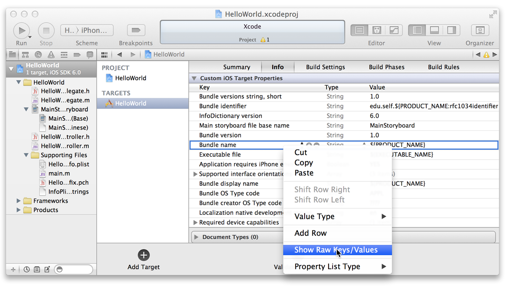
3. 找到属性 `CFBundleDisplayName`（它是表示某个应用程序的显示名称的 Core Foundation 符号）的位置。
4. 在项目导航器中，选择 `InfoPlist.strings` 文件，以在编辑器中显示该文件。

   该文件用于简体中文本地化。可以在“Identity”检查器的“Localization”部分，验证所选文件的本地化情况。

   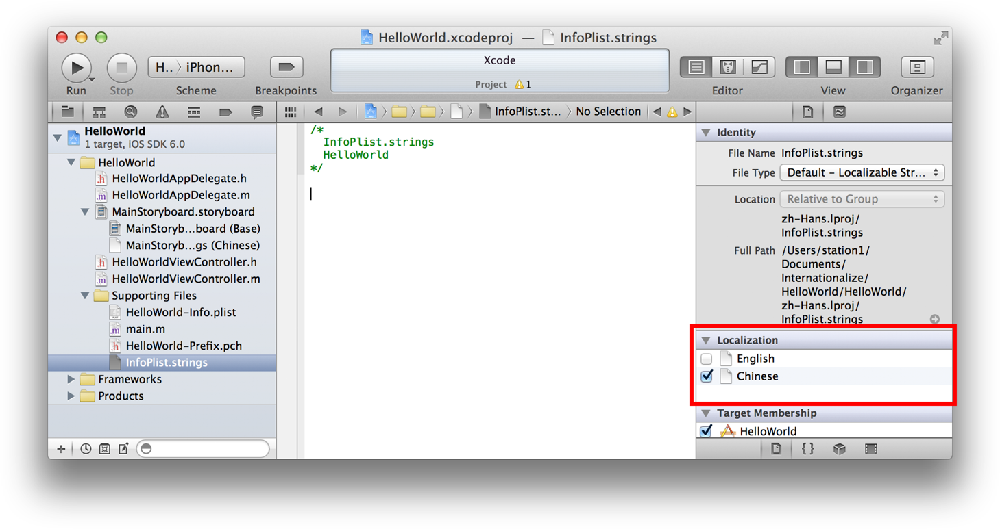
5. 在 `InfoPlist.strings` 文件中，键入以下代码行，然后从“File”菜单中，选取“Save”以存储该文件。

```
/* The name of the app displayed on the device*/
CFBundleDisplayName = "您好，世界";
```

   在本例中，可以不必给键加引号。

不需要为原始的英文本地化编辑 `InfoPlist.strings` 文件，因为信息属性列表中用户可见的属性已经是英文的。

应用程序的代码，经常在运行时创建和显示文本字符串。HelloWorld 项目的 `changeGreeting:` 方法，就是一个以编程方式生成文本的例子。

```objc
- (IBAction)changeGreeting:(id)sender {
    self.userName = self.textField.text;

    NSString *nameString = self.userName;
    if ([nameString length] == 0) {
        nameString = @"World";
    }
    NSString *greeting = [[NSString alloc] initWithFormat:@"Hello, %@", nameString]; // programmatically created
    self.label.text = greeting;
}
```

该方法从文本栏获取要显示的姓名，然后使用 `NSString` 类的 `initWithFormat:` 方法，将字符串“Hello, ”与该姓名连接起来。为了显示此文本，该方法将标签的 `text` 属性设定为构建的字符串。这里国际化的问题，在于必须将单词“Hello”翻译为该应用程序支持的每种本地化语言。为了将代码生成的字符串本地化，iOS 的国际化功能提供了字符串文件和 `NSLocalizedString` 宏。以下部分描述如何使用该文件和宏。

包含以编程方式显示的文本，其本地化字符串文件的惯用名称是 `Localizable.strings`。您将创建两个此类文件，一个用于英文，一个用于简体中文，然后将合适的键－值对添加到其中。

为每种本地化添加 Localizable.strings 文件

1. 在 Xcode 项目导航器中，选择“Supporting Files”文件夹。
2. 选取“File”>“New”>“File”。
3. 在“iOS”的“Resources”类别中，选择“Strings File”模板，然后点按“Next”按钮。

   
4. 在“Save As”栏中，给 `Localizable.strings` 文件重新命名，然后点按“Create”按钮。

   保持默认设置（例如，选定的目标）不变。
5. 选择项目导航器中的 `Localizable.strings`，然后点按“Identity”检查器中的“Make localized”按钮。

   
6. 在出现的确认对话框中，请确定已在下拉式菜单中选定“English”，然后点按“Localize”按钮。

   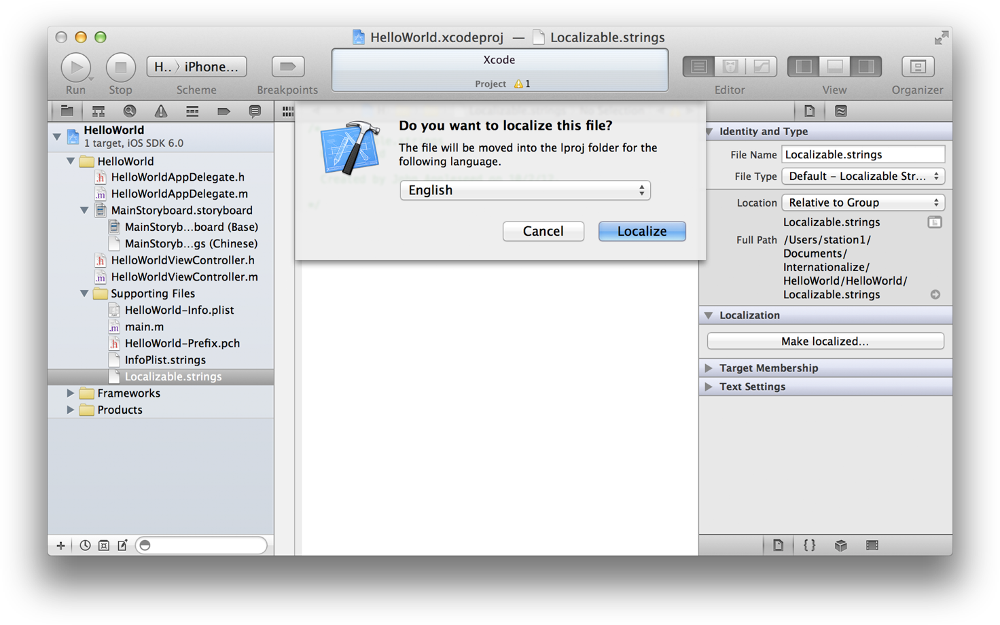

   此步骤完成后，“Make localized”按钮已由列出当前本地化语言的表格所替换。
7. 选择“Chinese”复选框，将 `Localizable.strings` 文件添加到简体中文本地化中。

现在，有了两种本地化语言的 `Localizable.strings` 文件，是时候将键－值对添加到其中了。

将“Hello”字符串本地化

1. 在项目导航器中，选择 `Localizable.strings (English)`。
2. 在编辑器中，键入以下文本：

```
/* The string displayed */
"HELLO" = "Hello, %@";
```

   为了帮助将左边的字符串 (“HELLO”) 识别为键，“Hello”为大写。
3. 在项目导航器中选择 `Localizable.strings (Chinese)`。
4. 在编辑器中，键入以下文本：

```
/* The string displayed */
"HELLO" = "您好，%@";
```


`NSLocalizedString` 宏从 `Localizable.strings` 文件获取当前本地化语言的本地化字符串。在 HelloWorld 应用程序中，您要以此宏替换文本 `@"Hello, %@"`。

请求代码中的本地化字符串

1. 在项目导航器中，选择 `HelloWorldViewController.m`。
2. 修改 `changeGreeting:` 方法中的以下语句：

```
NSString *greeting = [[NSString alloc] initWithFormat:@"Hello %@", nameString];
```

   使它看起来是这样的：

```
NSString *greeting = [[NSString alloc] initWithFormat:NSLocalizedString(@"HELLO", @"The string displayed"), nameString];
```

该宏中的第一个参数，采用字符串文件中的一个键，第二个参数采用给本地化工程师的注释。该宏会返回与用户首选语言相对应的本地化语言中键的值。您可能想知道此示例将给本地化工程师的注释作为该宏的参数的原因；毕竟，您已经在 `Localizable.strings` 文件中，为英文和中文写了一则注释。

大型应用程序项目，通常使用名称为 `genstrings` 的命令行程序，从该程序在代码中找到的信息生成一个字符串文件（默认情况下，该文件名称为 `Localizable.strings`）。该实用工具查找 `NSLocalizedString` 宏的每次调用，提取键（也是初始值）和注释，并将这些项目写入字符串文件。然后，您可以将该字符串文件，添加到项目中的每种本地化语言中，并翻译这些值。

恭喜您。您已经完成了将应用程序国际化，并本地化为简体中文。现在该开始测试该应用程序，以检查当简体中文为用户的首选语言时，该应用程序是否显示简体中文字符串。

测试应用程序的简体中文版本

1. 运行 iOS Simulator，启动 Settings 应用程序，选取简体中文作为首选语言。

   如果 iOS Simulator 正在运行 HelloWorld 或任何其他应用程序，点按主屏幕按钮。

   在 Settings 应用程序中，选取“General”>“International”>“Language”。然后点按示例中所描述表格中的行。点按“Done”按钮。

   
2. 在 Xcode 中，请确定“iPhone __版本号__ Simulator”是处于活跃状态的方案，然后点按“Run”按钮。

   Xcode 会在 iOS Simulator 中运行 HelloWorld 应用程序。它的外观应该是这样的：

   
3. 从菜单栏中，选取简体中文作为输入源，在文本栏中输入一些中文字，然后点按按钮。

   该应用程序应该显示“您好，__键入的文字__”。如果发现有未翻译为当前语言的任何字符串，请确定在字符串文件中翻译它们。
4. 从“Hardware”菜单中，选取“Rotate Left”或“Rotate Right”，以模拟方向的更改，并查看方向更改的结果。
5. 点按主屏幕按钮，以退出该应用程序，并在模拟的 iPhone 中，找到该应用程序。

   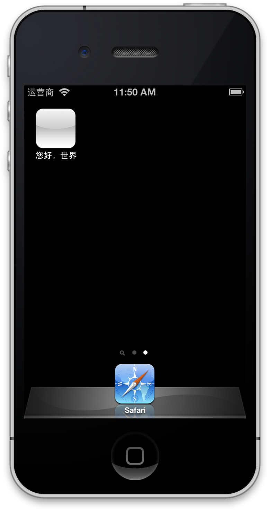

   您会注意到，该应用程序的名称已经本地化为简体中文。

当然，大多数商业应用程序显示的文本，要比 HelloWorld 多；它们也可能包括本地化的图像和其他资源。这些应用程序也可能含有多种本地化语言版本。对于每种本地化语言，您应该运行该应用程序，并前往每个显示文本的屏幕或对话框，以查看是否存在任何未本地化的字符串或资源。

如果已配置应用程序使用 VoiceOver，您也要检查该应用程序的辅助功能是否已正确本地化。您可以使用 iOS Simulator 内建的“Accessibility Inspector”来检查。有关“Accessibility Inspector”的更多信息，请参阅《_Accessibility Programming Guide for iOS_》（iOS 辅助功能编程指南）。

测试简体中文版的 HelloWorld 应用程序时，您模拟了方向的更改。该应用程序显示文本的方式，适合任何本地化语言。因为文本栏中的占位符文本和以编程方式显示在标签中的文本，在各自对象中居中显示（占据屏幕的宽度），无论方向如何，它们可以是任何合理的长度。并且，该按钮会调整自身的大小，以适合任何本地化字符串。

当然，像 HelloWorld 用户界面一样简单的应用程序很少（即对象在屏幕上居中显示，并且旁边没有别的对象）。用户界面文本的一个常见设计，就是标签后跟着一个文本栏。当本地化工程师把 _StoryboardName_`.strings` 文件中的标签文本翻译成特定的语言时，该标签应该调整自身的大小，以适合新文本。而该文本栏的宽度应该随之更改，以配合新的标签尺寸，如图 1-2 所示。

__图 1-2__  常见本地化模式中的自动布局

 !

在本教程的余下部分，您将了解一些有关 iOS 的自动布局系统，以及如何使用 Xcode 的“Auto Layout”工具，来指定用于应用程序国际化的布局规则的信息。之后，您将修改该用户界面，以拥有标签-文本栏设计，并对其进行配置，以拥有如图 1-2 所示的行为。

若要了解有关“Auto Layout”的更多信息，请参阅《_Cocoa Auto Layout Guide_》（Cocoa 自动布局指南）。

iOS 的自动布局系统，可让您定义应用程序视图布局的规则，以便当一个视图更改其尺寸或位置后，相邻的视图会适当地调整自己的尺寸和位置。“Auto Layout”是对设备摆放方向的更改作出响应的关键功能。它也是将应用程序国际化的关键功能，特别是使用“Base Internationalization”的时候。

使用“Auto Layout”时，您使用__布局约束__来描述您想应用程序如何为用户界面进行布局。在“__您的首个 iOS 应用程序__”中配置 HelloWorld 用户界面时，您接受了“Auto Layout”系统（符合 Aqua 指南）施加的自动约束，例如使用建议的对象间距，并使对象的前置或后置边缘固定到其父视图。串联图场景中，视图周围的蓝色布局细线表示自动约束。现在，您要检查这些约束。

检查布局约束

1. 在项目导航器中，选择 `MainStoryboard.storyboard` (Base Internationalization)。
2. 在 Hello World 视图控制器的大纲视图中，点按每个“Constraints”项旁边的展示三角形，以显示其内容。

   大纲视图应该是这样的：

   
3. 选择一种约束（例如“Horizontal Space - Label - View”），然后打开“Attributes”检查器。

   “Attributes”检查器显示有关该约束的如下信息：

   

   检查器中的值与该标签的父视图有关。选中“Standard”，意味着约束是自动的，换句话说，“Auto Layout”系统将根据 Aqua 指南布局对象。

   Xcode 也可让您查看与下面步骤中所描述的特定视图相关联的所有约束。
4. 选择该文本栏，然后选取“Size”检查器。

   除了显示约束外，“Size”检查器还会显示视图的“Content Hugging Priority”值和“Content Compression Resistance Priority”值。

   

您可以覆盖自动约束的设置，从而创建用户约束，但是没必要那么做。正如先前所述，HelloWorld 的简单用户界面适合本地化。该文本栏（及其占位符文本）和标签可在屏幕上扩展，从而可以容纳几乎任何长度的字符串。而且，“Hello”按钮会调整自己的大小，以适合每种本地化的标题，并在其父视图中保持居中。

现在您将修改 HelloWorld 的用户界面，以将标签和文本栏配对，这是应用程序中一种更为常见的用户界面设计。

更改 HelloWorld 应用程序的用户界面和布局约束

1. 选择该文本栏，在“Attributes”检查器中删除“Placeholder”栏中的 `Your Name`。
2. 调整该文本栏的宽度，以使其占据其父视图的右半部分。
3. 在“Utility”区域中打开对象库，并将一个标签对象拖到串联图场景上。

   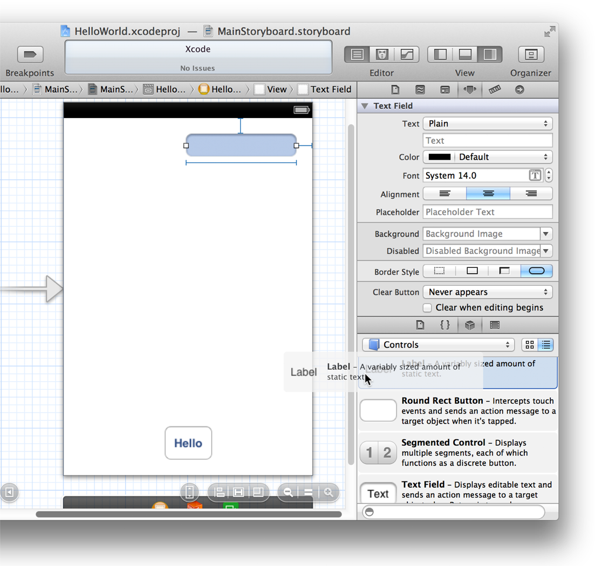
4. 选择该标签，然后点按“Attributes”检查器中的“Align Right”按钮。

   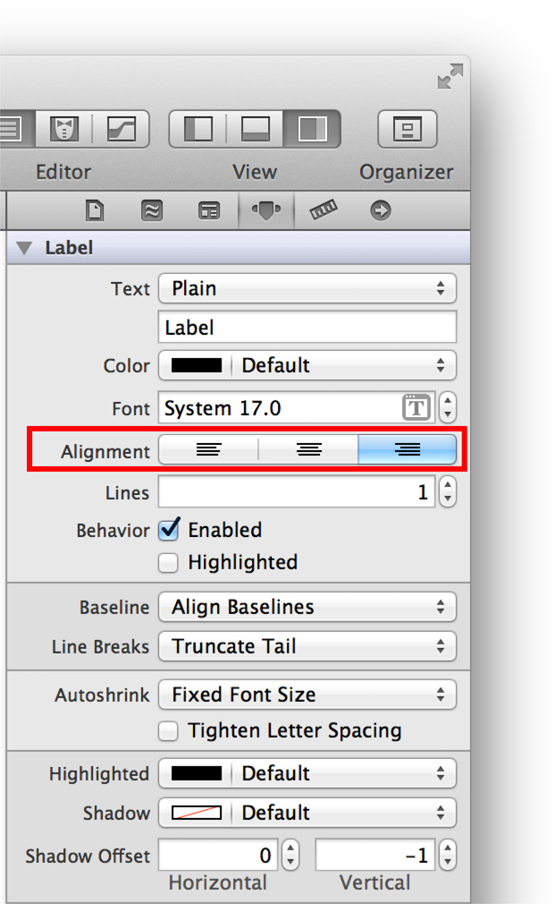
5. 选择该文本栏，然后点按“Align Left”按钮。
6. 连按该标签的默认文本 (`Label`)，以将其选中，然后使用 `Your Name:` 将其替换。
7. 调整标签和文本栏的位置和大小，以便该标签适合其文本，并且使自动约束（蓝色细线）能够生效。

   两个对象都选中后，现在用户界面应该是这样的：

   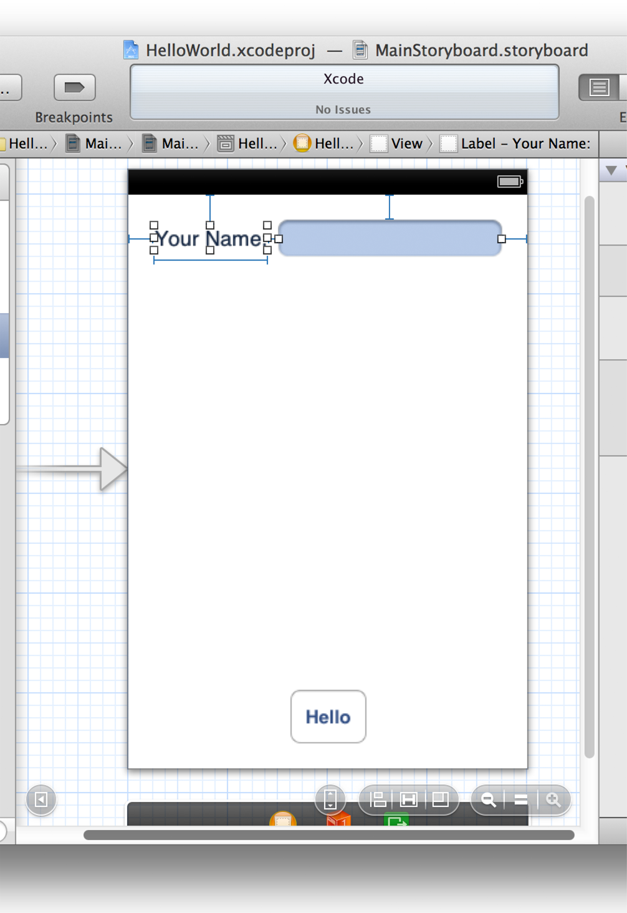
8. 选择新标签对象，在“Size”检查器中，将“Content Hugging Priority”的“Horizontal”值设为 1000。

   

   “Content Hugging Priority”告诉“Auto Layout”系统，相对其他视图来说，视图应该按其内容调整多少尺寸；就该标签而言，值 1000 实际上代表该标签应该总是调整其大小，以包含其字符串。因为该文本栏的“Content Hugging Priority”仍使用 250 的默认值，它是一个当标签宽度变更后也随之更改其宽度的对象。

现在已将标签-文本栏对国际化了。如果键入 `A Very Long Name` 作为标签文本，然后按下 Return 键，您会看到文本栏缩短自己的宽度，以容纳新标签值。您也可以运行这个程序的英文本地化版本和简体中文本地化版本，并观察各自行为的变化。

在刚完成的“Auto Layout”练习中，您将新文本显示对象（“Your Name”标签）添加到了 HelloWorld 用户界面。因此，现在中文 `MainStoryboard.strings` 文件与“Base Internationalization”(`MainStoryboard.storyboard`) 不同步。您可以使用命令行实用工具 `ibtool`，从“Base Internationalization”生成新字符串文件，然后将该新字符串文件条目添加到现有的 `MainStoryboard.strings` 文件。

将新用户界面对象与现有的中文 MainStoryboard.strings 文件合并

1. 启动“终端”应用程序。

   此应用程序位于“`/应用程序/实用工具`”中。
2. 在“终端”的“Shell”中，连接到项目文件夹的 `Base.lproj` 目录。

   例如：

```
cd /Users/UserName/Projects/HelloWorld/HelloWorld/Base.lproj
```
3. 在提示符后输入以下命令：

```
ibtool MainStoryboard.storyboard --generate-strings-file NewStuff.strings
```

   可以给输出文件命名随您选取的任何名称（本示例是用 `NewStuff.strings`）。
4. 在 Xcode 中，打开生成的输出文件，并将新字符串文件条目（即“Your Name：”标签的注释和键－值对）拷贝到中文 `MainStoryboard.strings` 文件。
5. 翻译新字符串值。

[返回“应用程序设计”](https://developer.apple.com/library/archive/referencelibrary/GettingStarted/RoadMapiOSCh-Legacy/chapters/ApplicationDesign.html) ! ! !
