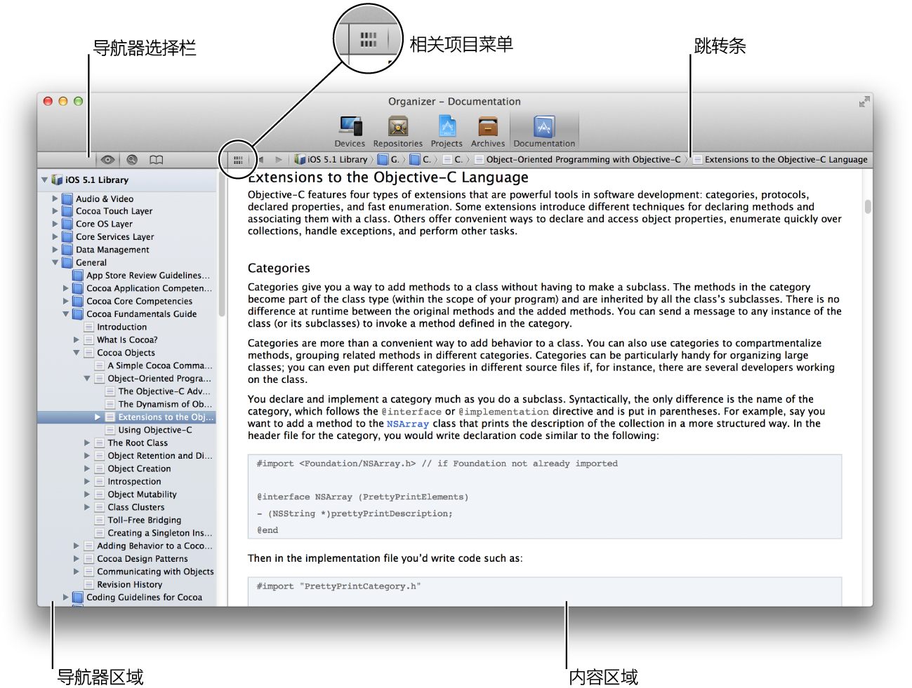
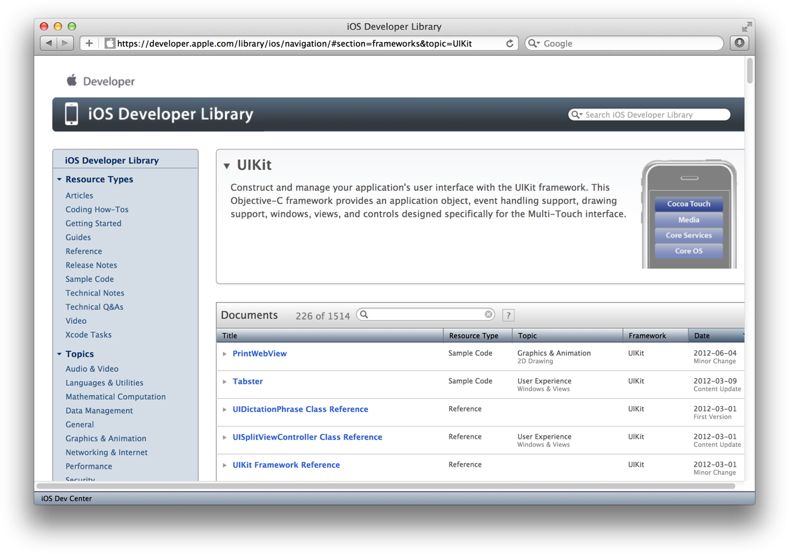
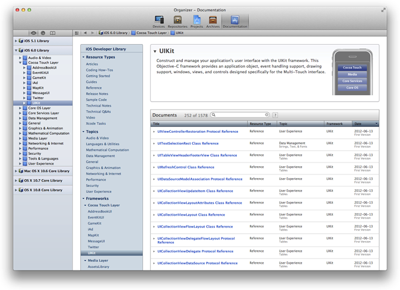
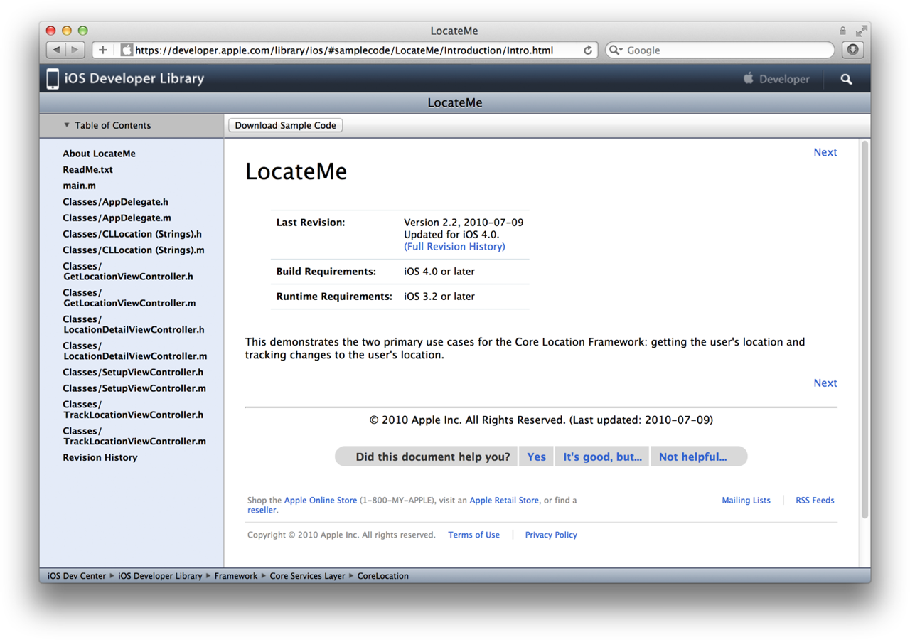
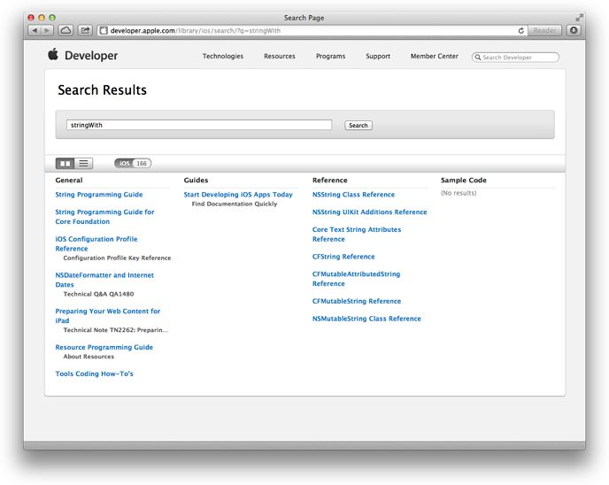
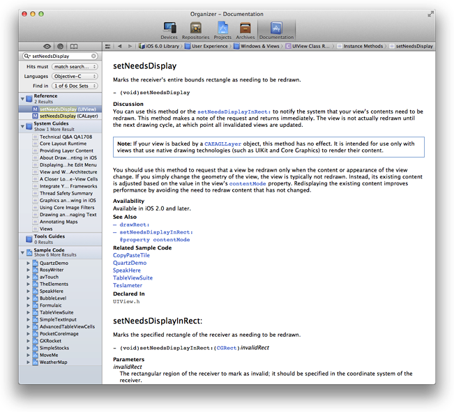
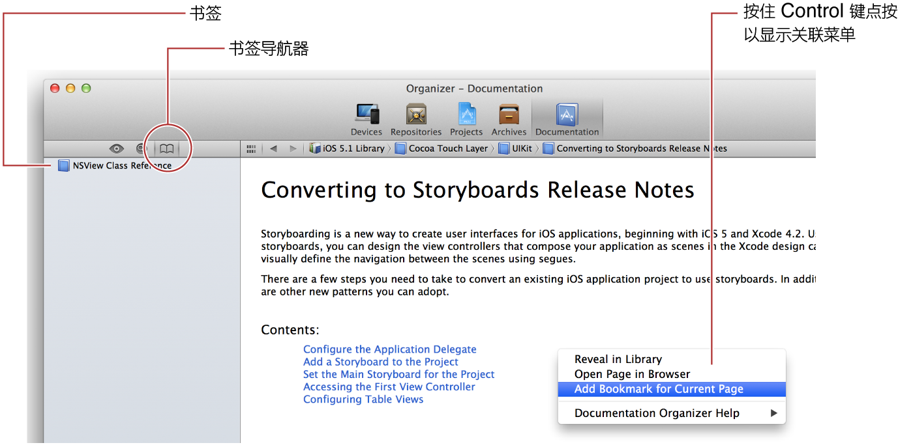
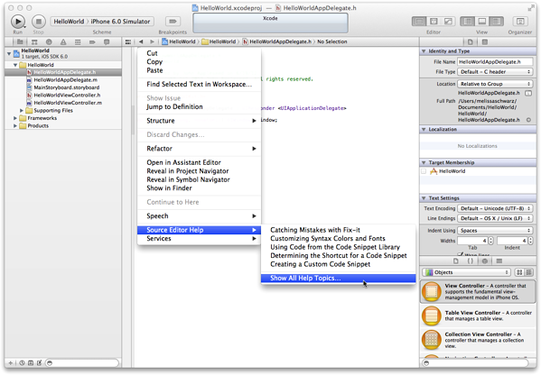
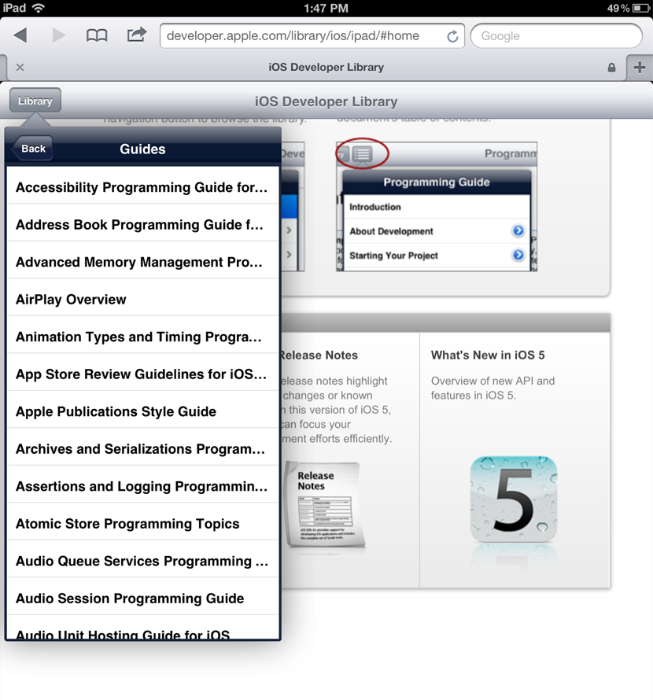
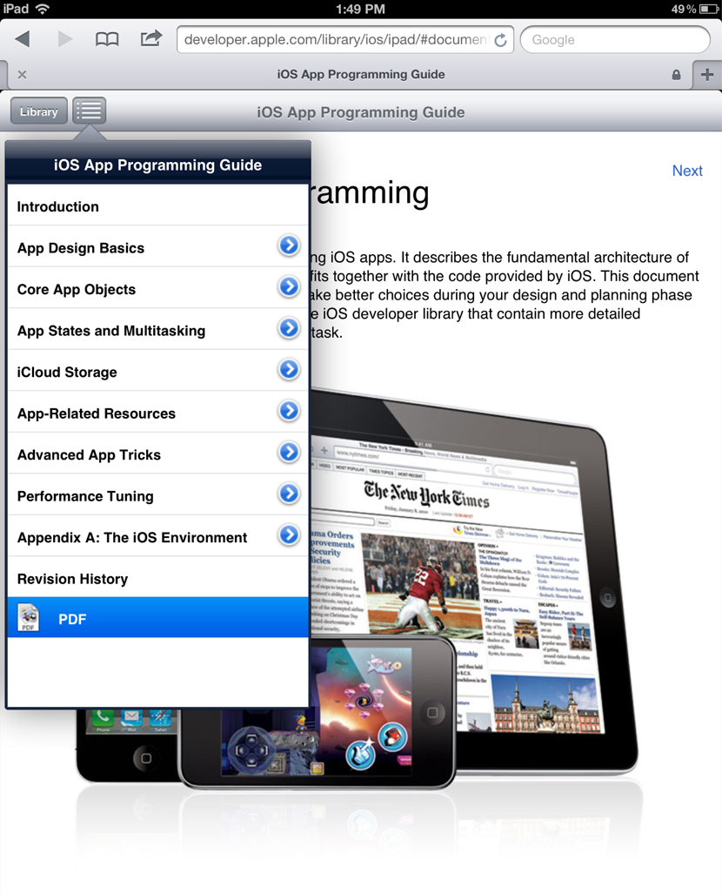

> 导航：[总目录](../../../README.md) · [referencelibrary](../../../_indexes/referencelibrary.md) · [马上着手开发 iOS 应用程序 (Start Developing iOS Apps Today) (弃用的文稿)](%E6%96%87%E7%A8%BF%E4%BF%AE%E8%AE%A2%E5%8E%86%E5%8F%B2%E8%AE%B0%E5%BD%95.md)

 [返回“查找信息”](https://developer.apple.com/library/archive/referencelibrary/GettingStarted/RoadMapiOSCh-Legacy/chapters/FindingInformation.html) ! ! !

# 快速查找文稿

Apple 提供文稿以帮助您成功生成并部署应用程序，包括示例代码、常见问题解答、技术说明、视频，以及概念性文稿和参考文稿。要获得最新和最准确的信息，请直接从 Apple 处获取您需要的文稿资源。安装了 Xcode，就可以访问这些资源。如果您更喜欢在 iPad 上使用浏览器或查阅 PDF 文件，可以查看网上的 iOS Developer Library。不管哪种方式，您都需要熟悉所提供的各种导航和搜索技巧。

Xcode 的“Documentation”管理器是一个功能完备的查看器，提供对开发者文稿的综合搜索和查阅。您可以使用“Documentation”管理器指定想要查阅的文稿集。

文稿集是一组与关键 Apple 技术有关的资源。每个集包含的资源，跟网上 iOS Developer Library 内的相同。默认情况下，Xcode 会自动安装并更新可用的文稿集。作为一名 iOS 开发者，您会发现这两个文稿集已经自动安装：

- iOS Developer Library，包含专用于编写 iOS 应用程序的文稿
- Xcode Developer Library，包含专用于使用 Xcode 作为开发环境的文稿

在 Xcode 中查看 iOS 文稿

1. 选取“Window”>“Organizer”，然后点按“Organizer”窗口中的“Documentation”。

   “Documentation”管理器出现，搜索导航器已启用。
2. 点按导航器选择栏中的浏览按钮 ()。

   已安装的开发者资源库会出现在文稿导航器中。
3. 选择“iOS Library”。

点按一个导航器按钮，以选取您想如何查找文稿：

-    浏览文稿层次。
-    搜索特定术语。
-    使用书签返回到查阅过的文稿。

选择文稿后，它会在内容区域中以 HTML 格式开启。如果文稿也有 PDF 格式，则可在相关项目菜单中选取它以打开 PDF 版本。

内容区域中的跳转条，可让您进一步探索文稿和文稿所在的资源库。在熟练使用跳转条后，不妨通过选取“Editor”>“Hide Navigator”来增大内容显示区域。

如果喜欢，您可以浏览网上的开发者资源库。例如，您可能想在 iPad 上或在未安装 Xcode 的电脑上阅读文稿。要访问 iOS Developer Library，请输入网址 `http://developer.apple.com/library/iOS`，或登录到 iOS Dev Center，然后点按 iOS Developer Library 链接。

您也可以查看网站上 PDF 格式的文稿。如果文稿有 PDF 版本，则当文稿显示时，其右上角会显示一个 PDF 按钮。点按该按钮，就会在浏览器中显示 PDF 文件，或者按住 Control 键并点按该按钮下载 PDF 文件。

Xcode 和 iOS Developer Library 网页界面为您提供了几种方式来导航和查找资源。您可以按资源类型、主题或框架查看文稿。资源类型包括指南（描述概念和任务）、参考文稿（包含 API 详细信息）、可供下载的示例代码，以及由 Apple 工程师讲解的视频演示。也有为某些技术提供逐步指导的教程。导航“Topics”部分按主题区域查找资源，例如主题“Audio & Video”、“Security”和“User Experience”。使用“Frameworks”部分以导航至专属框架的文稿，例如“UIKit”、“Foundation”和“Core Data”的相关文稿。

Xcode 和网上 iOS Developer Library 使用同样的用户界面来过滤文稿。在 Xcode 中，选择左栏的资源库可以看到和 iOS Developer Library 中相同的起点页面。然后，使用内容区域中的目录边栏来浏览资源库中的内容。

当您选择目录中的一项时，资源列表会显示在右侧的内容区域中。使用列标题将资源按标题、资源类型、主题、框架（如果适用）或上次修改日期排序。还可以使用文稿栏中的搜索栏来过滤列表。例如，如果想要查看所有有关 UIKit 的参考文稿，可从目录中的“Frameworks”类别中选择“UIKit”，然后将列表按资源类型进行排序。所有参考文稿首先出现，接着是示例代码。如果知道一项技术的名称，但不确定它在哪里，您可在目录中选择“iOS Library”标题以显示该开发者资源库中的所有文稿，然后在搜索栏中输入搜索字符串。

在资源库中，也可以轻松地查阅所有可用的示例代码。点按目录中的“Sample Code”（在“Resource Types”下面），然后使用栏标题和搜索栏，来过滤列表并对其排序。选择您有兴趣查阅的示例代码。如果您在 Xcode 中查阅示例，可以查阅所有 Xcode 项目文件，或者点按“Open Project”。如果您在 iOS Developer Library 中查阅示例，可以点按“Download Sample Code”。

搜索开发者文稿以找到符合当前需要的信息。

使用网上 iOS Developer Library 右上角的搜索栏，来查询整个资源库。搜索结果按资源类型分组。例如，如果在搜索栏中输入 `stringWith`，搜索结果会将《_String Programming Guide_》（String 编程指南）显示为最相关的指南，并将 _String_ 显示为示例代码项目。

在 Xcode 中，点按导航器选择栏中的搜索按钮 ()，以显示搜索导航器。搜索结果显示在导航器区域中，按资源类型（例如参考或指南）整理，并按相关性排序。

每个文稿都以文稿类型图标来标识。图标包括：

-   主题类别或概念文稿
-   API 参考文稿
-   示例代码项目
-   文稿页面或章节
-   帮助文章

参考文稿中 API 符号的搜索结果，会以符号类型图标作进一步标识，显示的内容中搜索词会高亮显示。

使用查找选项，以将结果限定为与您所需信息最相关的资源。点按放大镜图标，然后选取“Show Find Option”。使用“Match Type”菜单，来指定搜索词必须在搜出的文稿中出现至少一次。使用“Doc Sets”菜单，来选取文稿集的任意组合，以进行搜索。使用“Languages”菜单，来将搜索结果限定为特定一组程序设计语言的文稿。

可以直接从 Xcode 源代码编辑器中访问参考文稿。要打开源代码编辑器，请在导航区域选择一个源文件。源文件打开时，显示实用工具区域，点按其中的“Quick Help”检查器按钮。将插入点放在源代码编辑器中的 API 符号中，然后在检查器中查看文稿。

所显示的信息包括以下内容的链接：

- 该符号的完整参考文稿
- 符号声明所在的头文件
- 相关的编程指南
- 相关的示例代码

您还可以通过按住 Option 键，并点按源代码中的 API 符号，在弹出式窗口中查看有关该符号的简明参考信息。

在 Xcode 的“Documentation”管理器中添加书签，以轻松返回某个页面、文稿或类别。您可以给任何页面或文稿添加书签。

在书签导航器中管理您的书签。默认情况下，书签会按您添加它们的顺序来排列。您可以将书签拖移到列表中的新位置，以更改它的顺序。您可以通过选择书签并按下 Delete 键，以删除书签。指定给书签的名称是其相应 HTML 页面的标题。（您不能更改书签的名称。）

Apple 也提供了关于如何使用 Xcode 的文稿。要浏览 Xcode 的在线帮助，请选取“Help”>“Xcode Help”，此时“Documentation”管理器会转变成“Finding Help in Xcode”开始页面。点按“Xcode Application Help”，来查看按照主题整理的帮助手册列表。每份帮助手册包含的文章，逐步讲解如何在 Xcode 中执行常见操作。Xcode 帮助中的许多文章，还包括解释所描述任务的视频短片。点按视频缩略图可播放视频。

在整个 Xcode 中，也可以通过快捷菜单访问许多 Xcode 帮助文章。按住 Control 键，并点按 Xcode 中的任何一个主用户界面区域，查看该区域可用的帮助文章的列表。如果文章很多，菜单不能一一列出，请选取“Show All Help Topics”，以查看所有相关的帮助文章。

iPad 上的 Safari 有量身而设的界面供查看文稿。为节省屏幕空间，可以使用“Library”按钮（而不是目录）按照类型、主题或框架进行导航。

要在 iPad 上查看 PDF 文件，请选择想要阅读的文稿，轻按目录控制，然后轻按“PDF”。

如果未能在 Xcode 或 iOS Developer Library 中找到所需信息，可以将问题发布到 Apple 开发者论坛。登录到 iOS Dev Center 时，Apple 开发者论坛的链接出现在页面的底部。

[返回“查找信息”](https://developer.apple.com/library/archive/referencelibrary/GettingStarted/RoadMapiOSCh-Legacy/chapters/FindingInformation.html) ! ! !
