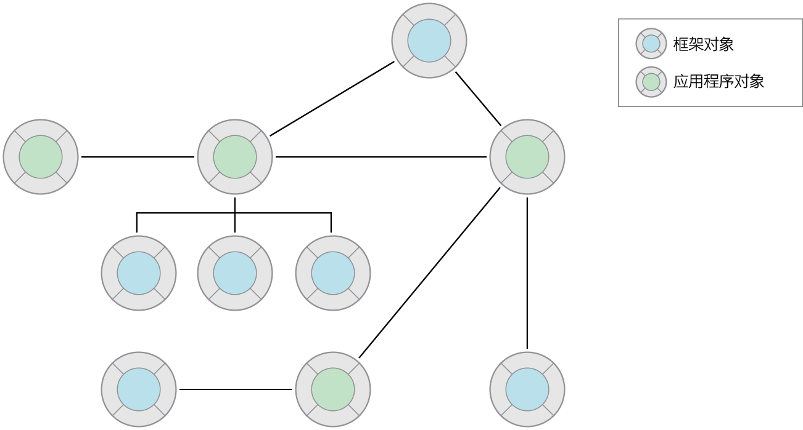
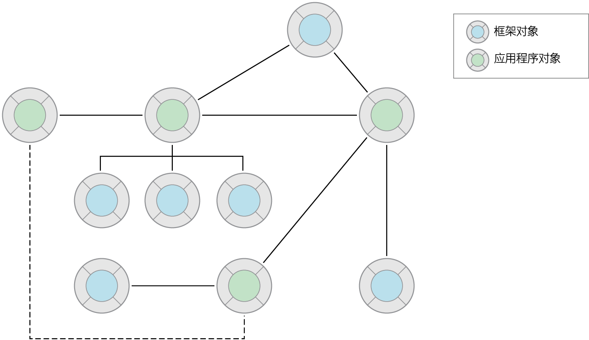
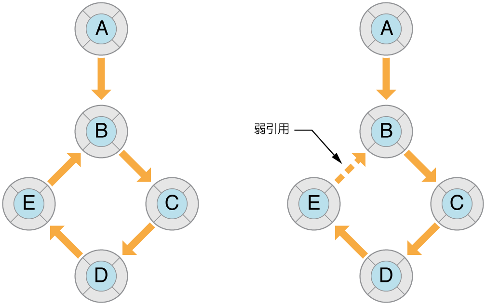
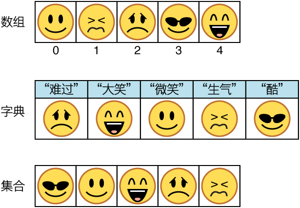

> 导航：[总目录](../../../README.md) · [referencelibrary](../../../_indexes/referencelibrary.md) · [马上着手开发 iOS 应用程序 (Start Developing iOS Apps Today) (弃用的文稿)](%E6%96%87%E7%A8%BF%E4%BF%AE%E8%AE%A2%E5%8E%86%E5%8F%B2%E8%AE%B0%E5%BD%95.md)


 
[返回“基本任务”](https://developer.apple.com/library/archive/referencelibrary/GettingStarted/RoadMapiOSCh-Legacy/chapters/BasicTasks.html) ! ! !

# 掌握基本的编程技能

Foundation 框架，顾名思义，是用于所有 iOS 和 OS X 编程的基础工具箱。您需要熟悉此工具箱，才能成功地在这些平台上开发。

Foundation 定义了几十个用途广泛的类和协议，其中有三种类和协议是极其基础的：

- __根类及相关协议。__根类 `NSObject` 及其同名协议指定了所有 Objective-C 对象的基本接口和行为。还有一些协议可以由类采用，以便客户端可以拷贝类的实例并对其状态进行编码。
- __值类。__值类产生的实例称为__值对象__，是一种面向对象的包装器 (wrapper)，用于基本的数据类型（如字符串、数字、日期或二进制数据）。同一值类的实例，如果具有相同的封装值，则视为是相等的。
- __集 (collection) 类。__集类的实例（称为__集__）管理一组的对象。区分特定集类型的关键，在于它让您如何使用所包含的对象。集 (collection) 中的项通常是值对象。

在 Objective-C 编程中，集与值对象极其重要，因为它们经常用作方法的参数和返回值。

在类层次中，根类不自其他类继承，而类层次中的所有其他类最终都是继承自根类的。`NSObject` 是 Objective-C 类层次中的根类。其他类从 `NSObject` 继承了 Objective-C 运行时系统的基本接口。这些类的实例从 `NSObject` 衍生出它们作为 Objective-C 对象的基本特性。

对于 `NSObject` 实例本身来说，除了是一个简单的对象外，没有其他实质作用。要给您的程序添加任何特定的属性和逻辑，您创建的一个或多个类，必须从 `NSObject` 继承，或者从任何其他直接或间接继承自 `NSObject` 的类来继承。

`NSObject` 采用 `NSObject` 协议，该协议声明的一些附加方法是所有对象的接口所共用的。此外，`NSObject.h`（该头文件包含 `NSObject` 的类定义）包含对 `NSCopying`、`NSMutableCopying` 和 `NSCoding` 协议的声明。当一个类采用这些协议时，它使用对象拷贝和对象编码功能来增加基本对象的行为。模型类（这些类的实例封装和管理应用程序的数据）经常采用对象拷贝和对象编码协议。

`NSObject` 类及相关协议定义的方法，用于创建对象、导航继承链、询问对象的特征和功能、比较对象、拷贝对象和对对象进行编码。本文章后面的章节描述了绝大多数这些任务的基本要求。

在运行时，每个应用程序都是一个由互相合作的对象组成的网络；这些对象相互通信以完成应用程序的工作。每个对象扮演一个角色，负责至少一项任务，并连接到起码一个另外的对象。（孤立的对象没有多少价值。）如下图所示，对象网络中的对象同时包含框架对象和应用程序对象。应用程序对象是自定子类的实例，通常属于框架超类。一个对象网络的通称为__对象图__。



您通过引用在对象之间建立这些连接或关系。引用有多种语言形式，其中包括实例变量、全局变量，甚至局部变量（在有限的范围内）。关系可以是一对一或一对多，可以表达主从关系或父子关系的概念。这些关系是一个对象访问其他对象、与其他对象通信或控制其他对象的一种手段。被引用的对象成为消息的自然接收者。

应用程序中对象之间的消息传递，对于应用程序的功能连贯性至关重要。就像管弦乐队中的音乐家，应用程序中的每个对象都各自有其角色和特定的行为表现，共同组成了一个应用程序。一个对象可能会显示椭圆表面对轻按操作作出响应，或者管理一组包含数据的对象，或者协调应用程序生命周期中的主要事件。但是为了实现它的作用，它必须能够与其他对象通信。它必须能够发送消息给应用程序中的其他对象，或者能够接收来自其他对象的消息。

对于强耦合对象（即通过直接引用建立相互连接的对象），发送消息轻而易举。但是对于松耦合对象（也就是说，在对象图中相隔很远），应用程序不得不寻找其他的通信方式。Cocoa Touch 和 Cocoa 框架具有许多机制和技巧，使得松耦合对象之间能够通信（正如下图所示）。这些机制和技巧，全部基于设计模式（您稍后将会学到更多内容），使得有效地构建稳固的和可扩展的应用程序成为可能。



创建对象时，您通常会先分配再初始化。尽管这是两个分离的步骤，但它们却是紧密相连的。很多类还可以让您通过调用一个类工厂方法来创建对象。

为了分配对象，您发送 `alloc` 消息给该对象的类，来获得该类的一个“原始”（未初始化）的实例。分配对象时，Objective-C 运行时会从应用程序的虚拟内存，为对象分配足够的内存。除分配内存以外，运行时在分配期间还做了一点别的事，例如将所有实例变量设定为零。

分配原始实例后，您必须立即对它初始化。初始化将一个对象的初始状态（即它的实例变量和属性）设定为合理的值，然后返回对象。初始化的目的在于返回有用的对象。

在框架中，您会发现很多称为__初始化程序__的方法，它们将对象初始化并且具有相似的格式。初始化程序为实例方法，它们以 `init` 开始，并返回一个类型为 `id` 的对象。根类 `NSObject` 声明 `init` 方法供其他所有类继承。其他类可以声明各自的初始化程序，各有专属的关键词和参数类型。例如，NSURL 类声明以下初始化程序：

```objc
- (id)initFileURLWithPath:(NSString *)path isDirectory:(BOOL)isDir
```

分配对象和将对象初始化时，您将分配调用嵌套在初始化调用内。以上面的初始化程序为例：

```
NSURL *aURL = [[NSURL alloc] initFileURLWithPath:NSTemporaryDirectory() isDirectory:YES];
```

作为一种安全的编程实践，您可以测试返回的对象以验证该对象已经创建。无论在哪个阶段发生对象不可创建的事情，初始化程序都会返回 `nil`。尽管 Objective-C 可让您发送消息到 `nil` 而不会有负面后果（例如，不会抛出异常），您的代码可能没有预期结果，因为它没有调用任何方法。您应该使用初始化程序返回的实例，而不是由 `alloc` 方法返回的实例。

您还可以通过调用类工厂方法来创建对象——类工厂方法是一种用于分配、初始化实例并返回一个它自己的实例的类方法。类工厂方法很方便，因为它们允许您只使用一个步骤（而不是两个步骤）就能创建对象。它们采用以下形式：

- `+ (`_type_`)`_className_`...`（在这里 _className_ 不包括任何前缀）

Objective-C 框架的某些类定义了类工厂方法，这些方法与这些类的初始化程序相对应。例如，`NSString` 声明了以下两个方法：

```objc
- (id)initWithFormat:(NSString *)format, ...;
+ (id)stringWithFormat:(NSString *)format, ...;
```

以下是您可以如何使用 `NSString` 这个类工厂的例子：

```
NSString *myString = [NSString stringWithFormat:@"Customer:%@", self.record.customerName];
```


Objective-C 程序中的对象可构成对象图：即通过每个对象与其他对象的关系，或对其他对象的引用，而构成的一个对象网络。对象具有的引用可以是一对一或一对多（通过集对象）。对象图很重要，因为它是对象存在多久的一个要素。编译器检查对象图中的引用强度，并在合适的地方添加保留和释放消息。

您通过基本 C 和 Objective-C 结构（如全局变量、实例变量和局部变量）在对象之间形成引用。其中每个结构都附带有隐含的作用范围；例如，被局部变量引用的对象的作用范围，正是声明它的函数块。同样重要的是，对象之间的引用还有强弱之分。强引用表示从属关系；引用对象拥有被引用的对象。弱引用则暗示引用对象不拥有被引用的对象。一个对象的寿命是由它被强引用多少次来决定的。只要对象还存在强引用，就不会释放该对象。

默认情况下，Objective-C 中的引用是强引用。这通常是件好事，让编译器能够管理对象的运行时长，这样对象就不会在您使用时被释放。但是，一不小心，对象之间的强引用会形成一个不能断开的引用链，如下图左侧所示。这种不间断链可以导致运行时不释放任何对象，因为每个对象都具有强引用。结果，强引用循环可导致程序发生内存泄漏。



对于图中的对象，如果断开 A 和 B 之间的引用，则包含 B、C、D 和 E 的子图形将“永远”存在，因为这些对象通过强引用循环绑定在一起。通过引入 E 至 B 的弱引用，您断开了此强引用循环。

对强引用循环的解决之道，在于明智地使用弱引用。运行时同时跟踪对象的弱引用和强引用。一个对象未被强引用时，该对象将被释放，对该对象的所有弱引用都会设定为 `nil`。对于变量（全局、实例和局部），请在变量名称前面使用 `__weak` 限定符，以将引用标记为弱。有关属性，请使用 weak 选项。您应该将弱引用用于以下种类的引用：

- 委托

```objc
@property(weak) id delegate;
```

  您将在“设计模式”文章“采用设计模式使您的应用程序合理化”中了解有关委托和目标的信息。
- 未引用顶级对象的 Outlet

```objc
@property(weak) IBOutlet NSString *theName;
```

  Outlet 是对象之间的连接（或引用），归档在串联图或 nib 文件中，且在应用程序载入该串联图或 nib 文件时得到恢复。串联图或 nib 文件中顶级对象（通常是窗口、视图、视图控制器或其他控制器）的 outlet 应该为 `strong`（默认值，因此无标记）。
- 目标

```
(void)setTarget:(id __weak)target
```
- 在块内对 `self` 的引用

```
__block typeof(self) tmpSelf = self;
[self methodThatTakesABlock:^ {
    [tmpSelf doSomething];
}];
```

  一个块对它所捕捉的变量构成强引用。如果在块内使用 `self`，该块对 `self` 构成强引用。因此，如果 `self` 也具有对该块的强引用（通常都有），将产生强引用循环。要避免循环，您需要__在块外__创建对 `self` 的 `weak`（或 `__block`）引用，如以上例子所示。

可变对象是指在创建后，可以更改其状态的对象。您通常通过属性或存取方法进行更改。不可变对象是指在创建后，不可以更改其封装状态的对象。您从 Objective-C 框架的大多数类所创建的实例是可变的，还有少数是不可变的。不可变对象具有以下好处：

- 不可变对象被使用时，其值不会意外更改。
- 对于许多对象而言，如果不可变，可提高其应用性能。

在 Objective-C 框架中，不可变类的实例通常用来封装离散的或缓冲的一组值，如数组和字符串。这些类通常具有可变变体，其名称包含“Mutable”。例如，有 `NSString` 类（不可变）和 `NSMutableString` 类。请注意，封装离散值的部分不可变对象（如 `NSNumber` 或 `NSDate`）没有可变类变体。

当您期望以增量方式频繁地更改对象的内容时，应使用可变对象，而不使用不可变变体。如果从框架接收到一个对象，其类型被定为不可变对象，请遵循该返回类型；请勿尝试更改该对象。

值对象是指封装了基本值（属于 C 数据类型）且提供与该值相关的服务的对象。值对象以对象形式表示标量类型。Foundation 框架向您提供了以下类（这些类产生对象，用于字符串、二进制数据、日期与时间、数字以及其他值）：

- `NSString` 和 `NSMutableString`
- `NSData` 和 `NSMutableData`
- `NSDate`
- `NSNumber`
- `NSValue`

值对象在 Objective-C 编程中很重要。您会频繁遇到这些对象，作为应用程序调用的方法和函数的参数和返回值。通过传递值对象，同一框架的不同部分以至不同的框架都可交换数据。因为值对象表示标量值，您可以在集 (collections) 中使用它们，也可以在任何需要对象的地方使用它们。但是，对象值除这些共性和由此产生的必然性之外，它们在其封装的基本类型上还具有另一项优势：它们让您能采用简单但高效的方式，对封装的值执行某些操作。例如，`NSString` 类具有用于搜索和替换子字符串、将字符串写入文件或（首选）URL 以及构建文件系统路径的方法。

有时，使用基本类型（即类型为 `int`（整型）、`float` 等的值）更高效、更直接。这种情况的一个主要例子是计算数值。因此，`NSNumber` 和 `NSValue` 对象在框架方法中，较少用作参数和返回值。但是，许多框架声明了它们自己的数值数据类型，并将这些类型用于参数和返回值；例如 `NSInteger` 和 `CGFloat`。您应该在合适的地方使用框架定义的这些类型，因为它们有助于让您的代码不拘泥于底层平台。

创建值对象的基本模式，是让您的代码或框架代码从基本类型的数据创建值对象（接着也许在一个方法参数中传递它）。在您的代码中，稍后会从该对象访问被封装的数据。`NSNumber` 类提供了此方法的最清晰示例：

```
int n = 5; // Value assigned to primitive type
NSNumber *numberObject = [NSNumber numberWithInt:n]; // Value object created from primitive type
int y = [numberObject intValue]; // Encapsulated value obtained from value object (y == n)
```

大多数“值”类同时声明初始化程序和类工厂方法来创建实例。某些类（特别是 `NSString` 和 `NSData`）还提供初始化程序和类工厂方法，来根据储存在本地或远程文件中的基本数据以及内存中的数据创建实例。这些类还提供补充方法，来将字符串和二进制数据写入文件或 URL 指定的位置。以下示例中的代码调用 `initWithContentsOfURL:` 方法，根据 URL 对象定位到的文件的内容，创建 `NSData` 对象；使用数据后，代码会将数据对象写回文件系统：

```
NSURL *theURL = // Code that creates a file URL from a string path...
NSData *theData = [[NSData alloc] initWithContentsOfURL:theURL];
// use theData...
[theData writeToURL:theURL atomically:YES];
```

除创建值对象和让您访问其封装值之外，大多数值类都提供用于简单操作（如对象比较）的方法。

将值类的实例声明为属性时，应该使用 `copy` 选项。

作为 C 的超集，Objective-C 支持的、用于指定字符串的约定与 C 相同：单个字符使用单引号括起来，字符串则使用双引号括起来。但是，Objective-C 框架通常不使用 C 字符串。相反，它们使用 `NSString` 对象。

在“__您的首个 iOS 应用程序__”中创建 `HelloWorld` 应用程序时，创建了一个格式化字符串：

```
NSString *greeting = [[NSString alloc] initWithFormat:@"Hello, %@!", nameString];
```

`NSString` 类为字符串提供对象包装器，这提供了很多便利，如内建内存管理用于储存任意长度的字符串、支持各种字符编码（特别是 Unicode），以及提供了 `printf` 样式的格式化实用工具。因为您通常使用这样的字符串，所以 Objective-C 提供速写记法来根据常量值创建 `NSString` 对象。要使用此 `NSString` 字面常量，只需在普通双引号字符串前面添加 `@` 符号，如下例所示：

```
// Create the string "My String" plus carriage return.
NSString *myString = @"My String\n";
// Create the formatted string "1 String".
NSString *anotherString = [NSString stringWithFormat:@"%d %@", 1, @"String"];
// Create an Objective-C string from a C string.
NSString *fromCString = [NSString stringWithCString:"A C string" encoding:NSASCIIStringEncoding];
```


Objective-C 还提供速写记法来创建 `NSNumber` 对象，从而无需调用初始化程序或类工厂方法，来创建此类对象。只需在数值前面添加 `@` 符号，并可选择在后面添加一个值类型指示。例如，要创建封装一个整数值和一个双精度值的 `NSNumber` 对象，您可以编写以下代码：

```
NSNumber *myIntValue    = @32;
NSNumber *myDoubleValue = @3.22346432;
```

您甚至可以使用 `NSNumber` 字面常量，创建封装的 Boolean 值和字符值。

```
NSNumber *myBoolValue = @YES;
NSNumber *myCharValue = @'V';
```

您可以创建 `NSNumber` 对象，表示无符号整型 (unsigned integers)、长整型 (long integers)、长长整型 (long long integers) 和浮点值 (float values)，方法是将字符“U”、“L”、“LL”和“F”分别追加到记号值末尾。例如，要创建一个 `NSNumber` 封装一个浮点值，您可以编写以下代码：

```
NSNumber *myFloatValue = @3.2F
```


`NSDate` 对象与其他种类的值对象不同，这是因为以时间作为基本值的独特性质。日期对象封装自参考日期算起的时间间隔（以秒为单位）。该参考日期是 GMT 2001 年 1 月 1 日开始的那一刻。

仅通过 `NSDate` 的实例本身，您无法做些什么。它的确表示某个时刻，但这种表示方式没有由一个区域的日历、时区和时间约定所提供的关联。幸运的是，有一些 Foundation 类可以表示这些概念性实体：

- `NSCalendar` 和 `NSDateComponents`——您可以将日期与日历关联，然后从该日期的日历派生时间单位，如年、月、小时和星期几。您还可以执行日历运算。
- `NSTimeZone`——在日期和时间必须反映某个区域的时区时，可以将时区对象与日历关联。
- `NSLocale`——区域对象封装了文化和语言约定，包括与时间相关的那些约定。

以下代码片段说明了如何将 `NSDate` 对象与其他此类对象配合使用，以获取您想要的信息（在本示例中，当前时间按照小时、分钟和秒数打印出来）。

```
NSDate *now = [NSDate date]; // 1
NSCalendar *calendar = [[NSCalendar alloc] initWithCalendarIdentifier:NSGregorianCalendar]; // 2
[calendar setTimeZone:[NSTimeZone systemTimeZone]]; // 3
NSDateComponents *dc = [calendar components:(NSHourCalendarUnit|NSMinuteCalendarUnit|
    NSSecondCalendarUnit) fromDate:now];  // 4
NSLog(@"The time is %d:%d:%d", [dc hour], [dc minute], [dc second]); // 5
```

本列表解释代码的每个编号行：

1. 创建表示当前时刻的日期对象
2. 创建表示公历的对象
3. 使用表示时区（在“系统偏好设置”中指定的时区）的对象设定日历对象。
4. 在日历对象上调用 `components:fromDate:` 方法，传入在步骤 1 中已创建的日期对象。此调用返回一个对象，该对象包含该日期对象的小时、分钟和秒数分量。
5. 将当前小时、分钟和秒数记录到控制台

尽管此示例记录了结果，但在应用程序用户界面上显示日期信息的首选方法，是使用日期格式化程序（`NSDateFormatter` 类的实例）。您应该经常将合适的类和方法用于日历计算；对于分钟、小时和天等单位，请勿对数值进行硬编码。

集 (collection) 是一个对象，它以特定方式储存其他对象，并且允许客户端访问那些对象。您通常将集作为方法和函数的参数进行传递，且通常获取集作为方法和函数的返回值。集经常包含值对象，但可以包含任何类型的对象。大多数集都具有对其包含的对象的强引用。

Foundation 框架有几种类型的集，但其中有三种在 Cocoa Touch 和 Cocoa 编程中尤其重要：数组 (array)、字典 (dictionary) 和集合 (set)。这些集的类具有不可变变体和可变变体。可变集允许您添加和移除对象，而不可变集仅可包含用来创建该集的那些对象。所有集都允许您枚举其内容——换言之，允许您依次检查它所包含的每个对象。

不同类型的集采用不同的方式组织它们所包含的对象：

- `NSArray` 和 `NSMutableArray`——数组是多个对象的有序集。通过在数组中指定对象的位置（即索引）来访问对象。数组中首个元素的索引是 0（零）。
- `NSDictionary` 和 `NSMutableDictionary`——字典将其条目储存为键－值对；键是一个唯一标识符，通常是字符串，而值则是您要储存的对象。通过指定键，您可以访问该对象。
- `NSSet` 和 `NSMutableSet`——集合储存一组无序对象，其中每个对象仅出现一次。一般是将测试或过滤器应用到集合中的对象，来访问这些集合中的对象。



由于其储存、访问和性能特征，一种集可能比另一种集更适合某个特定任务。

通过调用 `NSArray` 和 `NSDictionary` 的方法，或使用特殊的 Objective-C 容器字面常量和下标技巧，您可以创建数组和字典，并访问其包含的值。以下章节描述了这两种方法。

数组以有序序列储存对象。因此，一组对象的顺序很重要时，就该使用数组。例如，许多应用程序使用数组向表格视图中的行或菜单中的项目提供内容；索引为 0 的对象对应于第一行，索引为 1 的对象对应于第二行，依此类推。访问数组中对象的时间，比访问集合中对象的时间长。

`NSArray` 类提供许多初始化程序和类工厂方法，用于创建数组和对数组进行初始化，但有几个方法尤其常见和实用。您可以使用 `arrayWithObjects:count:` 和 `arrayWithObjects:` 方法（及其对应的初始化程序 `initWithObjects:count:` 和 `initWithObjects:`），从一系列对象创建数组。使用前一种方法时，第二个参数指定第一个参数（静态 C 数组）中的对象数；使用后一种方法时，其参数为以逗号分隔的对象序列（以 `nil` 终止）。

```
// Compose a static array of string objects
NSString *objs[3] = {@"One", @"Two", @"Three"};
// Create an array object with the static array
NSArray *arrayOne = [NSArray arrayWithObjects:objs count:3];
// Create an array with a nil-terminated list of objects
NSArray *arrayTwo = [[NSArray alloc] initWithObjects:@"One", @"Two", @"Three", nil];
```

创建可变数组时，可以使用 `arrayWithCapacity:`（或 `initWithCapacity:`）方法创建数组。容量参数将有关数组预期大小的提示提供给类，从而使数组在运行时更高效。数组甚至可以超过所指定的容量。

您还可以使用容器字面常量 `@[` ...`]` 创建数组，其中方括号之间的项目是以逗号分隔的对象。例如，要创建包含一个字符串、一个数字和一个日期的数组，您可以编写以下代码：

```
NSArray *myArray = @[ @"Hello World", @67, [NSDate date] ];
```


通常，您调用 `objectAtIndex:` 方法访问数组中的对象，方法是指定该对象在该数组中的索引位置（从 0 开始）。

```
NSString *theString = [arrayTwo objectAtIndex:1]; // returns second object in array
```

`NSArray` 提供其他方式来访问数组中的对象或其索引。例如，有 `lastObject`、`firstObjectCommonWithArray:` 和 `indexOfObjectPassingTest:`。

您可以使用下标记号（而非使用 `NSArray` 的方法）访问数组中的对象。例如，要访问 `myArray`（上面已创建）中的第二个对象，您可以编写如下代码：

```
id theObject = myArray[1];
```

与数组有关的另一个常见任务，是对数组中的每个对象执行某种操作——这是称为__枚举__的过程。您通常枚举数组，来决定一个对象或多个对象是否与某个值或条件匹配；如果有一个对象匹配，则使用该对象完成一项操作。您可以采用以下三种方式之一枚举数组：快速枚举、使用块枚举或使用 `NSEnumerator` 对象。顾名思义，快速枚举通常比使用其他技巧访问数组中的对象要快。快速枚举是一项需要特定语法的语言功能：

`for (`_type variable_ `in` _array_`)``{` `/* inspect` _variable_`, do something with it */ }`

例如：

```
NSArray *myArray = // get array
for (NSString *cityName in myArray) {
    if ([cityName isEqualToString:@"Cupertino"]) {
        NSLog(@"We're near the mothership!");
        break;
    }
}
```

数个 `NSArray` 方法使用块来枚举数组，其中最简单的是 `enumerateObjectsUsingBlock:`。此块具有三个参数：当前对象、其索引和引用的 Boolean 值（设置为 `YES` 时终止枚举）。此块中的代码执行的工作，与快速枚举语句中大括号内的代码完全相同。

```
NSArray *myArray = // get array
[myArray enumerateObjectsUsingBlock:^(id obj, NSUInteger idx, BOOL *stop) {
    if ([obj isEqual:@"Cupertino"]) {
        NSLog(@"We're near the mothership!");
        *stop = YES;
    }
}];
```


`NSArray` 具有其他方法用于給数组排序、搜索数组和在数组中的每个对象上调用方法。

通过调用 `addObject:` 方法，可将对象添加到可变数组；对象放在数组末尾。您也可以使用 `insertObject:atIndex:`，将对象放在可变数组中的特定位置。通过调用 `removeObject:` 方法或 `removeObjectAtIndex:` 方法，可以从可变数组中移除对象。

您还可以使用下标记号，将对象插入可变数组中的特定位置。

```
NSMutableArray *myMutableArray = [NSMutableArray arrayWithCapacity:1];
NSDate *today = [NSDate date];
myMutableArray[0] = today;
```


您使用字典将对象储存为键－值对，即标识符（键）和对象（值）对。字典是无序集，因为键－值对可采用任何顺序。尽管键几乎可以是任何内容，但通常是描述值的字符串，如 `NSFileModificationDate` 或 `UIApplicationStatusBarFrameUserInfoKey`（为字符串常量）。存在公共键时，字典是在对象之间传递任何种类的信息的绝佳方式。

`NSDictionary` 类通过初始化程序和类工厂方法，向您提供多种创建字典的方法，但是有两个类方法特别常用：`dictionaryWithObjects:forKeys:` 和 `dictionaryWithObjectsAndKeys:`（或它们对应的初始化程序）。使用前一种方法时，您传入对象数组和键数组；键在位置上与其值匹配。使用第二种方法时，您指定第一个对象值及其键，第二个对象值及其键，依此类推；您使用 `nil` 标记此对象序列的结尾。

```
// First create an array of keys and a complementary array of values
NSArray *keyArray = [NSArray arrayWithObjects:@"IssueDate", @"IssueName", @"IssueIcon", nil];
NSArray *valueArray = [NSArray arrayWithObjects:[NSDate date], @"Numerology Today",
    self.currentIssueIcon, nil];
// Create a dictionary, passing in the key array and value array
NSDictionary *dictionaryOne = [NSDictionary dictionaryWithObjects:valueArray forKeys:keyArray];
// Create a dictionary by alternating value and key and terminating with nil
NSDictionary *dictionaryTwo = [[NSDictionary alloc] initWithObjectsAndKeys:[NSDate date],
    @"IssueDate", @"Numerology Today", @"IssueName", self.currentIssueIcon, @"IssueIcon", nil];
```

如同数组，创建 `NSDictionary` 对象时，您可使用容器字面常量 `@{`_key_ `:`_value_`,` …}，其中“…”表示任意数量的键－值对。例如，以下代码创建含三个键－值对的不可变字典对象：

```
NSDictionary *myDictionary = @{
   @"name" :NSUserName(),
   @"date" :[NSDate date],
   @"processInfo" :[NSProcessInfo processInfo]
};
```


您通过调用 `objectForKey:` 方法并将键指定为参数，访问字典中的对象值。

```
NSDate *date = [dictionaryTwo objectForKey:@"IssueDate"];
```

您还可以使用下标访问字典中的对象。键出现在方括号内（方括号紧接在字典变量后面）。

```
NSString *theName = myDictionary[@"name"];
```


您通过调用 `setObject:forKey:` 和 `removeObjectForKey:` 方法，在可变字典中插入和删除项目。`setObject:forKey:` 方法替换给定键的任何现有值。这些方法都很快捷。

您还可以使用下标，将键－值对添加到可变字典中。键下标位于赋值左侧，而值位于右侧。

```
NSMutableDictionary *mutableDict = [[NSMutableDictionary alloc] init];
mutableDict[@"name"] = @"John Doe";
```


集合是类似于数组的一组对象，只是其中包含的项目是无序的（而数组是有序的）。您通过枚举集合中的对象，或者将过滤器或测试应用到集合，来随机访问集合中的对象（使用 `anyObject` 方法），而不是按索引位置或通过键访问它们。

尽管集合对象在 Objective-C 编程中不如字典和数组那么常用，但它们在某些技术中是重要的集类型。在 Core Data（一种数据管理技术）中，当您声明对多关系的属性时，属性类型应该是 `NSSet` 或 `NSOrderedSet`。集合对于 UIKit 框架中的原生触摸事件处理也很重要，例如：

```objc
- (void)touchesEnded:(NSSet *)touches withEvent:(UIEvent *)event {
    UITouch *theTouch = [touches anyObject];
    // handle the touch...
}
```

有序集合是集合基本定义的一个例外。在有序集合中，集合中的项目顺序很重要。有序集合中测试成员资格比数组中要快。

内省是 Objective-C 和 `NSObject` 类的强大且实用的功能，使您能在运行时了解有关对象的某些东西。您因此可避免代码出错，例如将消息发送到无法识别它的对象，或者误以为对象从一个给定的类继承。

对象会在运行时透露三种重要信息：

- 它是否是特定类或其子类的实例
- 它是否响应消息
- 它是否遵守协议

要发现对象是否是某类或其子类的实例，请在对象上调用 `isKindOfClass:` 方法。当应用程序需要发现其响应的消息（实现的或继承的），它有时进行以上的检查。

```
static int sum = 0;
for (id item in myArray) {
    if ([item isKindOfClass:[NSNumber class]]) {
        int i = (int)[item intValue];
        sum += i;
    }
}
```

`isKindOfClass:` 方法将类型为 `Class` 的对象视为参数；要获取此对象，请在类符号上调用 `class` 方法。接着评估此方法返回的 Boolean 值，并继续相应的操作。

`NSObject` 会声明其他方法来发现有关对象继承的信息。例如，`isMemberOfClass:` 方法告诉您，对象是否是特定类的实例；而 `isKindOfClass:` 告诉您，对象是否是该类或任何其后代类的成员。

要发现一个对象是否响应一则消息，请在该对象上调用 `respondsToSelector:` 方法。应用程序代码通常验证一个对象响应一则消息后，才将消息发送给该对象。

```
if ([item respondsToSelector:@selector(setState:)]){
    [item setState:[self.arcView.font isBold] ?NSOnState :NSOffState];
}
```

`respondsToSelector:` 方法将选择器视为其参数。选择器是一种 Objective-C 数据类型，用于方法的运行时标识符 (runtime identifiers)；您使用 `@selector` 编译器指令指定选择器。在您的代码中，评估此方法返回的 Boolean 值，并继续相应的操作。

要识别对象响应的消息，调用 `respondsToSelector:` 通常比评估类的类型更有用。例如，一个类的较新版本可能实现以前版本没有的方法。

要发现对象是否遵守协议，请在对象上调用 `conformsToProtocol:` 方法。

```objc
- (void) setDelegate:(id __weak) obj {
    NSParameterAssert([obj conformsToProtocol:
        @protocol(SubviewTableViewControllerDataSourceProtocol)]);
    delegate = obj;
}
```

`conformsToProtocol:` 方法将协议的运行时标识符视为参数，您使用 `@protocol` 编译器指令指定此标识符。评估此方法返回的 Boolean 值，并继续相应的操作。请注意，对象可以遵守协议，而不实现其可选方法。

您可以使用 `isEqual:` 方法比较两个对象。让接收消息的对象与传入的对象进行比较；如果相同，该方法返回 `YES`。例如：

```
BOOL objectsAreEqual = [obj1 isEqual:obj2];
if (objectsAreEqual) {
    // do something...
}
```

请注意，对象相等与对象相同是有分别的。对于后者，请使用相同运算符 `==` 测试两个变量是否指向同一个实例。

当您比较同一个类的两个对象时，到底在比较什么？这取决于类。根类 `NSObject` 将指针相等用作比较基础。任何级别的子类都可覆盖其超类的实现，以让比较基于类特定标准，如对象状态。例如，如果一个假设的 Person 对象和另一个 Person 对象的名字、姓氏和出生日期属性都相符，则这两个对象可能相等。

Foundation 框架的值和集类，声明的比较方法为 `isEqualTo`_Type_`:` 格式，其中 _Type_ 是类类型减去 NS 前缀，如 `isEqualToString:` 和 `isEqualToDictionary:`。此比较方法会假定传入的对象属于给定类型，否则会引发异常。

您通过将 `copy` 消息发送给对象，以制作对象的副本。

```
NSArray *myArray = [yourArray copy];
```

要拷贝，接收对象的类必须遵守 `NSCopying` 协议。如果想要对象可供拷贝，必须采用并实施此协议的 `copy` 方法。

有时，当您想要确保对象的状态在使用时不会更改，会拷贝从程序的其他地方获取的对象。

拷贝行为是特定于某一个类的，具体取决于实例的特定性质。大多数类实现深拷贝，即复制所有实例变量和属性；部分类（如集类）实现浅拷贝，即仅复制对这些实例变量和属性的引用。

具有可变变体和不可变变体的类也声明 `mutableCopy` 方法，来创建对象的可变副本。例如，如果在 `NSString` 对象上调用 `mutableCopy`，您会获得 `NSMutableString` 的实例。

[返回“基本任务”](https://developer.apple.com/library/archive/referencelibrary/GettingStarted/RoadMapiOSCh-Legacy/chapters/BasicTasks.html) ! ! !
