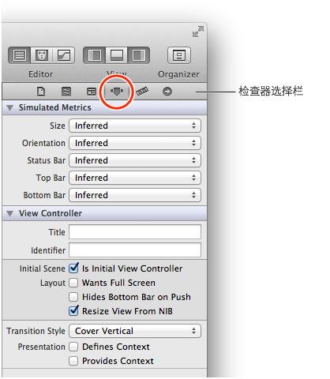
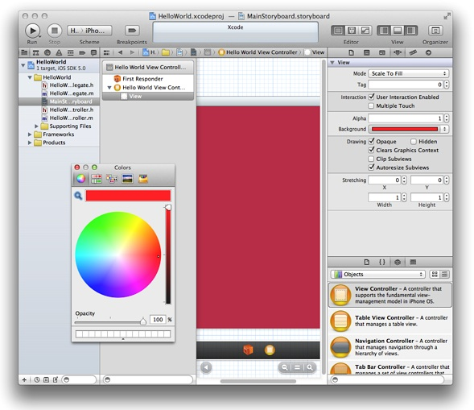
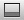

> 导航：[总目录](../../../README.md) · [referencelibrary](../../../_indexes/referencelibrary.md) · [马上着手开发 iOS 应用程序 (Start Developing iOS Apps Today) (弃用的文稿)](%E6%96%87%E7%A8%BF%E4%BF%AE%E8%AE%A2%E5%8E%86%E5%8F%B2%E8%AE%B0%E5%BD%95.md)

[下一页](%E9%85%8D%E7%BD%AE%E8%A7%86%E5%9B%BE.md)[上一页](%E7%AB%8B%E5%8D%B3%E5%BC%80%E5%A7%8B.md) 

# 检查视图控制器及其视图

正如先前所学习的，一个视图控制器负责管理一个场景，而一个场景代表一个内容区域。在该区域中看到的内容，是在视图控制器的视图中定义的。在本章中，您可以更仔细地查看由 `HelloWorldViewController` 所管理的场景，并学习如何调整视图的背景颜色。

应用程序启动时，载入主串联图文件，然后实例化初始视图控制器。初始视图控制器管理用户打开应用程序时看到的第一个场景。因为“Single View”模板只提供一个视图控制器，该视图控制器自动设定为初始视图控制器。您可以使用 Xcode 检查器来验证视图控制器的状态，并查看关于它的其他信息。

打开检查器

1. 如有需要，点按项目导航器中的 `MainStoryboard.storyboard`，在画布上显示场景。
2. 在大纲视图中，选择“Hello World View Controller”，列在“first responder”下方。

   您的工作区窗口外观应该像这样：

   

   请注意场景和场景台都有蓝色外框，并已选定场景台中的视图控制器对象。
3. 在工具栏中点按最右边的“View”按钮，在窗口右边显示实用工具区域（或者选取“View”>“Utilities”>“Show Utilities”）。
4. 在实用工具区域中点按“Attributes”检查器按钮，打开“Attributes”检查器。

   “Attributes”检查器按钮位于实用工具区域顶部的检查器选择栏中，为从左边起的第四个按钮。

   

   “Attributes”检查器打开时，工作区窗口外观应该像这样（您可能需要调整窗口的大小以便看到所有内容）：

   

   在“Attributes”检查器的“View Controller”部分，可以看到已选定“Initial Scene”选项。

   

   请注意，如果取消选定这个选项，初始场景指示器会从画布中消失。在本教程中，请确定“Initial Scene”选项一直是选定的。

在本教程的前面部分，您已了解到视图提供了在 Simulator 中运行应用程序时所看到的白色背景。要确定应用程序工作正常，您可以将视图的背景设定为白色以外的其他颜色，并再次在 Simulator 中运行应用程序来验证新颜色的显示。

在更改视图的背景之前，请确定串联图仍打开在画布上。（如有需要，点按项目导航器中的 `MainStoryboard.storyboard`，在画布上打开串联图。）

设定视图控制器的视图的背景颜色

1. 在大纲视图中，点按“Hello World View Controller”旁边的展示三角形（如果还未打开的话），然后选择“View”。

   Xcode 在画布上高亮显示视图区域。
2. 在实用工具区域顶部的检查器选择栏中点按“Attributes”按钮，打开“Attributes”检查器（如果还未打开的话）。
3. 在“Attributes”检查器中，点按“Background”弹出式菜单中的白色矩形，打开“Colors”窗口。

   矩形显示该项目的背景的当前颜色。“Background”弹出式菜单外观像这样：

   
4. 在“Colors”窗口中，选择白色以外的颜色。

   您的工作区窗口和“Colors”窗口外观应该像这样：

   

   请注意，在您选择视图时 Xcode 高亮显示该视图，所以画布上的颜色可能和“Colors”窗口中的颜色看起来不同。
5. 关闭“Colors”窗口。

点按“Run”按钮或选取“Product”>“Run”，在 Simulator 中测试您的应用程序。请确定 Xcode 工具栏中的“Scheme”弹出式菜单仍然显示“HelloWorld”>“iPhone 5.0 Simulator”。您看到的应该大致是这样的：

在继续本教程之前，请将视图的背景颜色恢复成白色。

恢复视图的背景颜色

1. 在“Attributes”检查器中，点按箭头打开“Background”弹出式菜单。

   请注意，“Background”弹出式菜单中的矩形已改变成显示在“Colors”窗口中所选取的颜色。如果点按的是有颜色的矩形而不是箭头，“Colors”窗口会重新打开。因为您想重新使用视图原来的背景颜色，从“Background”菜单中选取该颜色，比从“Colors”窗口中找要简单得多。
2. 在“Background”弹出式菜单中，选取“Recently Used Colors”部分中列出的白色方块。
3. 点按“Run”按钮来编译和运行应用程序（并存储所做的更改）。

验证了应用程序重新显示白色背景后，退出 Simulator。

运行应用程序时，Xcode 可能会在工作区窗口的底部打开调试区。本教程不会用到该面板，您可以将其关闭，以腾出更多空间。

关闭调试区

- 点按工具栏中的“Debug View”按钮。

  “Debug View”按钮为中间的那个视图按钮，它是这样的：。

在本章中，您检查了场景，更改和恢复了视图的背景颜色。

在下一章，您将文本栏、标签以及按钮添加到视图中，让用户与应用程序进行交互操作。

[下一页](%E9%85%8D%E7%BD%AE%E8%A7%86%E5%9B%BE.md)[上一页](%E7%AB%8B%E5%8D%B3%E5%BC%80%E5%A7%8B.md)

---
