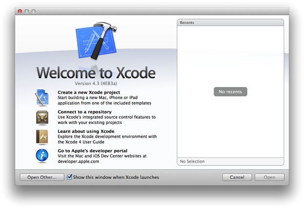
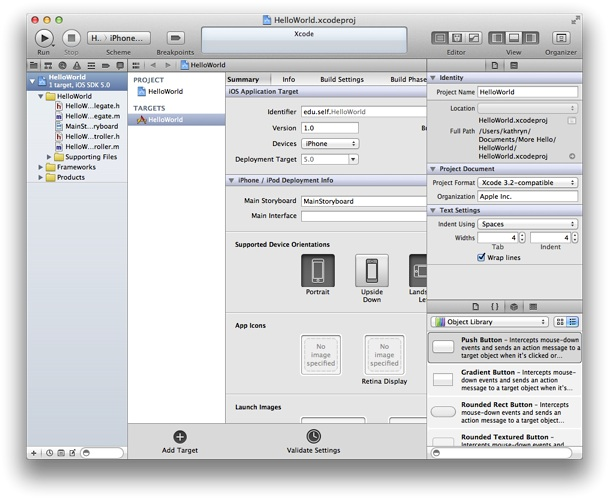
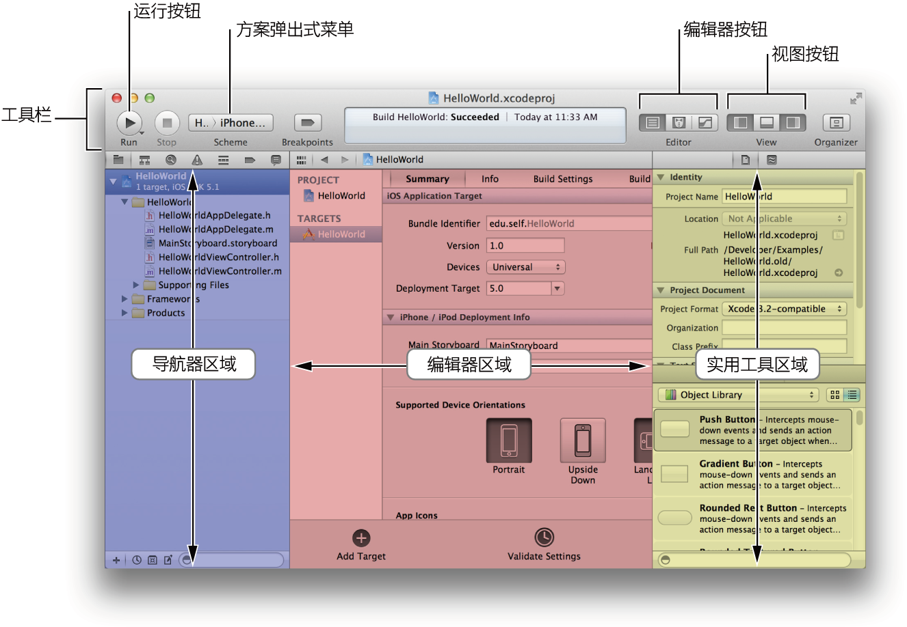
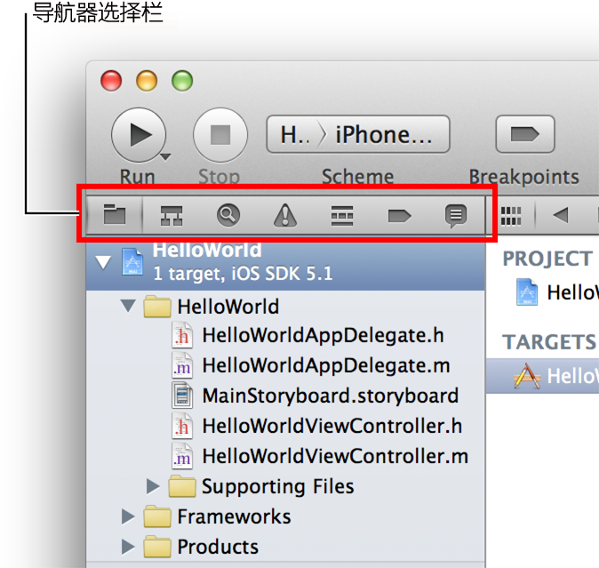
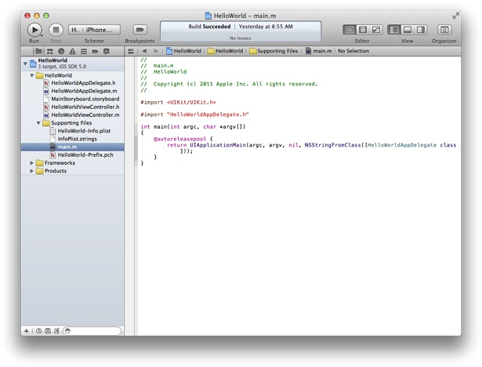
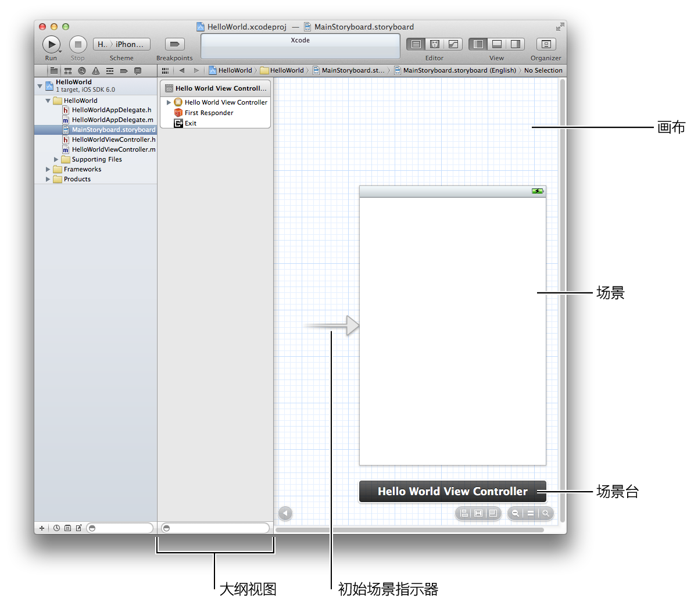

> 导航：[总目录](../../../README.md) · [referencelibrary](../../../_indexes/referencelibrary.md) · [马上着手开发 iOS 应用程序 (Start Developing iOS Apps Today) (弃用的文稿)](%E6%96%87%E7%A8%BF%E4%BF%AE%E8%AE%A2%E5%8E%86%E5%8F%B2%E8%AE%B0%E5%BD%95.md)


[下一页](%E6%A3%80%E6%9F%A5%E8%A7%86%E5%9B%BE%E6%8E%A7%E5%88%B6%E5%99%A8%E5%8F%8A%E5%85%B6%E8%A7%86%E5%9B%BE.md)[上一页](%E5%85%B3%E4%BA%8E%E5%88%9B%E5%BB%BA%E6%82%A8%E7%9A%84%E9%A6%96%E4%B8%AA%20iOS%20%E5%BA%94%E7%94%A8%E7%A8%8B%E5%BA%8F.md) 

# 立即开始

要创建本教程中的 iOS 应用程序，您需要 Xcode 4.3 或更高版本。Xcode 是 Apple 的集成开发环境（又称 IDE），用于 iOS 和 Mac OS X 的开发。在 Mac 上安装 Xcode，也会同时安装了 iOS SDK，它包含 iOS 平台的编程接口。

要着手开发应用程序，请创建一个新 Xcode 项目。

创建新项目

1. 打开 Xcode（默认位置在“`/应用程序`”中）。

   如果从未在 Xcode 中创建或打开过项目，您应该会看到一个与下图类似的“Welcome to Xcode”窗口：

   

   如果曾在 Xcode 中创建或打开过项目，您会看到一个项目窗口，而不是“Welcome to Xcode”窗口。
2. 在“Welcome to Xcode”窗口中，点按“Create a new Xcode project”，或选取“File”>“New”>“New project”。

   Xcode 将打开一个新窗口并显示对话框，让您从中选取一个模板。Xcode 内建了一些应用程序模板，您可以使用这些模板来开发常见类型的 iOS 应用程序。例如“Tabbed”模板可以创建与 iTunes 类似的应用程序，“Master-Detail”模板可以创建与“邮件”类似的应用程序。

   
3. 在对话框左边的 iOS 部分中，选择“Application”。
4. 在对话框的主区域中，选择“Single View Application”，然后点按“Next”。

   一个新对话框会出现，提示您为应用程序命名，并为项目选取附加选项。

   
5. 填写“Product Name”、“Company Identifier”和“Class Prefix”等栏位。

   您可以使用以下值：

   - Product Name：`HelloWorld`
   - Company Identifier：您的公司标识符（如果有）。如果没有公司标识符，可以使用 `edu.self`。
   - Class Prefix：`HelloWorld`
6. 在“Device Family”弹出式菜单中，确定选取 iPhone。
7. 确定选取“Use Storyboard”和“Use Automatic Reference Counting”选项，但不选定“Include Unit Tests”选项。
8. 点按“Next”。

   此时出现另一个对话框，让您指定项目存储的位置。
9. 为项目指定位置，不要选定“Source Control”选项，然后点按“Create”。

   Xcode 在__工作区窗口__中打开新项目，窗口的外观近似于：

   

请花一些时间来熟悉 Xcode 的工作区窗口。在接下来的整个教程中，您将会用到下面窗口中标识出的按钮和区域。



如果工作区窗口中的实用工具区域已打开（如上图窗口中所示），您可以暂时把它关闭，因为稍后才会用到它。最右边的“View”按钮可控制实用工具区域。实用工具区域可见时，该按钮是这样的：


如有需要，点按最右边的“View”按钮来关闭实用工具区域。

即使您还未编写任何代码，您都可以构建您的应用程序，并在 Simulator（已包含在 Xcode 中）中运行它。顾名思义，Simulator 可模拟应用程序在 iOS 设备上运行，让您初步了解它的外观和行为。

在 Simulator 中运行您的应用程序

1. 确定在 Xcode 工具栏的“Scheme”弹出式菜单中选定“HelloWorld”>“iPhone 6.0 Simulator”选项。

   如果弹出式菜单中该选项未被选定，请把它打开，然后从菜单中选取“iPhone 6.0 Simulator”。
2. 点按 Xcode 工具栏中的“Run”按钮，或选取“Product”>“Run”。

   Xcode 会报告生成的进度。

Xcode 完成生成项目后，Simulator 应该会自动启动。因为您指定的是 iPhone 产品而非 iPad 产品，Simulator 会显示一个看起来像 iPhone 的窗口。在模拟的 iPhone 屏幕上，Simulator 打开您的应用程序，外观应该是这样的：


此刻，您的应用程序还不怎么样：它只显示一个空白的画面。要了解空白画面是如何生成的，您需要了解代码中的对象，以及它们如何紧密协作来启动应用程序。现在，退出 Simulator（选取“iOS Simulator”>“Quit iOS Simulator”；请确定您不是退出 Xcode）。

您的项目是基于 Xcode 模板开发的，所以运行应用程序时，大部分基本的应用程序环境已经自动建立好了。例如，Xcode 创建一个应用程序对象（以及其他一些东西）来建立运行循环（运行循环将输入源寄存，并将输入事件传递给应用程序）。该工作大部分是由 `UIApplicationMain` 函数完成的，该函数由 UIKit 框架提供，并且在您的项目的 `main.m` 源文件中自动调用。

查看 main.m 源文件

1. 请确定项目导航器已在导航器区域中打开。

   项目导航器显示项目中的所有文件。如果项目导航器未打开，请点按导航器选择栏最左边的按钮：

   
2. 点按项目导航器中“Supporting Files”文件夹旁边的展示三角形，打开文件夹。
3. 选择 `main.m`。

   Xcode 在窗口的主编辑器区域打开源文件，外观应该类似这样：

   

`main.m` 中的 `main` 函数调用自动释放池 (autorelease pool) 中的 `UIApplicationMain` 函数：

```
@autoreleasepool {
   return UIApplicationMain(argc, argv, nil, NSStringFromClass([HelloWorldAppDelegate class]));
}
```

`@autoreleasepool` 语句支持“自动引用计数 (ARC)”系统。ARC 可自动管理应用程序的对象生命周期，确保对象在需要时一直存在，直到不再需要。

调用 `UIApplicationMain` 会创建一个 `UIApplication` 类的实例和一个应用程序委托的实例（在本教程中，应用程序委托是 `HelloWorldAppDelegate`，由“Single View”模板提供）。__应用程序委托__的主要作用是提供呈现应用程序内容的窗口，在应用程序呈现之前，应用程序委托也执行一些配置任务。（__委托__是一种设计模式，在此模式中，一个对象代表另一个对象，或与另一个对象协调工作。）

在 iOS 应用程序中，__窗口__对象为应用程序的可见内容提供容器，协助将事件传递到应用程序对象，协助应用程序对设备的摆放方向做出响应。窗口本身是不可见的。

调用 `UIApplicationMain` 也会扫描应用程序的 `Info.plist` 文件。`Info.plist` 文件为信息属性列表，即键和值配对的结构化列表，它包含应用程序的信息，例如名称和图标。

查看属性列表文件

- 在项目导航器的“Supporting Files”文件夹中，选择 `HelloWorld-Info.plist`。

  Xcode 在窗口的编辑器区域打开 `Info.plist` 文件，外观应该类似这样：

  

  在本教程中，您不需要查看“Supporting Files”文件夹中的文件，因此可以在项目导航器中关闭此文件夹来避免分散注意力。同样的，点按“Supporting Files”文件夹图标旁边的展示三角形以关闭该文件夹。

因为您已选取在项目中使用串联图，所以 `Info.plist` 文件还包含应用程序对象应该载入的串联图的名称。__串联图__包含对象、转换以及连接的归档，它们定义了应用程序的用户界面。

在“HelloWorld”应用程序中，串联图文件命名为 `MainStoryboard.storyboard`（请注意 `Info.plist` 文件只显示这名称的第一部分）。应用程序启动时，载入 `MainStoryboard.storyboard`，接着根据它对初始视图控制器进行实例化。__视图控制器__是管理区域内容的对象；而__初始视图控制器__是应用程序启动时载入的第一个视图控制器。

“HelloWorld”应用程序仅包含一个视图控制器（具体来说就是 `HelloWorldViewController`）。现在，`HelloWorldViewController` 管理由单视图提供的一个区域的内容。__视图__是一个对象，它在屏幕的矩形区域中绘制内容，并处理由用户触摸屏幕所引起的事件。一个视图也可以包含其他视图，这些视图称为__分视图__。当一个视图添加了一个分视图后，它被称为__父视图__，这个分视图被称为__子视图__。父视图、其子视图以及子视图的子视图（如有的话）形成一个__视图层次__。一个视图控制器只管理一个视图层次。

在接下来的步骤，您要给由 `HelloWorldViewController` 管理的视图添加三个分视图，以创建视图层次；这三个子视图分别表示文本栏、标签和按钮。

您可以在串联图中看到视图控制器及其视图的模样。

查看串联图

- 在项目导航器中选择 `MainStoryboard.storyboard`。

  Xcode 在编辑器区域打开串联图。（串联图对象后面的区域，即看起来像图纸的区域，称为__画布__。）

打开默认串联图后，工作区窗口看起来应该类似这样：



串联图包括场景和过渡。__场景__代表视图控制器，__过渡__则表示两个场景之间的转换。

因为“Single View”模板提供一个视图控制器，应用程序中的串联图只包含一个场景，没有过渡。画布上指向场景左侧的箭头是“__initial scene indicator__”（初始场景指示器），它标识出应用程序启动时应该首先载入的场景（通常初始的场景就是初始视图控制器）。

在画布上看到的场景称为“Hello World View Controller”，因为它是由 `HelloWorldViewController` 对象来管理的。“Hello World View Controller”场景由一些项目组成，显示在 Xcode __大纲视图__（在画布和项目导航器之间的面板）。现在，视图控制器由以下项目组成：

- 一个第一响应器占位符对象（以橙色立方体表示）。

  __“first responder”__是一个动态占位符，应用程序运行时，它应该是第一个接收各种事件的对象。这些事件包括以编辑为主的事件（例如轻按文本栏以调出键盘）、运动事件（例如摇晃设备）和操作消息（例如当用户轻触按钮时该按钮发出的消息）等等。本教程不会涉及第一响应器的任何操作。
- 名为 __Exit__ 的占位符对象，用于展开序列。

  默认情况下，当用户使子场景消失时，该场景的视图控制器__展开__（或返回）父场景——即转换为该子场景的原来场景。不过，Exit 对象使视图控制器能够展开任意一个场景。
- `HelloWorldViewController` 对象（以黄色球体内的浅色矩形表示）。

  串联图载入一个场景时，会创建一个视图控制器类的实例来管理该场景。
- 一个视图，列在视图控制器下方（要在大纲视图中显示此视图，您可能要打开“Hello World View Controller”旁边的展示三角形）。

  此视图的白色背景就是在 Simulator 中运行该应用程序时所看到的背景。

画布上，场景下方的区域称为__场景台__。现在，场景台显示了视图控制器的名称，即“Hello World View Controller”。其他时候，场景台可包含图标，分别代表第一响应器、Exit 占位符对象和视图控制器对象。

在本章中，您使用 Xcode 创建了一个基于“Single View”模板的新项目，生成并运行了该模板定义的默认应用程序。然后您查看了该项目的一些基本组成部分，例如 `main.m` 源文件、`Info.plist` 文件以及串联图文件，并了解了应用程序如何启动。您也学习了“模型－视图－控制器”设计模式是如何为应用程序中的对象定义角色的。

在下一章，您将了解有关视图控制器及其视图的更多信息。

[下一页](%E6%A3%80%E6%9F%A5%E8%A7%86%E5%9B%BE%E6%8E%A7%E5%88%B6%E5%99%A8%E5%8F%8A%E5%85%B6%E8%A7%86%E5%9B%BE.md)[上一页](%E5%85%B3%E4%BA%8E%E5%88%9B%E5%BB%BA%E6%82%A8%E7%9A%84%E9%A6%96%E4%B8%AA%20iOS%20%E5%BA%94%E7%94%A8%E7%A8%8B%E5%BA%8F.md)
