> 导航：[总目录](../../../README.md) · [referencelibrary](../../../_indexes/referencelibrary.md) · [马上着手开发 iOS 应用程序 (Start Developing iOS Apps Today) (弃用的文稿)](%E6%96%87%E7%A8%BF%E4%BF%AE%E8%AE%A2%E5%8E%86%E5%8F%B2%E8%AE%B0%E5%BD%95.md)


[下一页](%E5%AE%9E%E6%96%BD%E8%A7%86%E5%9B%BE%E6%8E%A7%E5%88%B6%E5%99%A8.md)[上一页](%E6%A3%80%E6%9F%A5%E8%A7%86%E5%9B%BE%E6%8E%A7%E5%88%B6%E5%99%A8%E5%8F%8A%E5%85%B6%E8%A7%86%E5%9B%BE.md) 

# 配置视图

Xcode 提供了对象库，您可以将库中的对象添加到串联图文件。其中的一些对象属于视图中的用户界面元素，例如按钮和文本栏。其他对象为高级对象，例如视图控制器和手势识别器。

“Hello World View Controller”场景已经包含了一个视图。现在需要添加一个按钮、一个标签和一个文本栏。然后，在这些元素和视图控制器类之间建立连接，以便元素提供您想要的行为。

将对象库中的用户界面 (UI) 元素拖移到画布上的视图中，来添加用户界面元素。UI 元素添加到视图后，可以适度移动它们的位置和调整大小。

将 UI 元素添加到视图并适当进行布局

1. 如有需要，选择项目导航器中的 `MainStoryboard.storyboard`，在画布上显示“Hello World View Controller”场景。
2. 如有需要，打开对象库。

   对象库出现在实用工具区域的底部。如果看不到对象库，您可以点按其按钮，即库选择栏中从左边起的第三个按钮。

   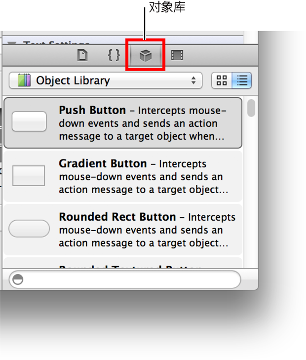
3. 在对象库中，从“Objects”弹出式菜单中选取“Controls”。

   Xcode 将控制列表显示在弹出式菜单下方。该列表显示每个控制的名称、外观及其功能的简短描述。
4. 从列表中拖一个文本栏、一个圆角矩形按钮和一个标签到视图上，一次一个。

   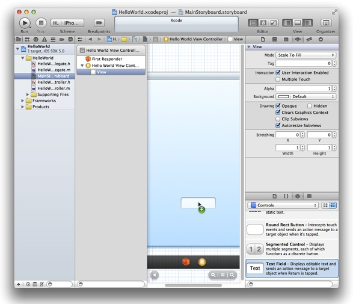
5. 在视图中，拖移文本栏将其放置在视图的左上角附近。

   在移动文本栏或任何其他 UI 元素时，会出现蓝色的虚线（称为__对齐参考线__），有助于将项目与视图的中心和边缘对齐。当您看到视图的左方和上方对齐参考线（如下图所示）时，停止拖移文本栏：

   
6. 在视图中，准备调整文本栏的大小。

   通过拖移__调整大小控制柄__（显示在元素边框上的小白方块）来调整 UI 元素的大小。一般情况下，在画布上或在大纲视图中选择一个元素，该元素的调整大小控制柄就会显露出来。在本例中，因为您刚刚停止拖移，文本栏应该已被选定。如果文本栏外观如下图所示，就可以调整它的大小；否则请在画布上或在大纲视图中选择它。

   
7. 拖移文本栏右侧的调整大小控制柄，直到视图最右侧的对齐参考线出现。

   当看到画布像下图这样时，停止调整文本栏大小：

   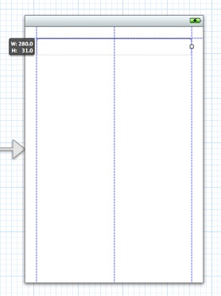
8. 在仍然选定文本栏时，打开“Attributes”检查器（如有需要的话）。
9. 在“Text Field Attributes”检查器顶部附近的“Placeholder”栏中，键入短语 `Your Name`。

   顾名思义，“Placeholder”栏提供的浅灰色文本是为了帮助用户理解能够在文本栏中输入何种信息。在运行的应用程序中，用户只要在文本栏内轻按，占位符文本就会立即消失。
10. 还是在“Text Field Attributes”检查器中，点按中间的“Alignment”按钮，使文本栏的文本居中显示。

    在输入占位符文本和更改对齐设置后，“Text Field Attributes”检查器外观应该像这样：

    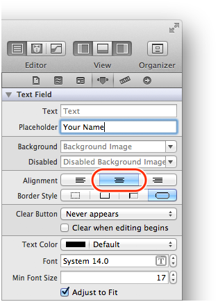
11. 在视图中，拖移标签到文本栏下方，并使其左边缘和文本栏的左边缘对齐。
12. 拖移标签的右侧调整大小控制柄，使标签与文本栏同宽。

    比起文本栏，标签有更多的调整大小控制柄。这是因为您可以调整标签的高度和宽度，但只能调整文本栏的宽度。现在不是要更改标签的高度，因此不要拖移标签四个角的调整大小控制柄。要拖移的是标签右侧中间的那个调整大小控制柄。

    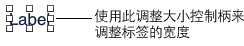
13. 在“Label Attributes”检查器中，点按中间的“Alignment”按钮，使出现在标签中的文本居中显示。
14. 拖移按钮使其靠近视图底部并且水平居中。
15. 在画布上，连按该按钮，然后输入文本 `Hello`。

    在视图中连按该按钮后，而还未输入文本时，您看到应该是这样的：

    

在添加文本栏、标签和按钮 UI 元素，并对布局做出建议的修改后，您的项目看起来应该是这样的：

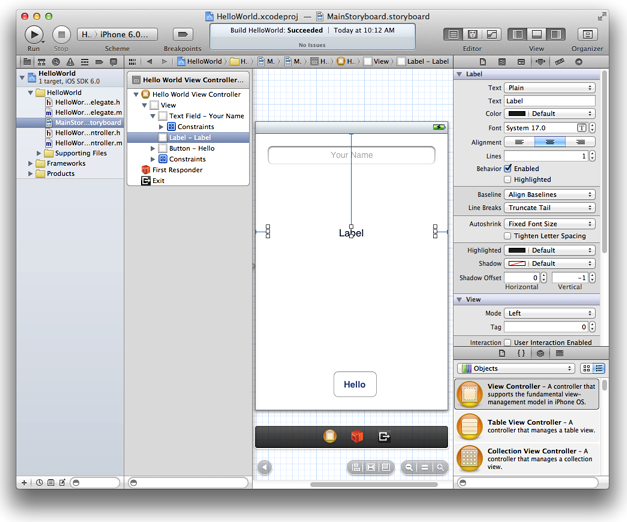

您可能注意到，当您将文本栏、标签和按钮添加到背景视图时，Xcode 在名为 __Constraints__ 的大纲视图中插入了项目。Cocoa Touch 具有一个自动布局系统，让您定义用户界面元素的布局约束。这些约束定义用户界面元素之间的关系，当其他视图的大小改变或设备摆放方向改变时，该关系影响各界面元素如何改变其位置和几何形状。现在不要改变您添加到用户界面的视图的默认约束。

您还可以对文本栏进行一些修改，使文本栏的行为符合用户的期望。首先，因为用户要输入自己的姓名，您可以确保 iOS 对用户键入的每个英文单词的首字母实施大写。其次，还可以确保与文本栏相关联的键盘配置为输入姓名（而不是数字），并且键盘显示“Done”按钮。

这些更改所遵循的原则是：因为在设计时，您已知道文本栏将包含何种类型的信息，您可以配置文本栏使它运行时的外观和行为符合用户的任务。这些配置都可以在“Attributes”检查器中修改。

配置文本栏

1. 在视图中，选择文本栏。
2. 在“Text Field Attributes”检查器中，进行以下选择：

   - 在“Capitalization”弹出式菜单中，选取“Words”。
   - 确保“Keyboard”弹出式菜单设定为“Default”。
   - 在“Return Key”弹出式菜单中，选取“Done”。

   选定以上选项后，“Text Field Attributes”检查器应该是这样的：

   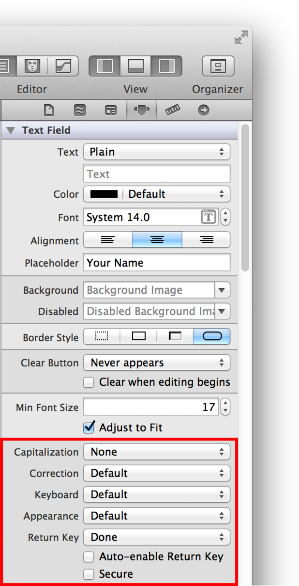

在 Simulator 中运行应用程序，以确定所添加的 UI 元素外观正如所期望的样子。如果点按“Hello”按钮，该按钮应该高亮显示；如果在文本栏内点按，键盘应该出现。不过，这时按钮没有任何功能，标签还是空的，而且键盘出现后无法使它消失。要添加此功能，需要在 UI 元素和视图控制器之间进行适当的连接。下面将说明如何建立连接。

当用户激活一个 UI 元素时，该元素可以向知道如何执行相应操作方法的对象发送一则操作消息，例如“将此联系人添加到用户的联系人列表”。这种互动是__目标-操作__机制的一部分，该机制是另一种 Cocoa Touch 设计模式。

在本教程中，当用户轻按“Hello”按钮时，您想要按钮发送一则“更改问候语”的消息（__操作__）给视图控制器（__目标__）。视图控制器通过更改其管理的字符串（即模型对象）来响应此消息。然后，视图控制器更新在标签中显示的文本，以反映模型对象值的变动。

使用 Xcode，您可以将操作添加到 UI 元素，并设置其相应的操作方法。方法是按住 Control 键并将画布上的元素拖移到源文件中的合适位置（通常是类扩展在视图控制器的实现文件中）。串联图将您通过这种方式创建的连接归档存储下来。稍后，应用程序载入串联图时，会恢复这些连接。

为按钮添加操作

1. 如有需要，选择项目导航器中的 `MainStoryboard.storyboard`，将场景显示在画布上。
2. 在 Xcode 工具栏中，点按“Utilities”按钮以隐藏实用工具区域，点按“Assistant Editor”按钮以显示辅助编辑器面板。

   “Assistant Editor”按钮为中间的那个编辑器按钮，外观是这样的：。
3. 确定“Assistant”显示视图控制器的实现文件，即 `HelloWorldViewController.m`。

   万一显示的是 `HelloWorldViewController.h`，请在项目导航器中选择 `HelloWorldViewController.m`。
4. 在画布上，按住 Control 键将“Hello”按钮拖移到 `HelloWorldViewController.m` 中的类扩展。

   实现文件中的类扩展是申明类的专有属性和方法的地方。（在“__编写 Objective-C 代码__”中，您将学到有关类扩展的更多信息。）Outlet 和操作应该专有。视图控制器的 Xcode 模板包含实现文件中的类扩展。以“HelloWorld”项目为例，类扩展看起来像这样：

```objc
@interface HellowWorldViewController()

@end
```

   要按住 Control 键拖移，请按住 Control 键不放，并将按钮拖移到辅助编辑器中的实现文件。随着您按住 Control 键拖移，看到的应该是这样的：

   

   松开 Control 键并停止拖移后，Xcode 会显示一个弹出式窗口，在窗口中可以设置刚进行的操作连接：

   
5. 在弹出式窗口中，配置按钮的操作连接：

   - 在“Connection”弹出式菜单中，选取“Action”。
   - 在“Name”栏中，输入 `changeGreeting:`（请确保包括冒号）。

     在稍后步骤中，您将实施 `changeGreeting:` 方法，让它把用户输入文本栏的文本载入，然后在标签中显示。
   - 确定“Type”栏包含 `id`。

     `id` 数据类型可指任何 Cocoa 对象。在这里使用 `id` 是因为无论哪种类型的对象发送消息都没有关系。
   - 请确定“Event”弹出式菜单包含“Touch Up Inside”。

     指定“Touch Up Inside”事件是因为您想要在用户触摸按钮后提起手指时发送消息。
   - 请确定“Arguments”弹出式菜单包含“Sender”。

   配置完操作连接后，弹出式窗口应该是这样的：

   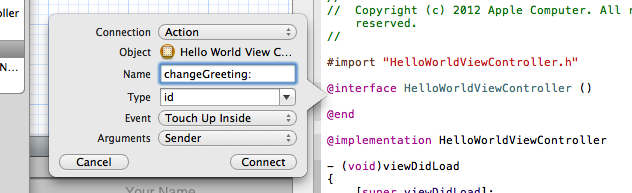
6. 在弹出式窗口中，点按“Connect”。

   Xcode 为新的 `changeGreeting:` 方法添加一个存根实现，并通过在该方法的左边显示一个带有填充的圆圈，以标示已经建立连接。

   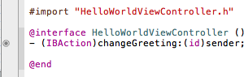

按住 Control 键将“Hello”按钮拖移到 `HelloWorldViewController.m` 文件中的类扩展，并配置生成的操作后，您完成了两件事情：通过 Xcode 将合适的代码添加到了视图控制器类中（在 `HelloWorldViewController.m` 中），并在按钮和视图控制器之间创建了连接。具体来说，Xcode 做了以下事情：

- 在 `HelloWorldViewController.m` 中，将以下操作方法声明添加到了类扩展：

```objc
- (IBAction)changeGreeting:(id)sender;
```

  并将以下的存根方法添加到了实现区域：

```objc
- (IBAction)changeGreeting:(id)sender {
}
```
- 它在按钮和视图控制器之间创建了连接。

接下来，您要在视图控制器和剩余的两个 UI 元素（即标签和文本栏）之间创建连接。

_Outlet_ 描述了两个对象之间的连接。当您想要一个对象（例如视图控制器）和它包含的对象（例如文本栏）进行通讯时，须将被包含的对象指定为 outlet。应用程序运行时，会恢复在 Xcode 中创建的 outlet，从而使对象在运行时可以互相通讯。

在本教程中，您想要视图控制器从文本栏获取用户的文本，然后将文本显示在标签上。为确保视图控制器可以和这些对象通讯，您在它们之间创建 outlet 连接。

为文本栏和标签添加 outlet 的步骤与添加按钮操作的步骤非常相似。开始之前，请确定主串联图文件仍然显示在画布上，而 `HelloWorldViewController.m` 在辅助编辑器中保持打开。

为文本栏添加 outlet

1. 按住 Control 键将视图中的文本栏拖移到实现文件中的类扩展。

   随着您按住 Control 键拖移，看到的应该是这样的：

   

   在类扩展内部的任何地方松开 Control 键并停止拖移都没有关系。在本教程中，文本栏和标签的 outlet 声明出现在“Hello”按钮的方法声明的上面。
2. 在松开 Control 键并停止拖移时出现的弹出式窗口中，配置文本栏的连接：

   - 确定“Connection”弹出式菜单包含“Outlet”。
   - 在“Name”栏中，键入“textField”。

     您可以给 outlet 随意命名，但是如果 outlet 名称与其表示的项目有关联，您的代码会更便于阅读。
   - 确定“Type”栏包含“UITextField”。

     将“Type”栏设定为“UITextField”可确保 Xcode 将 outlet 仅与文本栏连接。
   - 确定“Storage”弹出式菜单包含默认值“Weak”。

     稍后在“__掌握基本的编程技能__”中，您将了解有关强储存和弱储存的更多信息。

   完成这些设置后，弹出式窗口看起来应该是这样的：

   
3. 在弹出式窗口中，点按“Connect”。

通过为文本栏添加 outlet，您完成了两件事情：在这个过程中：

- Xcode 将合适的代码添加到了视图控制器类的实现文件 (`HelloWorldViewController.m`)。

  具体来说，Xcode 将以下声明添加到了类扩展：

```objc
@property (weak, nonatomic) IBOutlet UITextField *textField;
```
- Xcode 在视图控制器和文本栏之间建立了连接。

  通过在视图控制器和文本栏之间建立连接，用户输入的文本可以传递给视图控制器。和处理 `changeGreeting:` 方法声明一样，Xcode 在文本栏声明的左边显示带有填充的圆圈，以表示已经建立连接。

现在为标签添加 outlet 并配置连接。在视图控制器和标签之间建立连接，会让视图控制器以字符串（该字符串包含用户输入的文本）来更新标签。完成此任务的步骤与为文本栏添加 outlet 的步骤相同，只不过在配置时要做适当修改。（确定 `HelloWorldViewController.m` 仍然显示在辅助编辑器中。）

为标签添加 outlet

1. 按住 Control 键将视图中的标签拖移到辅助编辑器中的 `HelloWorldViewController.m` 的类扩展。
2. 在松开 Control 键并停止拖移时出现的弹出式窗口中，配置标签的连接：

   - 确定“Connection”弹出式菜单包含“Outlet”。
   - 在“Name”栏中，键入“label”。
   - 确定“Type”栏包含“UILabel”。
   - 确定“Storage”弹出式菜单包含“Weak”。
3. 在弹出式窗口中，点按“Connect”。

到此为止，您一共创建了三种到视图控制器的连接：

- 按钮的操作连接
- 文本栏的 Outlet 连接
- 标签的 Outlet 连接

您可以在“Connections”检查器中验证这些连接。

为视图控制器打开“Connections”检查器

1. 点按标准编辑器按钮以关闭辅助编辑器，并切换到标准编辑器视图。

   标准编辑器按钮是最左边的那个“Editor”按钮，它是这样的： 
2. 点按“Utilities”视图按钮以打开实用工具区域。
3. 在大纲视图中选择“Hello World View Controller”。
4. 在实用工具区域显示“Connections”检查器。

   “Connections”检查器按钮是检查器选择栏最右边的那个按钮，它是这样的： 

在“Connections”检查器中，Xcode 显示了所选对象（在本例中为视图控制器）的连接。在工作区窗口中，您看到的应该是这样的：


您会发现，在视图控制器和其视图之间，除了您创建的三个连接之外，还有一个连接。Xcode 提供了视图控制器和其视图之间的默认连接；您不必用任何方式访问它。

您还需要在应用程序中建立另一个连接：您需要将文本栏连接到您指定的委托对象上。在本教程中，您将视图控制器用作文本栏的委托。

您需要为文本栏指定一个委托对象。这是因为当用户轻按键盘中的“Done”按钮时，文本栏发送消息给它的委托（前面提到过委托是代表另一个对象的对象）。在后面的步骤中，您将使用与此消息相关联的方法让键盘消失。

确定串联图文件已在画布上打开。如果未打开，则在项目导航器中选择 `MainStoryboard.storyboard`。

设定文本栏的委托

1. 在视图中，按住 Control 键将文本栏拖移到场景台中的黄色球体（黄色球体代表视图控制器对象）。

   松开 Control 键并停止拖移时，看到的应该是这样的：

   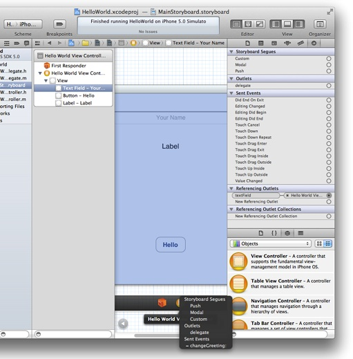
2. 在出现的半透明面板的“Outlets”部分中选择“`delegate`”。

iOS 操作系统提供了许多功能，让应用程序可供所有用户使用，包括有视觉障碍、听觉障碍和身体残疾的用户。让应用程序具有辅助功能，也就让应用程序接触到了数以百万计原本不能够使用它的用户。

Apple 的创新性读屏技术 VoiceOver 是一个重要的辅助功能。使用 VoiceOver，用户可以在不看屏幕的情况下导航和控制应用程序的各部分。通过触摸用户界面中的控制或其他对象，用户可以知道他们的位置、可以执行的操作以及执行某些操作后将发生什么。

您可以将一些辅助功能属性添加到用户界面中的任何视图。这些属性包括视图的当前值（例如文本栏中的文本）、其标签、提示以及很多特征。就 HelloWorld 应用程序而言，您将要给文本栏添加一则提示。

添加辅助功能提示

1. 在项目导航器中选择该串联图文件 (Base Internationalization)。
2. 选择该文本栏。
3. 在“Identity”检查器的“Accessibility”部分，在“Hint”栏中键入“Type your name”。

   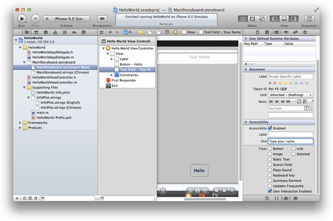

点按“Run”以测试您的应用程序。

在您点按“Hello”按钮时，应该看到它高亮显示。您还应该发现，如果在文本栏中点按，键盘会出现，您可以输入文本。然而还没有办法让键盘消失。要让键盘消失，您必须实施相关的委托方法。下一章会教您如何做。现在请退出 Simulator。

当您在画布上的视图控制器与辅助编辑器中实现文件（即 `HelloWorldViewController.m`）里的类扩展之间建立适当的连接时，也就更新了实现文件以支持 Outlet 和操作。

您不必使用 Xcode 自动添加代码（即通过按住 Control 键从画布拖移到源文件来建立连接时）的功能。而是可以自行编写类扩展的属性和方法声明，或公共属性和方法声明的头文件，然后就像建立文本栏的委托那样进行连接。然而通常情况下，Xcode 做得越多，您犯错的机会就越少，需要键入的内容也会越少。

[下一页](%E5%AE%9E%E6%96%BD%E8%A7%86%E5%9B%BE%E6%8E%A7%E5%88%B6%E5%99%A8.md)[上一页](%E6%A3%80%E6%9F%A5%E8%A7%86%E5%9B%BE%E6%8E%A7%E5%88%B6%E5%99%A8%E5%8F%8A%E5%85%B6%E8%A7%86%E5%9B%BE.md)
