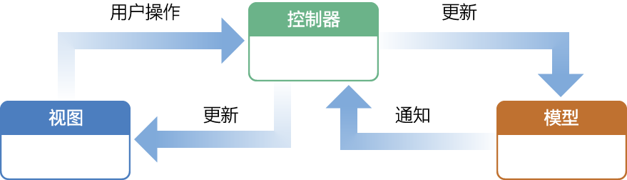
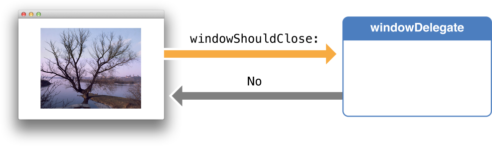
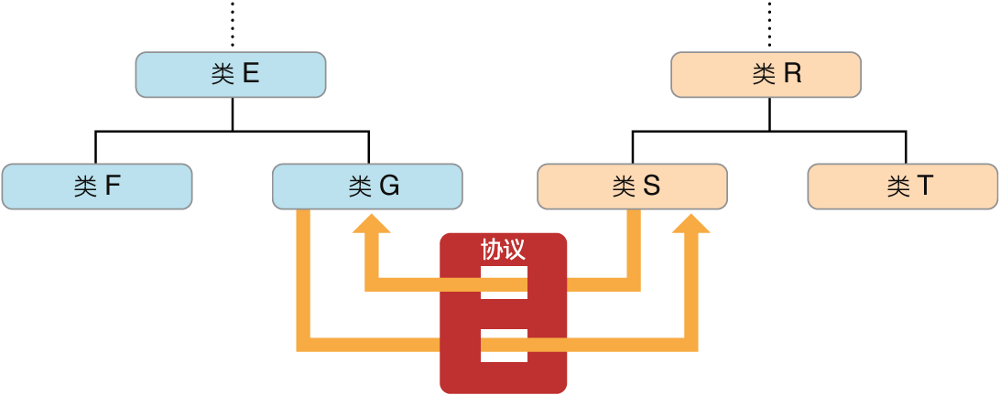
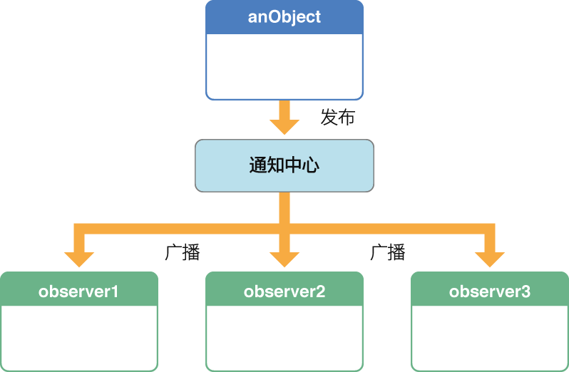
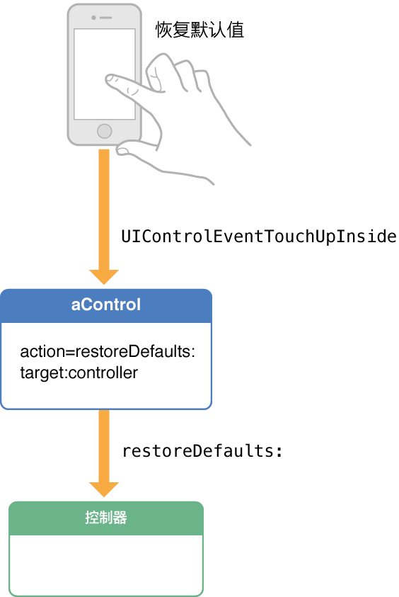
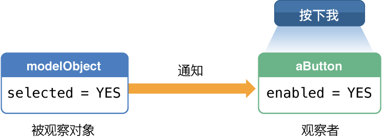

> 导航：[总目录](../../../README.md) · [referencelibrary](../../../_indexes/referencelibrary.md) · [马上着手开发 iOS 应用程序 (Start Developing iOS Apps Today) (弃用的文稿)](%E6%96%87%E7%A8%BF%E4%BF%AE%E8%AE%A2%E5%8E%86%E5%8F%B2%E8%AE%B0%E5%BD%95.md)

 [返回“设计模式”](https://developer.apple.com/library/archive/referencelibrary/GettingStarted/RoadMapiOSCh-Legacy/chapters/DesignPatterns.html) ! ! !

# 采用设计模式使您的应用程序合理化

在 Objective-C 编程中，继承是添加应用程序特定行为的一种方式。创建的现有类的子类，要么增加超类的属性和行为，要么在某种程度上修改它们。但是，它也有其他更加动态的方式，可添加应用程序特定行为，而不涉及到子类化。这些动态技巧和方式，是基于设计模式的。正如本文章所解释的，在代码中采用设计模式，有助于增加类和框架类的可再用性和扩展性。

设计模式是一个抽象工具，用于面向对象的软件开发，以及其他领域。它是一个设计模板，在特定背景中，解决一般性的、重复出现的问题。因此，设计模式是一种针对特定的、具体的设计的准则：在某种意义上，它是模式的“实例化”。在如何应用设计模式上，有一定的灵活性，通常例如程序设计语言和现有架构等事物，会影响如何应用模式。

有几个设计主题或原则对设计模式产生影响。这些设计原则是构建面向对象系统的经验法则，例如“封装发生变化的系统结构方面”(encapsulate the aspects of system structure that vary) 和“面向接口编程，而非面向实现编程”(program to an interface, not an implementation)。它们表达了重要的见解。例如，封装原则告诉我们，如果隔离并封装系统中发生变化的部分，它们可以独立于系统其他部分进行变化，特别是如果您为它们定义了不依赖实现特性的接口。您稍后可以修改或扩展这些可变部分，而不影响系统的其他部分。这样一来，您清除了各部分之间的互相依赖，减少了各部分的耦合性，系统就会变得更加灵活、更容易修改。

这样的优点，让设计模式成了编写软件的重点考虑因素。如果您在应用程序的设计中找到了模式，加以调整和使用，该程序（以及其所包含的对象和类）在将来需要时复用程度更高、扩展能力更强和更容易修改。此外，基于设计模式的应用程序，与没有基于设计模式的应用程序比较，会更见优雅和更具效率，因为它们只需较少的代码就能达到同样目的。

您会发现，设计模式的应用贯穿于整个 Cocoa Touch 和 Cocoa 框架、Objective-C 的运行时及程序设计语言自身。您可以几乎“免费”获得部分基于模式的机制，而其他部分则需要您做一些工作。情况合适时，可以将设计模式应用到您自己的应用程序代码中。如果使用与 Cocoa Touch 和 Cocoa 框架相同的模式，您的代码往往会更好地与框架的代码匹配，运行也更为优雅。

“模型－视图－控制器”(Model-View-Controller) 设计模式，通常被称为“MVC”，将以下一种角色分配给应用程序中的对象：“模型”、“视图”或“控制器”。模式不仅定义了对象在应用程序中扮演的角色，还定义了对象之间通信的方式。这三类对象的每一个，都由抽象边界与其他对象分隔，穿过这些边界与其他类型的对象进行通信。应用程序中某一 MVC 类型的对象的集合，有时统称为层，例如模型层。

对于任何 iOS 应用程序或 Mac 应用程序而言，MVC 对一个好的设计至关重要。采用此设计的好处多不胜数。这些应用程序中的很多对象，倾向于更可再用，它们的接口倾向于定义得更好。采用 MVC 设计的应用程序，也比其他应用程序更容易扩展。此外，您的应用程序可以用到的很多技术和架构，都是基于 MVC 的，也要求您的自定对象扮演其中一个 MVC 角色。

您可能还没有意识到，就已经创建了一个基于 MVC 的应用程序：“__您的首个 iOS 应用程序__”中的 HelloWorld。模型对象是 `userName` 属性（`NSString` 对象），由 `HelloWorldViewController` 类声明和管理。`HelloWorldViewController` 类和 `HelloWorldAppDelegate` 类的实例，是应用程序的控制器对象；而应用程序的视图对象，是文本栏、标签、按钮和背景视图。

有关“模型－视图－控制器”的完整信息，请参阅《_Concepts in Objective-C Programming_》（Objective-C 编程中的概念）中的“Model-View-Controller”。

模型对象封装了应用程序的数据，并定义操控和处理该数据的逻辑和运算。例如，模型对象可能是表示游戏中的角色或地址簿中的联系人。有时应用程序的模型层，实际是相关对象的一个或多个图形。数据载入应用程序后，作为应用程序的持续状态（不论该持续状态是储存在文件中，还是在数据库中）一部分的大部分数据，应该驻留在模型对象中。因为模型对象代表了与特定问题领域相关的知识和专长，在相似问题领域，就可以重复使用它们。“纯”模型对象应该和视图对象不发生明确连接（视图对象显示其数据并允许用户编辑数据），它不该管到用户界面和显示的问题。

用户在视图层中所进行的创建或修改数据的操作，通过控制器对象传达出去，最终会创建或更新模型对象。模型对象更改时（例如通过网络连接接收到新数据），它通知控制器对象，控制器对象更新相应的视图对象。

视图对象是应用程序中用户可以看见的对象。视图对象知道如何将自己绘制出来，并可能对用户的操作作出响应。视图对象的主要目的，就是显示来自应用程序模型对象的数据，并使该数据可被编辑。尽管如此，在 MVC 应用程序中，视图对象通常与模型对象分离。

因为您通常重新使用并重新配置对象，视图对象保证了应用程序之间的一致性。对于 iOS，UIKit 框架提供了视图类的集合；对于 OS X，AppKit 框架提供了类似的集合。在 UIKit 中，视图对象最终继承自 `UIView` 类；在 AppKit 中，视图对象最终继承自 `NSView` 类。

视图对象通过应用程序的控制器对象，了解模型数据的更改，并通过控制器对象，将用户发动的修改（例如，在文本栏输入的文本），传达到应用程序的模型对象。

在应用程序的一个或多个视图对象和一个或多个模型对象之间，控制器对象充当媒介。控制器对象因此是同步管道程序，通过它，视图对象了解模型对象的更改，反之亦然。控制器对象还可以为应用程序执行设置和协调任务，并管理其他对象的生命周期。

控制器对象解释在视图对象中进行的用户操作，并将新的或更改过的数据传达给模型对象。模型对象更改时，一个控制器对象会将新的模型数据传达给视图对象，以便视图对象可以显示它。

面向对象的系统（例如应用程序）是动态的。对象在运行时所能做的，并不局限于编写时所设定的行为。一个对象可以向另一个对象发送消息，而同一消息的目标，会根据运行时的情况而变化。一个对象也可以在运行时与可变的一组其他对象合作，并使用多种技巧，有效地完成应用程序的工作。一个对象或一群对象要这样做，必须利用许多技巧和框架架构，它们都是设计模式的派生。

下面部分说明许多这样的技巧和架构。请将它们作为您 Objective-C 编程工具箱的一部分。

在委托中，一个称为__委托__的对象应另一个对象的请求，作为该对象的代表。作出委托的对象，通常是框架模型。在执行的某些时候，它会向其委托发送消息，告诉委托即将发生某些事件，并要求给它回应。委托（通常是自定类的实例）实施供该消息调用的方法，并返回相应的值。通常该值是一个 Boolean 值，告诉作出委托的对象是否继续操作。

委托因此是一种将应用程序特定行为加入框架类工作的手段，而无需给该类创建子类。它是一种常见的、强大的设计，来扩展和影响框架的行为。

您应该记得，在编写“__您的首个 iOS 应用程序__”HelloWorld 时，创建了 `HelloWorldAppDelegate` 对象。Xcode 自动将其分配为应用程序对象（为框架对象）的委托。应用程序委托可以处理 `application:didFinishLaunchingWithOptions:`，以及应用程序对象发送给它的其他委托消息。

有两个可编程的组件用于委托。委托类必须定义属性（通过名称为 `delegate` 的约定），以保存一个指向委托的参考。它还必须声明委托类必须采用的协议（请参阅以下部分以获得有关协议的更多信息）。Cocoa Touch 和 Cocoa 框架的许多类，都提供委托作为一种方式，给应用程序用来增加其特定的框架行为。

但是委托并不局限于框架类。您可以在应用程序的两个自定对象之间实施委托。Cocoa Touch 应用程序常见的设计，是将委托作为一种手段，允许子视图控制器将某些值（通常为用户输入的值）传达到父视图控制器。

协议是可编程接口的声明，任何类都可以实施它的方法。与协议相关联的类实例，调用协议的方法，并获取由该类正式__采用__和实现该协议所返回的值。对象之间的此类通信，产生了一个特定目标，例如解析 XML 代码或拷贝对象。协议接口两边的对象可以通过继承，实施远距离彼此相关。协议因此和委托一样，可作为子类化的替换手段，通常是框架实施委托的一部分。

Apple 提供的框架，声明了数十个协议。此外，您的应用程序可以声明自定协议，让类可以采用。协议是您编程工具箱的一部分。《_Programming with Objective-C_》（使用 Objective-C 编程）对协议进行了综合描述。

通知中心是 Foundation 框架的一个子系统，它向应用程序中注册为某个事件观察者的所有对象广播消息（即通知）。（从编程角度而言，它是 `NSNotificationCenter` 类的实例）。该事件可以是发生在应用程序中的任何事情，例如进入后台状态，或者用户开始在文本栏中键入。通知是告诉观察者，事件已经发生或即将发生，因此让观察者有机会以合适的方式响应。通过通知中心来传播通知，是增加应用程序对象间合作和内聚力的一种途径。

例如，iOS 应用程序中的视图控制器，可以观察 `UIKeyboardWillShowNotification` 通知，以调整其视图的几何图形，来容纳虚拟键盘。正如此例所示，通知是一个对象，该对象的名称指明了一个特定事件，以及该事件是已经发生或将要发生。它还将一个引用（指向发布或发送通知的对象）送到通知中心，而它可以包含补充信息字典。

任何对象都可以观察通知，但要做到这一点，该对象必须注册，以接收通知。在注册时，它必须指定选择器，以确定由通知传送所调用的方法；方法签名必须只有一个参数：通知对象。注册后，观察者也可以指定发布对象。

通知中心的通知跟委托消息相似；当某些事件发生时，两者都发送给任意对象。但是，处理通知的方法与委托方法不同，它不能返回值。通过通知中心的通知是同步的，与委托一样。

应用程序的自定对象可定义和发布自己的通知，其他自定对象则可以观察该通知。

目标-操作设计在概念上很简单。一个对象储存着组成消息表达式的元素，某些事件发生时，将这些元素放在一起，并发送一则消息。这些元素为一个选择器，用来确定消息（即操作）和接收消息的对象（即目标）。目标的类会实现与操作和目标相对应的方法，当它在运行中接收到消息时，会通过执行方法来响应事件。

目标-操作主要是 Cocoa Touch 和 Cocoa 框架中的一种控制功能。控制是用户界面对象，例如用户通过轻按、拖移等进行操控的按钮、滑块或开关，将用户的意图通过信号发送给应用程序。Cocoa Touch 的控制储存了操作和目标；大多数 Cocoa 控制与一个或多个单元对象进行了配对，这些单元对象储存了目标和操作。

一些框架在对象中使用目标-操作而不是控制。例如，在设计手势识别器时，UIKit 框架使用了目标-操作。手势识别对象识别手势后，它将操作消息发送给目标对象。

键值观察（Key-value observing，或简称 KVO）允许对象观察另一个对象的属性。该属性值改变时，会通知观察对象。它了解新值以及旧值；如果观察的属性为对多的关系（例如数组），它也要了解哪个包含的对象发生了改变。KVO 有助于使应用程序变得更内聚，保持模型、控制器和视图层中的对象与改变同步。

与 `NSNotificationCenter` 通知相似，多个 KVO 观察者可以观察单一属性。此外，KVO 更动态，因为它允许对象观察任意属性，而不需任何新的 API，例如通知名称。KVO 是一个轻量级点对点通信机制，不允许观察所有实例的特定属性。

Cocoa Touch 和 Cocoa 框架也包含基于设计模式的其他设计，有以下模式：

- __视图层次。__应用程序所显示的视图，会排列成层次结构（直观上基于包含）。此模式允许应用程序将单个视图和合成视图同等对待。层次的根部为一个窗口对象；根部以下的每个视图，都有一个父视图，以及零个或多个子视图。父视图包含子视图。视图层次是绘图和事件处理的结构性组件。
- __响应器链。__响应器链是一系列的对象（主要是视图，但也有窗口、视图控制器和应用程序对象本身），事件或操作消息可以沿着响应器链传递，直到链中的一个对象处理该事件。因此，它是一个合作性事件处理机制。响应器链与视图层次密切相关。
- __视图控制器。__虽然 UIKit 和 AppKit 框架都有视图控制器类，它们在 iOS 中尤其重要。视图控制器是一种特殊的控制器对象，用于显示和管理一组视图。视图控制器对象提供基础结构，来管理内容相关的视图并协调视图的显示与隐藏。视图控制器管理应用程序视图的子层次结构。
- __前台。__在前台模式中，应用程序所执行的工作，从一个执行环境重定向（或弹回）到另一个环境。（执行环境是一个与主线程或辅助线程相关联的调度队列或操作队列。）您将前台模式主要应用于这样的情形：在次队列执行的工作，产生了必须在主队列执行的任务，例如更新用户界面的操作。
- __类别。__类别提供了一种方式，通过将方法添加到一个类，以使该类得到扩展。与委托一样，它可以让您自定行为，而不子类化。类别是 Objective-C 的一个功能，在“__编写 Objective-C 代码__”中有说明。

[返回“设计模式”](https://developer.apple.com/library/archive/referencelibrary/GettingStarted/RoadMapiOSCh-Legacy/chapters/DesignPatterns.html) ! ! !
