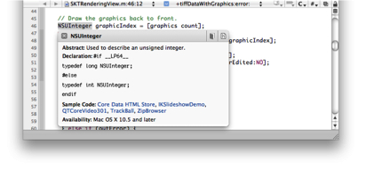
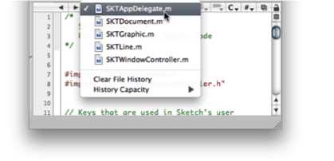
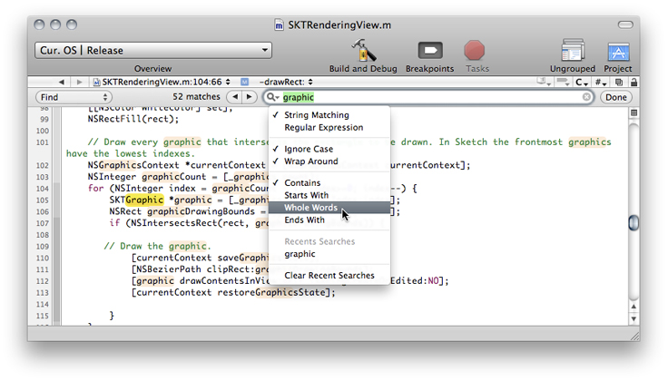

> 导航：[总目录](../../../README.md) · [releasenotes](../../../_indexes/releasenotes.md)

# Xcode FAQ

> [!IMPORTANT]
> 

[General](#apple-f4xwc4dqnrsv64tfmyxwi33df52wszbpkridimbqga4donjufvbuqmjnknltcna)

- [How do I set my preferred project-window layout?](#apple-f4xwc4dqnrsv64tfmyxwi33df52wszbpkridimbqga4donjufvbuqmjnknltc)

[Finding Documentation](#apple-f4xwc4dqnrsv64tfmyxwi33df52wszbpkridimbqga4donjufvbuqmjnknltcnq)

- [How do I search documentation?](#apple-f4xwc4dqnrsv64tfmyxwi33df52wszbpkridimbqga4donjufvbuqmjnknltk)
- [How do I view essential information about a symbol?](#apple-f4xwc4dqnrsv64tfmyxwi33df52wszbpkridimbqga4donjufvbuqmjnknltm)
- [How do I display symbol documentation?](#apple-f4xwc4dqnrsv64tfmyxwi33df52wszbpkridimbqga4donjufvbuqmjnknlto)
- [How do I make Quick Help remain open?](#apple-f4xwc4dqnrsv64tfmyxwi33df52wszbpkridimbqga4donjufvbuqmjnknltq)

[Writing Code](#apple-f4xwc4dqnrsv64tfmyxwi33df52wszbpkridimbqga4donjufvbuqmjnknltcni)

- [How do I open the header file that defines a symbol?](#apple-f4xwc4dqnrsv64tfmyxwi33df52wszbpkridimbqga4donjufvbuqmjnknlti)
- [How do I show or hide parameters in code completions?](#apple-f4xwc4dqnrsv64tfmyxwi33df52wszbpkridimbqga4donjufvbuqmjnknlte)
- [How do I move between visited locations within a file?](#apple-f4xwc4dqnrsv64tfmyxwi33df52wszbpkridimbqga4donjufvbuqmjnknltena)
- [How do I switch between opened files?](#apple-f4xwc4dqnrsv64tfmyxwi33df52wszbpkridimbqga4donjufvbuqmjnknltg)
- [How do I set search options in Single-File Find?](#apple-f4xwc4dqnrsv64tfmyxwi33df52wszbpkridimbqga4donjufvbuqmjnknlteni)

[Managing Projects](#apple-f4xwc4dqnrsv64tfmyxwi33df52wszbpkridimbqga4donjufvbuqmjnknltcny)

- [How do I check the correctness of my code?](#apple-f4xwc4dqnrsv64tfmyxwi33df52wszbpkridimbqga4donjufvbuqmjnknltemq)
- [How do I rename the product a target produces?](#apple-f4xwc4dqnrsv64tfmyxwi33df52wszbpkridimbqga4donjufvbuqmjnknltenq)
- [How do I rename a project?](#apple-f4xwc4dqnrsv64tfmyxwi33df52wszbpkridimbqga4donjufvbuqmjnknlteny)

[Building Products](#apple-f4xwc4dqnrsv64tfmyxwi33df52wszbpkridimbqga4donjufvbuqmjnknltcoa)

- [How do I tell Xcode where to find external headers, libraries, and frameworks?](#apple-f4xwc4dqnrsv64tfmyxwi33df52wszbpkridimbqga4donjufvbuqmjnknlts)

[Debugging Code](#apple-f4xwc4dqnrsv64tfmyxwi33df52wszbpkridimbqga4donjufvbuqmjnknltcoi)

- [How do I debug an application without its original project?](#apple-f4xwc4dqnrsv64tfmyxwi33df52wszbpkridimbqga4donjufvbuqmjnknltcma)

#### Contents:

- [General](#apple-f4xwc4dqnrsv64tfmyxwi33df52wszbpkridimbqga4donjufvbuqmjnknltcna)
- [Finding Documentation](#apple-f4xwc4dqnrsv64tfmyxwi33df52wszbpkridimbqga4donjufvbuqmjnknltcnq)
- [Writing Code](#apple-f4xwc4dqnrsv64tfmyxwi33df52wszbpkridimbqga4donjufvbuqmjnknltcni)
- [Managing Projects](#apple-f4xwc4dqnrsv64tfmyxwi33df52wszbpkridimbqga4donjufvbuqmjnknltcny)
- [Building Products](#apple-f4xwc4dqnrsv64tfmyxwi33df52wszbpkridimbqga4donjufvbuqmjnknltcoa)
- [Debugging Code](#apple-f4xwc4dqnrsv64tfmyxwi33df52wszbpkridimbqga4donjufvbuqmjnknltcoi)

### General

### How do I set my preferred project-window layout?

Xcode provides three ways of laying out your projects:

- __Default:__ This layout provides windows for each phase of your development process. You can arrange these windows to help you get specific information by glancing at particular locations in your screen.
- __Condensed:__ This layout provides a condensed Project window, which displays only the Groups & Files list arranged by files, targets, and other items.
- __All-in-one:__ This layout provides one window that displays the Project and Debugger pages. In the Project page you can display the Detail View and project find, SCM, and build results.

### Finding Documentation

### How do I search documentation?

The Documentation window is your portal into developer documentation. To search for documentation use the window’s search field. After entering a search term, the Documentation window provides three kinds of search results: API, Title, and Full-Text.

To open the Documentation window, choose Help > Documentation.

### How do I view essential information about a symbol?

To view symbol information in a succinct manner, use Quick Help. You open Quick Help by selecting a symbol in the text editor and choosing Help > Quick Help.

### How do I display symbol documentation?

While the cursor is on the symbol you’re interested in in the text editor, type choose Help > Quick Help (or type Option–double-click). This action opens Quick Help, displaying essential information about the symbol.

For more information about Quick Help, see [Using Quick Help](../../../documentation/Developer%20Tools/Xcode%20Workspace%20Guide/Documentation%20Access.md#apple-f4xwc4dqnrsv64tfmyxwi33df52wszbpkridimbqga3dsmrqfvbuqmrwgawvgvzr).

### How do I make Quick Help remain open?

After displaying Quick Help, drag it from its initial location. With that action Quick Help becomes an inspector, displaying help for the symbols you select as you move through your code.

### Writing Code

### How do I open the header file that defines a symbol?

Xcode provides two quick ways for opening the header file that defines a symbol:

- __While editing a source file.__ Select the symbol in the source file and type Option–double-click.
- __At any time.__ Choose File > Open Quickly and enter the symbol name in the search field.

### How do I show or hide parameters in code completions?

In Code Sense preferences, you can specify whether arguments are shown in completion lists and in-line completions. For details, see .[Code Sense Preferences](../../../documentation/Developer%20Tools/Xcode%20Workspace%20Guide/The%20Text%20Editor.md#apple-f4xwc4dqnrsv64tfmyxwi33df52wszbpkridimbqgazdmnzzfvjvonrw)

### How do I move between visited locations within a file?

To move the cursor between file locations:

- Choose View > Go Back or View > Go Forward.
- Click the left or right triangle in the navigation bar.

### How do I switch between opened files?

You can use menu commands or the navigation bar in the text editor to move between the files you’ve viewed in a particular editor view.

To move between opened files:

- Choose View > Previous File or View > Next File (hold down Shift to reveal these commands).
- Shift-click the left or right triangle in the navigation bar.
- Choose a file from the file-history menu.

### How do I set search options in Single-File Find?

The pop-up menu in the search field in the Single-File Find pane lets you specify search options.

### Managing Projects

### How do I check the correctness of my code?

To check the correctness of your code use static analysis at regular intervals or after making major changes. Static analysis uses rules, heuristics, and knowledge about system frameworks and proper API usage to detect problems in source code without actually executing it.

To perform static analysis on your code, choose Build > Build and Analyze.

### How do I rename the product a target produces?

To change the name of the product a target produces (an application, framework, plug-in, and so on), change the value of the Product Name build setting:

1. In the Targets group of the Groups & Files list, double-click the target in question.
2. In the Target Info window, click Build.
3. From the Configuration pop-up menu, choose All Configurations.
4. From the Show pop-up menu, choose Settings Defined at This Level.
5. Set the value of the Product Name build setting, in the Packaging group, to the new product name.

For more information, see [Editing Build Settings](../../../documentation/Developer%20Tools/Xcode%20Project%20Management%20Guide/Building%20Products.md#apple-f4xwc4dqnrsv64tfmyxwi33df52wszbpkridimbqgazdmojtfvbegskjifausri).

### How do I rename a project?

To rename a project, choose Project > Rename.

### Building Products

### How do I tell Xcode where to find external headers, libraries, and frameworks?

Xcode uses search paths to find headers, libraries, and frameworks used in your project. If you use third-party libraries in nonstandard locations, you need to add those locations to the search paths. These build settings specify search paths:

- Header Search Paths
- Library Search Paths
- Framework Search Paths

For more information, see [Search Paths](../../../documentation/Developer%20Tools/Xcode%20Project%20Management%20Guide/Building%20Products.md#apple-f4xwc4dqnrsv64tfmyxwi33df52wszbpkridimbqgazdmojtfvjvomrt).

### Debugging Code

### How do I debug an application without its original project?

You can use the debugger to debug an application for which you don’t have the project that created it. To do so, you create a project with a custom executable environment to use as your debugging platform.

To debug an application without its originating project:

1. In Xcode, choose File > New Project. Specify a name and a location for the project.
2. Choose Project > New Custom Executable. Name the executable after the name of the application you want to debug and choose the binary.
3. In the Executables group of the Groups & Files list, select the newly created executable environment.
4. Choose Run > Debug to debug the application.

If you want to use breakpoints and you have the application’s source code available, there are two ways to identify the sources:

- Add the source-file paths to the “Additional directories to find source files” list. See [Executable-Environment Debugging Information](../../../documentation/Developer%20Tools/Xcode%20Project%20Management%20Guide/Defining%20Executable%20Environments.md#apple-f4xwc4dqnrsv64tfmyxwi33df52wszbpkridimbqgazdmojyfvbuuqsjinduusi).
- Add the source files to your project. See [Managing Files and Folders in a Project](../../../documentation/Developer%20Tools/Xcode%20Project%20Management%20Guide/Files%20in%20Projects.md#apple-f4xwc4dqnrsv64tfmyxwi33df52wszbpkridimbqgazdmnrwfvbuuqseincuuri).
