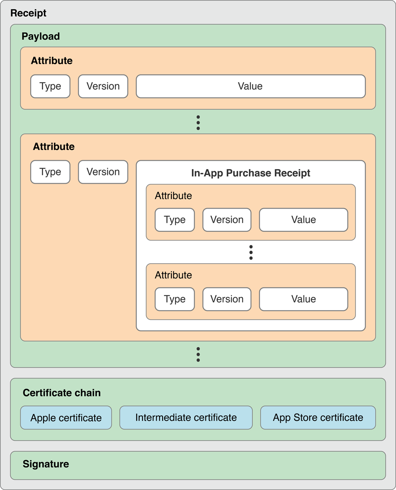

> 导航：[总目录](../../../README.md) · [releasenotes](../../../_indexes/releasenotes.md) · [Receipt Validation Programming Guide](About%20Receipt%20Validation.md)


# Validating Receipts Locally

Perform receipt validation immediately after your app is launched, before displaying any user interface or spawning any child processes. Implement this check in the `main` function, before the [NSApplicationMain](https://developer.apple.com/documentation/appkit/1428499-nsapplicationmain) function is called. For additional security, you may repeat this check periodically while your application is running.

## Locate and Parse the Receipt

When an application is installed from the App Store, it contains an application receipt that is cryptographically signed, ensuring that only Apple can create valid receipts. The receipt is stored inside the application bundle. Call the [appStoreReceiptURL](https://developer.apple.com/documentation/foundation/nsbundle/1407276-appstorereceipturl) method of the [NSBundle](https://developer.apple.com/library/archive/documentation/LegacyTechnologies/WebObjects/WebObjects_3.5/Reference/Frameworks/ObjC/Foundation/Classes/NSBundle/Description.html#//apple_ref/occ/cl/NSBundle) class to locate the receipt.

__Note:__ In macOS, if the `appStoreReceiptURL` method is not available (on older systems), you can fall back to a hardcoded path. The receipt’s path is `/Contents/_MASReceipt/receipt` inside the app bundle.

In iOS, if the `appStoreReceiptURL` method is not available (on older systems), you can fall back to validating the [transactionReceipt](https://developer.apple.com/documentation/storekit/skpaymenttransaction/1617722-transactionreceipt) property of an [SKPaymentTransaction](https://developer.apple.com/documentation/storekit/skpaymenttransaction) object with the App Store. For details, see [Validating Receipts With the App Store](Validating%20Receipts%20With%20the%20App%20Store.md#apple-f4xwc4dqnrsv64tfmyxwi33df52wszbpkridimbqgeydknztfvbuqmjqgqwvgvzr).

The receipt is a binary file with the structure shown in Figure 1-1.

__Figure 1-1__  Structure of a receipt



The outermost portion (labeled _Receipt_ in the figure) is a PKCS #7 container, as defined by RFC 2315, with its payload encoded using ASN.1 (Abstract Syntax Notation One), as defined by ITU-T X.690. The payload is composed of a set of _receipt attributes_. Each receipt attribute contains a type, a version, and a value.

The structure of the payload is defined using ASN.1 notation in Listing 1-1. You can use this definition with the `asn1c` tool to generate data type declarations and functions for decoding the payload, rather than writing that part of your code by hand. You may need to install `asn1c` first; it is available through [MacPorts](http://www.macports.org/) and [SourceForge](http://sourceforge.net/projects/asn1c/).

For information about keys found in a receipt, see [Receipt Fields](Receipt%20Fields.md#apple-f4xwc4dqnrsv64tfmyxwi33df52wszbpkridimbqgeydknztfvbuqmjqgywvgvzr).

To generate the code, save the payload description shown in Listing 1-1 to a file and, in Terminal, run the following command:

```
asn1c -fnative-types filename
```

After the `asn1c` tool finishes generating files in the current directory, add the files it generated to your Xcode project.

__Listing 1-1__  ASN.1 definition of the payload format

```
ReceiptModule DEFINITIONS ::=
BEGIN

ReceiptAttribute ::= SEQUENCE {
    type    INTEGER,
    version INTEGER,
    value   OCTET STRING
}

Payload ::= SET OF ReceiptAttribute

END
```

## Compute the Hash of the GUID

In macOS, use the method described in [Get the GUID in macOS](#apple-f4xwc4dqnrsv64tfmyxwi33df52wszbpkridimbqgeydknztfvbuqmjnknltcna) to fetch the computer’s GUID.

In iOS, use the value returned by the [identifierForVendor](https://developer.apple.com/documentation/uikit/uidevice/1620059-identifierforvendor) property of [UIDevice](https://developer.apple.com/documentation/uikit/uidevice) as the computer’s GUID.

To compute the hash, first concatenate the GUID value with the opaque value (the attribute of type 4) and the bundle identifier. Use the raw bytes from the receipt without performing any UTF-8 string interpretation or normalization. Then compute the SHA-1 hash of this concatenated series of bytes.

## Validate the Receipt

To validate the receipt, perform the following tests, in order:

1. Locate the receipt.

   If no receipt is present, validation fails.
2. Verify that the receipt is properly signed by Apple.

   If it is not signed by Apple, validation fails.
3. Verify that the bundle identifier in the receipt matches a hard-coded constant containing the `CFBundleIdentifier` value you expect in the `Info.plist` file.

   If they do not match, validation fails.
4. Verify that the version identifier string in the receipt matches a hard-coded constant containing the `CFBundleShortVersionString` value (for macOS) or the [CFBundleVersion](../../../documentation/General/Information%20Property%20List%20Key%20Reference/Core%20Foundation%20Keys.md#apple-f4xwc4dqnrsv64tfmyxwi33df52wszbpgiydambrgqztcljrgazdgnru) value (for iOS) that you expect in the `Info.plist` file.

   If they do not match, validation fails.
5. Compute the hash of the GUID as described in [Compute the Hash of the GUID](#apple-f4xwc4dqnrsv64tfmyxwi33df52wszbpkridimbqgeydknztfvbuqmjnknltk).

   If the result does not match the hash in the receipt, validation fails.

If all of the tests pass, validation passes.

__Note:__ Bundle identifiers and version identifier strings are UTF-8 strings, not just a series of bytes. Make sure you code your comparison logic accordingly.

If your app supports the Volume Purchase Program, check the receipt’s expiration date.

## Respond to Receipt Validation Failure

Validation can fail for a variety of reasons. For example, when users copy your application from one Mac to another, the GUID no longer matches, causing receipt validation to fail.

### Exit If Validation Fails in macOS

If validation fails in macOS, call `exit` with a status of `173`. This exit status notifies the system that your application has determined that its receipt is invalid. At this point, the system attempts to obtain a valid receipt and may prompt for the user’s iTunes credentials.

If the system successfully obtains a valid receipt, it relaunches the application. Otherwise, it displays an error message to the user, explaining the problem.

Do not display any error message to the user if validation fails. The system is responsible for trying to obtain a valid receipt or informing the user that the receipt is not valid.

### Refresh the Receipt If Validation Fails in iOS

If validation fails in iOS, use the [SKReceiptRefreshRequest](https://developer.apple.com/documentation/storekit/skreceiptrefreshrequest) class to refresh the receipt.

Do not try to terminate the app. At your option, you may give the user a grace period or restrict functionality inside your app.

## Set a Minimum System Version for Mac Apps

Include the `LSMinimumSystemVersion` key with a value of 10.6.6 or greater in your application’s `Info.plist` file. If receipt validation fails on versions of macOS earlier than 10.6.6, your application quits immediately after launch with no explanation to the user. Earlier versions of macOS do not interpret the exit status of `173`, so they do not try to obtain a valid receipt or display any error message.

## Don’t Localize Your Version Number

If your application is localized, the `CFBundleShortVersionString` key should not appear in any of your application’s `InfoPlist.strings` files. The unlocalized value from your `Info.plist` file is stored in the receipt—attempting to localize the value for this key can cause receipt validation to fail.

## Protect Your Validation Check

An attacker may try to circumvent the validation code by patching your application binary or altering the basic operating system routines that the validation code depends upon. Resilience against these types of attacks requires a variety of coding techniques, including the following:

- Inline the code for cryptographic checks instead of using the APIs provided by the system.
- Avoid simple code constructions that provide a trivial target for patching the application binary.

  For example, avoid writing code like the following:

  ```
  if (failedValidation) {
     exit(173);
  }
  ```
- Implement code robustness techniques, such as obfuscation.

  If multiple applications use the same code for performing validation, this common code signature can be targeted by tools that patch application binaries.
- Ensure that, even if the `exit` function fails to terminate your application, your application stops running.

## Test During the Development Process

In order to test your main application during the development process, you need a valid receipt so that your application launches. To set this up, do the following:

1. Make sure you have Internet access so you can connect to Apple’s servers.
2. Launch your application by double-clicking on it (or in some way cause Launch Services to launch it).

After you launch your application, the following occurs:

- Your application fails to validate its receipt because there is no receipt present, and it exits with a status of `173`.
- The system interprets the exit status and attempts to obtain a valid receipt. Assuming your application signing certificate is valid, the system installs a valid receipt for the application. The system may prompt you for your iTunes credentials.
- The system relaunches your application, and your application successfully validates the receipt.

With this development receipt installed, you can launch your application by any method—for example, with `gdb` or the Xcode debugger.

## Validate In-App Purchases

To validate an in-app purchase, your application performs the following tests, in order:

1. Parse and validate the application’s receipt, as described in the previous sections.

   If the receipt is not valid, none of the in-app purchases are valid.
2. Parse the in-app purchase receipts (the values for the attributes of type 17).

   Each in-app purchase receipt consists of a set of attributes, like the application’s receipt does. The structure for these receipts is defined in [Listing 1-2](#apple-f4xwc4dqnrsv64tfmyxwi33df52wszbpkridimbqgeydknztfvbuqmjnknltena). As when parsing the receipt, you can generate some of your code from the ASN.1 description using the `asn1c` tool. Ignore all attributes with types that do not appear in the table—they are reserved for use by the system and their contents may change at any time.

   For information about the fields in a receipt, see [Receipt Fields](Receipt%20Fields.md#apple-f4xwc4dqnrsv64tfmyxwi33df52wszbpkridimbqgeydknztfvbuqmjqgywvgvzr).
3. Examine the product identifier for each in-app purchase receipt and enable the corresponding functionality or content in your app. For information about how to calculate a subscription's active period, see [Working with Subscriptions](../../../documentation/Networking%20Internet/In-App%20Purchase%20Programming%20Guide/Working%20with%20Subscriptions.md#apple-f4xwc4dqnrsv64tfmyxwi33df52wszbpkridimbqga4denrxfvbuqny).

If validation of an in-app purchase receipt fails, your application simply does not enable the functionality or content.

__Listing 1-2__  ASN.1 definition of the in-app purchase receipt format

```
InAppAttribute ::= SEQUENCE {
    type                   INTEGER,
    version                INTEGER,
    value                  OCTET STRING
}

InAppReceipt ::= SET OF InAppAttribute
```

The attributes for the original transaction identifier and original transaction date are used when a purchase is redownloaded. The redownloaded purchase is given a new transaction identifier, but it contains the identifier and date of the original purchase.

## Implementation Tips

This section contains several code listings for your reference as you implement receipt validation.

### Get the GUID in macOS

In macOS, follow the model in Listing 1-3 (or even use this exact same code), so that the method you use to get the GUID in your validation code is exactly the same as the method used when the application’s receipt was created.

__Listing 1-3__  Get the computer’s GUID

```objc
#import <IOKit/IOKitLib.h>
#import <Foundation/Foundation.h>

// Returns a CFData object, containing the computer's GUID.
CFDataRef copy_mac_address(void)
{
    kern_return_t             kernResult;
    mach_port_t               master_port;
    CFMutableDictionaryRef    matchingDict;
    io_iterator_t             iterator;
    io_object_t               service;
    CFDataRef                 macAddress = nil;

    kernResult = IOMasterPort(MACH_PORT_NULL, &master_port);
    if (kernResult != KERN_SUCCESS) {
        printf("IOMasterPort returned %d\n", kernResult);
        return nil;
    }

    matchingDict = IOBSDNameMatching(master_port, 0, "en0");
    if (!matchingDict) {
        printf("IOBSDNameMatching returned empty dictionary\n");
        return nil;
    }

    kernResult = IOServiceGetMatchingServices(master_port, matchingDict, &iterator);
    if (kernResult != KERN_SUCCESS) {
        printf("IOServiceGetMatchingServices returned %d\n", kernResult);
        return nil;
    }

    while((service = IOIteratorNext(iterator)) != 0) {
        io_object_t parentService;

        kernResult = IORegistryEntryGetParentEntry(service, kIOServicePlane,
                &parentService);
        if (kernResult == KERN_SUCCESS) {
            if (macAddress) CFRelease(macAddress);

            macAddress = (CFDataRef) IORegistryEntryCreateCFProperty(parentService,
                    CFSTR("IOMACAddress"), kCFAllocatorDefault, 0);
            IOObjectRelease(parentService);
        } else {
            printf("IORegistryEntryGetParentEntry returned %d\n", kernResult);
        }

        IOObjectRelease(service);
    }
    IOObjectRelease(iterator);

    return macAddress;
}
```

### Parse the Receipt and Verify Its Signature

Use the following code listings as an outline of one possible implementation of receipt validation using OpenSSL and `asn1c`. These listings are provided to guide you as you write your own code, by highlighting relevant APIs and data structures, not to use as a copy-and-paste solution.

If you use OpenSSL, statically link your binary against it. Dynamic linking against OpenSSL is deprecated and results in build warnings.

Make sure your code does the following as outlined in the listings:

1. Verify the signature ([Listing 1-4](#apple-f4xwc4dqnrsv64tfmyxwi33df52wszbpkridimbqgeydknztfvbuqmjnknltcoa)).
2. Parse the payload ([Listing 1-5](#apple-f4xwc4dqnrsv64tfmyxwi33df52wszbpkridimbqgeydknztfvbuqmjnknltcoi)).
3. Extract the receipt attributes ([Listing 1-6](#apple-f4xwc4dqnrsv64tfmyxwi33df52wszbpkridimbqgeydknztfvbuqmjnknltema)).
4. Compute the hash of the GUID ([Listing 1-7](#apple-f4xwc4dqnrsv64tfmyxwi33df52wszbpkridimbqgeydknztfvbuqmjnknltcma)).

__Listing 1-4__  Verify the signature using OpenSSL

```
/* The PKCS #7 container (the receipt) and the output of the verification. */
BIO *b_p7;
PKCS7 *p7;

/* The Apple root certificate, as raw data and in its OpenSSL representation. */
BIO *b_x509;
X509 *Apple;

/* The root certificate for chain-of-trust verification. */
X509_STORE *store = X509_STORE_new();

/* ... Initialize both BIO variables using BIO_new_mem_buf() with a buffer and its size ... */

/* Initialize b_out as an output BIO to hold the receipt payload extracted during signature verification. */
BIO *b_out = BIO_new(BIO_s_mem());

/* Capture the content of the receipt file and populate the p7 variable with the PKCS #7 container. */
p7 = d2i_PKCS7_bio(b_p7, NULL);

/* ... Load the Apple root certificate into b_X509 ... */

/* Initialize b_x509 as an input BIO with a value of the Apple root certificate and load it into X509 data structure. Then add the Apple root certificate to the structure. */
Apple = d2i_X509_bio(b_x509, NULL);
X509_STORE_add_cert(store, Apple);

/* Verify the signature. If the verification is correct, b_out will contain the PKCS #7 payload and rc will be 1. */
int rc = PKCS7_verify(p7, NULL, store, NULL, b_out, 0);

/* You must verify the fingerprint of the root certificate and verify the OIDs of the intermediate certificate and signing certificate. The OID in the certificate policies extension of the intermediate certificate is (1 2 840 113635 100 6 2 1), and the marker OID of the signing certificate is (1 2 840 113635 100 6 11 1). */
```

__Listing 1-5__  Parse the payload using asn1c

```c
#include "Payload.h" /* This header file is generated by asn1c. */

/* The receipt payload and its size. */
void *pld = NULL;
size_t pld_sz;

/* Variables used to parse the payload. Both data types are declared in Payload.h. */
Payload_t *payload = NULL;
asn_dec_rval_t rval;

/* ... Load the payload from the receipt file into pld and set pld_sz to the payload size ... */

/* Parse the buffer using the decoder function generated by asn1c.  The payload variable will contain the receipt attributes. */
rval = asn_DEF_Payload.ber_decoder(NULL, &asn_DEF_Payload, (void **)&payload, pld, pld_sz, 0);
```

__Listing 1-6__  Extract the receipt attributes

```
/* Variables used to store the receipt attributes. */
OCTET_STRING_t *bundle_id = NULL;
OCTET_STRING_t *bundle_version = NULL;
OCTET_STRING_t *opaque = NULL;
OCTET_STRING_t *hash = NULL;

/* Iterate over the receipt attributes, saving the values needed to compute the GUID hash. */
size_t i;
for (i = 0; i < payload->list.count; i++) {
    ReceiptAttribute_t *entry;

    entry = payload->list.array[i];

    switch (entry->type) {
        case 2:
            bundle_id = &entry->value;
            break;
        case 3:
            bundle_version = &entry->value;
            break;
        case 4:
            opaque = &entry->value;
            break;
        case 5:
            hash = &entry->value;
            break;
        }
    }
```

__Listing 1-7__  Compute the hash of the GUID

```
/* The GUID returned by copy_mac_address() is a CFDataRef.  Use CFDataGetBytePtr() and CFDataGetLength() to get a pointer to the bytes that make up the GUID and to get its length. */
UInt8 *guid = NULL;
size_t guid_sz;

/* Declare and initialize an EVP context for OpenSSL. */
EVP_MD_CTX evp_ctx;
EVP_MD_CTX_init(&evp_ctx);

/* A buffer for result of the hash computation. */
UInt8 digest[20];

/* Set up the EVP context to compute a SHA-1 digest. */
EVP_DigestInit_ex(&evp_ctx, EVP_sha1(), NULL);

/* Concatenate the pieces to be hashed.  They must be concatenated in this order. */
EVP_DigestUpdate(&evp_ctx, guid, guid_sz);
EVP_DigestUpdate(&evp_ctx, opaque->buf, opaque->size);
EVP_DigestUpdate(&evp_ctx, bundle_id->buf, bundle_id->size);

/* Compute the hash, saving the result into the digest variable. */
EVP_DigestFinal_ex(&evp_ctx, digest, NULL);
```
