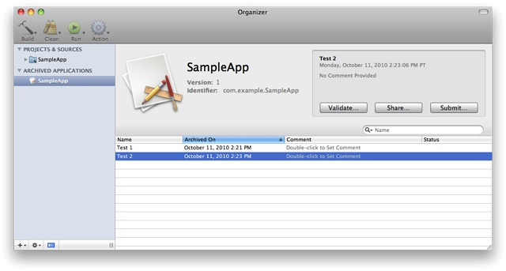

> 导航：[总目录](../../../README.md) · [releasenotes](../../../_indexes/releasenotes.md)


# Submitting to the Mac App Store

> [!IMPORTANT]

The Mac App Store is the preferred way to deliver your application to your users. It makes it easy for them to find and purchase your application, and offers them the most streamlined installation experience. You can submit your application from within Xcode, or (if you need to) you can submit it using Application Loader.

You can add receipt validation code to your application to prevent unauthorized copies of your application from running. For more details, refer to _[Receipt Validation Programming Guide](https://developer.apple.com/library/archive/releasenotes/General/ValidateAppStoreReceipt/Introduction.html#//apple_ref/doc/uid/TP40010573)_.

#### Contents:

- [Requirements](#apple-f4xwc4dqnrsv64tfmyxwi33df52wszbpkridimbqgeydknzsfvbuqmjwfvjvoni)
- [Submit Your Application using Xcode](#apple-f4xwc4dqnrsv64tfmyxwi33df52wszbpkridimbqgeydknzsfvbuqmjwfvjvomq)
- [Submit Your Application using Application Loader](#apple-f4xwc4dqnrsv64tfmyxwi33df52wszbpkridimbqgeydknzsfvbuqmjwfvjvomy)
- [Test the Installation Process](#apple-f4xwc4dqnrsv64tfmyxwi33df52wszbpkridimbqgeydknzsfvbuqmjwfvjvony)
- [File-System Usage Requirements for the Mac App Store](#apple-f4xwc4dqnrsv64tfmyxwi33df52wszbpkridimbqgeydknzsfvbuqmjwfvjvooi)
- [Helper Application Requirements for the Mac App Store](#apple-f4xwc4dqnrsv64tfmyxwi33df52wszbpkridimbqgeydknzsfvbuqmjwfvjvomjr)
- [Categorize Your Application](#apple-f4xwc4dqnrsv64tfmyxwi33df52wszbpkridimbqgeydknzsfvbuqmjwfvjvooa)

### Requirements

Before submitting your application, make sure that you have done the following:

- Read the [submission checklist](https://developer.apple.com/devcenter/mac/checklist/) and make sure you have entered the appropriate information into iTunes Connect, and that your application meets the submission requirements.
- Install your code signing certificate and select it in the Build pane of the project inspector. The name of this certificate begins with “3rd Party Mac Developer Application.” For more details, or to download your certificate, visit the [Developer Certificate Utility](https://developer.apple.com/certificates/index.action).
- In your build settings, ensure that the debug information is set to “DWARF with dSYM,” and that the list of valid architectures does not include PPC.
- Make sure that your `Info.plist` file contains a valid bundle ID, bundle version, and copyright string. For more details, see [CFBundleIdentifier](../../../documentation/General/Information%20Property%20List%20Key%20Reference/Core%20Foundation%20Keys.md#apple-f4xwc4dqnrsv64tfmyxwi33df52wszbpgiydambrgqztcljrgazdanzq), [CFBundleShortVersionString](../../../documentation/General/Information%20Property%20List%20Key%20Reference/Core%20Foundation%20Keys.md#apple-f4xwc4dqnrsv64tfmyxwi33df52wszbpgiydambrgqztcljrgeytgnbz), and NSHumanReadableCopyright in _[Information Property List Key Reference](../../../documentation/General/Information%20Property%20List%20Key%20Reference/About%20Info.plist%20Keys%20and%20Values.md#apple-f4xwc4dqnrsv64tfmyxwi33df52wszbpkridimbqga4tenbx)_.
- In your `Info.plist` file, set the value of the `LSApplicationCategoryType` key to the category of your application. For a list of categories, see [Categorize Your Application](#apple-f4xwc4dqnrsv64tfmyxwi33df52wszbpkridimbqgeydknzsfvbuqmjwfvjvooa).
- Ensure that every bundle identifier is unique within your application bundle. For example, if your application bundle includes an assistive executable, ensure that you do not include two copies of a framework that is used by both your application and the assistive executable.
- Ensure that all executable code in your application bundle is signed and has the correct entitlements set in its code signature.
- If your application validates its receipt, ensure that validation takes place immediately after launch, before you display any user interface. For details on receipt validation, see [“Validating App Store Receipts”](https://developer.apple.com/devcenter/mac/documents/validating.html).
- If your application creates or modifies files, ensure that it meets the additional requirements described in [File-System Usage Requirements for the Mac App Store](#apple-f4xwc4dqnrsv64tfmyxwi33df52wszbpkridimbqgeydknzsfvbuqmjwfvjvooi).
- If your application uses a background helper application, ensure that it meets the additional requirements described in [Helper Application Requirements for the Mac App Store](#apple-f4xwc4dqnrsv64tfmyxwi33df52wszbpkridimbqgeydknzsfvbuqmjwfvjvomjr).

### Submit Your Application using Xcode

> [!NOTE]
>
> __iOS Developers:__
> The procedure is very similar to the way you submit an iOS app.

You can use Xcode to submit your application as follows:

1. Archive your application.

   - Open your project in Xcode.
   - Select the Release build configuration.
   - Choose Build > Build and Archive.
2. Test the installation process.

   - Open the Organizer window and select the desired archive.
   - Click Share, then select Save to Disk.
   - Test the resulting package as described in [Test the Installation Process](#apple-f4xwc4dqnrsv64tfmyxwi33df52wszbpkridimbqgeydknzsfvbuqmjwfvjvony).
3. In the Organizer window, select the desired archive, and click Submit. Then select your installer signing certificate (its name begins with “3rd Party Mac Developer Installer”) from the drop-down menu in the sheet to sign your archive for submission.



### Submit Your Application using Application Loader

Using Xcode to submit your application is recommended in most cases. However, submitting using Application Loader may be more appropriate to your organization’s structure or build process. If your application needs to enforce minimum configuration requirements, you must use this method.

You can use Application Loader to submit your application as follows:

1. If you built your application with Xcode and specified your application signing certificate as described in [Requirements](#apple-f4xwc4dqnrsv64tfmyxwi33df52wszbpkridimbqgeydknzsfvbuqmjwfvjvoni), your application is already signed.

   Otherwise, use `codesign` to sign your application with your application signing certificate (its name begins with “3rd Party Mac Developer Application”).
2. Archive your application using the `productbuild` command. The following listing shows a typical usage:

   ```
   productbuild \
       --component build/Release/Sample.app /Applications \
       --sign "3rd Party Mac Developer Installer: John Appleseed" \
       --product product_definition.plist Sample.pkg
   ```

   The `productbuild` command can build a variety of product types; it provides a number of options that are not appropriate for submissions to the Mac App Store. You should specify a single component, a signature, and (optionally) a product definition file. The option to install into the user’s home directory is not supported.

   For more details about `productbuild`, see its man page.

   Alternatively, use Xcode to archive your application by following the steps in [Submit Your Application using Xcode](#apple-f4xwc4dqnrsv64tfmyxwi33df52wszbpkridimbqgeydknzsfvbuqmjwfvjvomq), then click Share in the Organizer window and save the archive to a file.

   > [!NOTE]
   >
   > __Note:__
   > Using the PackageMaker application to archive your application is not supported.
3. Test the installation process, as described in [Test the Installation Process](#apple-f4xwc4dqnrsv64tfmyxwi33df52wszbpkridimbqgeydknzsfvbuqmjwfvjvony).
4. Submit the package to the Mac App Store using Application Loader. The file name of the package must not have spaces in it, and the file extension must be `pkg`.

### Test the Installation Process

Before you submit to the Mac App Store, you should test the installation process to verify that your application installs correctly. Use the `installer` command. For example:

```
sudo installer -store -pkg
path-to-package
 -target /
```

If the installer finds an application bundle with the same bundle identifier as the one it is installing, it upgrades the existing application in place. This allows your users to install upgrades even if they have moved your application. If you have a copy of your application installed (for example, in your build products directory), you may want to remove it so that your application gets installed in `/Applications`. Other options include archiving the existing version in a ZIP file, or moving it to another volume and unmounting that volume.

Do not test the installation process by opening the package with the Installer application. Only the `installer` command verifies that your application will be installed correctly when it is purchased from the Mac App Store.

### File-System Usage Requirements for the Mac App Store

To promote a more consistent user experience, applications submitted to the Mac App Store must follow certain rules about where they write files. Users can be confused when applications cause unexpected side effects on the file system (for example, storing databases in the user’s Documents folder, storing files in the user’s Library folder that are not recognizably associated with your application, storing user data in the user’s Library folder, and so on).

Your application must adhere to the following requirements:

- You may use Apple frameworks such as User Defaults, Calendar Store, and Address Book that implicitly write to files in specific locations, including locations your application is not allowed to access directly.
- Your application may write to temporary paths that you acquire using the appropriate Apple programming interfaces.
- Your application may write to the following directories:

  - `~/Library/Application Support/<app-identifier>`
  - `~/Library/<app-identifier>`
  - `~/Library/Caches/<app-identifier>`

  where _<app-identifier>_ is your application's bundle identifier, its name, or your company’s name. This must exactly match what is in iTunes Connect for the application.

  Always use Apple programming interfaces such as the [URLsForDirectory:inDomains:](https://developer.apple.com/documentation/foundation/nsfilemanager/1407726-urlsfordirectory) function to locate these paths rather than hardcoding them. For more information, see _[File System Programming Guide](../../../documentation/File%20Management/File%20System%20Programming%20Guide/About%20Files%20and%20Directories.md#apple-f4xwc4dqnrsv64tfmyxwi33df52wszbpkridimbqgeydmnzs)_.
- If your application manages libraries of pictures, music, or movies, the application may also write to the following directories:

  - `~/Pictures/<app-identifier>`
  - `~/Music/<app-identifier>`
  - `~/Movies/<app-identifier>`
- If the user explicitly chooses to save data in an alternate location (using a Save As dialog), your application may write to the chosen location.

### Helper Application Requirements for the Mac App Store

Applications can contain a helper application as a full application bundle, stored inside the main application bundle. Use the Service Management framework to enable the helper application as a login item, as described in [Adding Login Items Using the Service Management Framework](../../../documentation/Mac%20OSX/Daemons%20and%20Services%20Programming%20Guide/Adding%20Login%20Items.md#apple-f4xwc4dqnrsv64tfmyxwi33df52wszbpgeydambqge3te2jnknltklktk4yq).

### Categorize Your Application

You must define your application’s category by adding the `LSApplicationCategoryType` key at the root level of your `Info.plist` file. The value of this key is exactly one of the following UTIs:

| Category | UTI |
| --- | --- |
| Business | `public.app-category.business` |
| Developer Tools | `public.app-category.developer-tools` |
| Education | `public.app-category.education` |
| Entertainment | `public.app-category.entertainment` |
| Finance | `public.app-category.finance` |
| Games | `public.app-category.games` |
| Graphics & Design | `public.app-category.graphics-design` |
| Healthcare & Fitness | `public.app-category.healthcare-fitness` |
| Lifestyle | `public.app-category.lifestyle` |
| Medical | `public.app-category.medical` |
| Music | `public.app-category.music` |
| News | `public.app-category.news` |
| Photography | `public.app-category.photography` |
| Productivity | `public.app-category.productivity` |
| Reference | `public.app-category.reference` |
| Social Networking | `public.app-category.social-networking` |
| Sports | `public.app-category.sports` |
| Travel | `public.app-category.travel` |
| Utilities | `public.app-category.utilities` |
| Video | `public.app-category.video` |
| Weather | `public.app-category.weather` |

For games, you can use one of the UTIs that are specific to games instead:

| Category | UTI |
| --- | --- |
| Action Games | `public.app-category.action-games` |
| Adventure Games | `public.app-category.adventure-games` |
| Arcade Games | `public.app-category.arcade-games` |
| Board Games | `public.app-category.board-games` |
| Card Games | `public.app-category.card-games` |
| Casino Games | `public.app-category.casino-games` |
| Dice Games | `public.app-category.dice-games` |
| Educational Games | `public.app-category.educational-games` |
| Family Games | `public.app-category.family-games` |
| Kids Games | `public.app-category.kids-games` |
| Music Games | `public.app-category.music-games` |
| Puzzle Games | `public.app-category.puzzle-games` |
| Racing Games | `public.app-category.racing-games` |
| Role Playing Games | `public.app-category.role-playing-games` |
| Simulation Games | `public.app-category.simulation-games` |
| Sports Games | `public.app-category.sports-games` |
| Strategy Games | `public.app-category.strategy-games` |
| Trivia Games | `public.app-category.trivia-games` |
| Word Games | `public.app-category.word-games` |

