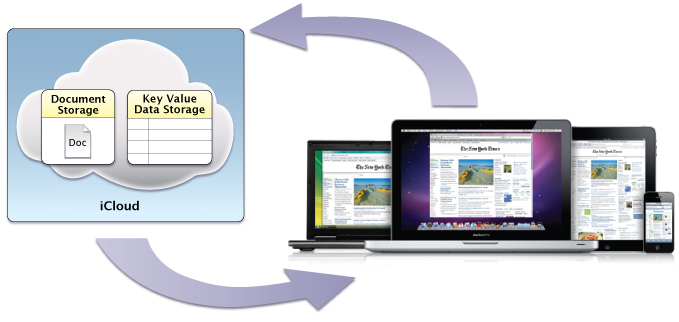
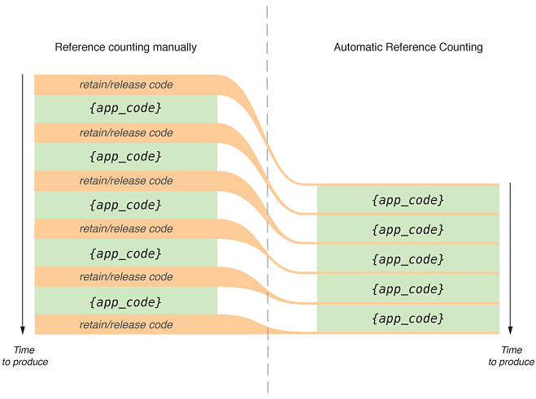
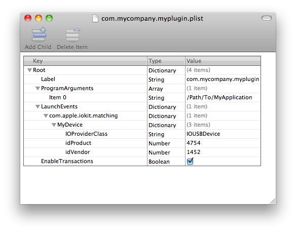

> 导航：[总目录](../../../README.md) · [releasenotes](../../../_indexes/releasenotes.md) · [What's New in macOS](Introduction.md)

[Next](OS%20X%20Snow%20Leopard%20v10.6.md)[Previous](OS%20X%20Mountain%20Lion%20v10.8.md)

# OS X Lion v10.7

This article summarizes the key technology changes and improvements that are available beginning with OS X Lion v10.7. The information about these changes is organized into sections by technology area:

- [Major Features](#apple-f4xwc4dqnrsv64tfmyxwi33df52wszbpkridimbqgeydgnjvfvjvomi) describes overarching changes that span multiple technology areas or are otherwise of particular importance.
- [Framework-Level Features](#apple-f4xwc4dqnrsv64tfmyxwi33df52wszbpkridimbqgeydgnjvfvjvomy) describes changes to system frameworks.
- [BSD And Kernel Features](#apple-f4xwc4dqnrsv64tfmyxwi33df52wszbpkridimbqgeydgnjvfvjvomq) describes changes to the UNIX/POSIX portions of OS X and to the OS X kernel, device drivers, and kernel extensions.
- [App Features](#apple-f4xwc4dqnrsv64tfmyxwi33df52wszbpkridimbqgeydgnjvfvjvona) describes changes in the behavior of built-in apps such as Safari.
- [OS X Server](#apple-f4xwc4dqnrsv64tfmyxwi33df52wszbpkridimbqgeydgnjvfvjvonbu) describes changes to OS X Server.

For a complete, detailed list of API changes, read _[OS X v10.7 API Diffs](https://developer.apple.com/library/archive/releasenotes/General/MacOSXLionAPIDiffs/index.html#//apple_ref/doc/uid/TP40010630)_.

Please file any bug reports about this seed or this documentation using [http://bugreport.apple.com/](http://bugreport.apple.com/).

The following sections highlight features that span multiple technology areas or that are otherwise of particular importance in OS X v10.7.

When you use the iCloud storage APIs, your app writes user documents and data to a central location. A user can view or edit those documents from any device without having to sync or transfer files explicitly. Storing documents in a user’s iCloud account also provides a layer of security for that user. Even if a user loses a device, the documents on that device are not lost if they are in iCloud storage.

There are two types of iCloud storage that your app can take advantage of:

- Use iCloud document storage to store user documents and data in a user’s iCloud account.
- Use iCloud key-value data storage to share small amounts of data among instances of your app.

To learn more about adding iCloud storage to your app, read iCloud Storage in _[Mac App Programming Guide](../../../documentation/General/Mac%20App%20Programming%20Guide/About%20OS%20X%20App%20Design.md#apple-f4xwc4dqnrsv64tfmyxwi33df52wszbpkridimbqgeydknbt)_.

_Automatic Reference Counting (ARC)_ is a compiler-level feature that simplifies the process of managing the lifetimes of Objective-C objects. Instead of you having to remember when to retain or release an object, ARC evaluates the lifetime requirements of your objects and automatically inserts the appropriate method calls at compile time.

ARC replaces the traditional managed-memory-model style of programming found in earlier versions of OS X. Any new projects you create automatically use ARC. And Xcode provides migration tools to help convert existing projects to use ARC. For more information about how to perform this migration, see _[What’s New in Xcode](../../../documentation/Developer%20Tools/What%E2%80%99s%20New%20in%20Xcode/What%27s%20New%20in%20Xcode%209.md#apple-f4xwc4dqnrsv64tfmyxwi33df52wszbpkridimbqga2dmmrw)_. For more information about ARC itself, see _[Transitioning to ARC Release Notes](../../Objective%20C/Transitioning%20to%20ARC%20Release%20Notes.md#apple-f4xwc4dqnrsv64tfmyxwi33df52wszbpkridimbqgeytemrw)_.

Resume is a systemwide enhancement of the user experience, introduced in OS X v10.7, that supports app persistence. A user can log out or shut down the operating system, and on next login or startup, OS X automatically relaunches the apps that were last running and restores the windows that were last opened. If your app provides the necessary support, reopened windows have the same size and location as before; in addition, window contents are scrolled to the previous position and selections are restored.

When an app that supports sudden termination goes unused or has no open windows, OS X may terminate it behind the scenes. When a user wants to use the app again, it usually relaunches instantly. Users who want to quit apps manually can still do so, but it is no longer necessary.

App persistence requires you to implement the ancillary programmatic features of automatic and sudden app termination, user interface preservation, and automatic data saving.

To learn more about the elements of Resume, read [Support the Key Runtime Behaviors in Your Apps](../../../documentation/General/Mac%20App%20Programming%20Guide/The%20Core%20App%20Design.md#apple-f4xwc4dqnrsv64tfmyxwi33df52wszbpkridimbqgeydknbtfvbuqmznknltcna) in _[Mac App Programming Guide](../../../documentation/General/Mac%20App%20Programming%20Guide/About%20OS%20X%20App%20Design.md#apple-f4xwc4dqnrsv64tfmyxwi33df52wszbpkridimbqgeydknbt)_.

Cocoa Auto Layout, a feature introduced in OS X v10.7, improves upon the “springs and struts” model previously used to lay out the elements of a user interface. _Auto Layout_ is a rule-based system designed to implement the layout guidelines described in _OS X Human Interface Guidelines_. It expresses a larger class of relationships and is more intuitive to use than springs and struts.

The entities used in Auto Layout are Objective-C objects called _constraints_. This approach brings you a number of benefits:

- Localization through swapping of strings alone, instead of also revamping layouts
- Mirroring of user-interface elements for right-to-left languages like Hebrew and Arabic
- Better layering of responsibility between objects in the view and controller layers

  A view object usually knows best about its standard size and its positioning within its superview and relative to its sibling views. A controller can override these values if something nonstandard is required.

For information about this feature, see _[Auto Layout Guide](https://developer.apple.com/library/archive/documentation/UserExperience/Conceptual/AutolayoutPG/index.html#//apple_ref/doc/uid/TP40010853)_.

File coordination, introduced in OS X v10.7, eliminates file-system inconsistencies due to overlapping read and write operations from competing processes. When you use the [NSDocument](https://developer.apple.com/documentation/appkit/nsdocument) class from the AppKit framework, you get file coordination with very little effort. To use file coordination explicitly, you employ the [NSFileCoordinator](https://developer.apple.com/documentation/foundation/nsfilecoordinator) class and the [NSFilePresenter](https://developer.apple.com/documentation/foundation/nsfilepresenter) protocol, both from the Foundation framework.

Use file coordination only with files that you think users might share with other users, not (for example) with files written to cache or temporary locations. File coordination is an enabling technology for automatic document saving, App Sandbox, and other features introduced in OS X v10.7. For more information on file coordination, see [Coordinating File Access with Other Processes](../../../documentation/General/Mac%20App%20Programming%20Guide/The%20Mac%20Application%20Environment.md#apple-f4xwc4dqnrsv64tfmyxwi33df52wszbpkridimbqgeydknbtfvbuqmrnknltcnq) in _[Mac App Programming Guide](../../../documentation/General/Mac%20App%20Programming%20Guide/About%20OS%20X%20App%20Design.md#apple-f4xwc4dqnrsv64tfmyxwi33df52wszbpkridimbqgeydknbt)_.

Starting in OS X v10.7, you can enable full-screen mode for your app by calling a single method. Enabling full-screen mode adds an Enter Full Screen menu item to the View menu or, if there is no View menu, to the Window menu. When a user chooses this menu item, the frontmost app or document window fills the entire screen.

You enable and manage full-screen support through methods of the [NSApplication](https://developer.apple.com/documentation/appkit/nsapplication) and [NSWindow](https://developer.apple.com/documentation/appkit/nswindow) classes and the [NSWindowDelegate Protocol](https://developer.apple.com/documentation/appkit/nswindowdelegate). To find out more about this feature, read [Implementing the Full-Screen Experience](https://developer.apple.com/library/archive/documentation/General/Conceptual/MOSXAppProgrammingGuide/FullScreenApp/FullScreenApp.html#//apple_ref/doc/uid/TP40010543-CH6) in _[Mac App Programming Guide](../../../documentation/General/Mac%20App%20Programming%20Guide/About%20OS%20X%20App%20Design.md#apple-f4xwc4dqnrsv64tfmyxwi33df52wszbpkridimbqgeydknbt)_.

Starting in OS X v10.7, AppKit provides support for popovers by way of the [NSPopover](https://developer.apple.com/documentation/appkit/nspopover) class. A popover provides a means to display additional content related to existing content on the screen. The view containing the existing content—from which the popover arises—is referred to in this context as a _positioning view_. You use an anchor to express the relation between a popover and its positioning view.

You configure a popover in terms of appearance and behavior. One important part of this task is to specify which user interactions cause the popover to close. By implementing the appropriate delegate method, you can configure a popover to detach itself and become a separate window when a user drags it.

For more information, see _[NSPopover Class Reference](https://developer.apple.com/documentation/appkit/nspopover)_ and _[NSPopoverDelegate Protocol Reference](https://developer.apple.com/documentation/appkit/nspopoverdelegate)_. For guidelines on using popovers, see Popovers in _OS X Human Interface Guidelines_.

Introduced in OS X v10.7, App Sandbox provides a last line of defense against stolen, corrupted, or deleted user data if malicious code exploits your app. App Sandbox also minimizes the damage from coding errors. Its strategy is twofold:

1. App Sandbox enables you to describe how your app interacts with the system. The system then grants your app the access it needs to get its job done, and no more.
2. App Sandbox allows the user to transparently grant your app additional access by using Open and Save dialogs, drag and drop, and other familiar user interactions.

You describe your app’s interaction with the system by setting entitlements in Xcode. For details on all the entitlements available in OS X, see _[Entitlement Key Reference](../../../documentation/Miscellaneous/Entitlement%20Key%20Reference/About%20Entitlements.md#apple-f4xwc4dqnrsv64tfmyxwi33df52wszbpkridimbqgeytcojv)_.

Some app operations are more likely to be targets of malicious exploitation. Examples are the parsing of data received over a network and the decoding of video frames. You can improve the effectiveness of the damage containment offered by App Sandbox by separating such potentially dangerous activities into their own address spaces.

For a complete explanation of App Sandbox and how to use it, read _[App Sandbox Design Guide](https://developer.apple.com/library/archive/documentation/Security/Conceptual/AppSandboxDesignGuide/AboutAppSandbox/AboutAppSandbox.html#//apple_ref/doc/uid/TP40011183)_.

The following sections highlight changes to frameworks and technologies in OS X v10.7.

Introduced in OS X v10.7, the AV Foundation framework (`AVFoundation.framework`) provides services for capturing, playing, inspecting, editing, and reencoding time-based audiovisual media. The framework includes many Objective-C classes, with the core class being [AVAsset](https://developer.apple.com/documentation/avfoundation/avasset); this class presents a uniform model and inspection interface for all forms and sources of audiovisual media.

For most audio recording and playback requirements, you can use the [AVAudioPlayer](https://developer.apple.com/documentation/avfoundation/avaudioplayer) and [AVAudioRecorder](https://developer.apple.com/documentation/avfoundation/avaudiorecorder) classes.

AV Foundation is the recommended API for all new development involving time-based audiovisual media. AV Foundation is also recommended for transitioning existing apps that were based on QuickTime or QTKit.

For more information about the classes of the AV Foundation framework and how to use them, see _[AVFoundation Programming Guide](../../../documentation/Audio%20Video/AVFoundation%20Programming%20Guide/About%20AVFoundation.md#apple-f4xwc4dqnrsv64tfmyxwi33df52wszbpkridimbqgeydcoby)_.

Starting in OS X v10.7, the [NSFontCollection](https://developer.apple.com/documentation/appkit/nsfontcollection) class provides all of the functionality provided by the [CTFontCollectionRef](https://developer.apple.com/documentation/coretext/ctfontcollection) opaque type, plus a few higher-level features to support font user interfaces. The two APIs are toll-free bridged.

For more information, see _[NSFontCollection Class Reference](https://developer.apple.com/documentation/appkit/nsfontcollection)_.

OS X v.10.7 introduces new classes and protocols to support multi-image drag and drop in your app. This feature allows fine-grained control over the appearance of multiple dragged icons as a drag proceeds.

When multiple items are dragged, they “flock” together. The source and destination apps can each influence the appearance of the icons at appropriate points during a drag.

For more information, see _[AppKit Release Notes for macOS 10.13](../../App%20Kit/AppKit%20Release%20Notes%20for%20macOS%2010.13.md)_, the [NSDraggingSession](https://developer.apple.com/documentation/appkit/nsdraggingsession), [NSDraggingItem](https://developer.apple.com/documentation/appkit/nsdraggingitem), and [NSDraggingImageComponent](https://developer.apple.com/documentation/appkit/nsdraggingimagecomponent) classes, and the [NSDraggingSource](https://developer.apple.com/documentation/appkit/nsdraggingsource) and [NSDraggingDestination](https://developer.apple.com/documentation/appkit/nsdraggingdestination) formal protocols.

OS X v10.7 introduces overlay scrollbars similar to those in iOS. Unless the user overrides scrollbar appearance using System Preferences, the following behavior occurs:

- If all of a user’s pointing devices support both horizontal and vertical touch scrolling, the scrollbars are hidden during normal use. They appear as an overlay on top of the window’s content while the user is scrolling and remain visible briefly to allow scrollbar dragging.
- If a user has at least one external pointing device that does not support scrolling, the scrollbar is displayed at all times and the usable space in the window is reduced, as in previous versions of OS X. (These permanent scrollbars are referred to as _legacy scrollbars_.)
- If a user has no external pointing devices attached, the trackpad settings control the scrollbar behavior; if a user has disabled scrolling for the trackpad in System Preferences, legacy scrollbars are used.

In addition, the scrollbars no longer contain scroll arrows (in overlay mode or in legacy mode).

Because these changes may affect your app layout, you should test your apps with both standard and scrolling pointing devices.

For more information, see _[AppKit Release Notes for macOS 10.13](../../App%20Kit/AppKit%20Release%20Notes%20for%20macOS%2010.13.md)_.

The scroll views in OS X v10.7 allow developers additional control over scrolling behavior with respect to the Magic Mouse device and trackpads. Specifically, new methods allow the developer to control the stretching behavior of [NSScrollView](https://developer.apple.com/documentation/appkit/nsscrollview) objects (auto or on/off in horizontal and vertical axes) and provide content hints to prevent unintentional scrolling drifts.

Additionally, new [NSEvent](https://developer.apple.com/documentation/appkit/nsevent) events have been added to support mouse momentum in scroll views.

For more information, see _[AppKit Framework Reference](https://developer.apple.com/documentation/appkit)_.

OS X v10.7 provides expanded UI for text autocorrection, similar to the functionality in iOS, with the opportunity for the user to accept or reject a proposed correction. As in iOS, the spell checker learns from the user’s responses, such as whether a correction was explicitly rejected, implicitly accepted, accepted at first and then revised, and so on.

For more information, see _[AppKit Framework Reference](https://developer.apple.com/documentation/appkit)_.

[NSTableView](https://developer.apple.com/documentation/appkit/nstableview) and [NSOutlineView](https://developer.apple.com/documentation/appkit/nsoutlineview) in OS X v10.7 now support the use of [NSView](https://developer.apple.com/documentation/appkit/nsview) objects instead of [NSCell](https://developer.apple.com/documentation/appkit/nscell) objects for content. This extension allows apps to easily provide a much richer interface for the content of cells within a table view.

OS X v10.7 also adds new functionality to provide animation of rows as they are added and deleted from the table view, providing a more context-based user experience.

For more information, see _[AppKit Framework Reference](https://developer.apple.com/documentation/appkit)_.

Safari, Xcode, and other apps support an in-window find. In OS X v10.7, this functionality has been extended to allow it to be used in views other than `NSTextView`.

In addition, user-editable window titles allow the developer to programmatically begin editing the window title, typically in response to a user interaction.

For more information, see _[AppKit Framework Reference](https://developer.apple.com/documentation/appkit)_.

OS X v10.7 adds the following enhancements:

- Core Data formalizes the concurrency model for managed object contexts by taking advantage of Grand Central Dispatch. When you create a context, you specify the dispatch queue association option it should adopt: confinement, private queue, or main queue. Contexts should always use the confinement pattern, just as they have prior to OS X v10.7. (In other words, you must not use the context on any thread other than the one on which you created it.) When sending messages to a context associated with a different queue (or thread), you must dispatch your block using the new `performBlock:` or `performBlockAndWait:` method.
- You can create nested managed object contexts, in which the parent object store of a context is another managed object context rather than the persistent store coordinator. This means that fetch and save operations are mediated by the parent context instead of by a coordinator. This pattern has a number of usage scenarios, including:

  - Performing background operations on a second thread or queue
  - Managing discardable edits, such as in an inspector window or view
- Managed objects support two significant new features: ordered relationships, and external storage for attribute values. If you specify that the value of a managed object attribute may be stored as an external record, Core Data heuristically decides on a per-value basis whether it should save the data directly in the database or store a URI to a separate file that it manages for you.
- There are two new classes, `NSIncrementalStore` and `NSIncrementalStoreNode`, that you can use to implement support for nonatomic persistent stores. The store does not have to be a relational database—for example, you could use a web service as the back end.

For more information, see _[Core Data Framework Reference](https://developer.apple.com/documentation/coredata)_.

OS X v10.7 adds support for enumerating ranges within an index set.

[NSIndexSet](https://developer.apple.com/documentation/foundation/nsindexset) is an abstraction of a set of indexes. Developers often also view it as a set of noncontiguous ranges, which is a natural extension of this abstraction. As a result, developers often want to be able to enumerate the contents of an `NSIndexSet` object in terms of ranges, instead of individual indexes. Beginning in OS X v10.7, `NSIndexSet` includes convenience methods to provide this enumeration functionality.

For more information, see _[NSIndexSet Class Reference](https://developer.apple.com/documentation/foundation/nsindexset)_.

In OS X 10.7, the Foundation framework adds a new class, `NSJSONSerialization`, to support conversion of JSON data ([http://www.json.org/](http://www.json.org/)) into Foundation types and vice versa.

For more information, see [NSJSONSerialization](https://developer.apple.com/documentation/foundation/nsjsonserialization) and _[Foundation Framework Reference](https://developer.apple.com/documentation/foundation)_.

OS X v10.7 introduces a linguistic tagging class, [NSLinguisticTagger](https://developer.apple.com/documentation/foundation/nslinguistictagger), that lets you break down a sentence into its grammatical components, allowing the determination of nouns, verbs, adverbs, and so on. This tagging works fully for the English language. The API provides a method to find out what capabilities are currently available in other languages as well.

For more information, see _[NSLinguisticTagger Class Reference](https://developer.apple.com/documentation/foundation/nslinguistictagger)_.

In OS X v10.7, the [NSFileWrapper](https://developer.apple.com/documentation/foundation/filewrapper) class is in the Foundation framework instead of the AppKit framework.

For more information, see _[Foundation Framework Reference](https://developer.apple.com/documentation/foundation)_ and _[AppKit Framework Reference](https://developer.apple.com/documentation/appkit)_.

OS X v10.7 now provides support for ordered sets. An [NSOrderedSet](https://developer.apple.com/documentation/foundation/nsorderedset) object contains each element at most once, and the elements can be accessed by a compact integer index space, numbered `0 .. (N-1)`. It thus combines two of the most salient features of the [NSSet](https://developer.apple.com/library/archive/documentation/LegacyTechnologies/WebObjects/WebObjects_3.5/Reference/Frameworks/ObjC/Foundation/Classes/NSSetClassCluster/Description.html#//apple_ref/occ/cl/NSSet) and [NSArray](https://developer.apple.com/library/archive/documentation/LegacyTechnologies/WebObjects/WebObjects_3.5/Reference/Frameworks/ObjC/Foundation/Classes/NSArrayClassCluster/Description.html#//apple_ref/occ/cl/NSArray) classes.

The `NSOrderedSet` class similarly borrows a lot from both `NSArray` and `NSSet` (and the mutable subclasses of each), but it is closer to `NSArray` than `NSSet`.

The main client for `NSOrderedSet` is Core Data.

For more information, see _[NSOrderedSet Class Reference](https://developer.apple.com/documentation/foundation/nsorderedset)_.

OS X v10.7 adds a Unicode-compatible regular expression class, [NSRegularExpression](https://developer.apple.com/documentation/foundation/nsregularexpression), along with related data detectors. This class is used to represent and apply regular expressions to Unicode strings. An instance of this class is an immutable representation of a compiled regular expression pattern and various option flags. The pattern syntax currently supported is that specified by International Components for Unicode (ICU).

The fundamental matching method for `NSRegularExpression` is a block iterator. This method allows clients to supply a block object, which will be invoked each time the regular expression matches a portion of the target string. There are additional convenience methods for returning all the matches as an array, the total number of matches, the first match, and the range of the first match.

For more information, see _[NSRegularExpression Class Reference](https://developer.apple.com/documentation/foundation/nsregularexpression)_.

Prior to OS X v.10.7, [NSXMLParser](https://developer.apple.com/documentation/foundation/xmlparser) always read the entire XML document into memory. Beginning in OS X v10.7, the class allows you to stream the data into memory as required.

For more information, see _[NSXMLParser Class Reference](https://developer.apple.com/documentation/foundation/xmlparser)_.

OS X v10.7 now provides OpenGL 3.2 on hardware capable of supporting its feature set. Read _[OpenGL Programming Guide for Mac](../../../documentation/Graphics%20Imaging/OpenGL%20Programming%20Guide%20for%20Mac/About%20OpenGL%20for%20OS%20X.md#apple-f4xwc4dqnrsv64tfmyxwi33df52wszbpkridimbqgaytsobx)_ to learn about selecting the OpenGL 3.2 Core profile.

Beginning in OS X v10.7, Quick Look provides a simple synchronous public method to create a Quick Look thumbnail or icon for a file.

Quick Look also now provides a public API for the Quick Look Preview panel, allowing the developer to display the panel.

For more information see _Quick Look Framework Reference for Mac_.

The Store Kit framework, previously available in iOS, is now also part of OS X. Classes of the Store Kit framework allow you to request payment from a user to purchase additional functionality or content from the Mac App Store. For more information about Store Kit, read _[In-App Purchase Programming Guide](https://developer.apple.com/library/archive/documentation/NetworkingInternet/Conceptual/StoreKitGuide/Introduction.html#//apple_ref/doc/uid/TP40008267)_ and _[Store Kit Framework Reference](https://developer.apple.com/documentation/storekit)_.

The following sections highlight changes to the UNIX/POSIX portions of OS X, including command-line functionality and libSystem. They also highlight changes to the kernel, device drivers, and kernel extensions.

The list of computers that boot K64 by default has grown to include the following hardware:

- Mac Mini (early 2009 and later)
- MacBook (Aluminum; late 2008 and later)
- MacBook Air (late 2008 and later)
- MacBook Pro (mid 2007 and later)
- iMac (mid 2007 and later)
- XServe (early 2008 and later)

A number of folders in the System and Local file system domains now have different ownership and permissions. Specifically:

- Many folders in the System domain that were previously owned by the `admin` group are now owned by the `wheel` group.
- Permissions for the root directory (`/`) are now mode 755 (writable only by root) instead of mode 775 (writable by the admin group).
- Permissions for `/Applications/Utilities` are now mode 755 (writable only by root) instead of mode 775 (writable by the admin group).
- Permissions for `/Library` are now mode 755 (writable only by root) instead of mode 775 (writable by the admin group), and are no longer sticky.

  All subdirectories within `/Library` now have mode 755 (writable only by root) permissions instead of mode 775 (writable by the admin group) _except:_

  - `/Library/Caches`
  - `/Library/Fonts`
  - `/Library/Java`
  - `/Library/QuickTimeStreaming`
  - `/Library/Receipts`
  - `/Library/Tomcat`

  The subdirectories listed above have the same permissions as in previous versions of OS X (usually mode 775, sometimes with the sticky bit set).
- Permissions for `/Network/Applications` and `/Network/Library` are now mode 555 (unwritable even by root) instead of mode 755 (writable only by root).
- Permissions for `/var/log/DiagnosticMessages` are slightly more lax, with mode 770 (writable by the admin group, unreadable by non-admin users) instead of mode 750 (writable only by root, unreadable by non-admin users).

In OS X v10.7, FileVault provides built-in support for encrypted root volumes. When you enable encryption, the system’s root volume is encrypted in the background and you can continue to use the system normally. Once encryption is enabled, on reboot or wake from sleep, you must log in before you can access any data on the drive.

Although this feature has limited developer impact (there is no public API for the underlying storage system), there are two things to notice:

- Assumptions that “boot = root” are much more likely to be wrong. (You should be allowing OS X to handle KEXT caches, so in general, this change should not cause problems.)
- The OS X UI may disallow enabling encryption if you have a particularly exotic driver stack. For example, if it is not possible to map a volume-relative block number to a physical block number.

IT developers should also be aware that the FileVault UI is disabled.

In general, if your driver worked correctly with AppleRAID in previous versions of OS X, it should also work correctly with Core Storage.

Beginning in OS X v10.7, you can use `launchd` to automatically launch an app whenever a specific device is detected by I/O Kit.

To use this feature, add a property list file to the `/Library/LaunchAgents` folder. The property list has the standard structure of a `launchd` property list file (see `launchd.plist`), with one additional item: an I/O Kit matching dictionary.

The I/O Kit matching dictionary contains a separate dictionary for each distinct device that you want associated with your app. Each of these device dictionaries should provide the product number, vendor number, and provider class for its device.

The I/O Kit matching plug-in watches for [IOService](https://developer.apple.com/documentation/kernel/ioservice) objects that match any of the device dictionaries you provide and launches your app when at least one is detected. If your app terminates when there is at least one matching `IOService` object, the I/O Kit matching plug-in relaunches it automatically.

Although your app is automatically launched when a corresponding device is detected, it is not automatically terminated when a device is removed. Therefore, you should configure your app to listen for notifications and respond appropriately when a device is removed. See the _[USBPrivateDataSample](../../../samplecode/USBPrivateDataSample/USBPrivateDataSample.md#apple-f4xwc4dqnrsv64tfmyxwi33df52wszbpirkfgmjqgaydanbvgy)_ sample code for more information.

If your app is already running when a corresponding device is attached, no action is taken.

OS X v10.7 provides a new kernel-level programming interface for writing video capture device drivers, I/O Video, that is intended to replace the QuickTime sequence grabber API as the primary means of getting video into OS X.

I/O Video consists of (1) the `IOVideoDevice` class on the kernel side (along with various related minor classes) that your actual driver should subclass and (2) a user space device interface for communicating with the driver.

For more information, see the header file in the Kernel framework.

The following sections highlight changes to the behavior of built-in apps such as the Finder and Safari.

Beginning in OS X v10.7, Safari includes a new process architecture that separates its rendering process from its app process. As a result, Safari is more responsive, stable, and secure.

In Safari on OS X v10.7, all browser plug-ins run in their own process, improving browser stability and security. Netscape plug-ins continue to work in Safari with no modification. However, Safari does not support WebKit plug-ins. The WebKit plug-in API is not compatible with this new process architecture and is being deprecated. Plug-in developers currently using the WebKit plug-in API should adopt the Netscape plug-in API in order to be compatible with Safari on OS X v10.7. You can find the documentation at _[WebKit Plug-In Programming Topics](../../../documentation/Internet%20Web/WebKit%20Plug-In%20Programming%20Topics/Introduction%20to%20WebKit%20Plug-in%20Programming%20Topics.md#apple-f4xwc4dqnrsv64tfmyxwi33df52wszbpkridimbqgaytkmrr)_.

The WebKit framework’s `Element` and `Document` classes now provide methods to enable full-screen mode for web content and to control keyboard behavior while in full-screen mode.

In OS X v10.7, the following files and folders are now hidden:

- `/lost+found`
- `$HOME/Library`

The following sections highlight changes to OS X Server.

Beginning in OS X v10.7, OS X Server ships with PostgreSQL as its database server instead of MySQL. If you are using other software that requires MySQL, you must install it yourself.

You can find downloads and installation instructions for MySQL at the MySQL Community Edition site, [http://www.mysql.com/downloads/mysql/](http://www.mysql.com/downloads/mysql/).

In addition to the directions linked to above, you must manually reconfigure PHP if you use it to work with MySQL databases. Previous versions of PHP obtained their default values for `mysql.default_port` and `mysql.default_socket` from the `mysql-config` command-line tool. Because this tool is no longer available, you must explicitly define these values in `/etc/php.ini`.

The default port for MySQL is traditionally `3306`, and the traditional socket on OS X was `/var/mysql/mysql.sock`. For more information about the available directives, see [http://us3.php.net/manual/en/mysql.configuration.php](http://us3.php.net/manual/en/mysql.configuration.php).

OS X now supports configuration profiles similar to those on iOS-based devices. As part of this functionality, OS X Server provides a full mobile-device-management (MDM) server. This configuration service provides you with the ability to administer both OS X clients and iOS clients.

To enable the MDM server, launch Server Center and enable the Device Config service. Then manage devices using the device-configuration web interface. There is no need to use the iPhone Configuration Utility when working with this service.

Although iOS configuration profiles are mostly compatible with OS X clients, there are some minor differences. Specifically, Exchange accounts behave differently because iOS uses ActiveSync whereas OS X uses Exchange Web Services. Also, the following features are not currently supported in OS X:

- Certain advanced network settings, such as GPRS
- Passcode policies
- Calendar subscriptions (iCal)
- The Clear Passcode command
- Find My Mac

As with iOS mobile device management, all managed computers must be able to reach the Apple Push Notification servers in order to receive push notifications.

[Next](OS%20X%20Snow%20Leopard%20v10.6.md)[Previous](OS%20X%20Mountain%20Lion%20v10.8.md)

