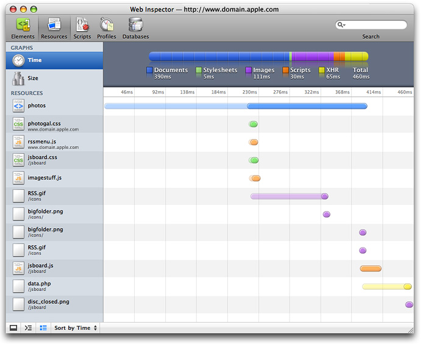
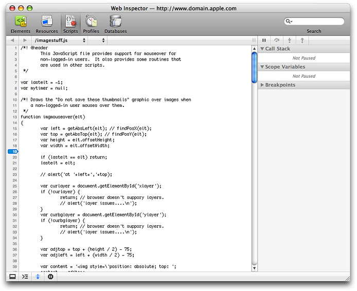

> 导航：[总目录](../../../README.md) · [releasenotes](../../../_indexes/releasenotes.md) · [What's New in macOS](Introduction.md)


[Next](Document%20Revision%20History.md)[Previous](OS%20X%20Lion%20v10.7.md)

# OS X Snow Leopard v10.6

This article summarizes the key technology changes and improvements that are available beginning with OS X Snow Leopard v10.6. The information about these changes is organized into sections by technology layer:

- System Level
- [Framework Level](#apple-f4xwc4dqnrsv64tfmyxwi33df52wszbpkridimbqga4dqojyfvjvoni)
- [Application Level](#apple-f4xwc4dqnrsv64tfmyxwi33df52wszbpkridimbqga4dqojyfvjvonq)

This section introduces changes to the UNIX-level layers in OS X v10.6.

Aggressive caching is an important technique in maximizing application performance. However, when caching demands exceed available memory, the system must free up memory as necessary to handle new demands. Typically, this means paging cached data to and from relatively slow storage devices, sometimes even resulting in systemwide performance degradation. Your application should avoid potential paging overhead by actively managing its data caches, releasing them as soon as it no longer needs the cached data.

In the wider system context, your application can now also help by creating caches that the operating system can simply purge on a priority basis as memory pressure necessitates. OS X v10.6 includes the low-level `libcache` and framework-level `NSCache` APIs to create these purgeable caches.

The `libcache` API is a low-level purgeable caching API. This API uses callbacks and other concepts that should be familiar to UNIX programmers.

Using the `libcache` API is fairly straightforward. First, your application allocates a cache using `cache_create`. Next, your application stores a pointer to a block of data into the cache by calling `cache_set_and_retain`. For example:

```
cache_t *mycache

/* Attributes contain a series of callbacks for handling
   comparisons, retain/release, and so on.
 */
cache_attributes_t attrs = {
    .version = CACHE_ATTRIBUTES_VERSION_1,
    .key_hash_cb = cache_key_hash_cb_cstring,
    .key_is_equal_cb = cache_key_is_equal_cb_cstring,
    .key_retain_cb = copy_string,
    .key_release_cb = cache_release_cb_free,
    .value_release_cb = image_release_callback,
};

char *key;
void *data;
uint64_t data_len;

cache_create("com.mycompany.mycache", &attrs, &mycache);
cache_set_and_retain(mycache, key, data, data_len);
```

Next, your application should release the region using `cache_release_value`. At this point, OS X can release the underlying memory if it is needed elsewhere. For example:

```
void *data;
...
cache_release_value(mycache, data);
```

When your application needs to obtain potentially cached data, it must first check to see whether the cached data exists and is still valid. It does this by calling `cache_get_and_retain`.

If the `cache_get_and_retain` operation succeeds, the cached region is still available and your application can use the cached data.

If the `cache_get_and_retain` operation fails, the cached data either was never in the cache or became unavailable while your application was not retaining it. Thus, your application must compute the data or fetch it from the original source. For example:

```
char *key;
void *data;
...
if (cache_get_and_retain(image_cache, key, &data) == 0) {
    // Do something with the value now stored in "data".
} else {
    // Recompute the value.
}
```

You can learn more about the UNIX-level API in _libcache Reference_.

OS X v10.6 provides support for block objects in C, C++, and Objective-C. A block object (in casual parlance often referred to simply as a _block_) is a mechanism you can use to create an ad hoc function body as an expression. In other languages and environments, a block object is sometimes called a _closure_ or a _lambda_. You use block objects when you need to create a reusable segment of code but defining a function or method might be a heavyweight (and perhaps inflexible) solution—for example, if you want to write callbacks with custom data or if you want to perform an operation on all the items in a collection.

For details, see _[Blocks Programming Topics](../../../documentation/Cocoa/Blocks%20Programming%20Topics/Introduction.md#apple-f4xwc4dqnrsv64tfmyxwi33df52wszbpkridimbqga3tkmbs)_.

Grand Central Dispatch (GCD) is a new BSD-level infrastructure. With this simple and efficient API, application developers can achieve concurrency by avoiding blocking APIs, contended memory access, and synchronization with locking and explicit thread management. It provides a POSIX-layer task-queuing API and a dispatch source API for handling events.

The GCD queue API provides dispatch queues from which threads take tasks to be executed. Because the threads are managed by GCD, OS X can optimize the number of threads based upon available memory, number of currently active CPU cores, and so on. This shifts a great deal of the burden of power and resource management to the operating system itself, freeing your application to focus on the actual work to be accomplished.

To provide greater control over concurrency, GCD provides two different types of queues: concurrent queues and serial queues. Both types are FIFO, but although a task in a serial queue waits until the previous task finishes executing, the task at the front of a concurrent queue can start executing as soon as a thread becomes available.

A dispatch group allows your application to block a thread until one or more tasks finish executing. For example, after dispatching several tasks to compute some data, you might use a group to wait on those tasks and then process the results when they are done.

Calls into the kernel or other system layers can be expensive. GCD dispatch sources replace the asynchronous callback functions typically used to mitigate the expense of handling system-related events. The GCD dispatch source API consolidates event sources into a single run-loop mechanism. This model allows you to specify the events you want to monitor and the dispatch queue and code (in the form of a block or a function) to use to process those events. When an event of interest arrives, the dispatch source submits your block or function to the specified dispatch queue for execution. GCD offers the following types of dispatch sources:

- Timer sources for periodic notifications
- Signal sources for UNIX signals
- Descriptor sources for file and socket operations
- Process sources for significant process events
- Mach port sources for Mach-related events
- Custom sources that you define and trigger

You can use a dispatch semaphore to regulate the number of tasks allowed to simultaneously access a finite resource. For example, each application is given a limited number of file descriptors to use. If you have a task that processes large numbers of files, you do not want to open so many files at one time that you run out of file descriptors. Instead, you can use a semaphore to limit the number of file descriptors in use at any one time by your file-processing code.

A dispatch semaphore works like a traditional semaphore, except that when the resource is available, it takes less time to acquire a dispatch semaphore. The reason is that Grand Central Dispatch does not call into the kernel for this particular case. It calls into the kernel only when the resource is not available and the system needs to park your thread until the semaphore is signaled.

For more information about GCD, read _[Concurrency Programming Guide](../../../documentation/General/Concurrency%20Programming%20Guide/Introduction.md#apple-f4xwc4dqnrsv64tfmyxwi33df52wszbpkridimbqga4daojr)_ and _Grand Central Dispatch (GCD) Reference_.

OS X v10.6 includes a 64-bit kernel. Although OS X allows a 32-bit kernel to run 64-bit applications, a 64-bit kernel provides several benefits:

- The kernel can better support large memory configurations.

  Many kernel data structures such as the page table get larger as physical RAM increases. When using a 32-bit kernel with more than 32 GB of physical RAM, these data structures can consume an unmanageably large portion of the 4 GB kernel address space.

  By moving to a 64-bit kernel, the 4 GB kernel address space limitation is eliminated, and thus these data structures can grow as needed.
- The maximum size of the buffer cache is increased, potentially improving I/O performance.

  A 32-bit kernel is limited in its ability to cache disk accesses because of the 4 GB kernel address space limit.

  With a 64-bit kernel, the buffer cache can grow as needed to maximize the use of otherwise unused RAM.
- Performance is improved when working with specialized networking hardware that emulates memory mapping across a wire or with multiple video cards containing over 2 GB of video RAM.

  With a 32-bit kernel, if the combined physical address space (video RAM, for example) of all of your devices exceeds about 1.5 GB, it is impossible to map them fully into a 32-bit kernel address space at the same time. To work around this limitation, driver writers must map smaller apertures of that physical address space into the kernel’s address space.

  When such a driver needs to write to or read from an unmapped address on the device, it must unmap an existing region, then map in the new region. Depending on how the mappings are managed, this extra process may cause a performance penalty, particularly for clients that exhibit low locality of reference.

  With a 64-bit kernel, the entire device can be mapped into the kernel’s address space at once. This improves performance by removing the extra overhead of mapping and unmapping regions of memory. It also removes the burden of managing these mappings in your driver code, thus making the drivers simpler and less likely to generate panics by unmapping the wrong memory at the wrong time.

You must make your driver 64-bit-capable for OS X v10.6 because the 64-bit kernel does not support 32-bit drivers. Fortunately, for most drivers, this is usually not as difficult as you might think. For the most part, transitioning a driver to be 64-bit capable is just like transitioning any other piece of code. Go through and look for potential problem areas such as:

- Casting pointers to integer types
- Assigning `long` values to `int`
- Storing non-Boolean values in a `bool` variable
- Using size-variant types such as `long` or pointer types in data structures that are shared or transmitted between 32-bit and 64-bit address spaces

If you see any of these potential problems, either change the code so that they never occur, change the padding of data structures (or add unions) so that fields after size-variant types do not change positions, or use magic numbers to support different versions of data structures for 32-bit and 64-bit code and provide translation routines to convert between them.

The document _[64-Bit Transition Guide](../../../documentation/Darwin/64-Bit%20Transition%20Guide/Introduction%20to%2064-Bit%20Transition%20Guide.md#apple-f4xwc4dqnrsv64tfmyxwi33df52wszbpkridimbqgaytanru)_ describes things to look for when checking your code and provides helpful techniques for updating your code to be 64-bit clean.

In addition to being familiar with general porting issues, you should also make sure that your driver avoids use of the [IOMemoryCursor](https://developer.apple.com/documentation/kernel/iomemorycursor) class and the `getPhysicalAddress` method. Use the [IODMACommand](https://developer.apple.com/documentation/kernel/iodmacommand) class instead. (You should do this for 32-bit drivers on Intel-based Macs as well.)

Here are a few other 64-bit changes specific to drivers:

- Only KPI symbol sets are available. The legacy `com.apple.kernel.*` symbol sets are not exported for 64-bit KEXTs.
- The `clock_get_uptime` operation is not available (use `mach_absolute_time` instead).
- Various data structures associated with time calls have changed to allow larger time values.
- `IOCreateThread` and `IOExitThread` are not available.
- The function `kernel_thread` is not available. Use `kernel_thread_start` instead.
- The `kextload` tool now exclusively loads kernel extensions. Additional KEXT management debugging functionality that used to be in `kextload` is now in the `kextutil` tool.
- Many functions in `com.apple.unsupported` are unavailable. Consult the reference documentation and headers for further details.

These changes apply only to the `x86_64` portion of your universal KEXT binary, not to existing `i386` or `ppc` code.

In addition, kernel extension property lists now support architecture-specific properties to allow you to specify different property values for 64-bit versions of your extension. For example, you might specify the property key `OSBundleLibraries_x86_64` to specify a different value for the `OSBundleLibraries` key for the `x86_64` architecture.

To improve the user experience in OS X v10.6, API improvements help your application contribute to shorter shutdown times.

To support improved shutdown, your application needs to mark itself as “dirty” or “clean,” depending on whether it has unsaved changes and needs to do work before quitting, or can be terminated without further notice. When the system shuts down, clean applications are terminated (via `SIGKILL`) without further interaction.

You support improved shutdown in your application by calling the `enableSuddenTermination` and `disableSuddenTermination` methods in `NSProcessInfo`. These are intended to be used as paired calls. Call `disableSuddenTermination` when you have work that must be done before quitting, and `enableSuddenTermination` when that work is done.

It’s recommended that you have your application begin in the clean state by including the following entry in the plist for your application:

`<key>NSSupportsSuddenTermination</key>`

`<string>YES</string>`

This essentially launches your application with a call to `enableSuddenTermination`. Make calls to `disableSuddenTermination` when there is work that must be done before quitting, such as when you begin an export operation, and make subsequent calls to `enableSuddenTermination` when the work is complete. Note that even though these calls are in balanced pairs, they can be called on separate threads. For example, you can can disable sudden termination when you schedule an export operation on a background thread, and enable sudden termination when the operation ends, without affecting a foreground process that disables sudden termination when the user begins editing and enables it when the user saves his or her work. Sudden termination is not enabled until all calls to disable it have been balanced by calls to enable it.

For many kinds of work, you do not have to disable sudden termination explicitly. The operating system automatically disables sudden termination if an `NSDocument` object has unsaved changes, for example, or when `NSUserDefaults` or `CFPreferences` has been changed but not synchronized.

Your application should avoid data management and cleanup code that runs lazily during termination. You should carefully examine your code for work you do in `applicationWillTerminate`, overrides of `[NSApplication terminate:]`, and `[NSWindow close]`. Other places to consider are in the handlers `atexit()` and `cxa_atexit()`, and in C and C++ destructors. You should plan to rework such code as soon as possible; in the meantime, you must disable sudden termination to ensure that it will execute.

You generally do not need to perform any deallocations before quitting. The operating system can be relied on to do this for you when it terminates your application.

For more information, see _[NSProcessInfo Class Reference](https://developer.apple.com/documentation/foundation/processinfo)_.

For agents and daemons, there is a UNIX-level function in `vproc.h` (`vproc_transaction_begin`), which corresponds to `disableSuddenTermination`, and another function (`vproc_transaction_end`), which corresponds to `enableSuddenTermination`.

Add the following to your `launchd` `.plist` file:

`<key>EnableTransactions</key>`

`<true/>`

You should refactor your code as necessary to avoid executing maintenance code lazily in certain places: your `SIGTERM` handler, as well as any `atexit()`, `cxa_atexit()` handlers, module finalizers, and C++ destructors. In the meantime, you must add begin and end transaction calls where appropriate to ensure that any such code continues to run.

This section introduces changes to the framework-level layers in OS X v10.6. Some of the more salient Cocoa enhancements are listed here. Some are described briefly later in this section; each is described in detail in the relevant ADC Reference Library documents.

- __Concurrency:__

  - Concurrent enumerations, searching, and sorting in collections
  - `NSNotificationCenter` supports concurrent notification posting
  - `NSView` supports concurrent drawing
  - `NSDocument` supports concurrent document opening
  - Enhancements and performance improvements to `NSOperation` and `NSOperationQueue`.
  - New `NSBlockOperation` class for block-based operations. See [Concurrency with Operation Objects](#apple-f4xwc4dqnrsv64tfmyxwi33df52wszbpkridimbqga4dqojyfvjvomzs).
- __File handling and efficiency:__

  - `NSFileWrapper`: `NSURL` and `NSError` APIs, enhanced implementation
  - `NSFileManager`: `NSURL` and `NSError` APIs
  - `NSURL`: Much more complete support for file properties, along with caching for improved performance and path utilities for managing file names. See [File-System Efficiency](#apple-f4xwc4dqnrsv64tfmyxwi33df52wszbpkridimbqga4dqojyfvjvomjq).
  - New `NSBundle` APIs using `NSURL`
- __Caching and purgeable memory:__

  - New `NSPurgeableData` data class to implement the `NSDiscardableContent` protocol.
  - New `NSCache` class. See [The NSCache API](#apple-f4xwc4dqnrsv64tfmyxwi33df52wszbpkridimbqga4dqojyfvjvooa).
- __Text:__

  - Improvements to bidirectional text editing
  - Improvements to text checking in `NSText`, as well as low-level APIs that can be used without `NSText`
  - New `NSOrthography` class to describe the linguistic content of a piece of text, typically used for checking spelling and grammar
  - New `NSTextInputContext` class for dealing with input management systems
- __Other Enhancements:__

  - Better-organized services menu, providing more context-sensitive and user-selectable services
  - `NSPasteboard`: Support for multiple items and a more general and flexible API
  - `NSImage`: cleaner API, better impedance match with CGImage for performance, and support for rotated images from cameras
  - Gesture and multitouch event support
  - `NSEvent` event monitoring
  - `NSCollectionView`, `NSTableView`, and `NSBrowser` enhancements
  - Ability to set desktop images
  - Cocoa support for bringing up Dictionary application and Spotlight window in Finder
  - New `NSRunningApplication` class to provide information about running applications
  - New `NSUserInterfaceItemSearching` protocol to implement searching custom help data in applications
  - More control over color spaces in `NSWindow`
  - Use of formal protocols for declaring data source and delegate methods
  - Block-based sheet APIs
  - Block-based enumerations for lines, words, and the like in `NSString` and `NSAttributedString`
  - New `NSPropertyList` APIs with better error handling and performance
  - APIs and support for sudden termination. See [Improved Shutdown](#apple-f4xwc4dqnrsv64tfmyxwi33df52wszbpkridimbqga4dqojyfvjvomrs).
  - Core Data integration with Spotlight. See _Core Data Spotlight Integration Guide_.
  - New `presentationOptions` API for controlling some behaviors of system UI elements (Dock, menu bar, task switcher, and so on)

In addition to the UNIX-level `libcache` API described above, OS X v10.6 also provides an Objective-C API, `NSCache`. This API is conceptually similar to the `libcache` API, but `NSCache` also offers autoremoval policies to ensure that the memory footprint of the cache doesn't get too large.

To use the API, first create a new `NSCache` object. Next, add new objects for keys using `setObject:forKey:` or `setObject:forKey:cost:`. When you want to retrieve the object again, call `objectForKey:`. If the object is still available in the cache, you will get it back. Otherwise, you must recreate the object and its contents.

You can remove an item from the cache by calling `removeObjectForKey:` or clear the cache by calling `removeAllObjects`.

If desired, you can also specify advisory limits for the maximum number of items in the cache and the maximum total cost of items in the cache. You can also add your own delegate conforming to the `NSCacheDelegate` protocol. If you do, its `cache:willEvictObject:` method will be called before an object is evicted to allow you to clean up as needed.

For more information, see _Caching and Purgeable Memory_.

The `NSCache` API is not the only way to minimize the memory footprint of your application. Cocoa also provides the [NSPurgeableData](https://developer.apple.com/documentation/foundation/nspurgeabledata) class to help your application use memory efficiently and possibly improve performance. Paging is a time-intensive process. With memory marked as purgeable, the system avoids the expense of paging by simply reclaiming that memory. The tradeoff, of course, is that the data is discarded, and if your application needs that data later, it must recompute it.

The `NSPurgeableData` class does not have to be used in conjunction with `NSCache`; you can use it independently to get purging behavior.

For more information, see _Caching and Purgeable Memory_.

A Cocoa operation is an Objective-C–based object designed to help you improve the level of concurrency in your application. You use it to encapsulate a task that you want executed asynchronously. You can submit operation objects to a queue and let the corresponding work be performed asynchronously on one or more separate threads.

The Foundation framework in OS X version 10.6 includes a new class, [NSBlockOperation](https://developer.apple.com/documentation/foundation/blockoperation), for executing one or more blocks concurrently. Because it can execute more than one block, a block operation object operates using a group semantic; only when all of the associated blocks have finished executing is the operation itself considered finished.

For more information about concurrency via operation objects, read _[Concurrency Programming Guide](../../../documentation/General/Concurrency%20Programming%20Guide/Introduction.md#apple-f4xwc4dqnrsv64tfmyxwi33df52wszbpkridimbqga4daojr)_.

OS X v10.6 maximizes file-system efficiency by using URLs to consolidate access to files, file properties, and directory contents. This allows a single mechanism to be used for accessing all files, file properties, and directories and eliminates internal translations between paths, URLs, and `FSRefs`.

To maximize file efficiency in your application, you should use `file:` scheme URLs as file accessors, instead of using `FSRefs`, `FSSpecs`, File Manager routines, or POSIX file routines (`stat`, `lstat`, `getattrlist`, `chmod`, `setattrlist`, `chflag`) to access file properties or directory contents. In this way, your file-system calls can be processed with a minimum of format translations.

Methods that accept URLs instead of paths have been added to the `NSFileManager` and `NSFileHandler` classes:

- `copyItemAtURL:toURL:error:`
- `linkItemAtURL:toURL:error:`
- `moveItemAtURL:toURL:error:`
- `removeItemAtURL:error:`
- `fileHandleForReadingFromURL:error:`
- `fileHandleForUpdatingURL:error:`
- `fileHandleForWritingToURL:`

These methods work just as the corresponding methods that accept file system paths.

Similarly, delegate methods that accept URLs have also been defined for `NSFileManager`:

- `fileManager:shouldCopyItemAtURL:toURL:`
- `fileManager:shouldLinkItemAtURL:toURL:`
- `fileManager:shouldMoveItemAtURL:toURL:`
- `fileManager:shouldProceedAfterError:copyingItemAtURL:toURL:`
- `fileManager:shouldProceedAfterError:linkingItemAtURL:toURL:`
- `fileManager:shouldProceedAfterError:movingItemAtURL:toURL:`
- `fileManager:shouldProceedAfterError:removingItemAtURL:`
- `fileManager:shouldRemoveItemAtURL:`

File properties have been added to `CFURL` and `NSURL` to provide the same flexibility and services that formerly required use of `FSRef`. Your application can identify properties using the familiar mechanism of keys and values, where file properties are identified by keys (string constants) that are paired with values (`CFType`s for `CFURL` and objects for `NSURL`).

For example, to obtain the modification date of a file using `NSURL`, you could ask for the property associated with the key `NSURLContentModificationDateKey`. For the file size, there is `NSURLFileSizeKey`. For the icon normally associated with this type of file, there is `NSURLEffectiveIconKey`. To obtain the file’s parent directory, there is `NSURLParentDirectoryURLKey`. For the available file space on the parent volume, use `NSURLVolumeAvailableCapacityKey`.

There are over 40 file, directory, and volume properties that can be read this way. And because OS X v10.6 has consolidated the file property API, it can use intelligent caching for file properties, often allowing you to obtain multiple properties without additional file I/O.

To facilitate this, new methods have been added to `CFURL.h`:

- `CFURLCopyResourcePropertyForKey`
- `CFURLCopyResourcePropertiesForKeys`
- `CFURLSetResourcePropertyForKey`
- `CFURLSetResourcePropertiesForKeys`

And similar methods have been added to `NSURL.h`:

- `getResourceValue`
- `resourceValuesForKeys`
- `setResourceValue`
- `setResourceValues`

For the most part, these methods replace the file properties API in the File Manager, `NSFileManager`, and POSIX file access calls (`stat`, `lstat`, `getattrlist`, `chmod`, `setattrlist`, `chflag`).

In addition, you can now create two kinds of `file:` scheme URLs—path-based and file-ID based—so you no longer need to rely on paths when files are moving around or directories have been renamed. File-ID based URLs contain the volume ID and file ID of the target, and can be used to specify a file or directory (or a bundle, which is a directory by another name).

The `CFURLCreateFileIDURL` function converts a path-based URL to a file-ID URL, and `CFURLCreateFileURL` converts a file-ID URL to a path-based URL. Generally speaking, you can use a file-ID URL wherever you can use a `file:` scheme URL.

The following APIs will also operate correctly with file-ID based URLs:

`-[NSURL path]`

`CFURLCopyFileSystemPath`

`CFURLGetFileSystemRepresentation`

There is also a new Bookmark API which creates a data object (`NSData`) or `CFDataRef` (`CFURL`) containing a representation of a URL (a `CFURLRef` or an `NSURL`). This provides the services formerly supplied by aliases, and replaces the Alias Manager. Bookmark data can be stored persistently—in your application’s files or database, for example—and later resolved to create a URL locating the bookmarked file, even if that file has moved. The API also supports fetching resource properties directly from bookmark data.

These methods have been added to `CFURL.h`:

`CFURLCreateBookmarkData`

`CFURLCreateByResolvingBookmarkData`

`CFURLCreateResourcePropertyForKeyFromBookmarkData`

`CFURLCreateResourcePropertiesForKeysFromBookmarkData`

And these methods have been added to `NSURL.h`:

`-bookmarkDataWithOptions:includingResourceValuesForKeys:relativeToURL:error:`

`-initByResolvingBookmarkData:bookmarkData:options:relativeToURL:bookmarkDataIsStale:error`

`+URLByResolvingBookmarkData:options:relativeToURL:bookmarkDataIsStale:error:`

`+resourceValuesForKeys:fromBookmarkData:`

See _[CFURL Reference](https://developer.apple.com/documentation/corefoundation/cfurl-rd7)_ and _[NSURL Class Reference](https://developer.apple.com/documentation/foundation/nsurl)_ for additional details.

The imaging APIs in OS X v10.6 have been simplified to improve your ability to handle images in your application. Image classes are more consistent, and the subsystems in OS X v10.6 provide more efficient bridging between the classes. These improvements bring you several benefits:

- Less uncertainty in choosing among image types
- Less conversion code for you to write and maintain
- Improved performance in decoding and rendering large images with additional level-of-detail support in lower-level image abstractions
- Reduced memory usage through more efficient caching of image data

OS X v10.6 also offers efficient partial decoding of image files, providing support for your application to access subrectangles of images for tiling.

Clients of `NSImage`, `CIImage` and `CGImageRef` generally don’t need to make code changes to benefit from the improved imaging pipeline. If you’re using Icon Services to get icons, you should switch to `NSWorkspace`.

If your application needs to play back iPod media, including content purchased through iTunes, you can take advantage of a new, lightweight, and more efficient media playback capability provided in QuickTime X and OS X v10.6. You gain access to these media services through the QTKit framework.

The new QuickTime X media services offered in OS X v10.6 allow applications to perform asynchronous movie opening, thus avoiding operations from getting blocked for lengthy periods of time when a media file is opened. Note, however, that asynchronous opening is not available for all media types that QTKit supports. Asynchronous loading can also be cancelled at any time.

In OS X v10.6, maximum backward compatibility with existing QTKit client applications is also preserved. This is accomplished by minimizing the number of changes made to the existing QTKit API and by defaulting to completely backward-compatible behaviors. For example, clients of QTKit must explicitly grant QTKit permission to try to use the new private media services for a particular media file, by including a new attribute in the list of attributes passed to `-[QTMovie initWithAttributes:error:]`.

In OS X v10.6, QTKit support for the new media services provided in QuickTime X is primarily limited to media playback. You can:

- Open a media file
- Gather information about the playback characteristics of the movie, such as its duration, the codecs used, and thumbnail images
- Display the movie in a view
- Control the loading and playback of that movie

In particular, movies handled using the new media services in QuickTime X will not be editable or exportable. If you attempt to edit a `QTMovie` object that was opened as a playback-only movie, an exception is thrown. (Note that this is the current behavior for applications that attempt to edit QTMovie objects that are marked as uneditable.)

Among the enhancements provided by the media services in QuickTime X, two new and important movie attributes are defined:

```
NSString * const QTMovieOpenAsyncRequiredAttribute
NSString * const QTMovieOpenForPlaybackAttribute
```

The first attribute indicates whether a `QTMovie` object must be opened asynchronously. Set this attribute to `YES` to indicate that all operations necessary to open the movie file (or other container) and create a valid `QTMovie` object must occur asynchronously. That is, the methods `movieWithAttributes:error:` and `initWithAttributes:error:` will return almost immediately, performing any lengthy operations on another thread. Your application can monitor the movie load state to determine the progress of those operations.

The second attribute indicates whether a `QTMovie` object will be used only for playback and not for editing or exporting. Set this attribute to `YES` to indicate that you intend to use movie playback methods, such as `play` or `stop`, or corresponding movie view methods such as `play:` or `pause:` in order to control the movie, but do _not_ intend to use other methods that edit, export, or in any way modify the movie. Specifying that you need playback services only may allow `QTMovie` to use more efficient code paths for some media files.

For a simple and more efficient movie playback application, you can open a movie file and attach it to a `QTMovieView` object using the following snippet of code:

```objc
 - (void)windowControllerDidLoadNib:(NSWindowController *) aController
    {
        [super windowControllerDidLoadNib:aController];
        if ([self fileName]) {
            NSDictionary *attributes = [NSDictionary dictionaryWithObjectsAndKeys:
                                        [self fileName], QTMovieFileNameAttribute,
                                        [NSNumber numberWithBool:YES],
                                        QTMovieOpenForPlaybackAttribute, nil];
            movie = [[QTMovie alloc] initWithAttributes:attributes error:NULL];
            [movieView setMovie:movie];
            [movie release];
            [[movieView movie] play];
        }
    }
```

Because the attributes dictionary contains a key-value pair with the `QTMovieOpenForPlaybackAttribute` key and the value `YES`, QTKit uses the new media services provided in QuickTime X, if possible, to play back the media content in the selected file.

OS X v10.6 enables your application to leverage not only multiple CPUs and multiple cores, but the high-performance parallel processing power of GPUs built into many systems. For many applications, this can result in a significant speed-up.

Applications can make use of this new capability by calling the OpenCL (Open Computing Library) framework, an Apple-proposed open standard for parallel data computation across GPUs and CPUs. OpenCL provides an abstraction layer so that you can write your code once and it can then run on any hardware that supports the OpenCL standard. Before OpenCL it was possible to write general-purpose applications that ran on GPUs, but you had to translate your calculations into vector arithmetic and write your code in a different proprietary language for each compute device.

The OpenCL language is optimized for execution on graphics processors without being tied to any particular hardware or architecture. It is a general-purpose computer language, not specifically a graphics language. It results in the largest performance gains when used for data-parallel processing of large data sets. There are many applications that are ideal for acceleration using OpenCL, such as signal processing, image manipulation, or finite element modeling. The OpenCL language has a rich vocabulary of vector and scalar operators and the ability to operate on multidimensional arrays in parallel.

OpenCL programming involves writing compute kernels in the OpenCL-C language, and calling OpenCL framework APIs to set up the context in which the kernels run and to enqueue the kernels for execution. Before an OpenCL compute kernel can run on a particular compute device, the kernel must be compiled into binary code specific to that device. Therefore, to make OpenCL programs portable, the OpenCL compiler and runtime are included in the OpenCL framework and the kernels can be compiled dynamically at runtime. After the program is installed on a system, application load time can be minimized by compiling the program for that system and then saving and running the compiled version in subsequent invocations of the application. OpenCL routines can be linked to and called as C functions from Cocoa, C, or C++ applications.

Multiple instances of a compute kernel can be run in parallel on one or more compute units, such as GPU or CPU cores. OpenCL allows you to query the current device to determine how many instances of a kernel can be executed in parallel, for optimization on the fly. OpenCL syntax makes it easy to describe problems in terms of multi-dimensional arrays, often the most natural way to design a program. Multiple kernels can be linked together into larger OpenCL programs.

To obtain an overview, a description of the process of writing an OpenCL program, and code samples, see _[OpenCL Programming Guide for Mac](../../../documentation/Performance/OpenCL%20Programming%20Guide%20for%20Mac/About%20OpenCL%20for%20OS%20X.md#apple-f4xwc4dqnrsv64tfmyxwi33df52wszbpkridimbqga4dgmjs)_.

In OS X v10.6, a plug-in must match its host application in terms of both processor architecture and address width.

Applications and other executables that ship as part of OS X are being transitioned to 64-bit-capable executables. If you are writing plug-ins for these 64-bit-capable applications (screen savers, for example), your code must be made 64-bit-native in OS X v10.6 or it will not work on 64-bit-capable Macs.

Some examples of affected plug-ins include:

- Printer dialog extensions
- Screen savers
- Audio units
- Spotlight importers
- Dashboard plug-ins
- Safari plug-ins

If you are writing plug-ins that are loaded by Apple-authored applications or daemons, you should immediately start transitioning your plug-ins to add an `x86_64` version to the universal binaries. Plug-ins that are only two-way (32-bit) universal will not be loaded by 64-bit capable applications in OS X v10.6 and later. One current exception is the System Preferences application, which automatically relaunches itself in 32-bit mode if a user selects a legacy 32-bit preference pane. For an optimal user experience, however, you should still update your preference panes to contain an `x86_64` version as soon as possible.

To learn how to transition your code to 64-bit, read _[64-Bit Transition Guide](../../../documentation/Darwin/64-Bit%20Transition%20Guide/Introduction%20to%2064-Bit%20Transition%20Guide.md#apple-f4xwc4dqnrsv64tfmyxwi33df52wszbpkridimbqgaytanru)_ and then read either _[64-Bit Transition Guide for Cocoa](../../../documentation/Cocoa/64-Bit%20Transition%20Guide%20for%20Cocoa/Introduction%20to%2064-Bit%20Transition%20Guide%20For%20Cocoa.md#apple-f4xwc4dqnrsv64tfmyxwi33df52wszbpkridimbqga2denbx)_ or _[64-Bit Guide for Carbon Developers](../../../documentation/Carbon/64-Bit%20Guide%20for%20Carbon%20Developers/Introduction%20to%2064-Bit%20Guide%20for%20Carbon%20Developers.md#apple-f4xwc4dqnrsv64tfmyxwi33df52wszbpkridimbqga2dgobr)_.

The Core Text framework includes a new Font Manager API for registering and activating fonts, managing font descriptors, manipulating font names, and validating font files. For more information, see _Core Text Reference Collection_.

To provide better compile-time type checking, both the AppKit and the Foundation frameworks now use formal protocols for delegate methods. Required protocol methods are marked with `@required`, where possible. The rest are marked with `@optional`.

Digital images can be displayed on a wide variety of devices, including flat-panel displays, CRTs, and printers. These devices transmit and reflect light with different brightness and intensity, in a nonlinear manner. Including gamma information in the color profile helps the system to reproduce images on different devices with the correct luminance. When gamma information is not available, the system must either guess at the correct gamma correction for the image or use the system default.

Historically, the default gamma correction for Mac OS has been a value of 1.8 (a useful value for print professionals). In recent years, television, video, and web standards have all settled on a default gamma of 2.2. In OS X v10.6, the Mac moves to this common standard, with the following ramifications:

- Images without embedded gamma information look the same when created on Mac OS and displayed on other systems, and vice versa.
- Images tagged with gamma information look the same as in previous versions of Mac OS (with minor improvements in some cases, because images created in a 2.2 space are no longer converted).
- OpenGL images and untagged web images have higher contrast. In general, web content displayed will more closely match the luminance seen on other systems, such as PCs running Microsoft Windows.
- Applications that use system UI elements such as Cocoa controls will see little or no change. However, untagged images that are not part of the system UI appear darker. If your application uses custom UI elements, you may need to adjust their brightness to obtain the desired appearance.

It is strongly recommended that your application tag its images with gamma information. A new API has been added to ColorSync to return the gamma value for a given connected display. Programmatically generated images should use the ColorSync framework to automatically output the correct luminance.

This section introduces changes to the application-level layers in OS X v10.6.

OS X v10.6 includes technology to provide Microsoft Exchange support for Address Book, Mail, and iCal. It uses the Exchange Web Services protocol to provide access to Exchange Server 2007.

Safari in OS X v10.6 includes a number of enhancements to improve JavaScript performance:

- A new simplified DOM query API (W3C Selectors API):

  - `querySelector`
  - `querySelectorAll`
- New native replacements for commonly used JavaScript library functions:

  - `getElementsByClassName`
- A new JavaScript interpreter in WebKit and Safari. Instead of executing scripts using a traditional interpreter, JavaScript scripts are now compiled down to bytecode, then executed using a bytecode execution engine. This results in a significant performance improvement over interpreting scripts on the fly. As a result, Safari’s JavaScript performance in OS X v10.6 is four times faster than it is in Leopard.

In addition to these underlying changes, which are described next, there are additional tools for optimizing your JavaScript code.

The DOM Query Selector API adds two additional document methods, `querySelector` and `querySelectorAll`. Use these methods to obtain a list of elements matching a particular pattern. They work much like the XPath API, but with a syntax that is more lightweight and easier to learn. (The DOM query selector syntax uses the CSS selector syntax that you should already be familiar with as a web designer.)

For example, if you want to get every element of the class `stripedtable`, you could use the following code:

```
var stripetables = document.querySelectorAll(".stripedtable");
```

To obtain the odd-and even-numbered child elements of these tables, you could use code like this:

```
var darkstripes = document.querySelectorAll(".stripedtable tbody:nth-child(even)");
var lightstripes = document.querySelectorAll(".stripedtable tbody:nth-child(odd)");
```

The `querySelector` works similarly, but returns only the first matching element.

In addition to performing these queries on the document, you can also perform them on an individual element. In the previous example, if you want to work with each of the tables individually, you might write code like this:

```
// Obtain the initial list of matching tables
var stripetables = document.querySelectorAll(".stripedtable");

for (var mytable in stripetables) {
    // Perform further selection on each of the resulting elements.
    var darkstripes = mytable.querySelectorAll(".stripedtable tbody:nth-child(even));
    var lightstripes = mytable.querySelectorAll(".stripedtable tbody:nth-child(odd));
    ...
}
```

For a complete description of this API, see the W3C Selectors API at [http://www.w3.org/TR/selectors-api/](http://www.w3.org/TR/selectors-api/).

In addition to the DOM Selector Query API, Safari and WebKit provide a new native implementation of the `getElementsByClassName` document method. This function is similar to `getElementsByName` except that it searches the `class` attribute for class names that match. For example:

```
var buttonBarElements = document.getElementsByClassName('fancytoolbar_button');
```

This call returns an array containing all elements that match the specified class. For example, above call returns all of the following elements:

```
<a class="fancytoolbar_button">...</a>

<p class="fancytoolbar_button new_paragraph_button">...</p>
```


Safari in OS X v10.6 provides a number of improvements to the web inspector that help you tune your website for better performance. To use them, choose Show Web Inspector from the Develop menu. (You must first enable the Develop menu in the Advanced pane in Safari Preferences if you have not already done so.) Within the web inspector, you should now see several significant enhancements over previous versions of Safari:

- A graphical resources pane
- A built-in JavaScript debugger
- A performance profiler

The newly revamped Resources pane now shows detailed graphs of the size of each resource and the amount of time spent loading that resource. By looking at this pane, you can see at a glance what aspects of your web content dominate the load time of the page.

__Figure 1__  Web inspector Resources pane



The Scripts pane now provides substantial new debugging functionality. You can pause script execution or set breakpoints to stop automatically, and then step into function calls, step over them, or step out of them. While execution is stopped, you can also examine the values of local and global variables.

__Figure 2__  Web inspector Scripts pane



Finally, the Profiles pane allows you to test performance on your code. This built-in performance profiling helps you determine which areas of your JavaScript code you should optimize to provide the biggest performance improvements. To use profiling, click the dot icon in the lower-left corner, perform some task on the website, and then stop profiling by clicking the dot again.

__Figure 3__  Web inspector Profiles pane

!

After you finish profiling, you can view the profiles by clicking them in the sidebar. Safari then displays the amount of time spent in each function—both in the body of the function itself and in other functions that it calls—and allows you to sort by these values. In this way, you can quickly see which pieces of JavaScript code take the most time and thus are likely to be good targets for optimization.

Table 1 lists the documents describing the API changes that were made in system frameworks for OS X v10.6.

__Table 1__  OS X v10.6 delta documents

| Framework | Document |
| Accelerate | _Accelerate Reference Update_ |
| Address Book | _Address Book Reference Update_ |
| AGL | _AGL Reference Update_ |
| AppKit | _Application Kit Reference Update_ |
| Application Services | _Application Services Reference Update_ |
| Audio Toolbox | _Audio Toolbox Reference Update_ |
| Audio Unit | _Audio Unit Reference Update_ |
| Automator | _Automator Reference Update_ |
| Calendar Store | _Calendar Store Reference Update_ |
| Carbon | _Carbon Reference Update_ |
| Core Audio | _Core Audio Reference Update_ |
| Core Audio Kit | _Core Audio Kit Reference Update_ |
| Core Data | _Core Data Reference Update_ |
| Core Foundation | _Core Foundation Reference Update_ |
| Core Location | _Core Location Reference Update_ |
| Core Services | _Core Services Reference Update_ |
| Foundation | _Foundation Reference Update_ |
| Image Capture | _Image Capture Core Reference Update_ |
| Input Method Kit | _Input Method Kit Reference Update_ |
| Instant Message | _Instant Message Reference Update_ |
| OpenAL | _OpenAL Reference Update_ |
| OpenCL | _OpenCL Reference Update_ |
| Open Directory | _Open Directory Reference Update_ |
| OpenGL | _OpenGL Reference Update_ |
| QTKit | _QTKit Reference Update_ |
| Quartz | _Quartz Reference Update_ |
| Quartz Core | _Quartz Core Reference Update_ |
| Quick Look | _Quick Look Reference Update_ |
| QuickTime | _QuickTime Reference Update_ |
| Security | _Security Reference Update_ |
| Security Foundation | _Security Foundation Reference Update_ |
| Sync Services | _Sync Services Reference Update_ |
| System Configuration | _System Configuration Reference Update_ |
| WebKit | _WebKit Reference Update_ |

[Next](Document%20Revision%20History.md)[Previous](OS%20X%20Lion%20v10.7.md)

