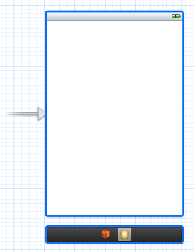
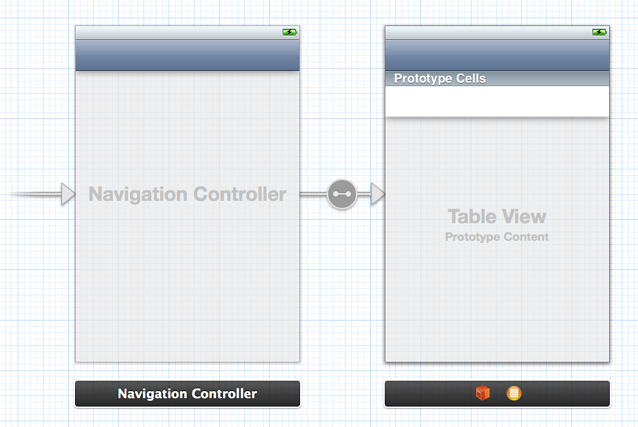
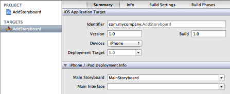
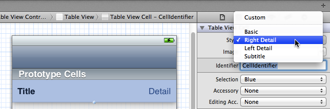
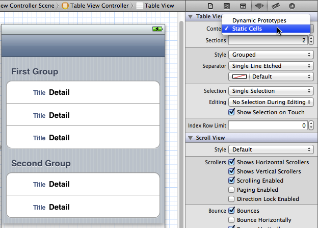

> 导航：[总目录](../../../README.md) · [releasenotes](../../../_indexes/releasenotes.md)


# Converting to Storyboards Release Notes

Storyboarding is a new way to create user interfaces for iOS applications, beginning with iOS 5 and Xcode 4.2. Using storyboards, you can design the view controllers that compose your application as scenes in the Xcode design canvas and visually define the navigation between the scenes using segues.

There are a few steps you need to take to convert an existing iOS application project to use storyboards. In addition, there are other new patterns you can adopt.

#### Contents:

- [Configure the Application Delegate](#apple-f4xwc4dqnrsv64tfmyxwi33df52wszbpkridimbqgeyteojxfvbuqmjnirxw45cmnfxgwrlmmvwwk3tujfcf6mi)
- [Add a Storyboard to the Project](#apple-f4xwc4dqnrsv64tfmyxwi33df52wszbpkridimbqgeyteojxfvbuqmjnirxw45cmnfxgwrlmmvwwk3tujfcf6mq)
- [Set the Main Storyboard for the Project](#apple-f4xwc4dqnrsv64tfmyxwi33df52wszbpkridimbqgeyteojxfvbuqmjnirxw45cmnfxgwrlmmvwwk3tujfcf6my)
- [Accessing the First View Controller](#apple-f4xwc4dqnrsv64tfmyxwi33df52wszbpkridimbqgeyteojxfvbuqmjnirxw45cmnfxgwrlmmvwwk3tujfcf6na)
- [Configuring Table Views](#apple-f4xwc4dqnrsv64tfmyxwi33df52wszbpkridimbqgeyteojxfvbuqmjnirxw45cmnfxgwrlmmvwwk3tujfcf6ni)

### Configure the Application Delegate

The application delegate is responsible for loading the storyboard and managing the window. You need to specify the name of the application delegate class in [UIApplicationMain](https://developer.apple.com/documentation/uikit/1622933-uiapplicationmain), and ensure that the application delegate has a property called `window`.

If you don’t have an existing application delegate class, you need to create one. A minimal implementation would look like this:

__Listing 1-1__Minimal application delegate header file

```objc
#import <UIKit/UIKit.h>
@interface AppDelegate : NSObject <UIApplicationDelegate>
@property (strong, nonatomic) UIWindow *window;
@end
```


__Listing 1-2__Minimal application delegate implementation file

```objc
#import "AppDelegate.h"
@implementation AppDelegate
@synthesize window = _window;
@end
```

> [!NOTE]
> 

In the `main.m` file, set the application delegate class in `UIApplicationMain`.

Your existing main.m file probably looks something like this:

```objc
#import <UIKit/UIKit.h>

int main(int argc, char *argv[]) {

    NSAutoreleasePool * pool = [[NSAutoreleasePool alloc] init];
    int retVal = UIApplicationMain(argc, argv, nil, nil);
    [pool release];
    return retVal;
}
```

Change it to look like this:

```objc
#import <UIKit/UIKit.h>
#import "AppDelegate.h"

int main(int argc, char *argv[]) {

    @autoreleasepool {
        return UIApplicationMain(argc, argv, nil, NSStringFromClass([AppDelegate class]));
    }
}
```

(replace “AppDelegate” with the name of your application delegate class).

> [!NOTE]
> 

### Add a Storyboard to the Project

Add a new storyboard file to the project. By convention, the initial storyboard is named `MainStoryboard`.

Add your first view controller to the storyboard from the Object library. You should see a sourceless segue indicating that this is the first scene.



If the first view controller is embedded in a container such as a navigation controller or tab bar controller, then use Editor > Embed In to embed it appropriately. The sourceless segue should now point to the container view controller:



### Set the Main Storyboard for the Project

In the Summary for application Target, set the value of the Main Storyboard to the name of the storyboard file you created. If there is a value for Main Interface (to specify the first nib file), make sure you remove it.



### Accessing the First View Controller

The application delegate is not represented in the storyboard. If you need to access the first view controller (for example, if you are creating a Core Data application and want to pass the delegate’s managed object context to the first view controller), you can do so via the window’s [rootViewController](https://developer.apple.com/documentation/uikit/uiwindow/1621581-rootviewcontroller). If the root view controller is a container controller—such as an instance of `UINavigationController`—then you can access your view controller using the appropriate accessor for the container’s contents, for example:

```objc
- (BOOL)application:(UIApplication *)application didFinishLaunchingWithOptions:(NSDictionary *)launchOptions {

    UINavigationController *rootNavigationController = (UINavigationController *)self.window.rootViewController;
    MyViewController *myViewController = (MyViewController *)[rootNavigationController topViewController];
    // Configure myViewController.
    return YES;
}
```


### Configuring Table Views

There are several new ways of working with table views when you use storyboards.

- The [dequeueReusableCellWithIdentifier:](https://developer.apple.com/documentation/uikit/uitableview/1614891-dequeuereusablecell) method is guaranteed to return a cell (provided that you have defined a cell with the given identifier). Thus there is no need to use the “check the return value of the method” pattern as was the case in the previous typical implementation of [tableView:cellForRowAtIndexPath:](https://developer.apple.com/documentation/uikit/uitableviewdatasource/1614861-tableview). Instead of:

```
UITableViewCell *cell = [tableView dequeueReusableCellWithIdentifier:CellIdentifier];
if (cell == nil) {
    cell = [[UITableViewCell alloc] initWithStyle:UITableViewCellStyleDefault reuseIdentifier:CellIdentifier];
}
// Configure and return the cell.
```

  you would now write just:

```
UITableViewCell *cell = [tableView dequeueReusableCellWithIdentifier:CellIdentifier];
// Configure and return the cell.
```
- You can configure table view cells directly in the table view. By default, the prototype cell style is set to Custom, so that you can design your own cell. You can also set the style to one of the built-in [UITableViewCell](https://developer.apple.com/documentation/uikit/uitableviewcell) cell styles by using the Attributes Inspector.

  
- For a table view that is the view of a `UITableViewController` instance, you can configure static content directly in the storyboard. In the Attributes Inspector, set the content of the table view to Static Cells.

  

  If you use static cells, you can connect outlets from the table view controller to individual cells so that you can configure the cell’s content at runtime.

```objc
// Declare properties for the outlets.
@property (nonatomic, weak) IBOutlet UITableViewCell *firstGroupFirstRowCell;

// Configure cells directly.
firstGroupFirstRowCell.detailTextLabel.text = newTextValue;
```
