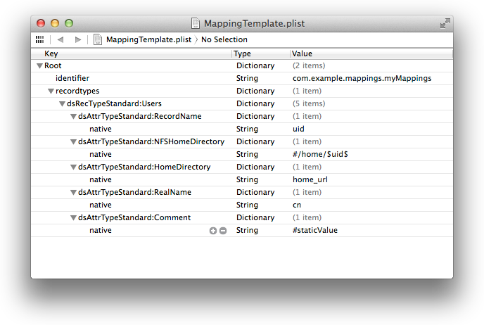
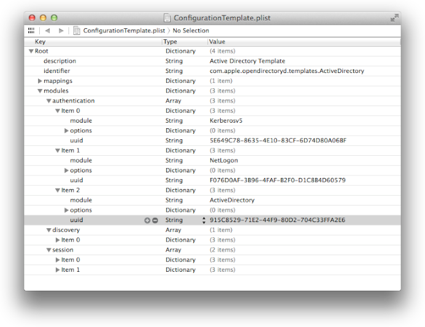

> 导航：[总目录](../../README.md) · [releasenotes](../../_indexes/releasenotes.md)


# Open Directory Module Developer Note

A new architecture was introduced in OS X v10.9 Mavericks to allow creation of native Open Directory modules. Unlike DirectoryService, opendirectoryd uses ‘modules’ implemented as a standalone process that uses XPC to communicate with opendirectoryd. Implementing a module as an XPC service ensures a private address space, improves security and reliability since modules cannot crash another module nor opendirectoryd.

Support for DirectoryService plugins has been deprecated and will be removed in a future release.

There is an API available to store persistent data based on Core Foundation types. This API is the preferred method as it associates data with the corresponding configuration. It is cached in memory and written to disk when changes occur (i.e., “odmoduleconfig_set_dynamicdata”).

Modules are tagged as having specific capabilities based on the callbacks they support. For example:

- Authentication—supports some form of authentication
- Connection—supports connections
- Discovery—capable of determining a suitable list of servers
- Modification—supports record modifications
- Policy—reading/writing password policies
- Query—querying of records

The new module architecture allows layering of modules to implement different functionality or override functionality depending on needs. As an example, the default Active Directory support uses 4 modules in different areas to accomplish connectivity:

- ActiveDirectory
- Kerberos
- NetLogon
- LDAP

The design allows modules to “override” functionality where needed and avoids the need to re-implement the functionality in each module.

Majority of activity will have an associated request object (i.e., “od_request_t”) passed into the callbacks. Requests can be generated externally (via API calls) or internally as an artifact of another call. The request structure contains a child to parent relationship which improves ability to debug issues and filter to specific issues. The request object allows for easy introspection into in-flight work and useful logging. Active requests can be viewed using “odutil show requests”.

A new translation layer is built directly into ‘opendirectoryd’ which allows modules to work in their native name space. Any module can utilize the translation layer by providing appropriate mapping tables in the node configuration or via a mappings template. When a mapping table is provided, ‘opendirectoryd’ will translate standard attributes (i.e., “kODAttributeTypeFullName”) to the associated value native attribute (i.e., “cn”).

A function table must be provided by a module when loaded. The function table informs the system what callbacks are supported but does not dictate which will be active. Use of a module is dictated by the configuration for a given node. A module must populate “odmodule_vtable_s” with the appropriate callbacks and call “odmodule_main()” accordingly (see below).

```
   int
   main(int argc, char *argv[]) {
   	static struct odmodule_vtable_s vtable = {
   		.version = ODMODULE_VTABLE_VERSION,

   		.odm_initialize = initialize,
   		.odm_copy_auth_information = copy_auth_information,
   		.odm_configuration_loaded = configuration_loaded,
   		.odm_locate_service = locate_service,
   		.odm_parse_dynamic_destination = parse_dynamic_destination,
   		.odm_create_connection_with_options = create_connection_with_options,
   		.odm_copy_details = copy_details,

   		.odm_NodeSetCredentials = NodeSetCredentials,
   		.odm_NodeSetCredentialsExtended = NodeSetCredentialsExtended,
   		...
   	};

   	odmodule_main(&vtable);
   	return 0;
   }
```

The module will lose control once “odmodule_main” is called and it will only be consulted via the the provided callbacks when necessary. Most callbacks have a direct mapping to framework APIs though there are additional ones used to support core functionality:

- `odm_initialize`—called only once when module is first loaded
- `odm_configuration_loaded`—called the first time a configuration is loaded with a new UUID
- `odm_copy_auth_information`—must be implemented by authentication modules to inform opendirectoryd of capabilities
- `odm_copy_details`—copy details about the connection (merged across all modules to respond to ODNodeCopyDetails)
- `odm_create_connection_with_options`—create a new connection object for the module
- `odm_locate_service`—called at various times to locate available servers
- `odm_parse_dynamic_destination`—used to parse an unknown destination syntax into a valid destination

Only APIs that have an implementation should be wired to a callback. All unsupported callbacks should be set to NULL accordingly. It is strongly recommended that modules implement a sandbox profile to limit exposure of the system.

There are three (3) typical return codes for most function callbacks:

- eODCallbackResponseSkip—skip the current module and try the next one
- eODCallbackResponseAccepted—accepted by the current module and it will respond accordingly
- eODCallbackResponseRefused—refuse the operation (will ignore all other modules)

Typically the module will only return one of the first two values. Once a request has been accepted, it must respond to that request accordingly. There are several response functions available depending on the active callback:

- odrequest_respond_success
- odrequest_respond_error
- odrequest_respond_recordcreate

and so on.

Modules can provide preset mapping tables via a template or they can be included directly in a configuration via ODConfiguration APIs. Mapping tables are essentially a dictionary of standard record/attribute types to native, composed or static values. Both the native and standard attributes are case sensitive and therefore must match the expected values from the server.



A “configuration” template is much like a configuration file but does not have specifics about the node. It provides a default set of options, module layouts, among other things. A configuration template is not necessary as all the info can be included in the configuration file directly. Below is a snapshot of a complex template that is used for Active Directory functionality. The snapshot shows that authentication use three (3) possible modules. Modules are consulted in order represented in the configuration.



Module layout is broken into 4 types of areas:

- “authentication” - used for authentication related APIs
- “default” - used for all categories of calls (will be added to the tail of the other lists)
- “discovery” - used for locating servers appropriate for this node configuration
- “session” - used for queries and modification related APIs (a.k.a., general API module)

An Objective-C based configuration API has been added to the Open Directory framework. The new API will allow manipulation of the configuration including template, mappings, and options among many other items. There are five (5) core classes: ODConfiguration, ODMappings, ODRecordMap, ODAttributeMap and ODModuleEntry. The project template will provide a skeleton configuration tool with all the necessary bits.

An example of building a configuration is shown below that uses both a custom module and an Apple-provided module:

```

   /* create an ODRecordMap container */
   ODRecordMap *recordMap = [ODRecordMap recordMap];

   /* map standard attributes to LDAP native equivalent */
   [recordMap setAttributeMap: [ODAttributeMap attributeMapWithValue: @"cn"] forStandardAttribute: kODAttributeTypeFullName];
   [recordMap setAttributeMap: [ODAttributeMap attributeMapWithValue: @"homeDirectory"] forStandardAttribute: kODAttributeTypeNFSHomeDirectory];

   /* create an ODMappings container */
   ODMappings *mappings = [ODMappings mappings];

   /* add the newly created ODRecordMap so it is used for Users */
   [mappings setRecordMap: recordMap forStandardRecordType: kODRecordTypeUsers];

   /* create an ODConfiguration container */
   ODConfiguration *configuration = [ODConfiguration configuration];

   /* add the mappings to the configuration as a default */
   configuration.defaultMappings = mappings;

   /* create a module entry that will be used in this configuration */
   ODModuleEntry *myModuleEntry = [ODModuleEntry moduleEntryWithName: @"MyModule" xpcServiceName: @"com.example.myModule"];
   ODModuleEntry *ldapModuleEntry = [ODModuleEntry moduleEntryWithName: @"ldap" xpcServiceName: nil];

   /* set a specific option for LDAP */
   [ldapModuleEntry setOption: @"Use altServer replicas" value: @YES];

   /*
    * the Apple provided LDAP module will be used for authentication and general APIs
    * the custom Module will be consulted for authentications first
    * the LDAP module will be used to discover servers
    */

   configuration.authenticationModuleEntries = @[ myModuleEntry, ldapModuleEntry ];
   configuration.generalModuleEntries = @[ ldapModuleEntry ];
   configuration.discoveryModuleEntries = @[ ldapModuleEntry ];


   /* add a comment to the configuration */
   configuration.comment = @"Custom configuration for ldap.example.com";

   /* set a default destination for the configuration */
   configuration.preferredDestinationHostName = @"ldap.example.com";
   configuration.preferredDestinationHostPort = 389;

   /* set global options */
   configuration.queryTimeoutInSeconds = 30;
   configuration.connectionIdleTimeoutInSeconds = 120;
   configuration.connectionSetupTimeoutInSeconds = 15;

   /* give the configuration a name */
   configuration.nodeName = @"/LDAPv3/ldap.example.com";

   /* get the appropriate rights to change the configuration of Open Directory, allowing user interaction */
   NSError *error;
   SFAuthorization *authorization = [[ODSession defaultSession] configurationAuthorizationAllowingUserInteraction: TRUE error: &error];
   if (authorization) {
   	/* attempt to add the configuration to the default session */
   	if (![[ODSession defaultSession] addConfiguration: configuration authorization: authorization error: &error]) {
   		/* error occurred */
   	}
   } else {
   	/* error occurred */
   }
```


Authentication modules will be consulted in advance via the authentication info callback. There are currently 3 types of requests that might happen for a module:

|  |  |
| --- | --- |
| eODAuthInfoAttributes | Determine what standard or native attributes are needed to complete an authentication request.    Authentication modules may not have access to the record data, therefore it must provide a list of attributes it needs to fulfill the request. This allows ‘opendirectoryd’ to prefetch the attributes before calling into the module to do the authentication. There is a default set of attributes that are always retrieved. Nothing is required if no additional attributes are required.    kODAttributeTypeMetaRecordName  kODAttributeTypeAuthenticationAuthority  kODAttributeTypePasswordPolicyOptions  kODAttributeTypePassword  kODAttributeTypeGUID  kODAttributeTypeUniqueID  kODAttributeTypeRecordType |
| eODAuthInfoAuthTypes | An array of authentication types supported by this module:    kODAuthenticationTypeCRAM_MD5  kODAuthenticationTypeDigest_MD5  kODAuthenticationTypeClearText,  etc. |
| eODAuthInfoMechanisms | An array of mechanisms supported by the authentication module. The values correspond to those in AuthenticationAuthority (e.g., “Kerberos”, “basic”, etc.). |

All authentication callbacks will be passed an XPC dictionary called “add_info” which will contain additional info related to the request specified above. There are three (3) possible keys within the dictionary:

|  |  |
| --- | --- |
| kODAuthInfoUserDetails | an XPC_TYPE_DICTIONARY of keys related to the user |
| kODAuthInfoConnectionDestination | an XPC_TYPE_DICTIONARY containing the current destination for the session connection. Allows for an authentication module to contact the same server if it is running multiple protocols. |
| kODAuthInfoSessionCredentials | an XPC_TYPE_DICTIONARY containing the current credentials attached to the session connection, which is servicing the API calls. The session credentials may be required depending in order to complete the operation. |

It is recommended that modules use the provided logging API. All logging will be routed to “/var/log/opendirectoryd.log”. Using the API will preserve key details about a request including any relationships to other requests. The API supports CF-style formats:

```
odrequest_log_message(request, <loglevel>, <format string or message>, ...);
```

Log messages have a standardized format which include identifiers based on the PID and request IDs that allow for easy filtering and debugging:

```
2013-01-01 12:43:02.258999 PDT - 62906.6480.6481, Module: search - ODNodeCreateWithNameAndOptions request, SessionID: 00000000-0000-0000-0000-000000000000, Name: /Local/Default, Options: 0x0
2013-01-01 12:43:02.259046 PDT - 62906.6480.6481, Node: /Local/Default, Module: search - found an existing shared connection '/Local/Default:PlistFile:A3129A95-FC85-4E7B-B359-E3F795997716' in pool
2013-01-01 12:43:02.259055 PDT - 62906.6480.6481, Node: /Local/Default, Module: search - node assigned UUID - EC9BFA56-4CAF-44C2-93F9-AF84930C22EA
2013-01-01 12:43:02.259088 PDT - 62906.6480.6481, Node: /Local/Default, Module: search - ODNodeCreateWithNameAndOptions completed
```

The “identifier” for the log message is “62906.6480.6481” which corresponds to:

- `62906`—the calling PID
- `6480`—the original client request
- `6481`—the internal child request triggered by the “search” module to satisfy request ID 6480

There is other information included in various message, such as SessionID, NodeID, current Module, etc. Logging can be adjusted using “odutil set log <level>”, where log level is: “default”, “notice”, “info” or “debug”.

There is a way to check the current log level to avoid unnecessary and/or expensive operations to generate a log message for a level that is not enabled.

```
   if (log_level_enabled(eODLogNotice)) {
   	// do more expensive operations
   }
```

Possible levels include

- `eODLogCritical`—redirects to system.log as well
- `eODLogError`—some error occurred (this is the default logging level)
- `eODLogWarning`—concerning, but not fatal
- `eODLogNotice`—normal log details for high-level information, this should be minimal information
- `eODLogInfo`—some information info (like connection checks, scans, etc.)
- `eODLogDebug`—full debug information needed to help diagnose involved isues

The following are appropriate installation locations:

- `/Library/OpenDirectory/Modules/`—all third-party modules packaged in an XPC service bundle (i.e., module.xpc)
- `/Library/OpenDirectory/Templates/`—provided for third-party configuration templates
- `/Library/OpenDirectory/Mappings/`—provided for third-party mapping templates

It is your responsibility to handle migration of legacy configuration settings.

To use the Open Directory Module Template, do the following:

1. Download an Xcode template by clicking the Companion Files link when viewing this document in HTML form on the developer.apple.com website.
2. Create a project templates directory (if the does not exist) by issuing the following command:

```
mkdir -p ~/Library/Developer/Xcode/Templates/Project\ Templates/System\ Plug\-ins/
```
3. Copy the contents of the file into the resulting directory. You can open that directory by typing the following command:

```
open ~/Library/Developer/Xcode/Templates/Project\ Templates/System\ Plug\-ins/
```
4. Relaunch Xcode and select “Open Directory Module” from the “Mac -> System Plug-ins” section of the project picker.

