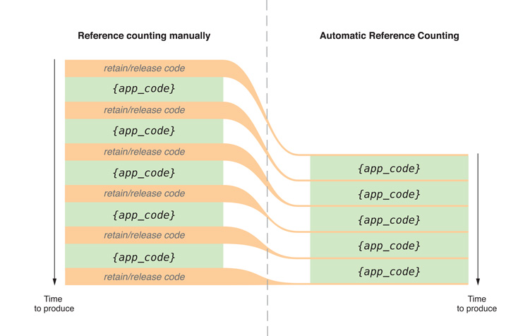
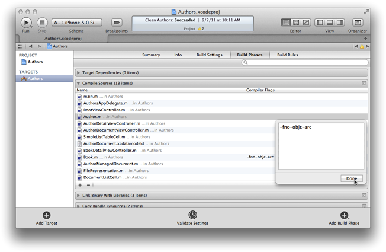

> 导航：[总目录](../../README.md) · [releasenotes](../../_indexes/releasenotes.md)


[Next](https://developer.apple.com/library/archive/releasenotes/ObjectiveC/RN-TransitioningToARC/RevisionHistory.html)

# Transitioning to ARC Release Notes

Automatic Reference Counting (ARC) is a compiler feature that provides automatic memory management of Objective-C objects. Rather than having to think about retain and release operations, ARC allows you to concentrate on the interesting code, the [object graphs](https://developer.apple.com/library/archive/documentation/General/Conceptual/DevPedia-CocoaCore/ObjectGraph.html#//apple_ref/doc/uid/TP40008195-CH54), and the relationships between objects in your application.



ARC works by adding code at compile time to ensure that objects live as long as necessary, but no longer. Conceptually, it follows the same memory management conventions as manual reference counting (described in _[Advanced Memory Management Programming Guide](../../documentation/Cocoa/Advanced%20Memory%20Management%20Programming%20Guide/About%20Memory%20Management.md#apple-f4xwc4dqnrsv64tfmyxwi33df52wszbpgeydambqgaytc2i)_) by adding the appropriate memory management calls for you.

In order for the compiler to generate correct code, ARC restricts the methods you can use and how you use toll-free bridging (see [Toll-Free Bridged Types](https://developer.apple.com/library/archive/documentation/CoreFoundation/Conceptual/CFDesignConcepts/Articles/tollFreeBridgedTypes.html#//apple_ref/doc/uid/TP40010677)). ARC also introduces new lifetime qualifiers for object references and [declared properties](https://developer.apple.com/library/archive/documentation/General/Conceptual/DevPedia-CocoaCore/DeclaredProperty.html#//apple_ref/doc/uid/TP40008195-CH13).

ARC is supported in Xcode 4.2 for OS X v10.6 and v10.7 (64-bit applications) and for iOS 4 and iOS 5. Weak references are not supported in OS X v10.6 and iOS 4.

Xcode provides a tool that automates the mechanical parts of the ARC conversion (such as removing `retain` and `release` calls) and helps you to fix issues the migrator can’t handle automatically (choose Edit > Refactor > Convert to Objective-C ARC). The migration tool converts all files in a project to use ARC. You can also choose to use ARC on a per-file basis if it’s more convenient for you to use manual reference counting for some files.

See also:

- _[Advanced Memory Management Programming Guide](../../documentation/Cocoa/Advanced%20Memory%20Management%20Programming%20Guide/About%20Memory%20Management.md#apple-f4xwc4dqnrsv64tfmyxwi33df52wszbpgeydambqgaytc2i)_
- _[Memory Management Programming Guide for Core Foundation](../../documentation/Core%20Foundation/Memory%20Management%20Programming%20Guide%20for%20Core%20Foundation/Introduction.md#apple-f4xwc4dqnrsv64tfmyxwi33df52wszbpgeydambqgezdo2i)_

Instead of you having to remember when to use [retain](https://developer.apple.com/library/archive/documentation/LegacyTechnologies/WebObjects/WebObjects_3.5/Reference/Frameworks/ObjC/Foundation/Protocols/NSObject/Description.html#//apple_ref/occ/intfm/NSObject/retain), [release](https://developer.apple.com/library/archive/documentation/LegacyTechnologies/WebObjects/WebObjects_3.5/Reference/Frameworks/ObjC/Foundation/Protocols/NSObject/Description.html#//apple_ref/occ/intfm/NSObject/release), and [autorelease](https://developer.apple.com/library/archive/documentation/LegacyTechnologies/WebObjects/WebObjects_3.5/Reference/Frameworks/ObjC/Foundation/Protocols/NSObject/Description.html#//apple_ref/occ/intfm/NSObject/autorelease), ARC evaluates the lifetime requirements of your objects and automatically inserts appropriate memory management calls for you at compile time. The compiler also generates appropriate [dealloc](https://developer.apple.com/library/archive/documentation/LegacyTechnologies/WebObjects/WebObjects_3.5/Reference/Frameworks/ObjC/Foundation/Classes/NSObject/Description.html#//apple_ref/occ/instm/NSObject/dealloc) methods for you. In general, if you’re only using ARC the traditional Cocoa naming conventions are important only if you need to interoperate with code that uses manual reference counting.

A complete and correct implementation of a `Person` class might look like this:

```objc
@interface Person : NSObject
@property NSString *firstName;
@property NSString *lastName;
@property NSNumber *yearOfBirth;
@property Person *spouse;
@end

@implementation Person
@end
```

(Object properties are `strong` by default; the `strong` attribute is described in [ARC Introduces New Lifetime Qualifiers](#apple-f4xwc4dqnrsv64tfmyxwi33df52wszbpkridimbqgeytemrwfvbuqmjnknlti).)

Using ARC, you could implement a contrived method like this:

```objc
- (void)contrived {
    Person *aPerson = [[Person alloc] init];
    [aPerson setFirstName:@"William"];
    [aPerson setLastName:@"Dudney"];
    [aPerson setYearOfBirth:[[NSNumber alloc] initWithInteger:2011]];
    NSLog(@"aPerson: %@", aPerson);
}
```

ARC takes care of memory management so that neither the `Person` nor the `NSNumber` objects are leaked.

You could also safely implement a `takeLastNameFrom:` method of `Person` like this:

```objc
- (void)takeLastNameFrom:(Person *)person {
    NSString *oldLastname = [self lastName];
    [self setLastName:[person lastName]];
    NSLog(@"Lastname changed from %@ to %@", oldLastname, [self lastName]);
}
```

ARC ensures that `oldLastName` is not deallocated before the `NSLog` statement.

To work, ARC imposes some new rules that are not present when using other compiler modes. The rules are intended to provide a fully reliable memory management model; in some cases, they simply enforce best practice, in some others they simplify your code or are obvious corollaries of your not having to deal with memory management. If you violate these rules, you get an immediate compile-time error, not a subtle bug that may become apparent at runtime.

- You cannot explicitly invoke `dealloc`, or implement or invoke `retain`, `release`, `retainCount`, or `autorelease`.

  The prohibition extends to using `@selector(retain)`, `@selector(release)`, and so on.

  You may implement a `dealloc` method if you need to manage resources other than releasing instance variables. You do not have to (indeed you cannot) release instance variables, but you may need to invoke `[systemClassInstance setDelegate:nil]` on system classes and other code that isn’t compiled using ARC.

  Custom `dealloc` methods in ARC do not require a call to `[super dealloc]` (it actually results in a compiler error). The chaining to super is automated and enforced by the compiler.

  You can still use `CFRetain`, `CFRelease`, and other related functions with Core Foundation-style objects (see [Managing Toll-Free Bridging](#apple-f4xwc4dqnrsv64tfmyxwi33df52wszbpkridimbqgeytemrwfvbuqmjnknltc)).
- You cannot use `NSAllocateObject` or `NSDeallocateObject`.

  You create objects using [alloc](https://developer.apple.com/library/archive/documentation/LegacyTechnologies/WebObjects/WebObjects_3.5/Reference/Frameworks/ObjC/Foundation/Classes/NSObject/Description.html#//apple_ref/occ/clm/NSObject/alloc); the runtime takes care of deallocating objects.
- You cannot use object pointers in C structures.

  Rather than using a `struct`, you can create an Objective-C class to manage the data instead.
- There is no casual casting between `id` and `void *`.

  You must use special casts that tell the compiler about object lifetime. You need to do this to cast between Objective-C objects and Core Foundation types that you pass as function arguments. For more details, see [Managing Toll-Free Bridging](#apple-f4xwc4dqnrsv64tfmyxwi33df52wszbpkridimbqgeytemrwfvbuqmjnknltc).
- You cannot use [NSAutoreleasePool](https://developer.apple.com/library/archive/documentation/LegacyTechnologies/WebObjects/WebObjects_3.5/Reference/Frameworks/ObjC/Foundation/Classes/NSAutoreleasePool/Description.html#//apple_ref/occ/cl/NSAutoreleasePool) objects.

  ARC provides `@autoreleasepool` blocks instead. These have an advantage of being more efficient than `NSAutoreleasePool`.
- You cannot use memory zones.

  There is no need to use `NSZone` any more—they are ignored by the modern Objective-C runtime anyway.

To allow interoperation with manual retain-release code, ARC imposes a constraint on method naming:

- You cannot give an accessor a name that begins with `new`. This in turn means that you can’t, for example, declare a property whose name begins with new unless you specify a different getter:

```objc
// Won't work:
@property NSString *newTitle;

// Works:
@property (getter=theNewTitle) NSString *newTitle;
```


ARC introduces several new lifetime qualifiers for objects, and _weak references_. A weak reference does not extend the lifetime of the object it points to, and automatically becomes `nil` when there are no strong references to the object.

You should take advantage of these qualifiers to manage the object graphs in your program. In particular, ARC does not guard against _strong reference cycles_ (previously known as retain cycles—see [Practical Memory Management](https://developer.apple.com/library/archive/documentation/Cocoa/Conceptual/MemoryMgmt/Articles/mmPractical.html#//apple_ref/doc/uid/TP40004447)). Judicious use of weak relationships will help to ensure you don’t create cycles.

The keywords `weak` and `strong` are introduced as new declared property attributes, as shown in the following examples.

```objc
// The following declaration is a synonym for: @property(retain) MyClass *myObject;
@property(strong) MyClass *myObject;

// The following declaration is similar to "@property(assign) MyClass *myObject;"
// except that if the MyClass instance is deallocated,
// the property value is set to nil instead of remaining as a dangling pointer.
@property(weak) MyClass *myObject;
```

Under ARC, `strong` is the default for object types.

You use the following lifetime qualifiers for variables just like you would, say, `const`.

```
__strong
__weak
__unsafe_unretained
__autoreleasing
```

- `__strong` is the default. An object remains “alive” as long as there is a strong pointer to it.
- `__weak` specifies a reference that does not keep the referenced object alive. A weak reference is set to `nil` when there are no strong references to the object.
- `__unsafe_unretained` specifies a reference that does not keep the referenced object alive and is _not_ set to `nil` when there are no strong references to the object. If the object it references is deallocated, the pointer is left dangling.
- `__autoreleasing` is used to denote arguments that are passed by reference (`id *`) and are autoreleased on return.

You should decorate variables correctly. When using qualifiers in an object variable declaration, the correct format is:

```
ClassName * qualifier variableName;
```

for example:

```
MyClass * __weak myWeakReference;
MyClass * __unsafe_unretained myUnsafeReference;
```

Other variants are technically incorrect but are “forgiven” by the compiler. To understand the issue, see [http://cdecl.org/](http://cdecl.org/).

Take care when using `__weak` variables on the stack. Consider the following example:

```
NSString * __weak string = [[NSString alloc] initWithFormat:@"First Name: %@", [self firstName]];
NSLog(@"string: %@", string);
```

Although `string` is used after the initial assignment, there is no other strong reference to the string object at the time of assignment; it is therefore immediately deallocated. The log statement shows that `string` has a null value. (The compiler provides a warning in this situation.)

You also need to take care with objects passed by reference. The following code will work:

```
NSError *error;
BOOL OK = [myObject performOperationWithError:&error];
if (!OK) {
    // Report the error.
    // ...
```

However, the error declaration is implicitly:

```
NSError * __strong e;
```

and the method declaration would typically be:

```objc
-(BOOL)performOperationWithError:(NSError * __autoreleasing *)error;
```

The compiler therefore rewrites the code:

```
NSError * __strong error;
NSError * __autoreleasing tmp = error;
BOOL OK = [myObject performOperationWithError:&tmp];
error = tmp;
if (!OK) {
    // Report the error.
    // ...
```

The mismatch between the local variable declaration (`__strong`) and the parameter (`__autoreleasing`) causes the compiler to create the temporary variable. You can get the original pointer by declaring the parameter `id __strong *` when you take the address of a `__strong` variable. Alternatively you can declare the variable as `__autoreleasing`.

You can use lifetime qualifiers to avoid strong reference cycles. For example, typically if you have a graph of objects arranged in a parent-child hierarchy and parents need to refer to their children and vice versa, then you make the parent-to-child relationship strong and the child-to-parent relationship weak. Other situations may be more subtle, particularly when they involve [block objects](https://developer.apple.com/library/archive/documentation/General/Conceptual/DevPedia-CocoaCore/Block.html#//apple_ref/doc/uid/TP40008195-CH3).

In manual reference counting mode, `__block id x;` has the effect of not retaining `x`. In ARC mode, `__block id x;` defaults to retaining `x` (just like all other values). To get the manual reference counting mode behavior under ARC, you could use `__unsafe_unretained __block id x;`. As the name `__unsafe_unretained` implies, however, having a non-retained variable is dangerous (because it can dangle) and is therefore discouraged. Two better options are to either use `__weak` (if you don’t need to support iOS 4 or OS X v10.6), or set the `__block` value to `nil` to break the retain cycle.

The following code fragment illustrates this issue using a pattern that is sometimes used in manual reference counting.

```
MyViewController *myController = [[MyViewController alloc] init…];
// ...
myController.completionHandler =  ^(NSInteger result) {
   [myController dismissViewControllerAnimated:YES completion:nil];
};
[self presentViewController:myController animated:YES completion:^{
   [myController release];
}];
```

As described, instead, you can use a `__block` qualifier and set the `myController` variable to `nil` in the completion handler:

```
MyViewController * __block myController = [[MyViewController alloc] init…];
// ...
myController.completionHandler =  ^(NSInteger result) {
    [myController dismissViewControllerAnimated:YES completion:nil];
    myController = nil;
};
```

Alternatively, you can use a temporary `__weak` variable. The following example illustrates a simple implementation:

```
MyViewController *myController = [[MyViewController alloc] init…];
// ...
MyViewController * __weak weakMyViewController = myController;
myController.completionHandler =  ^(NSInteger result) {
    [weakMyViewController dismissViewControllerAnimated:YES completion:nil];
};
```

For non-trivial cycles, however, you should use:

```
MyViewController *myController = [[MyViewController alloc] init…];
// ...
MyViewController * __weak weakMyController = myController;
myController.completionHandler =  ^(NSInteger result) {
    MyViewController *strongMyController = weakMyController;
    if (strongMyController) {
        // ...
        [strongMyController dismissViewControllerAnimated:YES completion:nil];
        // ...
    }
    else {
        // Probably nothing...
    }
};
```

In some cases you can use `__unsafe_unretained` if the class isn’t `__weak` compatible. This can, however, become impractical for nontrivial cycles because it can be hard or impossible to validate that the `__unsafe_unretained` pointer is still valid and still points to the same object in question.

Using ARC, you cannot manage autorelease pools directly using the `NSAutoreleasePool` class. Instead, you use `@autoreleasepool` blocks:

```
@autoreleasepool {
     // Code, such as a loop that creates a large number of temporary objects.
}
```

This simple structure allows the compiler to reason about the reference count state. On entry, an autorelease pool is pushed. On normal exit (break, return, goto, fall-through, and so on) the autorelease pool is popped. For compatibility with existing code, if exit is due to an exception, the autorelease pool is not popped.

This syntax is available in all Objective-C modes. It is more efficient than using the `NSAutoreleasePool` class; you are therefore encouraged to adopt it in place of using the `NSAutoreleasePool`.

The patterns for declaring [outlets](https://developer.apple.com/library/archive/documentation/General/Devpedia-CocoaApp-MOSX/Outlet.html#//apple_ref/doc/uid/TP40009448-CH4) in iOS and OS X change with ARC and become consistent across both platforms. The pattern you should _typically_ adopt is: outlets should be `weak`, except for those from File’s Owner to top-level objects in a nib file (or a storyboard scene) which should be `strong`.

Full details are given in [Nib Files](https://developer.apple.com/library/archive/documentation/Cocoa/Conceptual/LoadingResources/CocoaNibs/CocoaNibs.html#//apple_ref/doc/uid/10000051i-CH4) in _[Resource Programming Guide](../../documentation/Cocoa/Resource%20Programming%20Guide/About%20Resources.md#apple-f4xwc4dqnrsv64tfmyxwi33df52wszbpgeydambqga2tc2i)_.

Using ARC, strong, weak, and autoreleasing stack variables are now implicitly initialized with `nil`. For example:

```objc
- (void)myMethod {
    NSString *name;
    NSLog(@"name: %@", name);
}
```

will log null for the value of name rather than perhaps crashing.

You enable ARC using a new `-fobjc-arc` compiler flag. You can also choose to use ARC on a per-file basis if it’s more convenient for you to use manual reference counting for some files. For projects that employ ARC as the default approach, you can disable ARC for a specific file using a new `-fno-objc-arc` compiler flag for that file.

ARC is supported in Xcode 4.2 and later OS X v10.6 and later (64-bit applications) and for iOS 4 and later. Weak references are not supported in OS X v10.6 and iOS 4. There is no ARC support in Xcode 4.1 and earlier.

In many Cocoa applications, you need to use Core Foundation-style objects, whether from the Core Foundation framework itself (such as [CFArrayRef](https://developer.apple.com/documentation/corefoundation/cfarray) or [CFMutableDictionaryRef](https://developer.apple.com/documentation/corefoundation/cfmutabledictionaryref)) or from frameworks that adopt Core Foundation conventions such as Core Graphics (you might use types like [CGColorSpaceRef](https://developer.apple.com/documentation/coregraphics/cgcolorspaceref) and [CGGradientRef](https://developer.apple.com/documentation/coregraphics/cggradientref)).

The compiler does _not_ automatically manage the lifetimes of Core Foundation objects; you must call [CFRetain](https://developer.apple.com/documentation/corefoundation/1521269-cfretain) and [CFRelease](https://developer.apple.com/documentation/corefoundation/1521153-cfrelease) (or the corresponding type-specific variants) as dictated by the Core Foundation memory management rules (see _[Memory Management Programming Guide for Core Foundation](../../documentation/Core%20Foundation/Memory%20Management%20Programming%20Guide%20for%20Core%20Foundation/Introduction.md#apple-f4xwc4dqnrsv64tfmyxwi33df52wszbpgeydambqgezdo2i)_).

If you cast between Objective-C and Core Foundation-style objects, you need to tell the compiler about the ownership semantics of the object using either a cast (defined in `objc/runtime.h`) or a Core Foundation-style macro (defined in `NSObject.h`):

- `__bridge` transfers a pointer between Objective-C and Core Foundation with no transfer of ownership.
- `__bridge_retained` or `CFBridgingRetain` casts an Objective-C pointer to a Core Foundation pointer and also transfers ownership to you.

  You are responsible for calling `CFRelease` or a related function to relinquish ownership of the object.
- `__bridge_transfer` or `CFBridgingRelease` moves a non-Objective-C pointer to Objective-C and also transfers ownership to ARC.

  ARC is responsible for relinquishing ownership of the object.

For example, if you had code like this:

```objc
- (void)logFirstNameOfPerson:(ABRecordRef)person {

    NSString *name = (NSString *)ABRecordCopyValue(person, kABPersonFirstNameProperty);
    NSLog(@"Person's first name: %@", name);
    [name release];
}
```

you could replace it with:

```objc
- (void)logFirstNameOfPerson:(ABRecordRef)person {

    NSString *name = (NSString *)CFBridgingRelease(ABRecordCopyValue(person, kABPersonFirstNameProperty));
    NSLog(@"Person's first name: %@", name);
}
```


The compiler understands Objective-C methods that return Core Foundation types follow the historical Cocoa naming conventions (see _[Advanced Memory Management Programming Guide](../../documentation/Cocoa/Advanced%20Memory%20Management%20Programming%20Guide/About%20Memory%20Management.md#apple-f4xwc4dqnrsv64tfmyxwi33df52wszbpgeydambqgaytc2i)_). For example, the compiler knows that, in iOS, the CGColor returned by the [CGColor](https://developer.apple.com/documentation/uikit/uicolor/1621954-cgcolor) method of [UIColor](https://developer.apple.com/documentation/uikit/uicolor) is not owned. You must still use an appropriate type cast, as illustrated by this example:

```
NSMutableArray *colors = [NSMutableArray arrayWithObject:(id)[[UIColor darkGrayColor] CGColor]];
[colors addObject:(id)[[UIColor lightGrayColor] CGColor]];
```


When you cast between Objective-C and Core Foundation objects in function calls, you need to tell the compiler about the ownership semantics of the passed object. The ownership rules for Core Foundation objects are those specified in the Core Foundation memory management rules (see _[Memory Management Programming Guide for Core Foundation](../../documentation/Core%20Foundation/Memory%20Management%20Programming%20Guide%20for%20Core%20Foundation/Introduction.md#apple-f4xwc4dqnrsv64tfmyxwi33df52wszbpgeydambqgezdo2i)_); rules for Objective-C objects are specified in _[Advanced Memory Management Programming Guide](../../documentation/Cocoa/Advanced%20Memory%20Management%20Programming%20Guide/About%20Memory%20Management.md#apple-f4xwc4dqnrsv64tfmyxwi33df52wszbpgeydambqgaytc2i)_.

In the following code fragment, the array passed to the `CGGradientCreateWithColors` function requires an appropriate cast. Ownership of the object returned by `arrayWithObjects:` is not passed to the function, thus the cast is `__bridge`.

```
NSArray *colors = <#An array of colors#>;
CGGradientRef gradient = CGGradientCreateWithColors(colorSpace, (__bridge CFArrayRef)colors, locations);
```

The code fragment is shown in context in the following method implementation. Notice also the use of Core Foundation memory management functions where dictated by the Core Foundation memory management rules.

```objc
- (void)drawRect:(CGRect)rect {
    CGContextRef ctx = UIGraphicsGetCurrentContext();
    CGColorSpaceRef colorSpace = CGColorSpaceCreateDeviceGray();
    CGFloat locations[2] = {0.0, 1.0};
    NSMutableArray *colors = [NSMutableArray arrayWithObject:(id)[[UIColor darkGrayColor] CGColor]];
    [colors addObject:(id)[[UIColor lightGrayColor] CGColor]];
    CGGradientRef gradient = CGGradientCreateWithColors(colorSpace, (__bridge CFArrayRef)colors, locations);
    CGColorSpaceRelease(colorSpace);  // Release owned Core Foundation object.
    CGPoint startPoint = CGPointMake(0.0, 0.0);
    CGPoint endPoint = CGPointMake(CGRectGetMaxX(self.bounds), CGRectGetMaxY(self.bounds));
    CGContextDrawLinearGradient(ctx, gradient, startPoint, endPoint,
                                kCGGradientDrawsBeforeStartLocation | kCGGradientDrawsAfterEndLocation);
    CGGradientRelease(gradient);  // Release owned Core Foundation object.
}
```


When migrating existing projects, you are likely to run into various issues. Here are some common issues, together with solutions.

- You can’t invoke `retain`, `release`, or `autorelease`.

  This is a feature. You also can’t write:

```
while ([x retainCount]) { [x release]; }
```
- You can’t invoke `dealloc`.

  You typically invoke `dealloc` if you are implementing a singleton or replacing an object in an `init` methods. For singletons, use the shared instance pattern. In `init` methods, you don't have to call `dealloc` anymore, because the object will be freed when you overwrite `self`.
- You can’t use `NSAutoreleasePool` objects.

  Use the new `@autoreleasepool{}` construct instead. This forces a block structure on your autorelease pool, and is about six times faster than `NSAutoreleasePool`. `@autoreleasepool` even works in non-ARC code. Because `@autoreleasepool` is so much faster than `NSAutoreleasePool`, many old “performance hacks” can simply be replaced with unconditional `@autoreleasepool`.

  The migrator handles simple uses of `NSAutoreleasePool`, but it can't handle complex conditional cases, or cases where a variable is defined inside the body of the new `@autoreleasepool` and used after it.
- ARC requires you to assign the result of `[super init]` to `self` in `init` methods.

  The following is invalid in ARC `init` methods:

```
[super init];
```

  The _simple_ fix is to change it to:

```
self = [super init];
```

  The proper fix is to do that, _and_ check the result for `nil` before continuing:

```
self = [super init];
if (self) {
   ...
```
- You can’t implement custom `retain` or `release` methods.

  Implementing custom `retain` or `release` methods breaks weak pointers. There are several common reasons for wanting to provide custom implementations:

  - Performance.

    Please don’t do this any more; the implementation of `retain` and `release` for `NSObject` is much faster now. If you still find problems, please file bugs.
  - To implement a custom weak pointer system.

    Use `__weak` instead.
  - To implement singleton class.

    Use the shared instance pattern instead. Alternatively, use class instead of instance methods, which avoids having to allocate the object at all.
- “Assigned” instance variables become strong.

  Before ARC, instance variables were non-owning references—directly assigning an object to an instance variable did not extend the lifetime of the object. To make a property strong, you usually implemented or synthesized accessor methods that invoked appropriate memory management methods; in contrast, you may have implemented accessor methods like those shown in the following example to maintain a weak property.

```objc
@interface MyClass : Superclass {
    id thing; // Weak reference.
}
// ...
@end

@implementation MyClass
- (id)thing {
    return thing;
}
- (void)setThing:(id)newThing {
    thing = newThing;
}
// ...
@end
```

  With ARC, instance variables are strong references by default—assigning an object to an instance variable directly does extend the lifetime of the object. The migration tool is not able to determine when an instance variable is intended to be weak. To maintain the same behavior as before, you must mark the instance variable as being weak, or use a declared property.

```objc
@interface MyClass : Superclass {
    id __weak thing;
}
// ...
@end

@implementation MyClass
- (id)thing {
    return thing;
}
- (void)setThing:(id)newThing {
    thing = newThing;
}
// ...
@end
```

  Or:

```objc
@interface MyClass : Superclass
@property (weak) id thing;
// ...
@end

@implementation MyClass
@synthesize thing;
// ...
@end
```
- You can't use strong `id`s in C structures.

  For example, the following code won’t compile:

```
struct X { id x; float y; };
```

  This is because `x` defaults to strongly retained and the compiler can’t safely synthesize all the code required to make it work correctly. For example, if you pass a pointer to one of these structures through some code that ends up doing a `free`, each `id` would have to be released before the `struct` is freed. The compiler cannot reliably do this, so strong `id`s in structures are disallowed completely in ARC mode. There are a few possible solutions:

  1. Use Objective-C objects instead of structs.

     This is considered to be best practice anyway.
  2. If using Objective-C objects is sub-optimal, (maybe you want a dense array of these structs) then consider using a `void*` instead.

     This requires the use of the explicit casts, described below.
  3. Mark the object reference as `__unsafe_unretained`.

     This approach may be useful for the semi-common patterns like this:

```
struct x { NSString *S;  int X; } StaticArray[] = {
  @"foo", 42,
  @"bar, 97,
...
};
```

     You declare the structure as:

```
struct x { NSString * __unsafe_unretained S; int X; }
```

     This may be problematic and is unsafe if the object could be released out from under the pointer, but it is very useful for things that are known to be around forever like constant string literals.
- You can’t directly cast between `id` and `void*` (including Core Foundation types).

  This is discussed in greater detail in [Managing Toll-Free Bridging](#apple-f4xwc4dqnrsv64tfmyxwi33df52wszbpkridimbqgeytemrwfvbuqmjnknltc).

__How do I think about ARC? Where does it put the retains/releases?__

Try to stop thinking about where the retain/release calls are put and think about your application algorithms instead. Think about “strong and weak” pointers in your objects, about object ownership, and about possible retain cycles.

__Do I still need to write dealloc methods for my objects?__

Maybe.

Because ARC does not automate `malloc`/`free`, management of the lifetime of Core Foundation objects, file descriptors, and so on, you still free such resources by writing a `dealloc` method.

You do not have to (indeed cannot) release instance variables, but you may need to invoke `[self setDelegate:nil]` on system classes and other code that isn’t compiled using ARC.

`dealloc` methods in ARC do not require—or allow—a call to `[super dealloc]`; the chaining to super is handled and enforced by the runtime.

__Are retain cycles still possible in ARC?__

Yes.

ARC automates retain/release, and inherits the issue of retain cycles. Fortunately, code migrated to ARC rarely starts leaking, because properties already declare whether the properties are retaining or not.

__How do blocks work in ARC?__

Blocks “just work” when you pass blocks up the stack in ARC mode, such as in a return. You don’t have to call Block Copy any more.

The one thing to be aware of is that `NSString * __block myString` is retained in ARC mode, not a possibly dangling pointer. To get the previous behavior, use `__block NSString * __unsafe_unretained myString` or (better still) use `__block NSString * __weak myString`.

__Can I develop applications for OS X with ARC using Snow Leopard?__

No. The Snow Leopard version of Xcode 4.2 doesn’t support ARC at all on OS X, because it doesn’t include the 10.7 SDK. Xcode 4.2 for Snow Leopard _does_ support ARC for iOS though, and Xcode 4.2 for Lion supports both OS X and iOS. This means you need a Lion system to build an ARC application that runs on Snow Leopard.

__Can I create a C array of retained pointers under ARC?__

Yes, you can, as illustrated by this example:

```
// Note calloc() to get zero-filled memory.
__strong SomeClass **dynamicArray = (__strong SomeClass **)calloc(entries, sizeof(SomeClass *));
for (int i = 0; i < entries; i++) {
     dynamicArray[i] = [[SomeClass alloc] init];
}

// When you're done, set each entry to nil to tell ARC to release the object.
for (int i = 0; i < entries; i++) {
     dynamicArray[i] = nil;
}
free(dynamicArray);
```

There are a number of aspects to note:

- You will need to write `__strong SomeClass **` in some cases, because the default is `__autoreleasing SomeClass **`.
- The allocated memory must be zero-filled.
- You must set each element to `nil` before freeing the array (`memset` or `bzero` will not work).
- You should avoid `memcpy` or `realloc`.

__Is ARC slow?__

It depends on what you’re measuring, but generally “no.” The compiler efficiently eliminates many extraneous `retain`/`release` calls and much effort has been invested in speeding up the Objective-C runtime in general. In particular, the common “return a retain/autoreleased object” pattern is much faster and does not actually put the object into the autorelease pool, when the caller of the method is ARC code.

One issue to be aware of is that the optimizer is not run in common debug configurations, so expect to see a lot more `retain`/`release` traffic at `-O0` than at `-Os`.

__Does ARC work in ObjC++ mode?__

Yes. You can even put strong/weak `id`s in classes and containers. The ARC compiler synthesizes `retain`/`release` logic in copy constructors and destructors etc to make this work.

__Which classes don’t support weak references?__

You cannot currently create weak references to instances of the following classes:

`NSATSTypesetter`, `NSColorSpace`, `NSFont`, `NSMenuView`, `NSParagraphStyle`, `NSSimpleHorizontalTypesetter`, and `NSTextView`.

For declared properties, you should use `assign` instead of `weak`; for variables you should use `__unsafe_unretained` instead of `__weak`.

In addition, you cannot create weak references from instances of `NSHashTable`, `NSMapTable`, or `NSPointerArray` under ARC.

__What do I have to do when subclassing NSCell or another class that uses NSCopyObject?__

Nothing special. ARC takes care of cases where you had to previously add extra retains explicitly. With ARC, all copy methods should just copy over the instance variables.

__Can I opt out of ARC for specific files?__

Yes.

When you migrate a project to use ARC, the `-fobjc-arc` compiler flag is set as the default for all Objective-C source files. You can disable ARC for a specific class using the `-fno-objc-arc` compiler flag for that class. In Xcode, in the target Build Phases tab, open the Compile Sources group to reveal the source file list. Double-click the file for which you want to set the flag, enter `-fno-objc-arc` in the pop-up panel, then click Done.



__Is GC (Garbage Collection) deprecated on the Mac?__

Garbage collection is deprecated in OS X Mountain Lion v10.8, and will be removed in a future version of OS X. Automatic Reference Counting is the recommended replacement technology. To aid in migrating existing applications, the ARC migration tool in Xcode 4.3 and later supports migration of garbage collected OS X applications to ARC.

[Next](https://developer.apple.com/library/archive/releasenotes/ObjectiveC/RN-TransitioningToARC/RevisionHistory.html)

