> 导航：[总目录](../../../README.md) · [releasenotes](../../../_indexes/releasenotes.md)


# Cocoa Auto Layout Release Notes

#### Contents:

- [About Cocoa Auto Layout](#apple-f4xwc4dqnrsv64tfmyxwi33df52wszbpkridimbqgeydmmzrfvbuqmjnknltq)
- [Constraints Express Relationships Between Views](#apple-f4xwc4dqnrsv64tfmyxwi33df52wszbpkridimbqgeydmmzrfvbuqmjnknltcma)
- [Create Constraints Programmatically Using the Visual Format Language](#apple-f4xwc4dqnrsv64tfmyxwi33df52wszbpkridimbqgeydmmzrfvbuqmjnknltg)
- [Add Constraints to Views](#apple-f4xwc4dqnrsv64tfmyxwi33df52wszbpkridimbqgeydmmzrfvbuqmjnknltcmy)
- [Core Layout Runtime](#apple-f4xwc4dqnrsv64tfmyxwi33df52wszbpkridimbqgeydmmzrfvbuqmjnknltcna)
- [Dividing Responsibility Between Controllers and Views](#apple-f4xwc4dqnrsv64tfmyxwi33df52wszbpkridimbqgeydmmzrfvbuqmjnknltc)
- [Debugging](#apple-f4xwc4dqnrsv64tfmyxwi33df52wszbpkridimbqgeydmmzrfvbuqmjnknltcoa)
- [Auto Layout Supports Incremental Adoption](#apple-f4xwc4dqnrsv64tfmyxwi33df52wszbpkridimbqgeydmmzrfvbuqmjnknltemq)
- [Sample Code](#apple-f4xwc4dqnrsv64tfmyxwi33df52wszbpkridimbqgeydmmzrfvbuqmjnknltemy)

### About Cocoa Auto Layout

OS X Lion introduces a new layout system for Cocoa, replacing the historical springs and struts model. Instead of using autosizing masks, you define layout constraints that express your intent, such as “these views line up head to tail,” or “this button should move with this split view subview.”

__Figure 1-1__Laying out a label
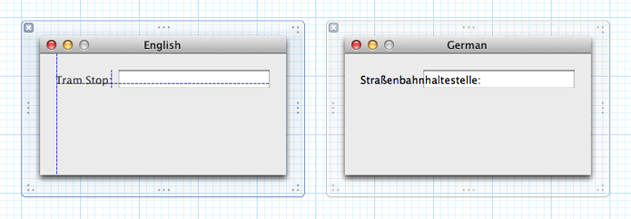

In the window on the left in [Figure 1-1](#apple-f4xwc4dqnrsv64tfmyxwi33df52wszbpkridimbqgeydmmzrfvbuqmjnknlti), the intent in laying out the text label is that it should be anchored the appropriate distance from the edges of the window and the text field as defined by Aqua guidelines, and that it should occupy only as much area as required by the string. There is no way to capture or express this intent using the springs and struts (autosizing mask) model, leading to the situation shown in the window on the right if the label text changes (because of localization, for example).

The new approach is to save the _dashed line guides_ from Interface Builder instead of just the _frames of views_. Rather than being one-off helpers for setting a frame in a nib file, guides become persistent first class objects called _constraints_. Constraints express desired relationships between user interface elements. When laying out the user interface, a constraint satisfaction system arranges the elements in a way that most closely meets the constraints.

The benefits of this approach are most clear for localization and resolution independence. With this architecture, your localization effort is typically confined to translating strings. You don’t have to specify new layout, even for right-to-left languages such as Hebrew and Arabic (in which the left-to-right ordering of elements in the window should generally be reversed). For resolution independence, this system allows for pixel-perfect layout at nonintegral scale factors for interfaces designed in Interface Builder. Neither was previously possible.

There are also more subtle advantages:

- The new architecture improves the division of responsibility between controllers and views.

  Rather than you writing a monolithic, omniscient controller that calculates where views need to go for a given geometry, views tell the layout engine where they want to be.
- For layout defined in Interface Builder, there are typically fewer steps needed.

  Suppose you drag a text field out of the library, snap it into the bottom-left corner of a window, then drag-resize the right edge until it snaps into the bottom-right corner. Nothing further is needed to specify that when the window is resized, the text field should stretch horizontally.
- For controllers that lay out views:

  - Source code is more readable through use of an ASCII-art-inspired format string for specifying layout. The source code literally looks like the final product.
  - There’s less work to do. Leaf views, such as buttons, always size themselves to fit their contents unless something prevents it.
  - You more directly express what you want. You provide constraints to specify “the baselines of these two views line up,” and the framework does the requisite calculations.
- For views, it’s easier to change metrics and visual design without updating clients:

  - Clients don’t specify anything about size unless they are trying to do something nonstandard.
  - Clients don’t hardcode things such as baselines or the amount of shadow under a button.

> [!NOTE]
> 

### Constraints Express Relationships Between Views

The only new class is [NSLayoutConstraint](https://developer.apple.com/documentation/uikit/nslayoutconstraint), instances of which represent constraints. A constraint is a statement of the form

```
y = m*x + b
```

- `y` and `x` are attributes of views.

  An _attribute_ is one of `left`, `right`, `top`, `bottom`, `leading`, `trailing`, `width`, `height`, `centerX`, `centerY`, and `baseline`.

  The attributes `leading` and `trailing` are the same as `left` and `right` in English, but the UI flips in a right-to-left environment like Hebrew or Arabic. When using Interface Builder or the visual format strings (see [Create Constraints Programmatically Using the Visual Format Language](#apple-f4xwc4dqnrsv64tfmyxwi33df52wszbpkridimbqgeydmmzrfvbuqmjnknltg)), `leading` and `trailing` are the default values.
- The relation in a constraint does not have to be `==`; it can also be `<=` or `>=`.

The following represents a concrete example of a constraint (although it is presented as pseudocode):

```
button1.right == button2.left - 12.0
```

A constraint also has an optional floating point _priority level_. Constraints with higher priority levels are satisfied before constraints with lower priority levels. The default priority level is `NSLayoutPriorityRequired`, which means that the constraint must be satisfied exactly. The layout system strives to meet an optional constraint, even if it cannot completely achieve it. If a constraint `a == b` is optional, it means that `abs(a - b)` should be minimized.

Priority levels allow you to express useful conditional behavior. For example, they are used to express that all controls should always be sized to fit their contents, unless something more important prevents it. For more detail on this example, see [Dividing Responsibility Between Controllers and Views](#apple-f4xwc4dqnrsv64tfmyxwi33df52wszbpkridimbqgeydmmzrfvbuqmjnknltc).

Constraints can, with some restrictions, cross the view hierarchy. In Mail, for example, by default the Delete button in the toolbar lines up with the message table, and in Desktop Preferences, the checkboxes at the bottom of the window align with the split view pane they operate on.

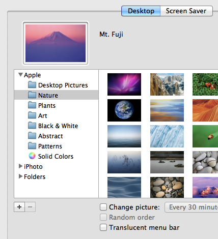

A constraint cannot cross through a view that is manually laid out, or through a view that has a bounds transform. You can think of these views as barriers. There’s an inside world and an outside world, but the inside cannot be connected to the outside by constraints.

A constraint is typically immutable after you create it, but you can still change the constant. There are two reasons for this:

- It’s algorithmically important. It is much more efficient to change the constant than to remove a constraint and add a new one.
- It leads to a natural way to implement operations such as dragging, where performance is most important.

Constraints are not directional, and there are no restrictions on cycles. Layout itself is neither top down nor bottom up. Instead, all constraints, and their relative priorities, are considered at the same time, and elements laid out in a way that best satisfies all of the constraints.

### Create Constraints Programmatically Using the Visual Format Language

### Source Code Traditionally Does Not Communicate Visual Presentation Well

A major problem for layout systems is that imperative source code is a poor way to communicate visual user interface. To illustrate, consider the layout of an alert panel, which might be implemented as follows:

```
   if (_accessoryView) {
        minYMessageAndAccessories -= [_accessoryView frame].size.height;
        if ([self showsSuppressionButton]) {
            // we’ve already accounted for the spacing above the suppression button and below the accessory view.  Add spacing between.
            minYMessageAndAccessories -= ACCESSORY_INTERY_SPACING;
            // adjust y-origin of suppression button since there is also an accessory view
            NSPoint buttonOrigin = [_suppressionButton frame].origin;
            buttonOrigin.y += [_accessoryView frame].size.height + ACCESSORY_INTERY_SPACING;
            [_suppressionButton setFrameOrigin:buttonOrigin];
        } else {
            // we need spacing above and below accessory view
            minYMessageAndAccessories -= ACCESSORY_MINY_SPACING + ACCESSORY_MAXY_SPACING;
        }
    }

    if (_imageView != nil) {
        if (minYMessageAndAccessories < NSMinY([_imageView frame])) {
            panelHeight += NSMinY([_imageView frame]) - minYMessageAndAccessories;
        }
    }
```

It is arguably impossible to understand at a glance what this code does. It is also difficult to maintain—changing the layout behavior will be tricky and error-prone. In practice, this situation is less common than might be the case, because instead of writing such code, you use Interface Builder:

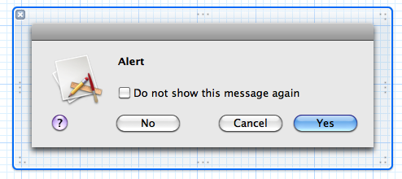

This is a principal element of the approach to usability: You must be able to visualize the layout. The largest component for this is Interface Builder. However, it is also desirable to visualize the layout in code as well. Consider the layout of these buttons:

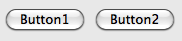

The left side of `button2` is the standard Aqua space away from the right side of the `button1`. For ease of illustration, replace “standard Aqua spacing” with a simple constant, `12`. Using the basic method for constraint creation, you might create the constraint like this:

```
[NSLayoutConstraint constraintWithItem:button1
                    attribute:NSLayoutAttributeRight
                    relatedBy:NSLayoutRelationEqual
                    toItem:button2
                    attribute:NSLayoutAttributeLeft
                    multiplier:1.0
                    constant:-12.0];
```

The code is still not very visual. It’s hard to quickly determine, for example, which is the left and which is the right button. In writing the code, it’s easy to use a positive constant instead of a negative one, or to specify the wrong attribute.

### Cocoa Auto Layout Offers a Visual Representation of Layout in Source Code

To provide a visual representation in source code, Cocoa Auto Layout introduces an ASCII-art–inspired format string. A view is represented in square brackets, and a connection between views is represented using a hyphen. Thus the relationship between `button1` and `button2` can be represented as:

```
[button1]-12-[button2]
```

Or, since this is the standard Aqua space, just:

```
[button1]-[button2]
```

To create constraints visually, you use `constraintsWithVisualFormat:options:metrics:views:`. You specify the views using the `views` dictionary—the keys are the names you use in the format string, and the values are the corresponding views. The code to create the constraints thus becomes:

```
NSDictionary *views = NSDictionaryOfVariableBindings(button1, button2);
NSArray *constraints = [NSLayoutConstraint constraintsWithVisualFormat:@"[button1]-[button2]"
                                           options:0
                                           metrics:nil
                                           views:views];
```


### Visual Format Syntax

The following list illustrates constraints you can specify using the visual format. Note how the text visually matches the image.

|  |  |
| --- | --- |
| **Standard Space** | : `[button]-[textField]`   image: Art/standardSpace.png |
| **Width Constraint** | : `[button(>=50)]`   image: Art/widthConstraint.png |
| **Connection to Superview** | : `|-50-[orchidBox]-50-|`   image: Art/connectionToSuperview.png |
| **Vertical Layout** | : `V:[topField]-10-[bottomField]`   image: Art/verticalLayout.png |
| **Flush Views** | : `[maroonView][oceanView]`   image: Art/flushViews.png |
| **Priority** | : `[button(100@20)]`   image: Art/priority.png |
| **Equal Widths** | : `[button1(==button2)]`   image: Art/equalWidths.png |
| **Multiple Predicates** | : `[flexibleButton(>=70,<=100)]`   image: Art/multiplePredicates.png |
| **A Complete Line of Layout** | : `|-[find]-[findNext]-[findField(>=20)]-|`   image: Art/completeLayout.png |

The notation prefers good visualization over completeness of expressibility. Although some constraints can’t be expressed in visual format syntax, most that are in real user interfaces can be. One useful constraint that can’t be expressed is a fixed aspect ratio (for example, `imageView.width = 2 * imageView.height`). To create such a constraint, you must use the basic creation method.

### Visual Format String Grammar

The visual format string grammar is defined as follows (literals are shown in `code font`; __e__ denotes the empty string).

| Symbol | Replacement rules |
| --- | --- |
| <visualFormatString> | (<orientation>:)?(<superview><connection>)?<view>(<connection><view>)\*(<connection><superview>)? |
| <orientation> | `H`|`V` |
| <superview> | `|` |
| <view> | `[`<viewName>(<predicateListWithParens>)?`]` |
| <connection> | __e__|`-`<predicateList>`-`|`-` |
| <predicateList> | <simplePredicate>|<predicateListWithParens> |
| <simplePredicate> | <metricName>|<positiveNumber> |
| <predicateListWithParens> | `(`<predicate>(`,`<predicate>)\*`)` |
| <predicate> | (<relation>)?(<objectOfPredicate>)(`@`<priority>)? |
| <relation> | `==`|`<=`|`>=` |
| <objectOfPredicate> | <constant>|<viewName> _(see note)_ |
| <priority> | <metricName>|<number> |
| <constant> | <metricName>|<number> |
| <viewName> | Parsed as a C identifier.  This must be a key mapping to an instance of `NSView` in the passed views dictionary. |
| <metricName> | Parsed as a C identifier.  This must be a key mapping to an instance of `NSNumber` in the passed metrics dictionary. |
| <number> | As parsed by `strtod_l`, with the C locale. |

> [!NOTE]
> 

If you make a syntactic mistake, an exception is thrown with a diagnostic message. For example:

```
Expected ':' after 'V' to specify vertical arrangement
V|[backgroundBox]|
 ^

A predicate on a view's thickness must end with ')' and the view must end with ']'
|[whiteBox1][blackBox4(blackWidth][redBox]|
                                 ^

Unable to find view with name blackBox
|[whiteBox2][blackBox]
                     ^

Unknown relation. Must be ==, >=, or <=
V:|[blackBox4(>30)]|
               ^
```


### Add Constraints to Views

To make a constraint active, you must add it to a view. The view that holds the constraint must be an ancestor of the views the constraint involves, often the closest common ancestor. (This is in the existing `NSView` API sense of the word _ancestor_, where a view is an ancestor of itself.) The constraint is interpreted in the coordinate system of that view.

Suppose you install `[zoomableView1]-80-[zoomableView2]` on the common ancestor of `zoomableView1` and `zoomableView2`.

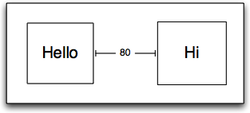

The 80 is in the coordinate system of the container, which is what it looks like if you visualize the constraint.

If the bounds transform of either of the zoomable views changes, the space between them remains fixed.

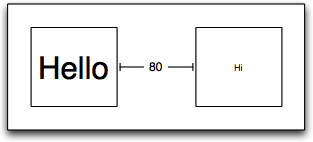

If the bounds transform in the container itself is changed, then the space scales, too.

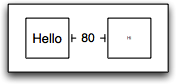

`NSView` provides a method—[addConstraint:](https://developer.apple.com/documentation/appkit/nsview/1526969-addconstraint)—to add a constraint, and methods to remove or inspect existing constraints—[removeConstraint:](https://developer.apple.com/documentation/appkit/nsview/1524333-removeconstraint) and [constraints](https://developer.apple.com/documentation/appkit/nsview/1526917-constraints)—as well as other related methods. `NSView` also provides a method, [fittingSize](https://developer.apple.com/documentation/appkit/nsview/1526904-fittingsize), which is similar to the [sizeToFit](https://developer.apple.com/documentation/appkit/nscontrol/1428877-sizetofit) method of `NSControl` but for arbitrary views rather than for controls.

The `fittingSize` method returns the ideal size for the view _considering only those constraints installed on the receiver’s subtree together with a preference for the view to be as small as possible_. The fitting size is not the “best” size for a view in a general sense—in the constraint-based system, a view’s “best” size if you consider everything has to be the size it currently has!

### Core Layout Runtime

In addition to the “display” pass Cocoa has always used, Cocoa Auto Layout adds two more passes that occur when rendering a window: [updateConstraintsIfNeeded](https://developer.apple.com/documentation/appkit/nswindow/1526915-updateconstraintsifneeded) and [layoutIfNeeded](https://developer.apple.com/documentation/appkit/nswindow/1526910-layoutifneeded). These occur in order: Update constraints, lay out, display. If you invoke `display` manually, it invokes `layout` and `layout` invokes `updateConstraints`.

You can think of the update constraints pass as a measurement pass that communicates changes in geometry to the layout system. For example, if you change the title of a button at some point the text has to be measured, and a constraint has to be set up that communicates that information into the layout system. The update constraints pass is bottom-up.

It is in the layout pass that the frames of views are updated. The layout pass is top-down.

These passes have parallel sets of methods:

|  | Display | Layout | Update Constraints | Override | Invoke Directly |
| --- | --- | --- | --- | --- | --- |
| __Perform pass at window level__ | `displayIfNeeded`  (`NSWindow`) | `layoutIfNeeded`  (`NSWindow`) | `updateConstraintsIfNeeded`  (`NSWindow`) | No. | Normally called automatically by AppKit, but may be called if you need things to be up-to-date right now. |
| __Perform pass at view level__  Sets things up and invokes the view overridable method on all views in subtree that are dirty with respect to the pass. | `displayIfNeeded`  (`NSView`) | `layoutSubtreeIfNeeded`  (`NSView`) | `updateConstraintsForSubtreeIfNeeded`  (`NSView`) | No. | Normally called automatically by AppKit, but may be called if you need things to be up-to-date right now. |
| __View level overridable method__  Subclassers should override this method to do the requested work for the receiver. This implementation should not dirty the current or previous passes or invoke later passes. | `drawRect:`  (`NSView`) | `layout`  (`NSView`) | `updateConstraints`  (`NSView`) | Yes. | You should not call these methods directly. |
| __Invalidation__  Get / set methods for invalidation of the pass. | `needsDisplay` (`NSView`)  `setNeedsDisplay:` (`NSView`) | `needsLayout` (`NSView`)  `setNeedsLayout:` (`NSView`) | `needsUpdateConstraints`  (`NSView`)  `setNeedsUpdateConstraints:`  (`NSView`) | No. | Yes, if/when necessary. |

If you’re implementing a custom view, the most common methods to interact with are the view-level overridable methods and the invalidation methods.

- You can override [updateConstraints](https://developer.apple.com/documentation/appkit/nsview/1526891-updateconstraints) to perform deferred constraint setup. You invoke [setNeedsUpdateConstraints:](https://developer.apple.com/documentation/appkit/nsview/1526856-needsupdateconstraints) when you have set up you want to defer. This is particularly useful when a nib file is loaded and properties are changing a lot—you won’t receive `updateConstraints` until things have settled down.
- You should override [layout](https://developer.apple.com/documentation/appkit/nsview/1526146-layout) only if you want to do custom layout. If you do, then you also need to invoke [setNeedsLayout:](https://developer.apple.com/documentation/appkit/nsview/1526912-needslayout) when something that feeds into your custom layout changes.

To reiterate: you never need to call `setNeedsLayout:` unless you override `layout`. Based on changes to constraints, the layout engine determines when layout is required.

A [controller object](https://developer.apple.com/library/archive/documentation/General/Conceptual/DevPedia-CocoaCore/ControllerObject.html#//apple_ref/doc/uid/TP40008195-CH11) is typically more concerned with the `NSWindow` and `NSView` methods that perform the pass. These uses are more rare, though still valid and needed on occasion.

- Perform the update constraints pass manually to make sure all constraints are up to date.

  You might do this before introspecting a constraint to extract a metric.
- Perform the layout pass manually if you want to extract frames from views and make decisions based on them. If you don’t first make sure that layout is up to date, the frames won’t be meaningful.

  An `NSAlert` object uses this as part of its layout. The constraint-based system doesn’t deal with flowed text and line breaking any better (or worse) than springs and struts does. `NSAlert` sets up all its constraints except for anything giving the height of the text fields. Then it calls [layoutSubtreeIfNeeded](https://developer.apple.com/documentation/appkit/nsview/1526871-layoutsubtreeifneeded). At this point the text fields have the correct width but not the correct height. It then uses `NSTextField` methods to find the appropriate height for the fields given their width, and adds the height constraints.

### Dividing Responsibility Between Controllers and Views

The Cocoa Auto Layout architecture improves the division of responsibility between controllers and views. Rather than you writing a monolithic, omniscient, controller that calculates where views need to go for a given geometry, views become more self-organizing. In addition to reducing the burden on you in implementing the controller object, the Cocoa Auto Layout architecture also lets a view designer change the view more easily without requiring all users to adapt.

### Some Views Have Intrinsic Content Size

Leaf-level views such as buttons typically know more about what size they should be than does the code that is positioning them. The size of such a view that ensures its contents are displayed appropriately is its _intrinsic size_. Not all views have an intrinsic content size. The Auto Layout system invokes a view’s [intrinsicContentSize](https://developer.apple.com/documentation/appkit/nsview/1526996-intrinsiccontentsize) method to find out if the view specifies how large it would like to be. A view can return absolute values for its width and height, or [NSViewNoInstrinsicMetric](https://developer.apple.com/documentation/appkit/nsviewnoinstrinsicmetric) for either or both to indicate that it has no preference for a given dimension.

For example, the intrinsic size for a push button is dictated by its title and image. A button’s [intrinsicContentSize](https://developer.apple.com/documentation/appkit/nsview/1526996-intrinsiccontentsize) method should return a size whose width and height ensure that the title text is not clipped and that the whole image is visible. A horizontal slider, however, has an intrinsic height but no intrinsic width—the slider artwork has no intrinsic best width. A horizontal `NSSlider` object returns `{NSViewNoInstrinsicMetric, <slider height>}`. A text label returns a value that specifies a standard height given the font used, and a width that ensures the text will not be clipped. A container, such as an instance of `NSBox`, also has no intrinsic content size and returns `{ NSViewNoInstrinsicMetric, NSViewNoInstrinsicMetric }`. Its subviews may have intrinsic content sizes, but the subviews’ content is not intrinsic to the box itself.

If a view implements the `intrinsicContentSize` method, the Auto Layout system sets up constraints that specify (1) that the opaque content should not be compressed or clipped, (2) that the view prefers to hug tightly to its content.

### You Can Specify How Important the Intrinsic Size Is

Although a view specifies its intrinsic content size, the user of the view says how important it is. For example, by default, a push button has these characteristics:

- It strongly wants to hug its content in the vertical direction (buttons really ought to be their natural height)
- It weakly hugs its content horizontally (extra side padding between the title and the edge of the bezel is acceptable)
- It strongly resists compressing or clipping content in both directions

In the scope bar in the Finder, however, the buttons only weakly resist compressing content in the horizontal direction. (You can make the window small enough that buttons start truncating their contents.) Thus, the Finder should lower the priority with which these buttons resist compressing content. You set the hugging and compression priorities for a view using [setContentHuggingPriority:forOrientation:](https://developer.apple.com/documentation/appkit/nsview/1526937-setcontenthuggingpriority) and [setContentCompressionResistancePriority:forOrientation:](https://developer.apple.com/documentation/appkit/nsview/1524974-setcontentcompressionresistancep) respectively. By default, a view has a value of either `NSLayoutPriorityDefaultHigh` or `NSLayoutPriorityDefaultLow`.

### Views Must Tell the Auto Layout System If Their Intrinsic Size Changes

Although the Auto Layout architecture _reduces_ the burden on the implementer of a controller class, Auto Layout may slightly _increase_ the burden on the implementer of a view class. If you implement a custom view class, you should determine whether the view has an intrinsic size and, if so, implement [intrinsicContentSize](https://developer.apple.com/documentation/appkit/nsview/1526996-intrinsiccontentsize) to return a suitable value.

In addition, if a property of a view changes and that change affects the intrinsic content size, the view must call [invalidateIntrinsicContentSize](https://developer.apple.com/documentation/appkit/nsview/1526864-invalidateintrinsiccontentsize) so that the layout system notices the change and can re-layout. In the implementation of your view class, you must ensure that if the value of any property upon which the intrinsic size depends changes, you invoke `invalidateIntrinsicContentSize`. For example, a text field calls `invalidateIntrinsicContentSize` if the string value changes.

### Layout Operates on Alignment Rectangles, Not Frames

When considering layout, keep in mind that the frame of a control is less important than its visual extent. As a result, ornaments like shadows and engraving lines should typically be ignored for the purposes of layout. Interface Builder has always done this.

In the following example, the Aqua guide (the dashed blue line) aligns with the visual extent of the button, not with the button’s frame (the solid blue rectangle).

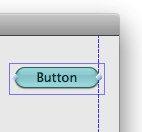

To allow layout based on the presentation of the content rather than the frame, views provide an `alignmentRect` object, which is what the layout actually operates on.

### Views Can Indicate Baseline Offsets

Often you want to align controls by baseline. Although you have always been able to do this in Interface Builder, it wasn’t previously possible to do this at runtime. You can do so now using `NSLayoutAttributeBaseline` in a constraint.

The method [baselineOffsetFromBottom](https://developer.apple.com/documentation/appkit/nsview/1526949-baselineoffsetfrombottom) returns the distance between `NSLayoutAttributeBottom` and `NSLayoutAttributeBaseline`. This default return value for `NSView` is `0`; the method is overridden by subclasses for which it makes sense to do so.

### Debugging

In an automatic layout system, the ability to debug effectively is clearly very important. Cocoa Auto Layout offers several features to help you find the source of errors. You goal in debugging is usually to identify an incorrect or incorrectly applied constrain by following this process:

1. Identify a problem.

   For example, notice that a view is in the wrong place.
2. If possible, reproduce the issue while running under a new “layout” template in Instruments.

   (This may be included with the developer tools in the future, but is currently provided in the associated sample code—see [Sample Code](#apple-f4xwc4dqnrsv64tfmyxwi33df52wszbpkridimbqgeydmmzrfvbuqmjnknltemy)).
3. Find the bad constraint or constraints.

   To get the constraints affecting a particular view, use [constraintsAffectingLayoutForOrientation:](https://developer.apple.com/documentation/appkit/nsview/1525968-constraintsaffectinglayout). You can then inspect the constraints in the debugger. They are printed using the visual format notation. If your views have identifiers (see `identifier` (`NSView`)), they print out using the identifier in the description, like this:

```
<NSLayoutConstraint: 0x400bef8e0 H:[refreshSegmentedControl]-(8)-[selectViewSegmentedControl] (Names: refreshSegmentedControl:0x40048a600, selectViewSegmentedControl:0x400487cc0 ) >
```

   Otherwise, the output looks like this:

```
<NSLayoutConstraint: 0x400cbf1c0 H:[NSSegmentedControl:0x40048a600]-(8)-[NSSegmentedControl:0x400487cc0]>
```

   If it’s not obvious which constraint is wrong at this point, visualize the constraints on screen by passing the constraints to the window using [visualizeConstraints:](https://developer.apple.com/documentation/appkit/nswindow/1526997-visualizeconstraints). Figure 1-2 shows an example of visualizing the constraints affecting the find field’s horizontal layout.

   __Figure 1-2__Constraint debugging window displayed using `visualizeConstraints:`.
   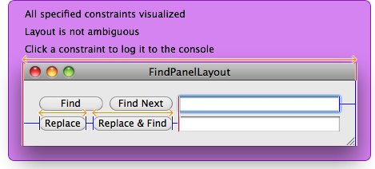

   When you click a constraint, it is printed in the console. In this way, you can determine which is which, and typically identify which is incorrect.
4. Find the code that’s wrong.

   Sometimes, once you’ve identified the incorrect constraint, you’ll know what to do to fix it.

   If this is not the case, then in Instruments search for the pointer of the constraint (or some of its description). This will show you interesting events in that constraint’s life cycle—its creation, modification, installation into windows, and so on. For each of these, you can see the backtrace where it happened. Find the stage at which things went awry, and look at the backtrace. This is the code with the problem.

### Ambiguity

In [Figure 1-2](#apple-f4xwc4dqnrsv64tfmyxwi33df52wszbpkridimbqgeydmmzrfvbuqmjnknltk) you may have noticed the report “Layout is not ambiguous.” A layout is ambiguous if it is underspecified. For example, suppose the system consists of one constraint.

```
x + y == 100
```

Because there are an infinite number of solutions to this equation, the system is ambiguous (as opposed to unsatisfiable). You can resolve it by adding a second constraint such as:

```
x == y
```

In the normal course of solving layout, the system detects unsatisfiability but not ambiguity. (This is for performance reasons—it’s a computationally expensive task to detect ambiguity in this system.) However, when you _visualize_ constraints, the system does check for ambiguity. If it detects an ambiguity, the visualizer presents an Exercise Ambiguity button. [Figure 1-3](#apple-f4xwc4dqnrsv64tfmyxwi33df52wszbpkridimbqgeydmmzrfvbuqmjnknltema) shows the find panel after one of the constraints has been removed.

__Figure 1-3__Constraint debugging window illustrating ambiguity
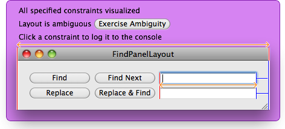

Exercising ambiguity (clicking the button) makes your UI toggle between different states that it could be in, given the current set of constraints. [Figure 1-4](#apple-f4xwc4dqnrsv64tfmyxwi33df52wszbpkridimbqgeydmmzrfvbuqmjnknltm) shows the layout of the find panel after clicking Exercise Ambiguity. Notice the different layout.

__Figure 1-4__Constraint debugging window illustrating alternative resolution of ambiguity
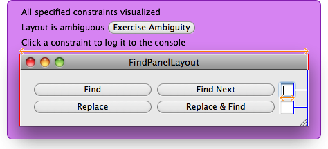

The FindPanelLayout sample walks through this debugging example, as well as demonstrating other issues.

### Unsatisfiability

The Auto Layout system attempts to behave gracefully if you add a constraint that cannot be satisfied.

1. The [addConstraint:](https://developer.apple.com/documentation/appkit/nsview/1526969-addconstraint) method (or the `setConstant:` method of `NSLayoutConstraint`) logs the mutually unsatisfiable constraints and throws an exception.

   The exception is appropriate, since this is a programmer error.
2. The system catches the exception immediately.

   Although adding a constraint that cannot be satisfied is a programmer error, it’s one that can readily be foreseen occurring on a user’s computer, and one from which the system can recover more gracefully than it can by crashing the program. The exception is thrown so that you notice the problem—and caught because it’s easier to debug the constraint system if the system still functions.
3. To allow the layout to proceed, the system selects a constraint from among the mutually unsatisfiable set and lowers its priority from “required” to an internal value that is not required but that is higher priority than anything you can externally specify. The effect is that as things change going forward, this incorrectly broken constraint gets first choice on satisfiability. (Note: every constraint in the set will be required to begin with, because otherwise it wouldn’t be causing a problem.)

```
2010-08-30 03:48:18.589 ak_runner[22206:110b] Unable to simultaneously satisfy constraints:
(
    "<NSLayoutConstraint: 0x40082d820 H:[NSButton:0x4004ea720'OK']-(20)-|   (Names: '|':NSView:0x4004ea9a0 ) >",
    "<NSLayoutConstraint: 0x400821b40 H:[NSButton:0x4004ea720'OK']-(29)-|   (Names: '|':NSView:0x4004ea9a0 ) >"
)

Will attempt to recover by breaking constraint
<NSLayoutConstraint: 0x40082d820 H:[NSButton:0x4004ea720'OK']-(20)-|   (Names: '|':NSView:0x4004ea9a0 ) >
```


### Auto Layout Supports Incremental Adoption

Views that are aware of Auto Layout can coexist in a window with views that are not. That is, an existing project can incrementally adopt Auto Layout features.

This works through the property [translatesAutoresizingMaskIntoConstraints](https://developer.apple.com/documentation/appkit/nsview/1526961-translatesautoresizingmaskintoco). When this property’s value is `YES`, which it is by default, the autoresizing mask of a view is translated into constraints. For example, the if a view is configured as in Figure 1-5 and `translatesAutoresizingMaskIntoConstraints` is `YES`, then the constraints `|-20-[button]-20-|` and `V:|-20-[button(20)]` are added to the view’s superview. The net effect is that unaware views behave as they did in versions of OS X earlier than version 10.7.

__Figure 1-5__Button layout using springs and struts
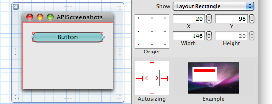

If you move the button 15 points to the left (including by calling `setFrame:` at runtime), the new constraints would be `|-5-[button]-35-|` and `V:|-20-[button(20)]`.

For views that are aware of Auto Layout, in most circumstances you’ll want `translatesAutoresizingMaskIntoConstraints` to be `NO`. This is because the constraints generated by translating the autoresizing mask are already sufficient to completely specify the frame of a view given its superview’s frame, which is generally too much. For example, this will prevent a button from automatically assuming its optimal width when its title is changed.

The principal circumstance in which you should _not_ call `setTranslatesAutoresizingMaskIntoConstraints:` is when you aren’t the person who specifies a view’s relation to its container. For example, an `NSTableRowView` instance is placed by `NSTableView`. It might do this by allowing the autoresizing mask to be translated into constraints, or it might not. This is a private implementation detail. Other views on which you should not call `setTranslatesAutoresizingMaskIntoConstraints:` include `NSTableCellView`, a subview of `NSSplitView`, an `NSTabViewItem` view, or the content view of `NSPopover`, `NSWindow`, or `NSBox`. For those familiar with classic Cocoa layout: If you would not call `setAutoresizingMask:` on a view in classic style, you should not call `setTranslatesAutoresizingMaskIntoConstraints:` in Auto Layout.

If you have a view that does its own custom layout by calling `setFrame:`, your existing code should work. Just don’t call `setTranslatesAutoresizingMaskIntoConstraints:` with the argument `NO` on views that you place manually.

To provide additional compatibility, the entire constraint-based layout system is inactive until you install a constraint on a view. Typically, this is not something you should be concerned with, but if your previous layout was delicate (in that you had problems you fixed by figuring out in what order the framework called methods), you may find that these problems have returned under constraint-based layout. Hopefully, in most cases the easiest solution will be to adopt constraint-based layout for the affected views. If you’re a framework author providing custom views and want to avoid engaging constraint-based layout in a window, you can do any necessary work in [updateConstraints](https://developer.apple.com/documentation/appkit/nsview/1526891-updateconstraints). This method is not called until constraint-based layout is engaged. Furthermore, one of the purposes of `updateConstraints` is that it has a well-defined timing, similar to [awakeFromNib](https://developer.apple.com/documentation/objectivec/nsobject/1402907-awakefromnib), so you may find your problems are easier to resolve in Auto Layout.

There is an edge case to be aware of. When you implement a view, you might implement all your constraint setup in a custom `updateConstraints` method. However, because the constraint based system engages lazily, if nothing installs _any_ constraint, your `updateConstraints` method will never be invoked. To avoid this problem, you can override [requiresConstraintBasedLayout](https://developer.apple.com/documentation/appkit/nsview/1526926-requiresconstraintbasedlayout) to return `YES` to signal that your view needs the window to use constraint based layout.

### Sample Code

There are several sample apps that demonstrate working with the API, grouped together in “_Cocoa Autolayout Demos_.”

__FindPanelLayout__ is a good example to start with. The sample demonstrates how code in the controller layer uses the API. It lays out a window that is fairly complex with classic Cocoa layout but that is straightforward with constraints. The example illustrates use of the visual format language, content-hugging priority, RTL and localization support, automatic window minimum size, visualization for debugging, and the concept of ambiguity as something that can go wrong.

__SplitView__ demonstrates the API from the perspective of a view. It implements a split view with one extra feature: When a divider is dragged, it pushes other dividers out of the way, if necessary, and they snap back. SplitView illustrates advanced use of priority, overriding `updateConstraints`, dragging, and constraints that cross the view hierarchy.

__DraggingAndWindowResize__ primarily demonstrates how you use `NSLayoutPriorityDragThatCanResizeWindow`. It shows a view with its own drag resize box inside a window, such as Safari has for multiline editable text views in a webpage. If the window needs to get bigger to accommodate your dragging, it does.

__Cocoa Layout.tracetemplate__ is the Instruments template that was mentioned in [Debugging](#apple-f4xwc4dqnrsv64tfmyxwi33df52wszbpkridimbqgeydmmzrfvbuqmjnknltcoa). The template isn’t a demo app, but it may be useful for finding errors.
