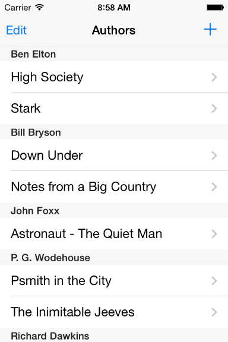

> 导航：[总目录](../../README.md) · [samplecode](../../_indexes/samplecode.md)

[Next](ReadMe.txt.md)

# CoreDataBooks

|  |  |
| --- | --- |
| __Last Revision:__ | Version 1.5, 2014-05-08 Fixed NSUndoManager allocation bug. [(Full Revision History)](Document%20Revision%20History.md#apple-f4xwc4dqnrsv64tfmyxwi33df52wszbpirkfgnbqgaydqnbqguwvezlwnfzws33ojbuxg5dpoj4s2rdpnz2ey2lonncwyzlnmvxhiskel4yq) |
| __Build Requirements:__ | iOS 7.0 SDK or later |
| __Runtime Requirements:__ | iOS 6.0 or later |

This sample illustrates a number of aspects of working with the Core Data framework with an iOS application:

\* Use of an instance of NSFetchedResultsController object to manage a collection of objects to be displayed in a table view. \* Undo and redo. \* Database initialization. \* Use of a second (child) managed object context to isolate changes during an add operation.

[Next](ReadMe.txt.md)

