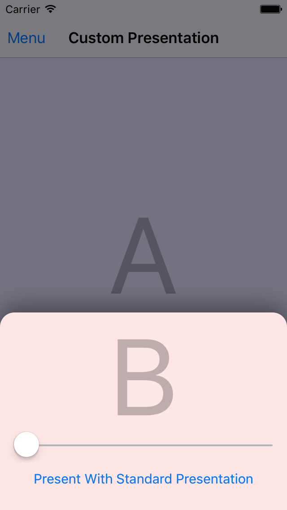
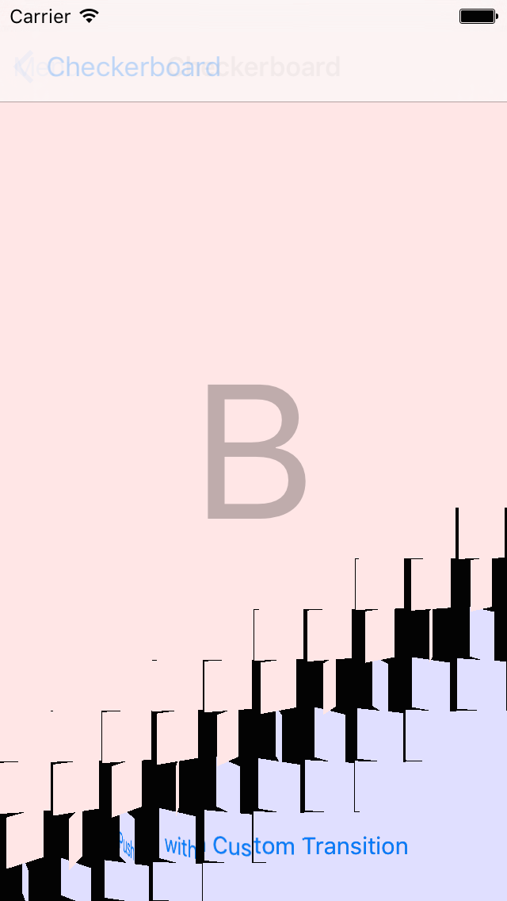

> 导航：[总目录](../../README.md) · [samplecode](../../_indexes/samplecode.md)

[Next](CustomTransitions-main.m.md)

# Custom View Controller Presentations and Transitions

|  |  |
| --- | --- |
| __Last Revision:__ | Version 1.0, 2016-01-28 First public release |
| __Build Requirements:__ | Xcode 6 or later |
| __Runtime Requirements:__ | iOS 7.1 or later |

Custom View Controller Presentations and Transitions demonstrates using the view controller transitioning APIs to implement your own view controller presentations and transitions. Learn from a collection of easy to understand examples how to use UIViewControllerAnimatedTransitioning, UIViewControllerInteractiveTransitioning, and UIPresentationController to create unique presentation styles that adapt to the available screen space.

[Next](CustomTransitions-main.m.md)

