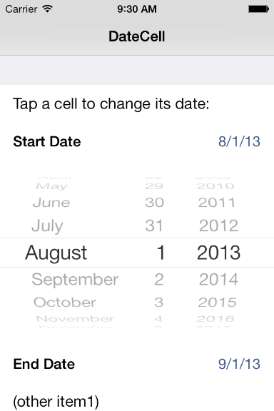

> 导航：[总目录](../../README.md) · [samplecode](../../_indexes/samplecode.md)

[Next](ReadMe.txt.md)

# DateCell

|  |  |
| --- | --- |
| __Last Revision:__ | Version 1.6, 2014-06-17 Fixed bug data source cell row detection in cellForRowAtIndexPath, now using CGRectGetHeight(). [(Full Revision History)](Document%20Revision%20History.md#apple-f4xwc4dqnrsv64tfmyxwi33df52wszbpirkfgnbqgaydqobwgywvezlwnfzws33ojbuxg5dpoj4s2rdpnz2ey2lonncwyzlnmvxhiskel4yq) |
| __Build Requirements:__ | Xcode 5.0, iOS SDK 7.0 |
| __Runtime Requirements:__ | iOS 6.0 or later |

Demonstrates formatted display of date objects in table cells and use of UIDatePicker to edit those values.

As a delegate to this table, the sample uses the method "didSelectRowAtIndexPath" to open the UIDatePicker control.

For iOS 6.x and earlier, UIViewAnimation is used for sliding the UIDatePicker up on-screen and down off-screen. For iOS 7.x, the UIDatePicker is added in-line to the table view.

The action method of the UIDatePicker will directly set the NSDate property of the custom table cell. In addition, this sample shows how to use NSDateFormatter class to achieve the custom cell's date-formatted appearance.

[Next](ReadMe.txt.md)

